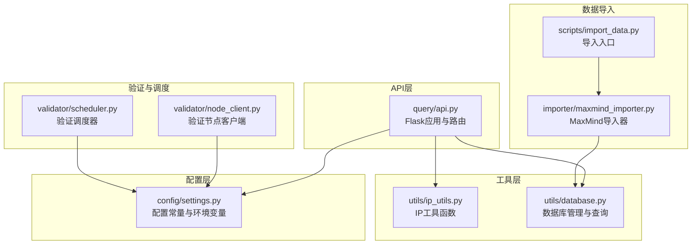
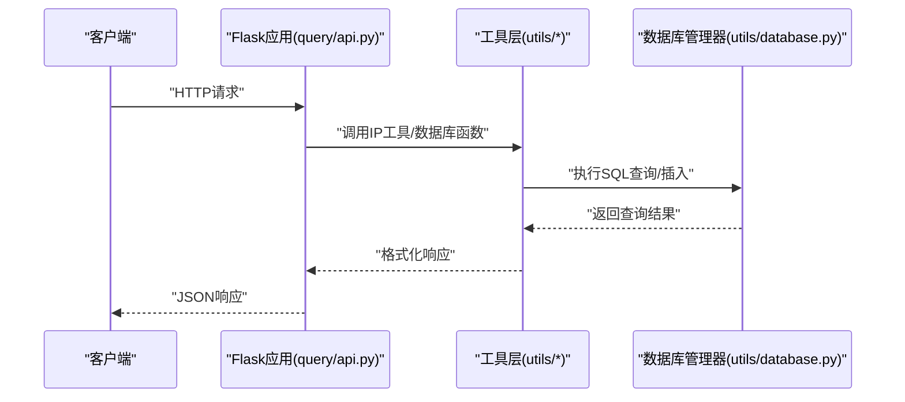
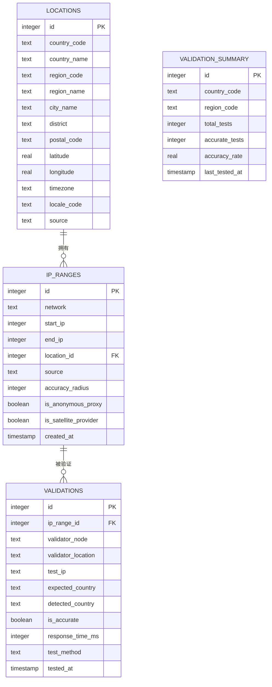
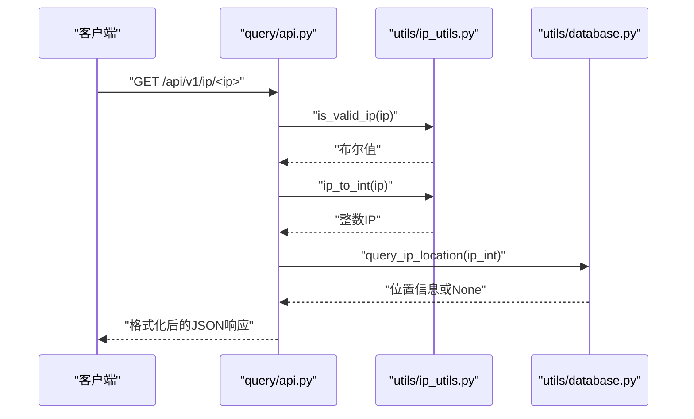
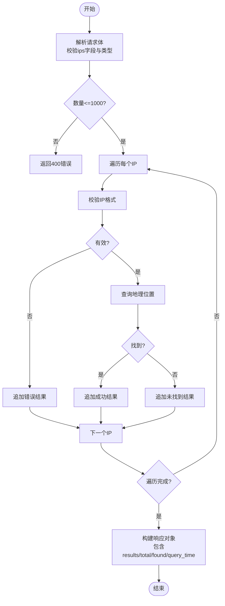
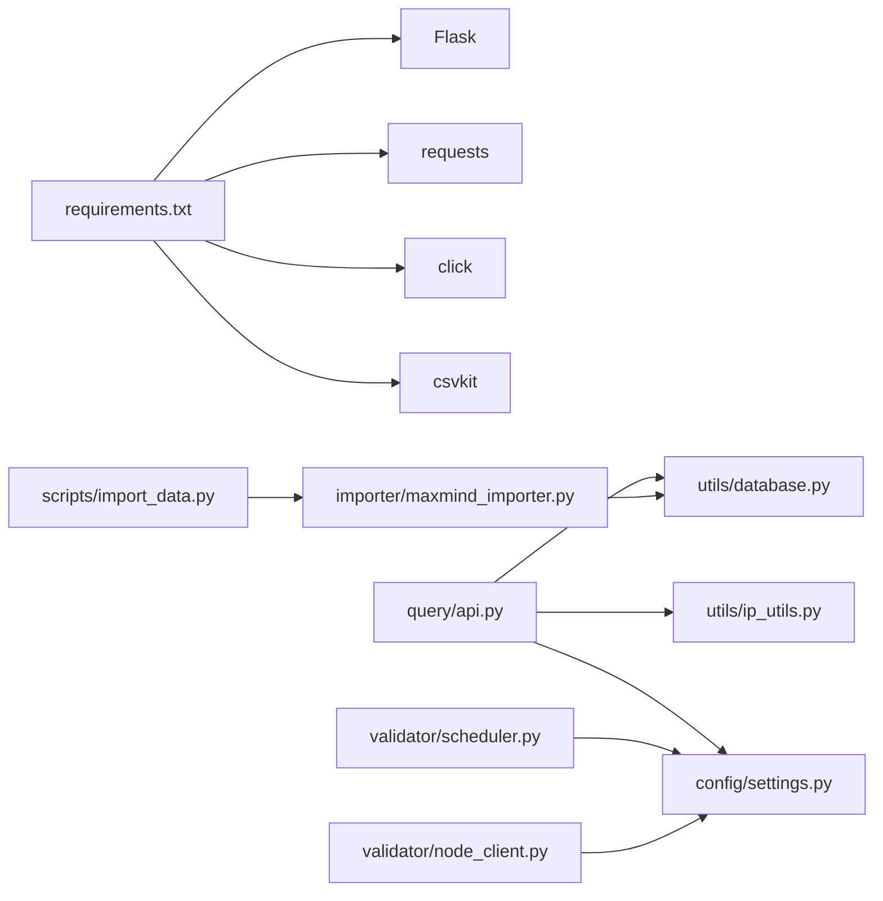

# API服务

<cite>
**本文引用的文件**
- [query/api.py](file://query/api.py)
- [config/settings.py](file://config/settings.py)
- [utils/database.py](file://utils/database.py)
- [utils/ip_utils.py](file://utils/ip_utils.py)
- [scripts/import_data.py](file://scripts/import_data.py)
- [importer/maxmind_importer.py](file://importer/maxmind_importer.py)
- [query/cli.py](file://query/cli.py)
- [validator/node_client.py](file://validator/node_client.py)
- [validator/scheduler.py](file://validator/scheduler.py)
- [requirements.txt](file://requirements.txt)
</cite>

## 目录
1. [简介](#简介)
2. [项目结构](#项目结构)
3. [核心组件](#核心组件)
4. [架构总览](#架构总览)
5. [详细组件分析](#详细组件分析)
6. [依赖分析](#依赖分析)
7. [性能考虑](#性能考虑)
8. [故障排查指南](#故障排查指南)
9. [结论](#结论)
10. [附录](#附录)

## 简介
本文件为IP地址定位API服务的RESTful API文档，覆盖以下端点：
- GET /
- GET /api/v1/ip/<ip>
- POST /api/v1/batch
- GET /api/v1/stats
- GET /api/v1/validation-stats

文档内容包括：端点说明、请求参数、响应格式、状态码、认证机制、缓存策略、错误处理、性能特性与限制、客户端集成最佳实践与常见使用模式。本文档严格基于仓库中的实际代码实现进行整理与说明。

## 项目结构
该项目采用按功能模块划分的组织方式，核心API服务位于 query/api.py，数据库与工具函数位于 utils，数据导入位于 scripts 与 importer，验证相关逻辑位于 validator。

图表来源
- [query/api.py:1-325](file://query/api.py#L1-L325)
- [utils/ip_utils.py:1-282](file://utils/ip_utils.py#L1-L282)
- [utils/database.py:1-398](file://utils/database.py#L1-L398)
- [config/settings.py:1-44](file://config/settings.py#L1-L44)
- [scripts/import_data.py:1-65](file://scripts/import_data.py#L1-L65)
- [importer/maxmind_importer.py:1-274](file://importer/maxmind_importer.py#L1-L274)
- [validator/node_client.py:1-244](file://validator/node_client.py#L1-L244)
- [validator/scheduler.py:1-265](file://validator/scheduler.py#L1-L265)

章节来源
- [query/api.py:1-325](file://query/api.py#L1-L325)
- [config/settings.py:1-44](file://config/settings.py#L1-L44)

## 核心组件
- Flask应用与路由：提供REST API端点、错误处理、启动参数。
- 数据库管理器：封装SQLite连接、事务、查询与索引。
- IP工具函数：IP地址校验、转换、CIDR与范围互转等。
- 配置模块：数据库路径、缓存TTL、API监听地址与端口、验证节点配置等。
- 数据导入：支持从MaxMind下载或本地CSV导入，构建数据库表与索引。
- 验证调度：周期性执行IP定位准确性验证，并维护验证统计。

章节来源
- [query/api.py:18-325](file://query/api.py#L18-L325)
- [utils/database.py:15-398](file://utils/database.py#L15-L398)
- [utils/ip_utils.py:9-282](file://utils/ip_utils.py#L9-L282)
- [config/settings.py:10-44](file://config/settings.py#L10-L44)
- [scripts/import_data.py:26-65](file://scripts/import_data.py#L26-L65)
- [importer/maxmind_importer.py:19-274](file://importer/maxmind_importer.py#L19-L274)
- [validator/scheduler.py:27-265](file://validator/scheduler.py#L27-L265)

## 架构总览
API服务以Flask为核心，路由层负责参数校验与调用工具层函数，工具层通过数据库管理器访问SQLite数据库，配置模块提供统一的运行参数与缓存策略。

图表来源
- [query/api.py:115-204](file://query/api.py#L115-L204)
- [utils/ip_utils.py:9-32](file://utils/ip_utils.py#L9-L32)
- [utils/database.py:193-230](file://utils/database.py#L193-L230)

## 详细组件分析

### 端点定义与行为

#### GET /
- 功能：返回API基本信息与可用端点列表。
- 响应字段：
  - name：服务名称
  - version：版本号
  - endpoints：可用端点映射
- 状态码：200

章节来源
- [query/api.py:100-112](file://query/api.py#L100-L112)

#### GET /api/v1/ip/<ip>
- 功能：查询单个IP地址的地理位置信息。
- 路径参数：
  - ip：IP地址（支持IPv4/IPv6）
- 请求与响应：
  - 请求：无
  - 响应：包含ip、found、network、location、accuracy、source、query_time等字段；当未找到时found=false且包含message
- 状态码：
  - 200：成功
  - 400：无效IP地址
  - 500：服务器内部错误
- 缓存策略：使用装饰器缓存，默认TTL由配置决定
- 错误处理：IP格式校验失败返回400；查询异常返回500

章节来源
- [query/api.py:115-143](file://query/api.py#L115-L143)
- [utils/ip_utils.py:134-148](file://utils/ip_utils.py#L134-L148)
- [utils/database.py:193-230](file://utils/database.py#L193-L230)
- [config/settings.py:26-27](file://config/settings.py#L26-L27)

#### POST /api/v1/batch
- 功能：批量查询IP地址。
- 请求体：
  - ips：IP地址数组，最多1000个
- 响应：
  - results：每个IP的查询结果数组
  - total：总查询数
  - found：匹配到地理位置的数量
  - query_time：查询时间
- 状态码：
  - 200：成功
  - 400：请求体缺失或格式错误；单个IP无效；超过最大批量限制
  - 500：服务器内部错误
- 错误处理：逐个IP处理，无效IP返回错误字段；异常捕获并返回错误信息

章节来源
- [query/api.py:145-204](file://query/api.py#L145-L204)
- [utils/ip_utils.py:134-148](file://utils/ip_utils.py#L134-L148)
- [utils/database.py:193-230](file://utils/database.py#L193-L230)

#### GET /api/v1/stats
- 功能：获取数据库统计信息（IP范围、位置、验证记录数量，国家分布，数据源分布）。
- 响应：
  - database：ip_ranges、locations、validations数量
  - countries：前20国家分布
  - sources：数据源分布
  - query_time：查询时间
- 状态码：200
- 缓存策略：默认缓存5分钟

章节来源
- [query/api.py:207-261](file://query/api.py#L207-L261)
- [utils/database.py:188-190](file://utils/database.py#L188-L190)

#### GET /api/v1/validation-stats
- 功能：获取验证统计摘要（按国家/区域聚合的准确率、测试次数等）。
- 响应：
  - validation_summary：每项包含country_code、region_code、total_tests、accurate_tests、accuracy_rate、last_tested_at
  - query_time：查询时间
- 状态码：200
- 缓存策略：默认缓存5分钟

章节来源
- [query/api.py:264-287](file://query/api.py#L264-L287)
- [utils/database.py:341-361](file://utils/database.py#L341-L361)

### 认证机制
- 当前API路由未实现任何认证中间件或鉴权逻辑。
- 验证节点服务（validator/node_server.py）使用请求头X-API-Key进行认证，但API服务本身未强制要求此头。
- 若需启用API级认证，可在路由装饰器中增加鉴权逻辑或全局before_request钩子。

章节来源
- [validator/node_client.py:34-37](file://validator/node_client.py#L34-L37)
- [validator/node_server.py:242-244](file://validator/node_server.py#L242-L244)

### 缓存策略
- 内置简单内存缓存装饰器，支持自定义TTL与最大缓存条目数。
- 默认缓存TTL与最大容量来自配置。
- /api/v1/stats 与 /api/v1/validation-stats 显式设置了较短的缓存TTL（5分钟），以平衡实时性与性能。

章节来源
- [query/api.py:31-60](file://query/api.py#L31-L60)
- [config/settings.py:26-27](file://config/settings.py#L26-L27)
- [query/api.py:208-209](file://query/api.py#L208-L209)
- [query/api.py:265](file://query/api.py#L265)

### 错误处理
- 404：未找到端点
- 500：服务器内部错误
- 路由内对IP格式校验与数据库查询异常进行显式处理，返回结构化错误信息

章节来源
- [query/api.py:290-303](file://query/api.py#L290-L303)
- [query/api.py:127-131](file://query/api.py#L127-L131)
- [query/api.py:160-175](file://query/api.py#L160-L175)

### 数据模型与查询流程

图表来源
- [utils/database.py:80-182](file://utils/database.py#L80-L182)
- [utils/database.py:341-398](file://utils/database.py#L341-L398)

### 查询流程（单IP）

图表来源
- [query/api.py:115-143](file://query/api.py#L115-L143)
- [utils/ip_utils.py:9-32](file://utils/ip_utils.py#L9-L32)
- [utils/database.py:193-230](file://utils/database.py#L193-L230)

### 批量查询流程

图表来源
- [query/api.py:145-204](file://query/api.py#L145-L204)
- [utils/ip_utils.py:134-148](file://utils/ip_utils.py#L134-L148)
- [utils/database.py:193-230](file://utils/database.py#L193-L230)

## 依赖分析
- 运行时依赖：Flask、requests、click、csvkit
- API服务依赖：utils/ip_utils.py、utils/database.py、config/settings.py
- 数据导入依赖：importer/maxmind_importer.py、scripts/import_data.py
- 验证相关：validator/node_client.py、validator/scheduler.py

图表来源
- [requirements.txt:1-5](file://requirements.txt#L1-L5)
- [query/api.py:18-22](file://query/api.py#L18-L22)
- [importer/maxmind_importer.py:22-26](file://importer/maxmind_importer.py#L22-L26)
- [validator/scheduler.py:17-18](file://validator/scheduler.py#L17-L18)
- [validator/node_client.py:16](file://validator/node_client.py#L16)

章节来源
- [requirements.txt:1-5](file://requirements.txt#L1-L5)
- [query/api.py:18-22](file://query/api.py#L18-L22)
- [importer/maxmind_importer.py:22-26](file://importer/maxmind_importer.py#L22-L26)
- [validator/scheduler.py:17-18](file://validator/scheduler.py#L17-L18)
- [validator/node_client.py:16](file://validator/node_client.py#L16)

## 性能考虑
- 缓存：内置装饰器缓存，可减少重复查询；统计类端点默认缓存5分钟。
- 批量限制：批量查询最多1000个IP，避免过大请求导致资源压力。
- 数据库索引：已建立多处索引（IP范围区间、网络、位置、验证等），提升查询效率。
- 并发处理：Flask开发服务器非生产级，建议在生产环境使用WSGI服务器（如gunicorn/uwsgi）与多进程/多线程部署。
- 速率限制：当前未实现速率限制；建议在网关或应用层增加限流策略（如基于IP的滑动窗口）。

章节来源
- [query/api.py:31-60](file://query/api.py#L31-L60)
- [query/api.py:172-175](file://query/api.py#L172-L175)
- [utils/database.py:149-181](file://utils/database.py#L149-L181)

## 故障排查指南
- 400错误（无效IP或请求格式错误）：检查请求体结构与IP格式；确认未超过批量上限。
- 500错误（服务器内部错误）：查看服务日志；确认数据库连接与查询SQL执行情况。
- 404错误（端点不存在）：核对API路径拼写与版本号。
- 缓存命中问题：若修改了数据但返回旧结果，可调整缓存TTL或禁用缓存装饰器进行验证。
- 数据库初始化：首次运行需初始化数据库并导入数据，确保表与索引存在。

章节来源
- [query/api.py:290-303](file://query/api.py#L290-L303)
- [query/api.py:127-131](file://query/api.py#L127-L131)
- [query/api.py:160-175](file://query/api.py#L160-L175)
- [utils/database.py:70-185](file://utils/database.py#L70-L185)

## 结论
本API服务提供了简洁高效的IP地理位置查询能力，具备基础缓存与批量查询能力，适合中小规模应用场景。生产部署建议结合限流、监控与缓存策略优化，并使用稳定的WSGI服务器承载。验证模块与调度器为后续扩展准确性评估与自动化运维提供了良好基础。

## 附录

### 启动与配置
- 启动参数：host、port、debug
- 配置项：数据库路径、缓存TTL、缓存最大条目、验证节点列表与密钥等

章节来源
- [query/api.py:306-320](file://query/api.py#L306-L320)
- [config/settings.py:22-44](file://config/settings.py#L22-L44)

### 数据导入流程（MaxMind）
- 支持在线下载或本地CSV导入
- 自动创建表与索引
- 批量插入IP范围记录

章节来源
- [scripts/import_data.py:26-65](file://scripts/import_data.py#L26-L65)
- [importer/maxmind_importer.py:28-258](file://importer/maxmind_importer.py#L28-L258)
- [utils/database.py:70-185](file://utils/database.py#L70-L185)

### CLI工具（参考）
- 提供命令行查询与统计展示，便于本地调试与小规模使用

章节来源
- [query/cli.py:54-173](file://query/cli.py#L54-L173)