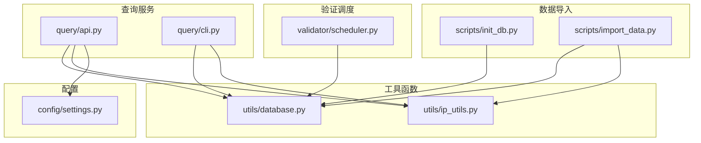
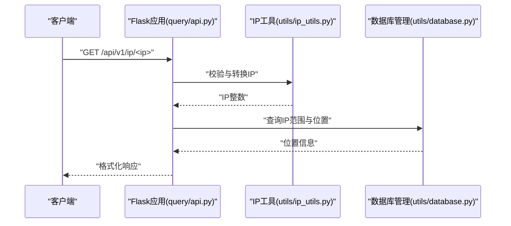
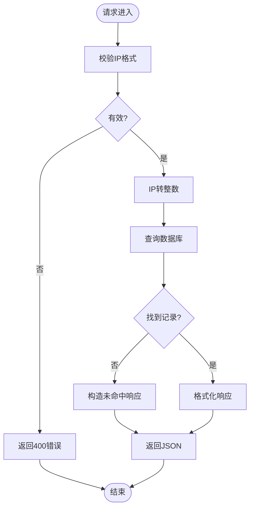
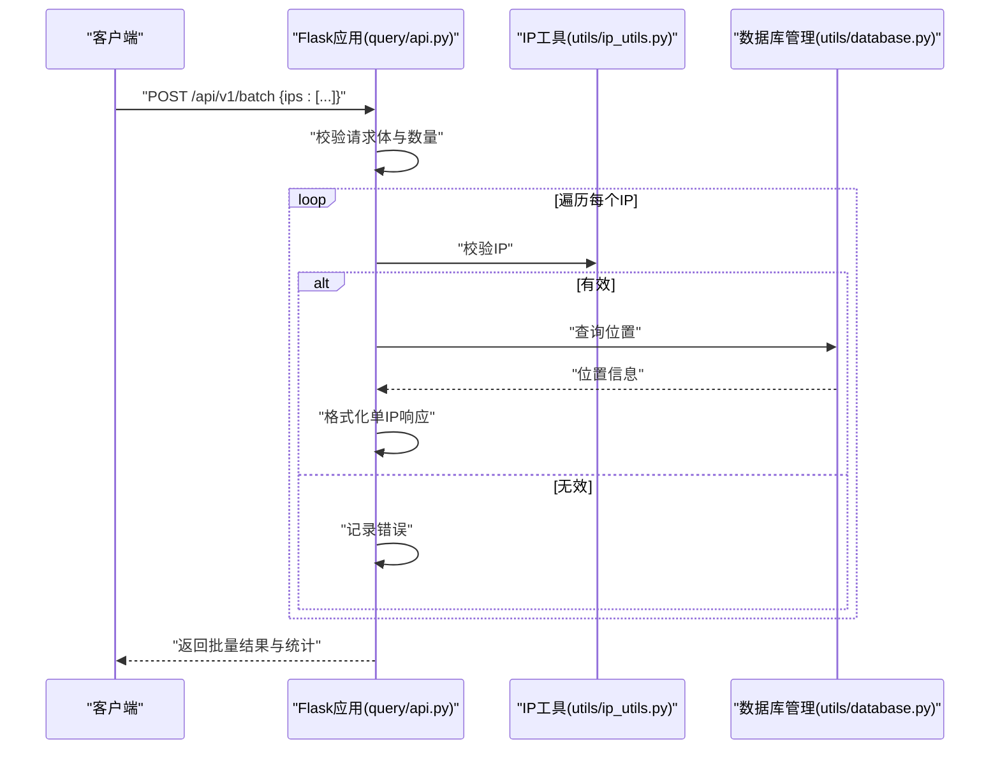
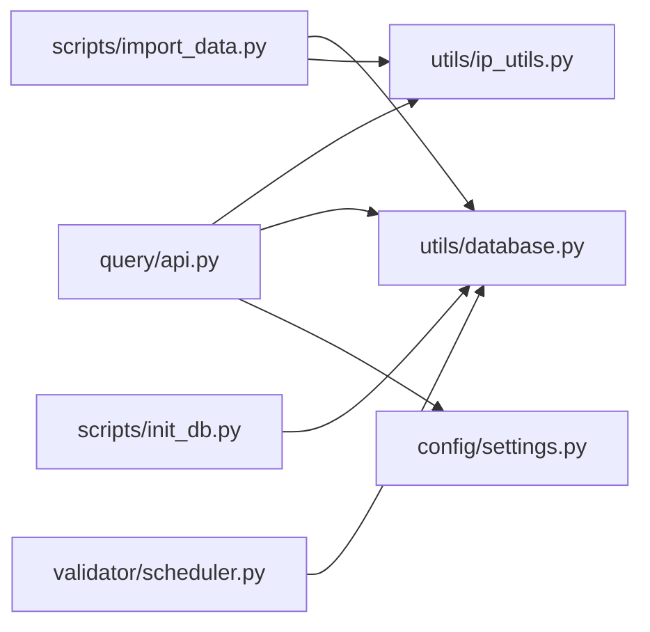

# API端点概览

<cite>
**本文档引用的文件**
- [query/api.py](file://query/api.py)
- [config/settings.py](file://config/settings.py)
- [utils/database.py](file://utils/database.py)
- [utils/ip_utils.py](file://utils/ip_utils.py)
- [scripts/init_db.py](file://scripts/init_db.py)
- [scripts/import_data.py](file://scripts/import_data.py)
- [validator/scheduler.py](file://validator/scheduler.py)
- [query/cli.py](file://query/cli.py)
- [requirements.txt](file://requirements.txt)
</cite>

## 目录
1. [简介](#简介)
2. [项目结构](#项目结构)
3. [核心组件](#核心组件)
4. [架构总览](#架构总览)
5. [详细端点分析](#详细端点分析)
6. [依赖关系分析](#依赖关系分析)
7. [性能考虑](#性能考虑)
8. [故障排除指南](#故障排除指南)
9. [结论](#结论)
10. [附录](#附录)

## 简介
本文件为IP地址定位API的所有HTTP端点提供全面概览，涵盖根路径、单IP查询、批量查询、数据库统计、验证统计等端点。文档详细说明每个端点的基本用途、请求方法、URL模式，并解释端点之间的关联关系与使用场景。同时包含API版本控制信息、向后兼容性说明以及面向初学者的端点选择指南与最佳实践建议。

## 项目结构
该项目采用模块化设计，围绕“查询服务”“数据导入”“验证调度”“工具函数”等模块组织：
- 查询服务：提供REST API端点与CLI工具
- 数据库工具：封装SQLite连接、查询与统计
- IP工具：提供IP地址解析、校验与转换
- 数据导入：支持MaxMind数据导入
- 验证调度：周期性执行准确性验证
- 配置：集中管理数据库路径、缓存、验证节点等

图表来源
- [query/api.py:100-325](file://query/api.py#L100-L325)
- [utils/database.py:15-398](file://utils/database.py#L15-L398)
- [utils/ip_utils.py:1-282](file://utils/ip_utils.py#L1-L282)
- [config/settings.py:1-44](file://config/settings.py#L1-L44)
- [scripts/init_db.py:1-38](file://scripts/init_db.py#L1-L38)
- [scripts/import_data.py:1-65](file://scripts/import_data.py#L1-L65)
- [validator/scheduler.py:1-265](file://validator/scheduler.py#L1-L265)

章节来源
- [query/api.py:100-325](file://query/api.py#L100-L325)
- [config/settings.py:1-44](file://config/settings.py#L1-L44)

## 核心组件
- Flask应用与路由：定义所有HTTP端点，包含根路径、单IP查询、批量查询、统计信息与验证统计
- 缓存装饰器：为热点查询与统计接口提供内存缓存，提升性能
- 数据库管理器：封装SQLite连接、事务、查询与索引优化
- IP工具：提供IP地址校验、转换、CIDR解析等能力
- 配置中心：集中管理数据库路径、API监听地址、缓存策略、验证节点等

章节来源
- [query/api.py:31-61](file://query/api.py#L31-L61)
- [utils/database.py:15-67](file://utils/database.py#L15-L67)
- [utils/ip_utils.py:9-32](file://utils/ip_utils.py#L9-L32)
- [config/settings.py:22-27](file://config/settings.py#L22-L27)

## 架构总览
API服务基于Flask构建，采用SQLite作为存储引擎，通过工具函数与数据库层实现IP查询、统计与验证功能。查询流程中，IP地址经工具函数转换为整数后，由数据库层进行范围匹配与地理位置关联查询；统计与验证接口通过数据库聚合查询与验证汇总表提供运营与质量保障数据。

图表来源
- [query/api.py:115-143](file://query/api.py#L115-L143)
- [utils/ip_utils.py:9-32](file://utils/ip_utils.py#L9-L32)
- [utils/database.py:193-231](file://utils/database.py#L193-L231)

## 详细端点分析

### 根路径 /
- 基本用途：提供API基础信息与可用端点列表
- 请求方法：GET
- URL模式：/
- 响应内容：包含服务名称、版本与端点清单
- 使用场景：快速了解API能力与版本

章节来源
- [query/api.py:100-113](file://query/api.py#L100-L113)

### 单IP查询 /api/v1/ip/<ip>
- 基本用途：查询单个IP地址的地理位置信息
- 请求方法：GET
- URL模式：/api/v1/ip/<ip>
- 请求参数：路径参数ip（IP地址）
- 响应字段：包含IP、是否命中、网络段、国家/地区/城市/区县、坐标、时区、准确度半径、数据来源与查询时间
- 错误处理：无效IP返回400，异常返回500
- 性能特性：启用缓存装饰器，按函数签名+参数构建缓存键
- 使用场景：单点查询、集成到业务系统

图表来源
- [query/api.py:115-143](file://query/api.py#L115-L143)
- [utils/ip_utils.py:134-148](file://utils/ip_utils.py#L134-L148)
- [utils/database.py:193-231](file://utils/database.py#L193-L231)

章节来源
- [query/api.py:115-143](file://query/api.py#L115-L143)
- [utils/ip_utils.py:9-32](file://utils/ip_utils.py#L9-L32)
- [utils/database.py:193-231](file://utils/database.py#L193-L231)

### 批量查询 /api/v1/batch
- 基本用途：批量查询多个IP地址
- 请求方法：POST
- URL模式：/api/v1/batch
- 请求体：包含ips数组（最多1000个IP）
- 响应字段：results数组（每个元素为单IP查询结果），统计总数、命中数与查询时间
- 错误处理：请求体缺失、类型不正确、IP数量超限返回400；单个IP无效时在结果中返回错误
- 使用场景：日志分析、报表生成、批量迁移

图表来源
- [query/api.py:145-204](file://query/api.py#L145-L204)
- [utils/ip_utils.py:134-148](file://utils/ip_utils.py#L134-L148)
- [utils/database.py:193-231](file://utils/database.py#L193-L231)

章节来源
- [query/api.py:145-204](file://query/api.py#L145-L204)

### 数据库统计 /api/v1/stats
- 基本用途：获取数据库统计信息（IP范围、位置、验证记录数量，国家分布，数据源分布）
- 请求方法：GET
- URL模式：/api/v1/stats
- 响应字段：database（三类表计数）、countries（前20国家分布）、sources（数据源分布）、query_time
- 性能特性：缓存5分钟，降低频繁统计查询的数据库压力
- 使用场景：运维监控、容量规划、数据质量评估

章节来源
- [query/api.py:207-261](file://query/api.py#L207-L261)
- [utils/database.py:19-67](file://utils/database.py#L19-L67)

### 验证统计 /api/v1/validation-stats
- 基本用途：获取验证统计摘要（按国家/省/州维度的准确率、测试次数、最近测试时间）
- 请求方法：GET
- URL模式：/api/v1/validation-stats
- 响应字段：validation_summary数组（每项包含国家/省/州、测试总数、准确测试数、准确率、最后测试时间）、query_time
- 性能特性：缓存5分钟，避免频繁聚合查询
- 使用场景：质量监控、区域准确性对比、验证调度效果评估

章节来源
- [query/api.py:264-287](file://query/api.py#L264-L287)
- [utils/database.py:341-361](file://utils/database.py#L341-L361)

### 端点间关联关系与使用场景
- 根路径用于快速发现可用端点与版本信息
- 单IP查询与批量查询互为补充：单点调试与批量处理
- 数据库统计与验证统计为运维与质量保障提供依据
- CLI工具可作为API的替代方案，适合离线或批处理场景

章节来源
- [query/cli.py:54-173](file://query/cli.py#L54-L173)

## 依赖关系分析
- API端点依赖IP工具进行地址校验与转换，依赖数据库管理器进行查询与统计
- 配置模块集中提供数据库路径、缓存TTL、API监听地址等参数
- 数据导入脚本负责初始化数据库与导入MaxMind数据，为查询提供数据基础
- 验证调度器定期执行准确性验证，更新验证汇总表，供验证统计端点使用

图表来源
- [query/api.py:18-22](file://query/api.py#L18-L22)
- [utils/ip_utils.py:1-7](file://utils/ip_utils.py#L1-L7)
- [utils/database.py:1-8](file://utils/database.py#L1-L8)
- [config/settings.py:1-44](file://config/settings.py#L1-L44)
- [scripts/import_data.py:16-41](file://scripts/import_data.py#L16-L41)
- [scripts/init_db.py:12-28](file://scripts/init_db.py#L12-L28)
- [validator/scheduler.py:17-35](file://validator/scheduler.py#L17-L35)

章节来源
- [requirements.txt:1-5](file://requirements.txt#L1-L5)

## 性能考虑
- 缓存策略：单IP查询与统计接口均使用内存缓存装饰器，减少重复查询；缓存TTL与最大条目数可配置
- 查询优化：数据库建立多处索引（IP范围区间、网络段、位置国家/城市、验证记录等），提升范围匹配与聚合查询效率
- 批量限制：批量查询最多1000个IP，避免单次请求过大导致资源占用
- 连接管理：数据库管理器使用上下文管理器确保连接正确释放与事务回滚

章节来源
- [query/api.py:31-61](file://query/api.py#L31-L61)
- [utils/database.py:149-181](file://utils/database.py#L149-L181)
- [config/settings.py:26-27](file://config/settings.py#L26-L27)

## 故障排除指南
- 404未找到：检查URL拼写与版本前缀，确认端点存在
- 400请求错误：单IP查询时IP格式无效；批量查询时请求体缺少ips字段、ips不是数组或数量超过限制
- 500服务器错误：数据库连接异常、查询失败或内部异常
- 缓存命中问题：若修改数据后统计未更新，等待缓存TTL到期或调整缓存策略
- 数据库初始化：首次使用需先初始化数据库并导入数据

章节来源
- [query/api.py:290-303](file://query/api.py#L290-L303)
- [scripts/init_db.py:16-34](file://scripts/init_db.py#L16-L34)
- [scripts/import_data.py:26-41](file://scripts/import_data.py#L26-L41)

## 结论
本API以简洁的端点设计与清晰的职责划分，提供了从单IP查询到批量处理、从统计监控到验证质量的完整能力。通过缓存与索引优化，兼顾了性能与可维护性。建议在生产环境中结合缓存策略、批量限制与监控指标，确保稳定高效的服务体验。

## 附录

### API版本控制与向后兼容性
- 版本前缀：所有端点均位于/api/v1路径下，当前版本为1.0.0
- 向后兼容性：当前版本为1.0.0，遵循语义化版本控制原则；新增端点建议保持现有接口不变，通过新增端点而非破坏性变更实现演进

章节来源
- [query/api.py:100-113](file://query/api.py#L100-L113)

### 端点选择指南与最佳实践
- 初学者建议
  - 先使用根路径了解可用端点与版本
  - 单IP查询用于调试与小规模查询
  - 批量查询用于日志分析与报表生成，注意控制每次请求的IP数量
  - 使用数据库统计与验证统计端点进行运维与质量评估
- 最佳实践
  - 对高频查询开启缓存，合理设置TTL
  - 批量请求控制在1000以内，避免长时间占用
  - 在调用前进行IP格式校验，减少无效请求
  - 结合CLI工具进行离线批处理与数据验证

章节来源
- [query/api.py:115-204](file://query/api.py#L115-L204)
- [query/cli.py:54-173](file://query/cli.py#L54-L173)