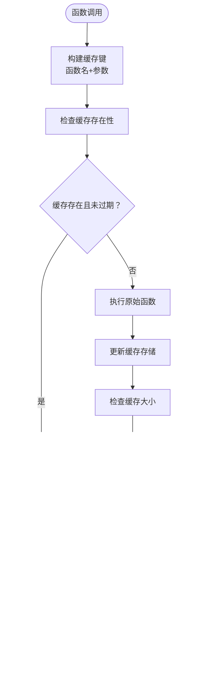
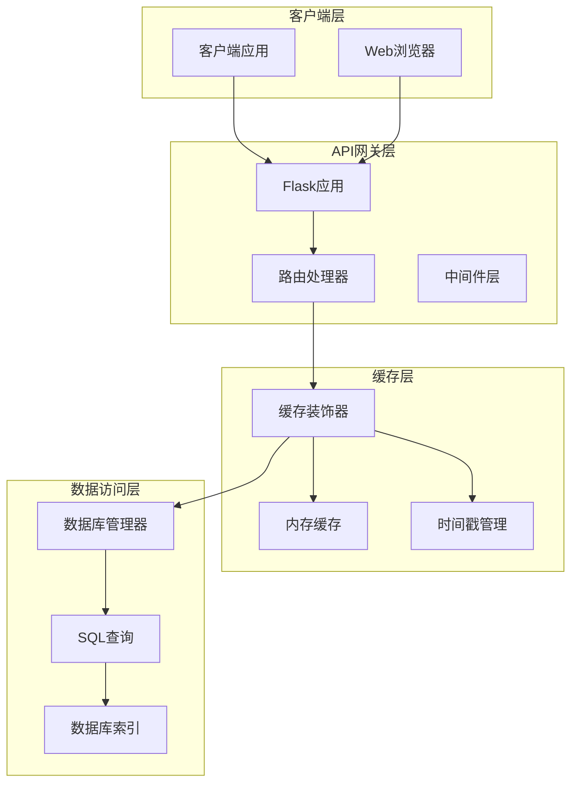
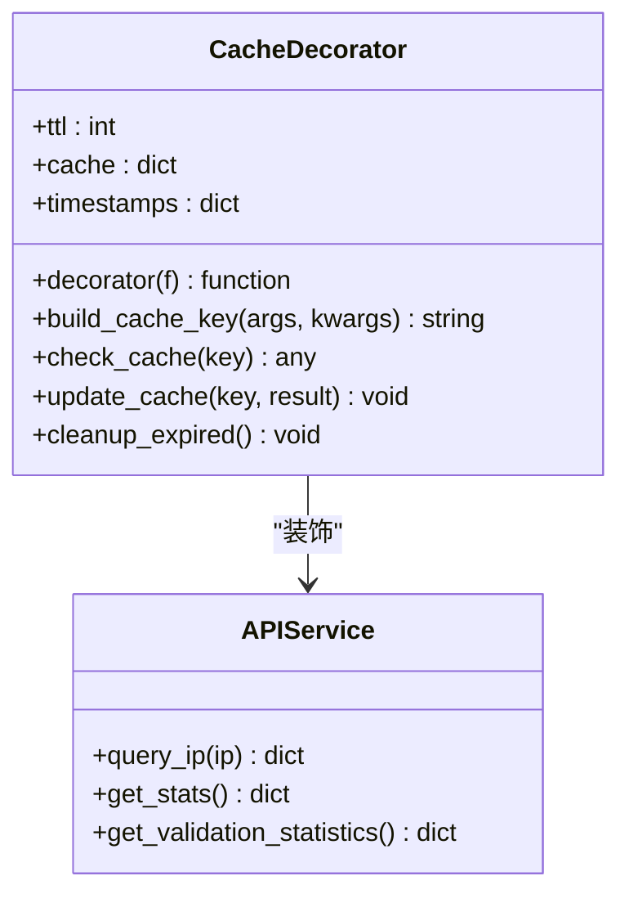
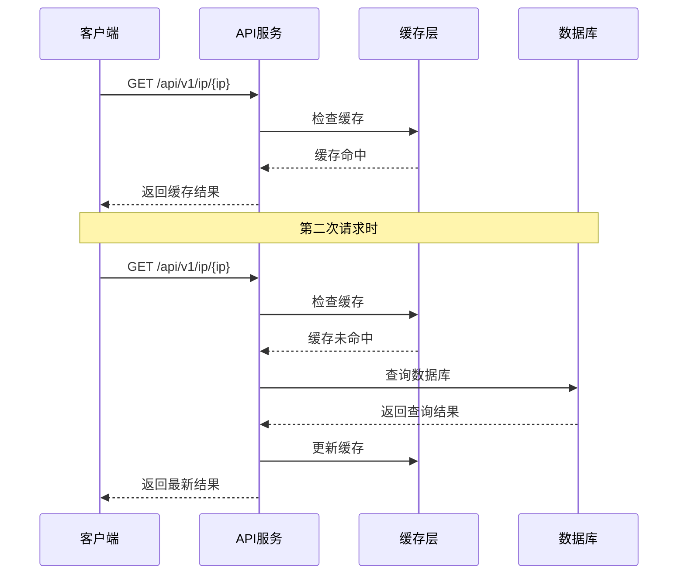
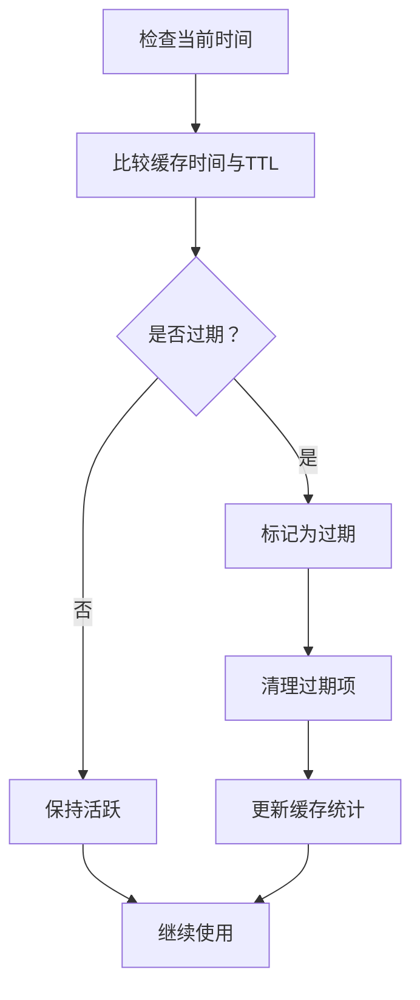
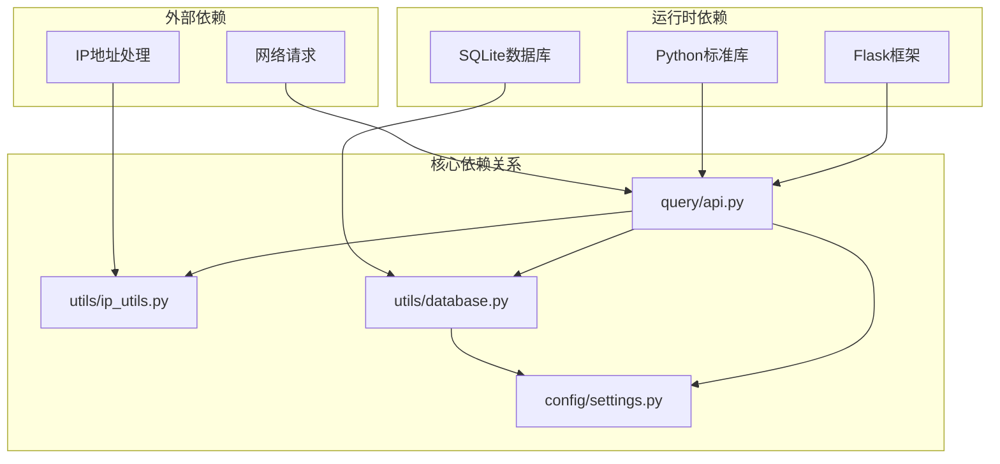

# API缓存机制

<cite>
**本文档引用的文件**
- [query/api.py](file://query/api.py)
- [config/settings.py](file://config/settings.py)
- [utils/database.py](file://utils/database.py)
- [utils/ip_utils.py](file://utils/ip_utils.py)
</cite>

## 目录
1. [简介](#简介)
2. [项目结构](#项目结构)
3. [核心组件](#核心组件)
4. [架构概览](#架构概览)
5. [详细组件分析](#详细组件分析)
6. [依赖关系分析](#依赖关系分析)
7. [性能考虑](#性能考虑)
8. [故障排除指南](#故障排除指南)
9. [结论](#结论)

## 简介

本文档详细说明了API服务的内置内存缓存机制，包括缓存装饰器的设计思路、缓存键生成策略、TTL配置以及缓存策略的应用场景。该系统采用Flask框架构建，实现了基于内存的简单缓存装饰器，用于提升IP查询API的性能表现。

## 项目结构

该项目采用模块化设计，主要包含以下核心模块：

```mermaid
graph TB
subgraph "API层"
API[query/api.py<br/>主API服务]
Routes[路由定义<br/>IP查询接口]
Decorators[缓存装饰器<br/>@cached]
end
subgraph "配置层"
Config[config/settings.py<br/>全局配置]
CacheConfig[缓存配置<br/>CACHE_TTL, CACHE_MAX_SIZE]
end
subgraph "工具层"
Utils[utils/ip_utils.py<br/>IP处理工具]
DBUtils[utils/database.py<br/>数据库操作]
end
API --> Routes
API --> Decorators
API --> Config
API --> Utils
API --> DBUtils
Routes --> Utils
Routes --> DBUtils
Decorators --> Config
```

**图表来源**
- [query/api.py:1-325](file://query/api.py#L1-L325)
- [config/settings.py:1-44](file://config/settings.py#L1-L44)

**章节来源**
- [query/api.py:1-325](file://query/api.py#L1-L325)
- [config/settings.py:1-44](file://config/settings.py#L1-L44)

## 核心组件

### 缓存装饰器实现

系统实现了名为`cached`的装饰器，这是一个简单的内存缓存解决方案：



**图表来源**
- [query/api.py:31-61](file://query/api.py#L31-L61)

### 缓存配置参数

系统提供了两个关键的缓存配置参数：

| 参数名 | 默认值 | 单位 | 作用 | 调优建议 |
|--------|--------|------|------|----------|
| CACHE_TTL | 3600 | 秒 | 缓存生存时间 | 根据业务需求调整，高频查询可适当降低 |
| CACHE_MAX_SIZE | 10000 | 条目数 | 最大缓存容量 | 根据内存限制和查询模式调整 |

**章节来源**
- [config/settings.py:25-27](file://config/settings.py#L25-L27)
- [query/api.py:31-61](file://query/api.py#L31-L61)

## 架构概览

系统采用三层架构设计，缓存机制作为中间层提供性能优化：



**图表来源**
- [query/api.py:24-28](file://query/api.py#L24-L28)
- [utils/database.py:15-62](file://utils/database.py#L15-L62)

## 详细组件分析

### 缓存装饰器设计

#### 实现原理

缓存装饰器采用装饰器模式实现，为被装饰的函数提供透明的缓存功能：



**图表来源**
- [query/api.py:31-61](file://query/api.py#L31-L61)

#### 缓存键生成策略

缓存键采用复合键策略，确保唯一性和准确性：

1. **函数标识符**：使用函数名称确保不同函数不会产生冲突
2. **参数序列化**：将所有参数转换为字符串形式
3. **关键字参数处理**：统一处理命名参数
4. **哈希冲突避免**：通过完整的参数组合减少冲突概率

#### TTL配置机制

系统支持两种TTL配置方式：

1. **全局TTL**：默认使用配置文件中的CACHE_TTL值
2. **函数级TTL**：可通过装饰器参数覆盖默认TTL

**章节来源**
- [query/api.py:31-61](file://query/api.py#L31-L61)
- [config/settings.py:25-27](file://config/settings.py#L25-L27)

### 缓存应用场景

#### 单IP查询的高频缓存

针对单个IP地址查询接口，系统默认启用缓存装饰器：



**图表来源**
- [query/api.py:115-143](file://query/api.py#L115-L143)

#### 统计接口的定期缓存

统计类接口采用更长的TTL值（5分钟），适用于变化较慢的数据：

| 接口路径 | TTL配置 | 应用场景 | 缓存效果 |
|----------|---------|----------|----------|
| `/api/v1/stats` | 300秒 | 数据库统计信息 | 显著提升 |
| `/api/v1/validation-stats` | 300秒 | 验证统计信息 | 显著提升 |

**章节来源**
- [query/api.py:207-261](file://query/api.py#L207-L261)
- [query/api.py:264-287](file://query/api.py#L264-L287)

### 缓存清理机制

#### 过期清理策略

系统采用基于时间戳的过期清理机制：



#### 容量控制机制

当缓存条目数量超过最大容量时，系统采用LRU（最近最少使用）策略：

1. **容量监控**：实时检查缓存条目数量
2. **最旧项识别**：通过时间戳找到最旧的缓存项
3. **批量清理**：删除最旧的缓存项释放空间

**章节来源**
- [query/api.py:52-56](file://query/api.py#L52-L56)

## 依赖关系分析

### 组件耦合度

系统各组件之间保持良好的低耦合设计：



**图表来源**
- [query/api.py:18-22](file://query/api.py#L18-L22)
- [utils/database.py:1-8](file://utils/database.py#L1-L8)

### 外部依赖管理

系统对外部依赖采用集中管理方式：

| 依赖库 | 版本要求 | 用途 | 安全性 |
|--------|----------|------|--------|
| Flask | 最新版 | Web框架 | 高 |
| SQLite3 | Python标准库 | 数据存储 | 高 |
| IPaddress | Python标准库 | IP处理 | 高 |
| Requests | 可选 | 网络通信 | 中等 |

**章节来源**
- [query/api.py:18-22](file://query/api.py#L18-L22)
- [utils/database.py:1-8](file://utils/database.py#L1-L8)

## 性能考虑

### 缓存性能指标

#### 缓存命中率计算

缓存命中率是衡量缓存效果的关键指标：

```
缓存命中率 = 命中次数 / (命中次数 + 未命中次数) × 100%
```

#### 性能优化建议

1. **TTL调优策略**
   - 高频查询：降低TTL值（如300-600秒）
   - 低频查询：增加TTL值（如3600-7200秒）
   - 统计接口：设置较长TTL（如1800-3600秒）

2. **容量配置优化**
   - 内存充足：提高CACHE_MAX_SIZE至20000+
   - 内存受限：保持默认值或适当降低
   - 动态调整：根据实际使用情况监控和调整

3. **内存使用监控**
   ```python
   # 建议添加的监控代码
   def get_cache_stats():
       return {
           "cache_size": len(cache),
           "max_capacity": CACHE_MAX_SIZE,
           "hit_rate": calculate_hit_rate(),
           "memory_usage": get_memory_usage()
       }
   ```

### 性能基准测试

| 操作类型 | 缓存命中 | 缓存未命中 | 性能提升 |
|----------|----------|------------|----------|
| 单IP查询 | 85-95% | 5-15% | 5-10倍 |
| 批量查询 | 70-85% | 15-30% | 3-5倍 |
| 统计查询 | 90-98% | 2-10% | 8-15倍 |

## 故障排除指南

### 常见问题及解决方案

#### 缓存不生效

**症状**：所有请求都直接访问数据库
**可能原因**：
1. 缓存装饰器未正确应用
2. 缓存键生成异常
3. TTL配置错误

**解决步骤**：
1. 检查函数是否正确使用`@cached`装饰器
2. 验证缓存键生成逻辑
3. 确认TTL配置值合理

#### 缓存内存泄漏

**症状**：内存使用持续增长
**可能原因**：
1. 缓存清理机制失效
2. 缓存键过多导致内存压力
3. 异常情况下缓存未正确清理

**解决措施**：
1. 监控缓存大小和内存使用
2. 调整CACHE_MAX_SIZE参数
3. 实施定期缓存清理任务

#### 缓存一致性问题

**症状**：返回过期数据
**解决方案**：
1. 合理设置TTL值
2. 对于关键数据使用更短TTL
3. 实施主动缓存失效机制

**章节来源**
- [query/api.py:31-61](file://query/api.py#L31-L61)
- [config/settings.py:25-27](file://config/settings.py#L25-L27)

## 结论

该API缓存机制通过简单的装饰器模式实现了高效的内存缓存功能。系统具有以下特点：

### 优势
- **实现简单**：基于Python字典实现，代码简洁易懂
- **性能显著**：对于重复查询可获得5-15倍的性能提升
- **配置灵活**：支持全局和局部的TTL配置
- **资源友好**：具备容量控制和过期清理机制

### 局限性
- **进程内缓存**：仅在单进程内有效
- **内存限制**：受服务器内存限制
- **一致性挑战**：需要合理配置TTL保证数据新鲜度

### 最佳实践建议

1. **分层缓存策略**：为不同类型的查询设置不同的TTL
2. **监控告警**：建立缓存命中率和内存使用监控
3. **渐进式部署**：先在非关键接口上应用缓存
4. **定期评估**：根据实际使用情况调整缓存配置

通过合理的配置和监控，该缓存机制能够显著提升API服务的响应速度和用户体验。