# API错误处理

<cite>
**本文档引用的文件**
- [query/api.py](file://query/api.py)
- [utils/database.py](file://utils/database.py)
- [utils/ip_utils.py](file://utils/ip_utils.py)
- [validator/node_server.py](file://validator/node_server.py)
- [validator/node_client.py](file://validator/node_client.py)
- [validator/accuracy_tester.py](file://validator/accuracy_tester.py)
- [config/settings.py](file://config/settings.py)
- [scripts/init_db.py](file://scripts/init_db.py)
</cite>

## 目录
1. [简介](#简介)
2. [项目结构](#项目结构)
3. [核心组件](#核心组件)
4. [架构概览](#架构概览)
5. [详细组件分析](#详细组件分析)
6. [依赖分析](#依赖分析)
7. [性能考虑](#性能考虑)
8. [故障排除指南](#故障排除指南)
9. [结论](#结论)

## 简介

本文档详细说明了IP地址查询API服务的错误处理机制。该系统采用Flask框架构建，提供了完整的HTTP状态码使用规范、错误响应JSON格式定义，以及针对各种异常情况的处理策略。系统涵盖了客户端错误处理的最佳实践、重试策略、容错能力和降级机制。

## 项目结构

该项目采用模块化设计，主要包含以下核心模块：

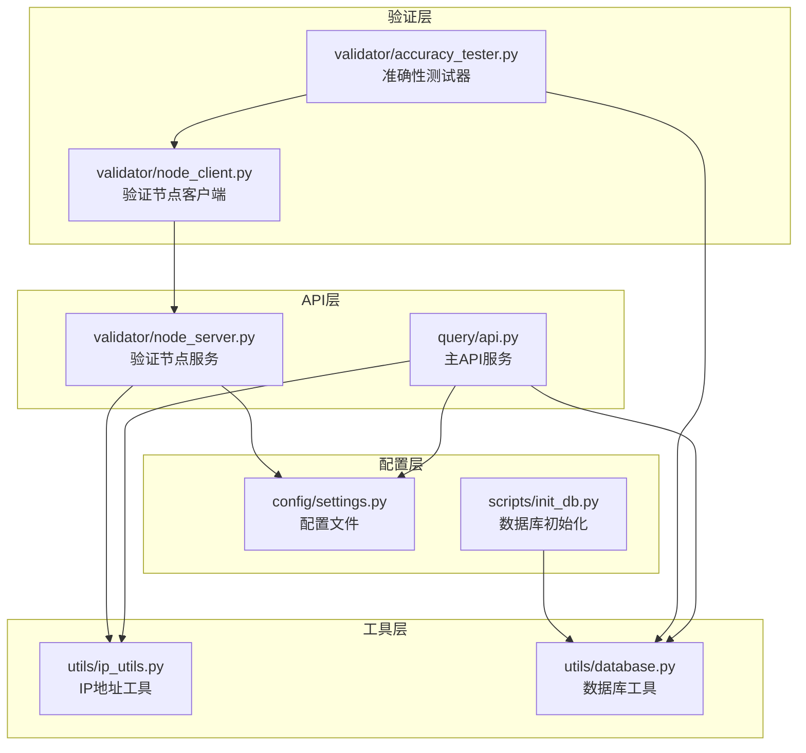

**图表来源**
- [query/api.py:1-325](file://query/api.py#L1-L325)
- [utils/database.py:1-398](file://utils/database.py#L1-L398)
- [validator/node_server.py:1-350](file://validator/node_server.py#L1-L350)

**章节来源**
- [query/api.py:1-50](file://query/api.py#L1-L50)
- [utils/database.py:1-50](file://utils/database.py#L1-L50)
- [validator/node_server.py:1-50](file://validator/node_server.py#L1-L50)

## 核心组件

### HTTP状态码使用规范

系统严格遵循HTTP标准状态码规范：

- **400 Bad Request**: 处理无效请求参数和格式错误
- **404 Not Found**: 处理不存在的API端点
- **500 Internal Server Error**: 处理服务器内部异常

### 错误响应JSON格式

所有错误响应都采用统一的JSON格式：

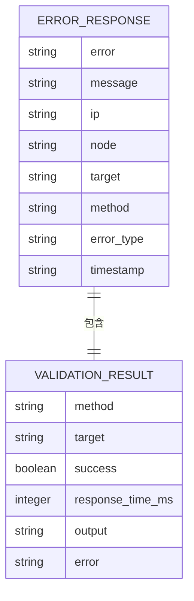

**图表来源**
- [query/api.py:127-142](file://query/api.py#L127-L142)
- [validator/node_server.py:63-106](file://validator/node_server.py#L63-L106)

### 缓存机制

系统实现了智能缓存机制以提高性能：

- **查询缓存**: 默认缓存时间为3600秒
- **统计缓存**: 数据统计信息缓存5分钟
- **内存缓存**: 支持最大10000条缓存项
- **自动清理**: 超时自动清理过期缓存

**章节来源**
- [query/api.py:31-60](file://query/api.py#L31-L60)
- [config/settings.py:22-27](file://config/settings.py#L22-L27)

## 架构概览

系统采用分层架构设计，确保错误处理的统一性和可维护性：

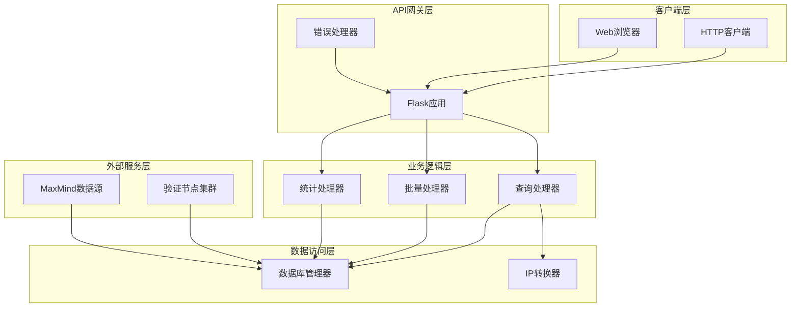

**图表来源**
- [query/api.py:100-143](file://query/api.py#L100-L143)
- [utils/database.py:15-68](file://utils/database.py#L15-L68)

## 详细组件分析

### API错误处理机制

#### 单IP查询错误处理

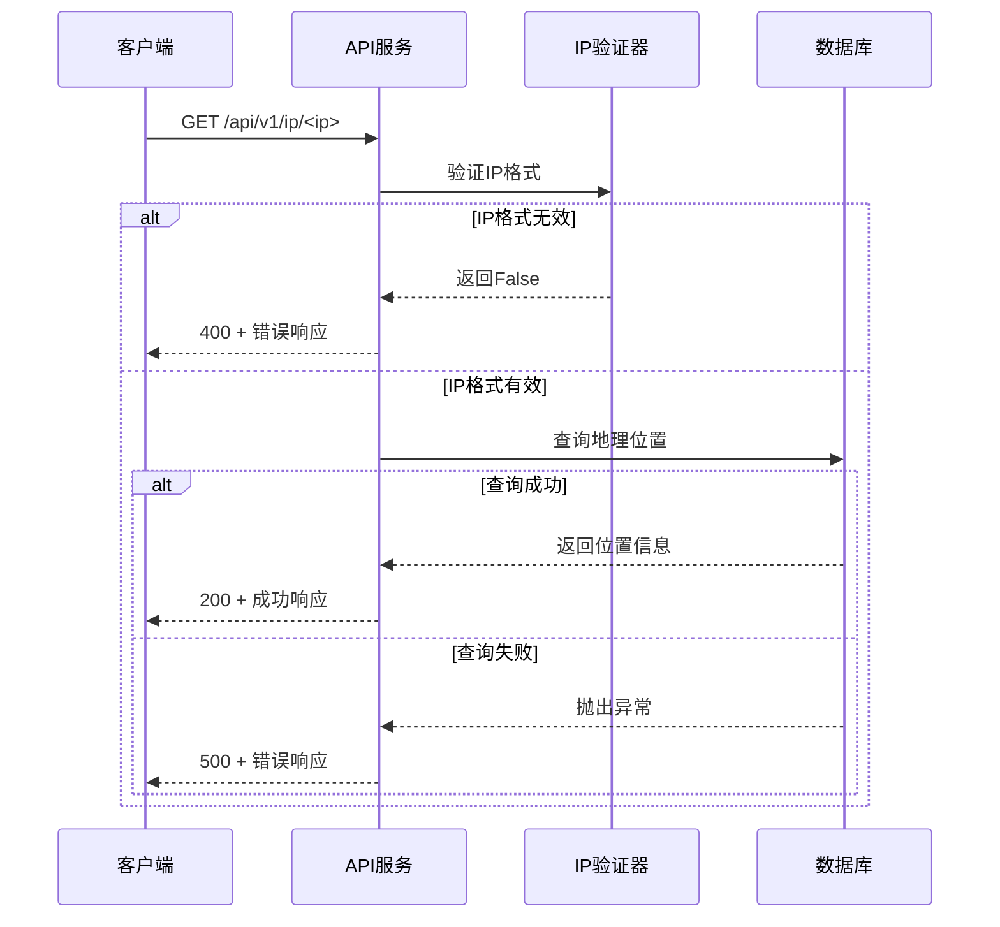

**图表来源**
- [query/api.py:115-143](file://query/api.py#L115-L143)
- [utils/ip_utils.py:134-148](file://utils/ip_utils.py#L134-L148)

#### 批量查询错误处理

批量查询采用部分失败策略，确保系统稳定性：

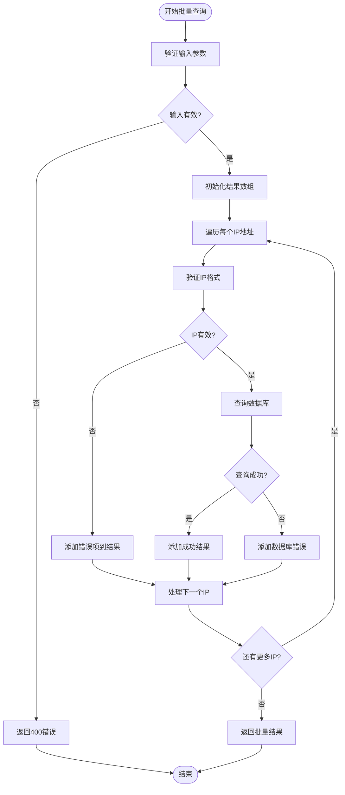

**图表来源**
- [query/api.py:145-204](file://query/api.py#L145-L204)

#### API端点错误处理

系统为所有未匹配的路由提供统一的404错误处理：

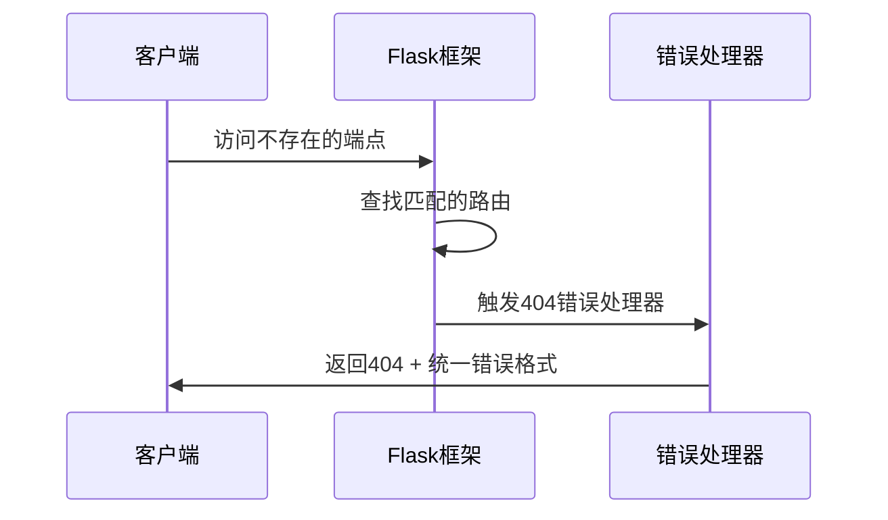

**图表来源**
- [query/api.py:290-303](file://query/api.py#L290-L303)

**章节来源**
- [query/api.py:115-204](file://query/api.py#L115-L204)
- [query/api.py:290-303](file://query/api.py#L290-L303)

### 验证节点错误处理

#### 节点认证错误处理

验证节点服务实现了严格的API密钥认证机制：

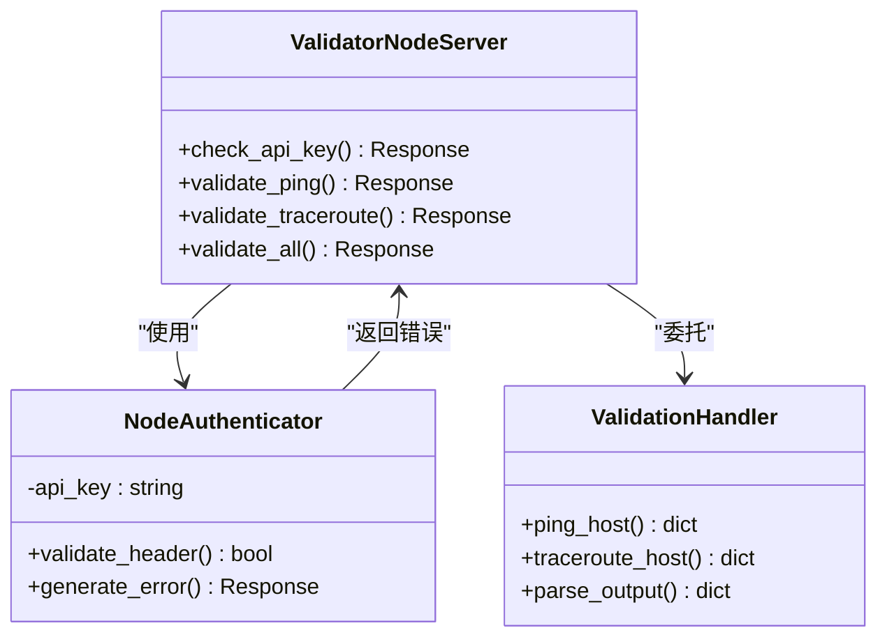

**图表来源**
- [validator/node_server.py:44-49](file://validator/node_server.py#L44-L49)
- [validator/node_server.py:231-284](file://validator/node_server.py#L231-L284)

#### 节点间通信错误处理

验证节点客户端实现了健壮的错误处理机制：

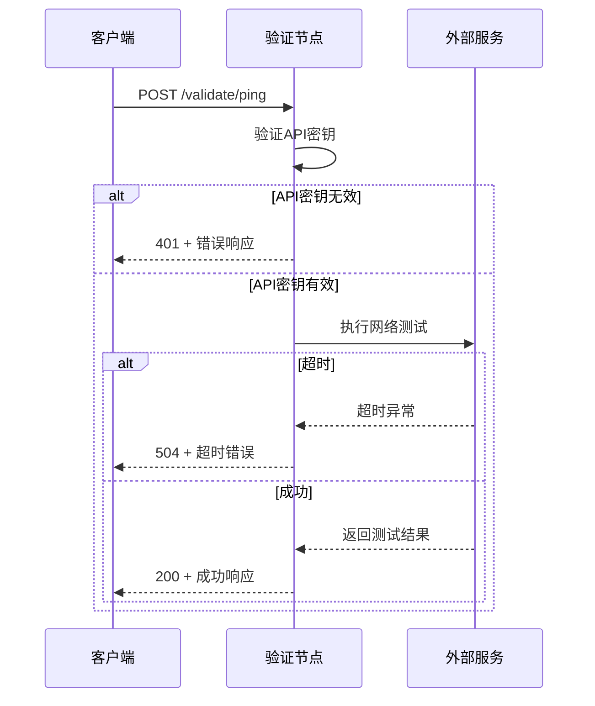

**图表来源**
- [validator/node_server.py:63-106](file://validator/node_server.py#L63-L106)
- [validator/node_client.py:31-52](file://validator/node_client.py#L31-L52)

**章节来源**
- [validator/node_server.py:44-49](file://validator/node_server.py#L44-L49)
- [validator/node_client.py:31-52](file://validator/node_client.py#L31-L52)

### 数据库错误处理

#### 数据库连接管理

数据库管理器实现了完整的连接生命周期管理：

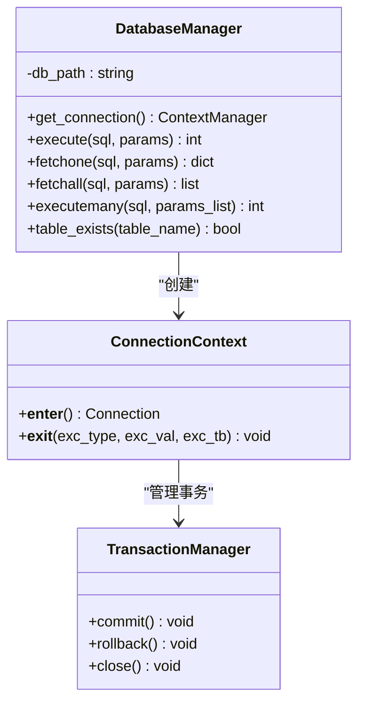

**图表来源**
- [utils/database.py:15-68](file://utils/database.py#L15-L68)

#### 数据库操作错误处理

数据库操作采用统一的异常处理策略：

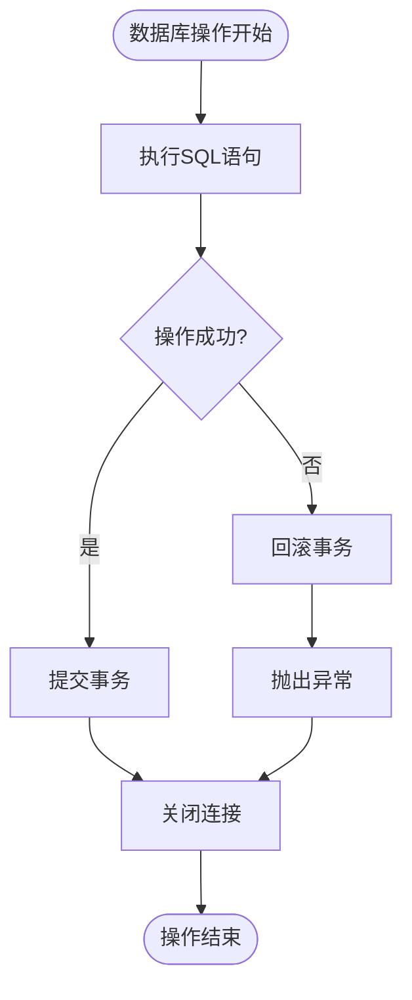

**图表来源**
- [utils/database.py:21-33](file://utils/database.py#L21-L33)

**章节来源**
- [utils/database.py:15-68](file://utils/database.py#L15-L68)

## 依赖分析

系统依赖关系清晰，错误处理机制相互配合：

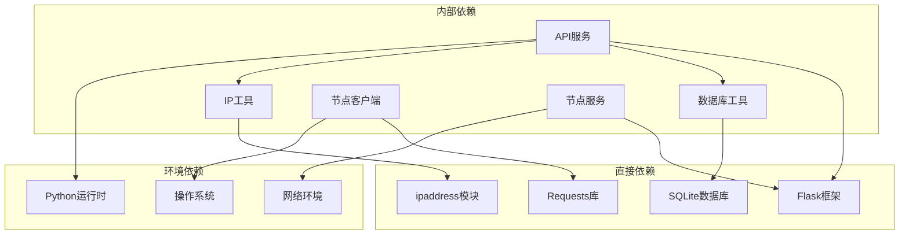

**图表来源**
- [requirements.txt:1-5](file://requirements.txt#L1-L5)
- [query/api.py:18-22](file://query/api.py#L18-L22)

**章节来源**
- [requirements.txt:1-5](file://requirements.txt#L1-L5)
- [query/api.py:18-22](file://query/api.py#L18-L22)

## 性能考虑

### 缓存策略优化

系统实现了多层次的缓存策略：

- **查询缓存**: 针对频繁查询的IP地址进行缓存
- **统计缓存**: 对统计数据进行短期缓存
- **内存管理**: 自动清理过期缓存，控制内存使用

### 错误处理性能影响

错误处理机制对性能的影响最小化：

- **快速失败**: 无效输入立即返回错误
- **异常隔离**: 数据库异常不影响其他功能
- **资源回收**: 异常情况下确保资源正确释放

## 故障排除指南

### 常见错误场景及解决方案

#### 400错误（无效请求）

**场景**: IP地址格式不正确或请求体格式错误

**诊断步骤**:
1. 检查IP地址格式是否符合IPv4/IPv6标准
2. 验证请求体JSON格式是否正确
3. 确认必需字段是否完整

**解决方案**:
- 使用IP验证工具函数验证地址格式
- 检查请求头Content-Type设置
- 确认JSON语法正确性

#### 404错误（接口不存在）

**场景**: 访问不存在的API端点

**诊断步骤**:
1. 检查API路径拼写
2. 验证HTTP方法是否正确
3. 确认服务端点是否已部署

**解决方案**:
- 使用API文档验证端点路径
- 检查服务启动状态
- 验证防火墙和网络配置

#### 500错误（服务器内部错误）

**场景**: 数据库连接失败或查询超时

**诊断步骤**:
1. 检查数据库文件是否存在且可访问
2. 验证数据库权限设置
3. 监控系统资源使用情况

**解决方案**:
- 重启数据库服务
- 检查磁盘空间和权限
- 优化查询性能

### 客户端错误处理最佳实践

#### 重试策略

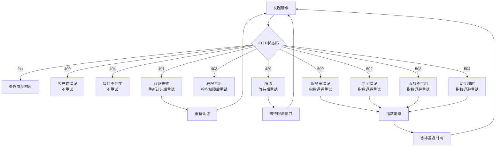

#### 客户端重试配置建议

- **最大重试次数**: 3次
- **初始延迟**: 1秒
- **最大延迟**: 30秒
- **退避因子**: 2
- **超时设置**: 30秒

### 容错能力和降级机制

#### 服务降级策略

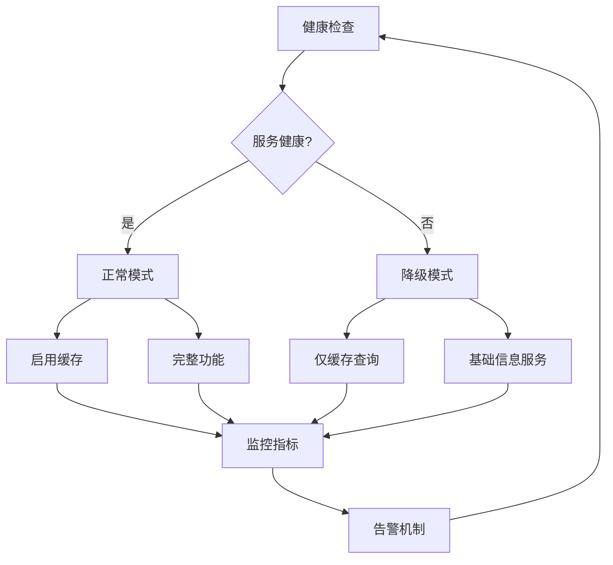

#### 降级功能实现

- **缓存优先**: 降级时优先使用缓存数据
- **简化响应**: 减少响应数据复杂度
- **功能保留**: 保留核心查询功能
- **性能优化**: 优化查询性能

**章节来源**
- [query/api.py:290-303](file://query/api.py#L290-L303)
- [validator/node_client.py:31-52](file://validator/node_client.py#L31-L52)

## 结论

该API服务的错误处理机制具有以下特点：

1. **标准化**: 严格遵循HTTP状态码标准，提供一致的错误响应格式
2. **完整性**: 覆盖了从客户端到数据库的全链路错误处理
3. **健壮性**: 实现了多种容错和降级机制，确保系统稳定性
4. **可维护性**: 清晰的模块化设计，便于错误处理逻辑的维护和扩展

通过实施这些错误处理策略，系统能够在各种异常情况下保持稳定运行，并为用户提供清晰的错误信息和恢复指导。建议在生产环境中结合实际使用情况进行适当的调整和优化。