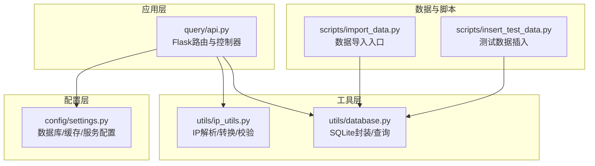
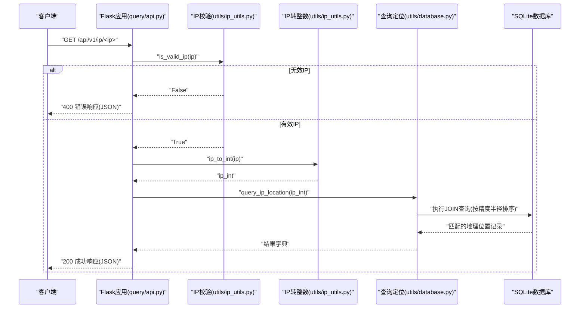
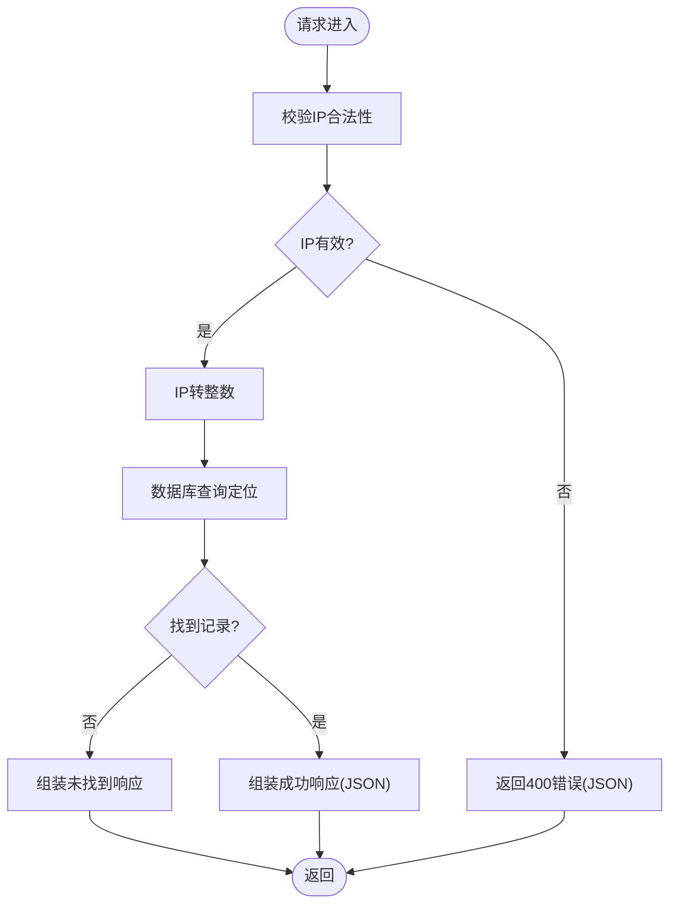
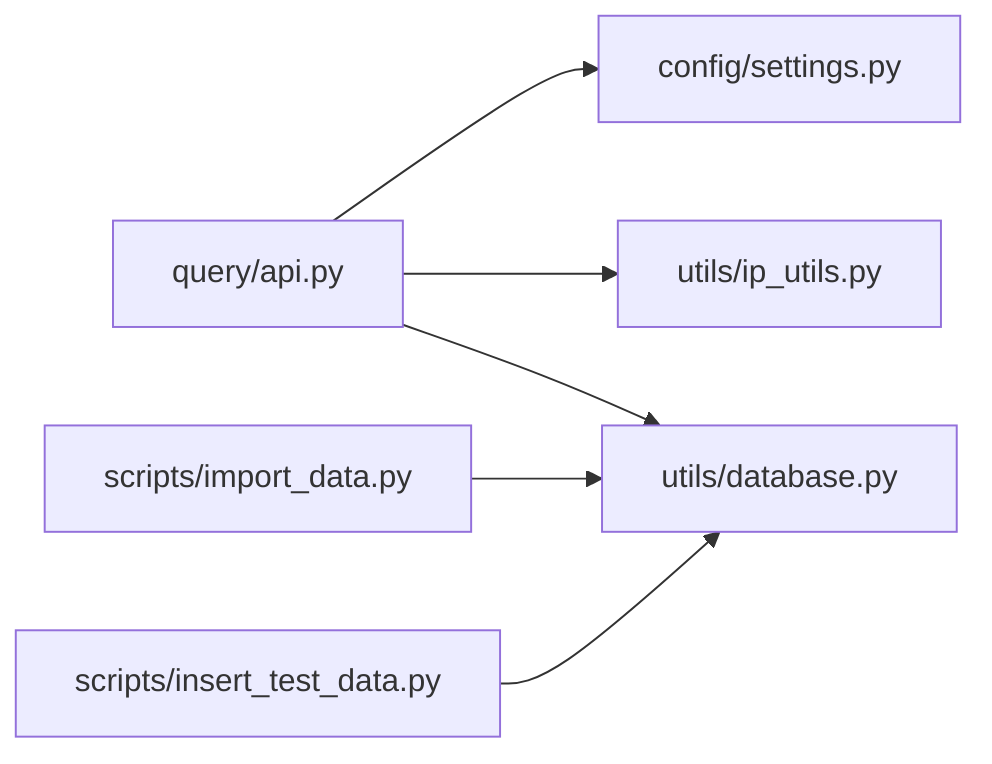

# 单IP查询接口

<cite>
**本文引用的文件**
- [query/api.py](file://query/api.py)
- [utils/ip_utils.py](file://utils/ip_utils.py)
- [utils/database.py](file://utils/database.py)
- [config/settings.py](file://config/settings.py)
- [scripts/import_data.py](file://scripts/import_data.py)
- [scripts/insert_test_data.py](file://scripts/insert_test_data.py)
- [requirements.txt](file://requirements.txt)
</cite>

## 目录
1. [简介](#简介)
2. [项目结构](#项目结构)
3. [核心组件](#核心组件)
4. [架构总览](#架构总览)
5. [详细组件分析](#详细组件分析)
6. [依赖关系分析](#依赖关系分析)
7. [性能考量](#性能考量)
8. [故障排查指南](#故障排查指南)
9. [结论](#结论)
10. [附录](#附录)

## 简介
本文档面向“单IP地址查询接口”的使用者与维护者，围绕 GET /api/v1/ip/<ip> 端点进行深入说明。内容涵盖：
- 路径参数 IP 的格式要求与有效性校验规则
- 请求处理流程：从 IP 校验到数据库查询的完整链路
- 成功与失败场景下的响应结构
- IPv4 与 IPv6 的请求/响应示例
- 缓存机制对查询性能的影响
- 错误处理策略与状态码含义
- 客户端集成建议与常见问题解答

## 项目结构
该项目采用模块化组织，核心查询逻辑集中在 query/api.py，IP 工具与数据库访问分别位于 utils/ip_utils.py 与 utils/database.py，配置项集中于 config/settings.py，数据导入与测试辅助脚本位于 scripts/ 目录。

图表来源
- [query/api.py:115-143](file://query/api.py#L115-L143)
- [utils/ip_utils.py:134-148](file://utils/ip_utils.py#L134-L148)
- [utils/database.py:193-230](file://utils/database.py#L193-L230)
- [config/settings.py:22-27](file://config/settings.py#L22-L27)
- [scripts/import_data.py:26-41](file://scripts/import_data.py#L26-L41)
- [scripts/insert_test_data.py:13-62](file://scripts/insert_test_data.py#L13-L62)

章节来源
- [query/api.py:115-143](file://query/api.py#L115-L143)
- [config/settings.py:22-27](file://config/settings.py#L22-L27)

## 核心组件
- Flask 应用与路由：定义 /api/v1/ip/<ip> 路由，并提供首页、批量查询、统计等其他接口。
- IP 工具模块：提供 IP 校验、IP 整数转换、CIDR 范围转换、IPv6 展开/压缩等能力。
- 数据库模块：封装 SQLite 连接、事务、查询与索引；提供 IP 地址定位查询方法。
- 配置模块：定义数据库路径、API 监听地址、缓存 TTL 与最大缓存条目等。
- 缓存装饰器：为查询接口提供简单内存缓存，提升重复查询性能。

章节来源
- [query/api.py:115-143](file://query/api.py#L115-L143)
- [utils/ip_utils.py:134-148](file://utils/ip_utils.py#L134-L148)
- [utils/database.py:193-230](file://utils/database.py#L193-L230)
- [config/settings.py:22-27](file://config/settings.py#L22-L27)

## 架构总览
下图展示了单IP查询请求从进入 Flask 路由到数据库查询与响应返回的完整调用序列。

图表来源
- [query/api.py:115-143](file://query/api.py#L115-L143)
- [utils/ip_utils.py:9-32](file://utils/ip_utils.py#L9-L32)
- [utils/database.py:193-230](file://utils/database.py#L193-L230)

## 详细组件分析

### 接口定义与路径参数
- 端点：GET /api/v1/ip/<ip>
- 路径参数：
  - ip：字符串形式的 IP 地址，支持 IPv4 与 IPv6
- 功能：根据 IP 地址查询其地理位置信息，若未找到则返回未找到提示

章节来源
- [query/api.py:115-143](file://query/api.py#L115-L143)

### IP 地址格式要求与有效性验证
- 支持格式：
  - IPv4：标准十进制点分格式，例如 192.168.1.1
  - IPv6：完整格式或压缩格式，例如 2001:db8::1 或 2001:0db8:0000:0000:0000:0000:0000:0001
- 校验规则：
  - 通过 ipaddress 模块进行解析，确保输入为合法的 IPv4 或 IPv6 地址
  - 不接受私有地址、保留地址等非法形式（具体取决于 ipaddress 的判定）
- 失败处理：
  - 当 ip 不符合上述规则时，返回 400 错误，响应体包含错误信息与原始 ip

章节来源
- [utils/ip_utils.py:134-148](file://utils/ip_utils.py#L134-L148)
- [query/api.py:127-131](file://query/api.py#L127-L131)

### 请求处理流程
- 步骤概览：
  1) 路由进入：Flask 接收 GET /api/v1/ip/<ip>
  2) IP 校验：调用 is_valid_ip(ip)
  3) IP 转换：调用 ip_to_int(ip) 将 IP 转为整数
  4) 数据库查询：调用 query_ip_location(ip_int) 执行定位查询
  5) 响应组装：调用 format_ip_response(ip, result) 组装 JSON
  6) 返回：返回 200 OK 或 500 内部错误

图表来源
- [query/api.py:115-143](file://query/api.py#L115-L143)
- [utils/ip_utils.py:9-32](file://utils/ip_utils.py#L9-L32)
- [utils/database.py:193-230](file://utils/database.py#L193-L230)

### 数据库查询逻辑
- 查询目标：ip_ranges 表与 locations 表的联结
- 查询条件：ip_int 在 [start_ip, end_ip] 范围内
- 排序策略：按 accuracy_radius 升序，优先返回精度更高的记录
- 返回字段：网络、国家/地区/城市/区县、邮政编码、经纬度、时区、精度半径、数据源等

章节来源
- [utils/database.py:193-230](file://utils/database.py#L193-L230)

### 响应格式
- 成功响应（200 OK）：
  - 结构要点：包含 ip、found、network、location（国家/地区/城市/区县/邮编/经纬度/时区）、accuracy（半径）、source、query_time
  - 未找到时：found=false，message 提示未找到
- 失败响应：
  - 400：无效IP，包含 error 与 ip 字段
  - 500：内部错误，包含 error 与 ip 字段

章节来源
- [query/api.py:63-97](file://query/api.py#L63-L97)
- [query/api.py:127-142](file://query/api.py#L127-L142)

### 请求/响应示例

- IPv4 示例
  - 请求：GET /api/v1/ip/8.8.8.8
  - 成功响应（节选）：{
    "ip": "8.8.8.8",
    "found": true,
    "network": "8.8.8.0/24",
    "location": {
      "country": {"code": "US", "name": "United States"},
      "region": {"code": "CA", "name": "California"},
      "city": "Mountain View",
      "district": null,
      "postal_code": "94043",
      "latitude": 37.386,
      "longitude": -122.0838,
      "timezone": "America/Los_Angeles"
    },
    "accuracy": {"radius_km": 100},
    "source": "maxmind",
    "query_time": "2025-04-05T12:34:56.789012"
  }
  - 未找到响应：{
    "ip": "192.0.2.1",
    "found": false,
    "message": "未找到该IP的地理位置信息"
  }

- IPv6 示例
  - 请求：GET /api/v1/ip/2001:db8::1
  - 成功响应（节选）：{
    "ip": "2001:db8::1",
    "found": true,
    "network": "2001:db8::/64",
    "location": {
      "country": {"code": "CN", "name": "China"},
      "region": {"code": "BJ", "name": "Beijing"},
      "city": "Beijing",
      "district": null,
      "postal_code": "100000",
      "latitude": 39.9042,
      "longitude": 116.4074,
      "timezone": "Asia/Shanghai"
    },
    "accuracy": {"radius_km": 50},
    "source": "maxmind",
    "query_time": "2025-04-05T12:34:56.789012"
  }

- 失败示例
  - 400 错误：{
    "error": "无效的IP地址",
    "ip": "invalid.ip"
  }
  - 500 错误：{
    "error": "查询失败: 数据库异常",
    "ip": "8.8.8.8"
  }

章节来源
- [query/api.py:63-97](file://query/api.py#L63-L97)
- [query/api.py:127-142](file://query/api.py#L127-L142)
- [scripts/insert_test_data.py:44-48](file://scripts/insert_test_data.py#L44-L48)

### 缓存机制
- 缓存装饰器 cached(ttl=CACHE_TTL)：
  - 对 query_ip 路由启用缓存，键由函数名、参数元组构成
  - TTL 默认 3600 秒（1小时），超过 TTL 自动失效
  - 最大缓存条目默认 10000，超出上限按最旧条目淘汰
- 性能影响：
  - 对相同 IP 的重复查询可显著降低数据库压力
  - 适合高并发场景下的热点 IP 查询优化

章节来源
- [query/api.py:31-60](file://query/api.py#L31-L60)
- [config/settings.py:26-27](file://config/settings.py#L26-L27)

### 错误处理策略与状态码
- 400：路径参数 ip 非法
  - 触发条件：is_valid_ip(ip) 返回 False
  - 响应体：包含 error 与 ip 字段
- 500：服务器内部错误
  - 触发条件：数据库查询或内部异常
  - 响应体：包含 error 与 ip 字段
- 404：未匹配到路由
  - 触发条件：请求了不存在的接口
  - 响应体：包含 error 与 message 字段

章节来源
- [query/api.py:127-142](file://query/api.py#L127-L142)
- [query/api.py:290-303](file://query/api.py#L290-L303)

### 客户端集成示例
- Python requests
  - 成功查询：requests.get("http://host:port/api/v1/ip/8.8.8.8").json()
  - 失败处理：if resp.status_code == 400: handle_invalid_ip(resp.json())
- curl
  - curl -s http://host:port/api/v1/ip/2001:db8::1
- 注意事项：
  - 优先使用 IPv6 压缩格式以减少歧义
  - 对高频查询开启本地缓存，避免重复请求
  - 捕获 400/500 并进行重试或降级处理

[本节为通用实践建议，不直接分析特定文件]

## 依赖关系分析
- query/api.py 依赖：
  - utils/ip_utils.py：IP 校验与转换
  - utils/database.py：数据库查询与连接管理
  - config/settings.py：数据库路径、缓存配置、服务监听参数
- 数据导入与测试：
  - scripts/import_data.py：MaxMind 数据导入入口
  - scripts/insert_test_data.py：手动插入测试数据

图表来源
- [query/api.py:18-22](file://query/api.py#L18-L22)
- [scripts/import_data.py:16-41](file://scripts/import_data.py#L16-L41)
- [scripts/insert_test_data.py:9-11](file://scripts/insert_test_data.py#L9-L11)

章节来源
- [query/api.py:18-22](file://query/api.py#L18-L22)
- [scripts/import_data.py:16-41](file://scripts/import_data.py#L16-L41)
- [scripts/insert_test_data.py:9-11](file://scripts/insert_test_data.py#L9-L11)

## 性能考量
- 缓存策略：
  - 启用 cached 装饰器，TTL 与最大缓存条目可在配置中调整
  - 对热点 IP 的重复查询可显著降低数据库负载
- 数据库索引：
  - ip_ranges 表对 (start_ip, end_ip)、network、location_id 建有索引，有利于范围查找
- 查询优化：
  - 按 accuracy_radius 升序排序，优先返回更高精度的结果
- 批量与并发：
  - 单IP查询为同步阻塞，建议在客户端侧做并发控制与重试
  - 如需批量查询，可参考 /api/v1/batch 接口的设计思路

[本节为通用性能讨论，不直接分析特定文件]

## 故障排查指南
- 常见问题与解决
  - 400 错误：确认 ip 参数为合法 IPv4/IPv6 地址
  - 500 错误：检查数据库连接与权限、表结构是否完整
  - 未找到记录：确认数据是否已导入、IP 是否在有效范围内
- 调试步骤
  - 启用调试模式运行 API 服务，查看日志输出
  - 使用 curl 直接访问接口，观察响应状态与内容
  - 在本地插入少量测试数据进行验证
- 相关配置
  - API_HOST/API_PORT：确认监听地址与端口
  - DATABASE_PATH：确认数据库文件存在且可读写
  - CACHE_TTL/CACHE_MAX_SIZE：根据业务调整缓存策略

章节来源
- [query/api.py:290-303](file://query/api.py#L290-L303)
- [config/settings.py:22-27](file://config/settings.py#L22-L27)
- [scripts/insert_test_data.py:13-62](file://scripts/insert_test_data.py#L13-L62)

## 结论
GET /api/v1/ip/<ip> 接口提供了简洁高效的单 IP 地址定位能力，具备完善的 IP 校验、数据库查询与响应组装流程，并通过缓存装饰器提升重复查询性能。建议在生产环境中结合批量查询、缓存与监控策略，确保稳定与高效的服务体验。

[本节为总结性内容，不直接分析特定文件]

## 附录

### A. 环境与依赖
- Python 版本：建议使用 Python 3.8+
- 依赖包：requests、flask、click、csvkit
- 安装命令：pip install -r requirements.txt

章节来源
- [requirements.txt:1-5](file://requirements.txt#L1-L5)

### B. 数据导入与初始化
- 初始化数据库：python scripts/import_data.py maxmind --init-db
- 导入 MaxMind 数据：python scripts/import_data.py maxmind --license-key YOUR_KEY
- 插入测试数据：python scripts/insert_test_data.py

章节来源
- [scripts/import_data.py:44-61](file://scripts/import_data.py#L44-L61)
- [scripts/insert_test_data.py:13-62](file://scripts/insert_test_data.py#L13-L62)