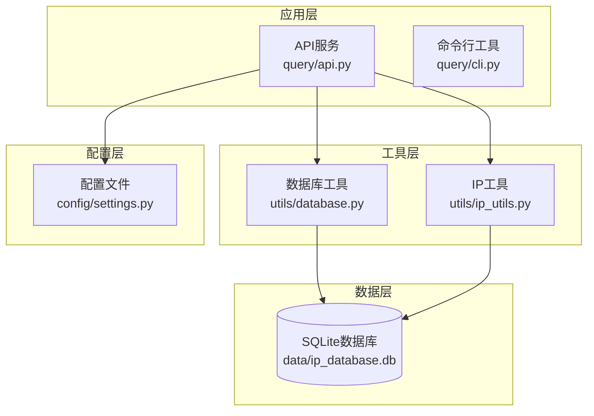
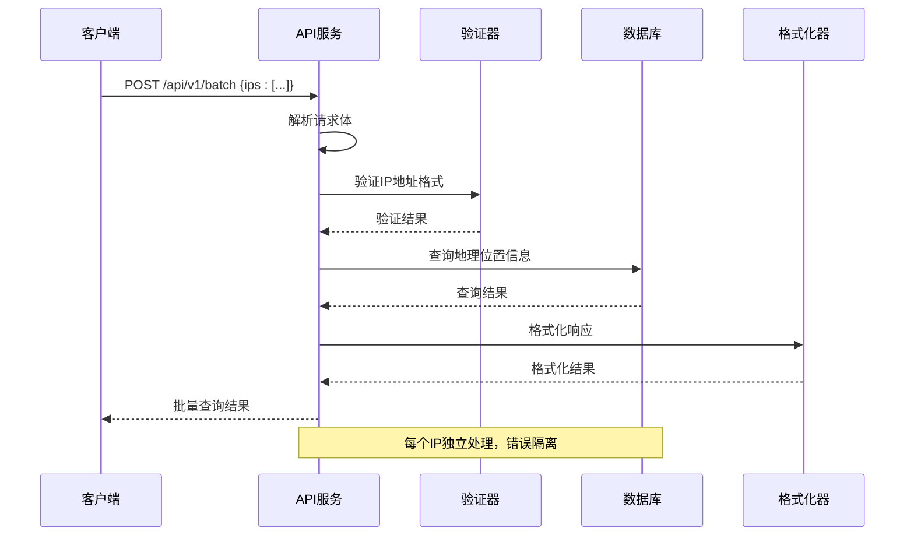
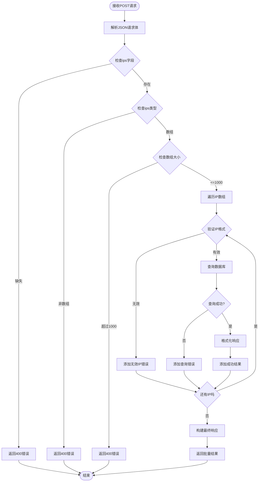
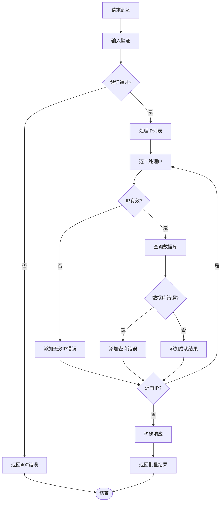
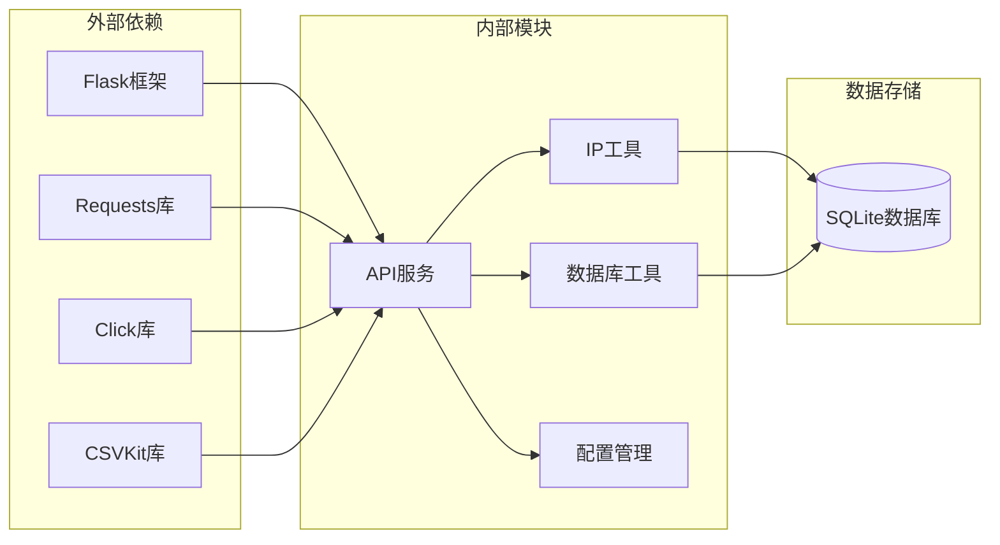

# 批量查询接口

<cite>
**本文档引用的文件**
- [query/api.py](file://query/api.py)
- [utils/ip_utils.py](file://utils/ip_utils.py)
- [utils/database.py](file://utils/database.py)
- [config/settings.py](file://config/settings.py)
- [requirements.txt](file://requirements.txt)
</cite>

## 目录
1. [简介](#简介)
2. [项目结构](#项目结构)
3. [核心组件](#核心组件)
4. [架构概览](#架构概览)
5. [详细组件分析](#详细组件分析)
6. [依赖关系分析](#依赖关系分析)
7. [性能考虑](#性能考虑)
8. [故障排除指南](#故障排除指南)
9. [结论](#结论)

## 简介

批量IP地址查询接口是IP地址定位API系统的核心功能之一，允许客户端一次性查询多个IP地址的地理位置信息。该接口实现了高效的批量处理机制，支持最多1000个IP地址的批量查询，并提供了完善的错误处理和性能优化策略。

## 项目结构

IP地址定位API系统采用模块化设计，主要包含以下核心模块：



**图表来源**
- [query/api.py:1-325](file://query/api.py#L1-L325)
- [utils/ip_utils.py:1-282](file://utils/ip_utils.py#L1-L282)
- [utils/database.py:1-398](file://utils/database.py#L1-L398)
- [config/settings.py:1-44](file://config/settings.py#L1-L44)

**章节来源**
- [query/api.py:1-325](file://query/api.py#L1-L325)
- [config/settings.py:1-44](file://config/settings.py#L1-L44)

## 核心组件

批量查询接口由以下核心组件构成：

### API路由组件
- **路由定义**: `/api/v1/batch` (POST方法)
- **请求处理**: `batch_query()`函数
- **响应格式**: 统一的JSON响应结构

### 输入验证组件
- **IP地址验证**: `is_valid_ip()`函数
- **批量大小限制**: 最大1000个IP地址
- **数据类型验证**: 确保输入为数组格式

### 处理引擎组件
- **逐个IP处理**: 顺序验证和查询
- **错误隔离**: 单个IP错误不影响其他IP处理
- **结果聚合**: 统一的结果格式化

**章节来源**
- [query/api.py:145-204](file://query/api.py#L145-L204)
- [utils/ip_utils.py:134-148](file://utils/ip_utils.py#L134-L148)

## 架构概览

批量查询接口采用分层架构设计，确保了良好的可维护性和扩展性：



**图表来源**
- [query/api.py:145-204](file://query/api.py#L145-L204)
- [utils/ip_utils.py:134-148](file://utils/ip_utils.py#L134-L148)
- [utils/database.py:193-230](file://utils/database.py#L193-L230)

## 详细组件分析

### 批量查询端点实现

#### 请求处理流程

批量查询接口的处理流程严格按照预定义的步骤执行：



**图表来源**
- [query/api.py:158-204](file://query/api.py#L158-L204)

#### 请求体格式规范

批量查询接口要求标准的JSON格式请求体：

**请求头**
- Content-Type: application/json

**请求体结构**
```json
{
  "ips": ["8.8.8.8", "1.1.1.1", "2001:4860:4860::8888"]
}
```

**字段说明**
- `ips`: 必需字段，IP地址数组
- 数组元素：支持IPv4和IPv6地址格式
- 最大数量：1000个IP地址

**章节来源**
- [query/api.py:150-157](file://query/api.py#L150-L157)

#### 输入验证规则

接口实施了多层次的输入验证：

1. **必需字段验证**
   - 检查请求体是否包含`ips`字段
   - 缺少字段时返回400状态码

2. **数据类型验证**
   - 确保`ips`字段为数组类型
   - 非数组类型返回400状态码

3. **批量大小限制**
   - 最大支持1000个IP地址
   - 超过限制返回400状态码

4. **IP地址格式验证**
   - 使用`is_valid_ip()`函数验证每个IP
   - 支持IPv4和IPv6格式
   - 无效IP地址单独处理

**章节来源**
- [query/api.py:160-175](file://query/api.py#L160-L175)
- [utils/ip_utils.py:134-148](file://utils/ip_utils.py#L134-L148)

#### 处理流程详解

批量查询采用逐个IP处理的策略，确保系统的稳定性和可靠性：

1. **IP地址验证阶段**
   - 对每个IP调用`is_valid_ip()`函数
   - 无效IP直接返回错误信息
   - 错误信息包含原始IP地址

2. **数据库查询阶段**
   - 有效IP转换为整数格式
   - 调用`query_ip_location()`函数查询
   - 支持异常处理和错误隔离

3. **结果格式化阶段**
   - 成功查询：调用`format_ip_response()`函数
   - 失败查询：构造标准化错误响应
   - 统一响应格式

**章节来源**
- [query/api.py:177-197](file://query/api.py#L177-L197)
- [utils/database.py:193-230](file://utils/database.py#L193-L230)

#### 响应格式规范

批量查询接口返回统一的JSON响应格式：

**响应头**
- Content-Type: application/json

**响应体结构**
```json
{
  "results": [
    {
      "ip": "8.8.8.8",
      "found": true,
      "network": "8.8.8.0/24",
      "location": {
        "country": {
          "code": "US",
          "name": "United States"
        },
        "region": {
          "code": "CA",
          "name": "California"
        },
        "city": "Mountain View",
        "district": null,
        "postal_code": "94043",
        "latitude": 37.4192,
        "longitude": -122.0574,
        "timezone": "America/Los_Angeles"
      },
      "accuracy": {
        "radius_km": 100
      },
      "source": "maxmind",
      "query_time": "2024-01-01T12:00:00.000000"
    }
  ],
  "total": 100,
  "found": 95,
  "query_time": "2024-01-01T12:00:00.000000"
}
```

**响应字段说明**
- `results`: 查询结果数组，包含每个IP的详细信息
- `total`: 总查询数量
- `found`: 成功查询的数量
- `query_time`: 查询完成的时间戳

**章节来源**
- [query/api.py:199-204](file://query/api.py#L199-L204)
- [query/api.py:63-97](file://query/api.py#L63-L97)

### 错误处理机制

批量查询接口实现了完善的错误处理策略：



**图表来源**
- [query/api.py:177-197](file://query/api.py#L177-L197)

**错误类型分类**

1. **请求格式错误**
   - 缺少`ips`字段：返回400状态码
   - `ips`不是数组：返回400状态码
   - 超过1000个IP：返回400状态码

2. **IP地址错误**
   - 格式无效的IP：单独返回错误信息
   - 不影响其他IP的处理

3. **数据库查询错误**
   - 查询异常：返回标准化错误信息
   - 错误信息包含原始IP地址

**章节来源**
- [query/api.py:160-175](file://query/api.py#L160-L175)
- [query/api.py:179-197](file://query/api.py#L179-L197)

## 依赖关系分析

批量查询接口的依赖关系清晰明确：



**图表来源**
- [requirements.txt:1-5](file://requirements.txt#L1-L5)
- [query/api.py:18-22](file://query/api.py#L18-L22)

**依赖模块说明**

1. **Flask框架**: 提供Web服务基础架构
2. **IP工具模块**: 提供IP地址验证和转换功能
3. **数据库工具模块**: 提供数据库连接和查询功能
4. **配置管理模块**: 提供系统配置参数

**章节来源**
- [requirements.txt:1-5](file://requirements.txt#L1-L5)
- [query/api.py:18-22](file://query/api.py#L18-L22)

## 性能考虑

### 并发处理能力

批量查询接口采用同步处理模式，具有以下特点：

1. **顺序处理**: 按IP在数组中的顺序依次处理
2. **无并发**: 不支持并行查询优化
3. **内存友好**: 逐个处理减少内存占用

### 缓存策略

系统实现了多层缓存机制：

1. **响应缓存**: 使用`@cached`装饰器缓存查询结果
2. **缓存配置**: 默认缓存时间为3600秒
3. **缓存清理**: 自动清理过期缓存条目

### 性能优化建议

基于当前实现，建议以下优化方案：

1. **批量大小建议**
   - 推荐批量大小：100-500个IP
   - 最大不超过1000个IP
   - 超大批量建议分批处理

2. **超时处理**
   - 设置合理的请求超时时间
   - 超时后返回部分结果
   - 实现断点续传机制

3. **连接池管理**
   - 实现数据库连接池
   - 减少连接建立开销
   - 支持并发查询

**章节来源**
- [config/settings.py:26-27](file://config/settings.py#L26-L27)
- [query/api.py:31-60](file://query/api.py#L31-L60)

## 故障排除指南

### 常见问题诊断

1. **请求格式错误**
   - 检查Content-Type是否为application/json
   - 确认请求体包含正确的ips字段
   - 验证IP地址格式是否正确

2. **数据库连接问题**
   - 检查数据库文件是否存在
   - 验证数据库权限设置
   - 确认数据库文件完整性

3. **性能问题**
   - 监控批量查询响应时间
   - 分析数据库查询性能
   - 评估系统资源使用情况

### 调试技巧

1. **启用调试模式**
   ```bash
   python query/api.py --debug
   ```

2. **查看日志输出**
   - 启动时会显示数据库路径
   - 查询过程中的错误信息
   - 性能相关的日志信息

3. **单元测试**
   - 编写针对批量查询的测试用例
   - 测试边界条件和异常情况
   - 验证响应格式的正确性

**章节来源**
- [query/api.py:306-325](file://query/api.py#L306-L325)

## 结论

批量IP地址查询接口提供了高效、可靠的批量IP地理位置查询功能。其设计特点包括：

1. **严格的输入验证**: 确保请求数据的完整性和正确性
2. **错误隔离机制**: 单个IP错误不影响整体查询结果
3. **统一响应格式**: 提供一致的API响应体验
4. **可扩展架构**: 模块化设计便于功能扩展

虽然当前实现采用同步处理模式，但通过合理的批量大小控制和缓存策略，能够满足大多数应用场景的需求。未来可以考虑引入并发处理和连接池等优化措施，进一步提升系统性能。