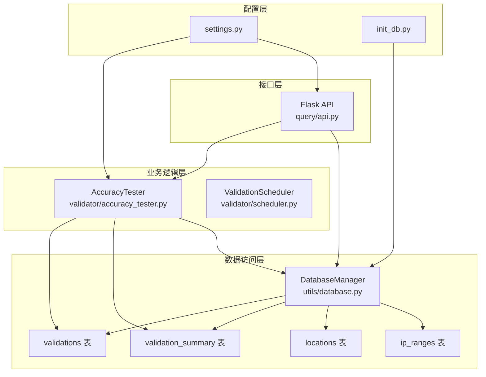
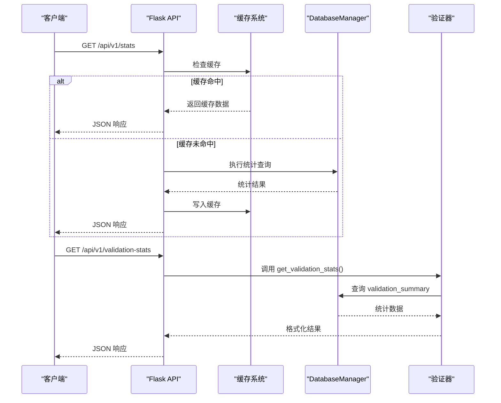
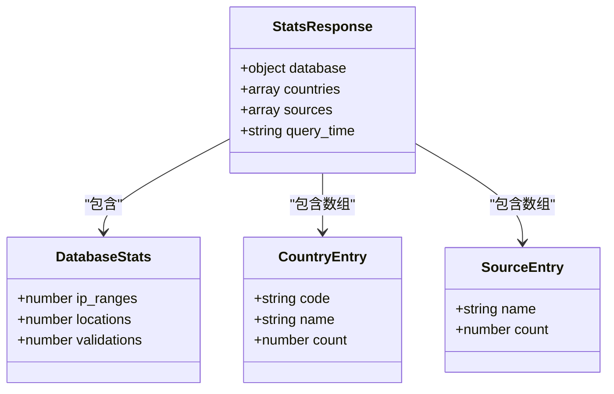
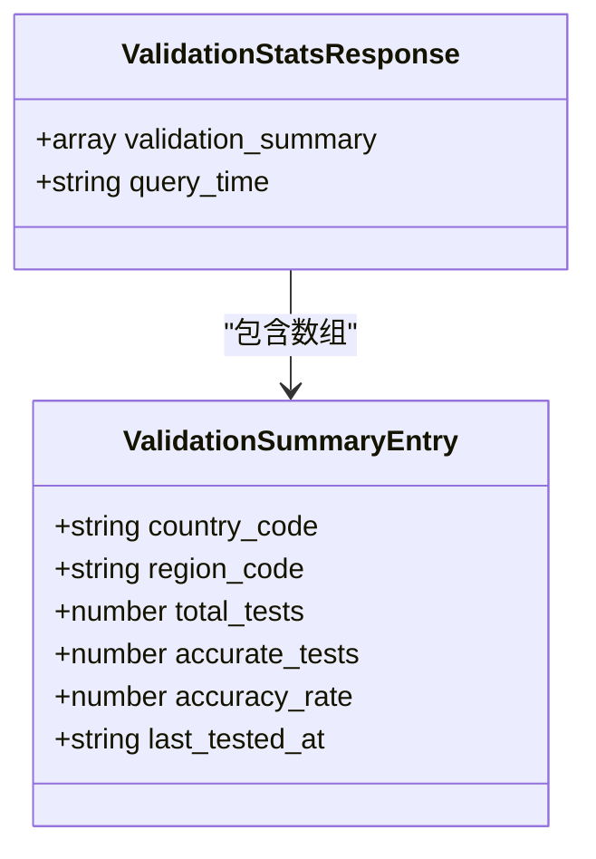
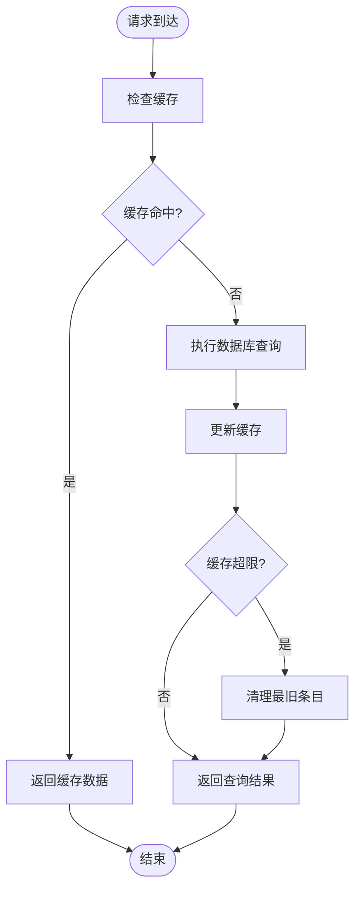
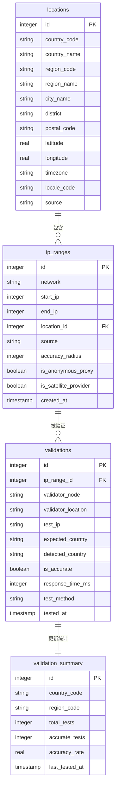
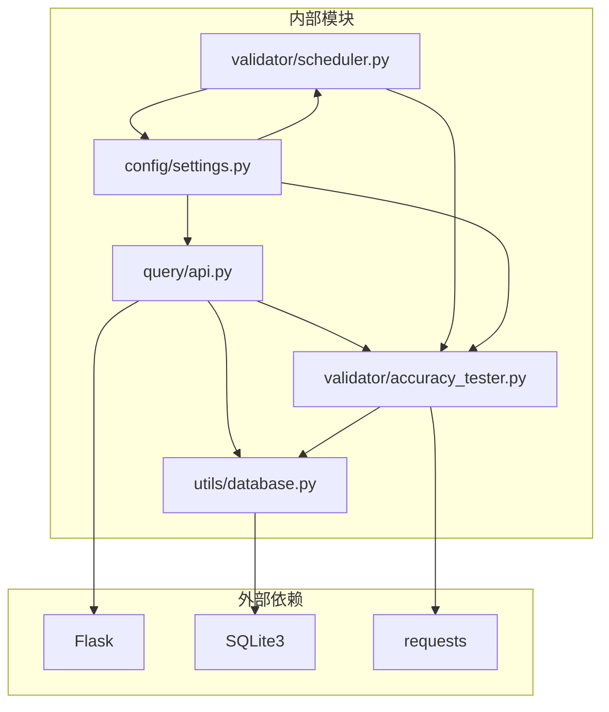
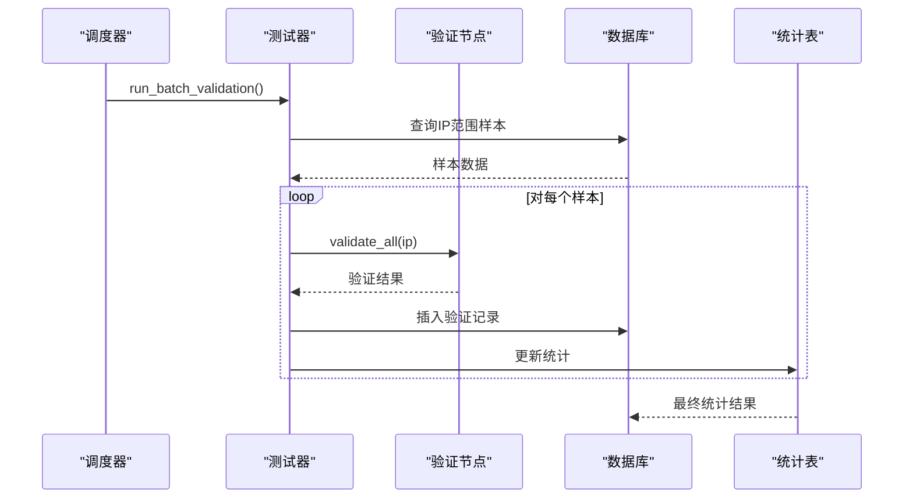

# 统计信息接口

<cite>
**本文档引用的文件**
- [query/api.py](file://query/api.py)
- [utils/database.py](file://utils/database.py)
- [validator/accuracy_tester.py](file://validator/accuracy_tester.py)
- [validator/scheduler.py](file://validator/scheduler.py)
- [config/settings.py](file://config/settings.py)
- [scripts/init_db.py](file://scripts/init_db.py)
</cite>

## 目录
1. [简介](#简介)
2. [项目结构](#项目结构)
3. [核心组件](#核心组件)
4. [架构概览](#架构概览)
5. [详细组件分析](#详细组件分析)
6. [依赖分析](#依赖分析)
7. [性能考虑](#性能考虑)
8. [故障排除指南](#故障排除指南)
9. [结论](#结论)
10. [附录](#附录)

## 简介
本文档详细说明了数据库统计和验证统计接口的实现细节，包括：
- GET /api/v1/stats：数据库统计接口
- GET /api/v1/validation-stats：验证统计接口

重点涵盖数据结构定义、缓存策略影响、响应示例、业务意义及应用场景、数据更新频率和实时性保证。

## 项目结构
该项目采用模块化设计，主要分为以下层次：
- 接口层：Flask Web API 提供 RESTful 接口
- 业务逻辑层：验证器负责准确性测试和统计更新
- 数据访问层：数据库管理器封装 SQLite 操作
- 配置层：集中管理应用配置和常量



**图表来源**
- [query/api.py:206-287](file://query/api.py#L206-L287)
- [utils/database.py:15-68](file://utils/database.py#L15-L68)
- [validator/accuracy_tester.py:27-334](file://validator/accuracy_tester.py#L27-L334)
- [validator/scheduler.py:27-123](file://validator/scheduler.py#L27-L123)

**章节来源**
- [query/api.py:100-112](file://query/api.py#L100-L112)
- [config/settings.py:10-27](file://config/settings.py#L10-L27)

## 核心组件
本项目的核心组件包括：
- Flask API 服务：提供 RESTful 接口和缓存装饰器
- DatabaseManager：封装 SQLite 数据库操作
- AccuracyTester：IP 定位准确性测试器
- ValidationScheduler：验证任务调度器
- 配置管理系统：集中管理应用配置

**章节来源**
- [query/api.py:26-61](file://query/api.py#L26-L61)
- [utils/database.py:15-68](file://utils/database.py#L15-L68)
- [validator/accuracy_tester.py:27-334](file://validator/accuracy_tester.py#L27-L334)
- [validator/scheduler.py:27-123](file://validator/scheduler.py#L27-L123)

## 架构概览
系统采用分层架构，各层职责清晰分离：



**图表来源**
- [query/api.py:207-287](file://query/api.py#L207-L287)
- [utils/database.py:341-361](file://utils/database.py#L341-L361)
- [validator/accuracy_tester.py:284-334](file://validator/accuracy_tester.py#L284-L334)

## 详细组件分析

### 数据库统计接口 (GET /api/v1/stats)

#### 接口定义
- **URL**: `/api/v1/stats`
- **方法**: GET
- **缓存策略**: TTL=300秒（5分钟）
- **认证**: 无需认证

#### 数据结构定义
接口返回的 JSON 结构包含以下字段：



**图表来源**
- [query/api.py:241-261](file://query/api.py#L241-L261)

#### 查询逻辑
接口执行三个主要查询：
1. **基础统计**：计算 ip_ranges、locations、validations 表的记录数
2. **国家分布**：按国家代码分组统计，返回前20名
3. **数据源分布**：按数据源分组统计

#### 响应示例
```json
{
  "database": {
    "ip_ranges": 1250000,
    "locations": 85000,
    "validations": 25000
  },
  "countries": [
    {
      "code": "CN",
      "name": "中国",
      "count": 450000
    },
    {
      "code": "US",
      "name": "美国",
      "count": 280000
    }
  ],
  "sources": [
    {
      "name": "MaxMind",
      "count": 1200000
    },
    {
      "name": "IP2Location",
      "count": 100000
    }
  ],
  "query_time": "2024-01-15T10:30:00.123Z"
}
```

**章节来源**
- [query/api.py:207-261](file://query/api.py#L207-L261)
- [query/api.py:218-239](file://query/api.py#L218-L239)

### 验证统计接口 (GET /api/v1/validation-stats)

#### 接口定义
- **URL**: `/api/v1/validation-stats`
- **方法**: GET
- **缓存策略**: TTL=300秒（5分钟）
- **认证**: 无需认证

#### 数据结构定义
接口返回的 JSON 结构包含以下字段：



**图表来源**
- [query/api.py:275-287](file://query/api.py#L275-L287)

#### 查询逻辑
接口调用 `get_validation_stats()` 函数，该函数：
1. 从 `validation_summary` 表查询统计数据
2. 支持按国家代码过滤
3. 默认按准确率升序排列

#### 响应示例
```json
{
  "validation_summary": [
    {
      "country_code": "CN",
      "region_code": "BJ",
      "total_tests": 1200,
      "accurate_tests": 1150,
      "accuracy_rate": 0.9583,
      "last_tested_at": "2024-01-15T08:00:00Z"
    },
    {
      "country_code": "US",
      "region_code": "CA",
      "total_tests": 800,
      "accurate_tests": 760,
      "accuracy_rate": 0.9500,
      "last_tested_at": "2024-01-15T09:30:00Z"
    }
  ],
  "query_time": "2024-01-15T10:30:00.123Z"
}
```

**章节来源**
- [query/api.py:264-287](file://query/api.py#L264-L287)
- [utils/database.py:341-361](file://utils/database.py#L341-L361)

### 缓存策略分析

#### 缓存装饰器实现
系统实现了通用的缓存装饰器，具有以下特性：
- **TTL 控制**：默认 3600 秒（1 小时），可通过配置调整
- **最大缓存条目**：默认 10000 个
- **LRU 清理**：超过最大容量时自动清理最旧条目
- **键生成**：基于函数名、参数和关键字参数生成唯一键

#### 缓存对性能的影响
1. **统计接口缓存**：stats 和 validation-stats 接口都使用 300 秒 TTL
2. **查询优化**：避免重复执行昂贵的聚合查询
3. **内存管理**：控制缓存大小防止内存泄漏
4. **一致性权衡**：牺牲实时性换取查询性能



**图表来源**
- [query/api.py:31-60](file://query/api.py#L31-L60)

**章节来源**
- [query/api.py:31-60](file://query/api.py#L31-L60)
- [config/settings.py:26-27](file://config/settings.py#L26-L27)

### 数据库架构

#### 表结构关系


**图表来源**
- [utils/database.py:80-147](file://utils/database.py#L80-L147)

#### 索引优化
数据库包含多个关键索引以优化查询性能：
- `idx_ip_ranges_start_end`: 优化 IP 查询范围
- `idx_ip_ranges_network`: 优化网络匹配
- `idx_validations_range`: 优化验证记录查询
- `idx_validations_accuracy`: 优化准确性过滤

**章节来源**
- [utils/database.py:149-181](file://utils/database.py#L149-L181)

## 依赖分析

### 组件依赖关系


**图表来源**
- [query/api.py:18-22](file://query/api.py#L18-L22)
- [validator/accuracy_tester.py:16-21](file://validator/accuracy_tester.py#L16-L21)
- [validator/scheduler.py:17-18](file://validator/scheduler.py#L17-L18)

### 数据流分析


**图表来源**
- [validator/scheduler.py:39-63](file://validator/scheduler.py#L39-L63)
- [validator/accuracy_tester.py:182-254](file://validator/accuracy_tester.py#L182-L254)
- [utils/database.py:363-397](file://utils/database.py#L363-L397)

**章节来源**
- [validator/scheduler.py:27-123](file://validator/scheduler.py#L27-L123)
- [validator/accuracy_tester.py:27-334](file://validator/accuracy_tester.py#L27-L334)

## 性能考虑

### 查询性能优化
1. **索引策略**：针对常用查询条件建立索引
2. **缓存机制**：统计接口使用短期缓存减少数据库压力
3. **批量操作**：导入时使用批量插入提高效率
4. **连接池**：使用上下文管理器确保连接正确释放

### 缓存策略优化
- **TTL 调整**：根据业务需求调整缓存过期时间
- **内存监控**：监控缓存大小防止内存溢出
- **热点数据**：优先缓存高频访问的统计接口

### 数据库优化
- **事务管理**：使用上下文管理器确保事务完整性
- **连接复用**：避免频繁创建和销毁数据库连接
- **查询优化**：使用适当的索引和查询计划

## 故障排除指南

### 常见问题诊断
1. **接口返回 500 错误**
   - 检查数据库连接是否正常
   - 验证 SQL 查询语法
   - 查看服务器日志

2. **统计结果为空**
   - 确认数据已正确导入
   - 检查 validation_summary 表是否有数据
   - 验证缓存是否过期

3. **缓存失效问题**
   - 检查 CACHE_TTL 配置
   - 验证缓存键生成逻辑
   - 监控缓存命中率

### 调试建议
- 启用调试模式查看详细错误信息
- 使用 CLI 工具验证数据库状态
- 监控数据库查询性能
- 检查验证任务执行状态

**章节来源**
- [query/api.py:290-303](file://query/api.py#L290-L303)
- [config/settings.py:26-27](file://config/settings.py#L26-L27)

## 结论
本项目提供了完整的统计信息接口解决方案，具有以下特点：

1. **清晰的架构设计**：分层架构确保了代码的可维护性和扩展性
2. **高效的性能优化**：通过缓存和索引优化显著提升了查询性能
3. **完善的错误处理**：提供了健壮的错误处理和故障恢复机制
4. **灵活的配置管理**：集中配置管理便于部署和维护

统计接口为系统提供了重要的监控和分析能力，支持业务决策和系统优化。

## 附录

### 数据更新频率和实时性
- **统计接口**：缓存 TTL 为 300 秒，约 5 分钟刷新一次
- **验证统计**：由调度器定期执行，间隔为 24 小时
- **数据导入**：批量导入，通常在数据源更新时执行

### 业务应用场景
1. **系统监控**：监控数据库规模和增长趋势
2. **质量评估**：评估 IP 定位准确性
3. **资源规划**：根据国家分布优化资源配置
4. **性能分析**：分析不同数据源的质量差异

### 配置参数说明
- `CACHE_TTL`: 缓存过期时间（秒）
- `CACHE_MAX_SIZE`: 缓存最大条目数
- `VALIDATION_INTERVAL_HOURS`: 验证任务间隔（小时）
- `VALIDATION_BATCH_SIZE`: 验证批次大小