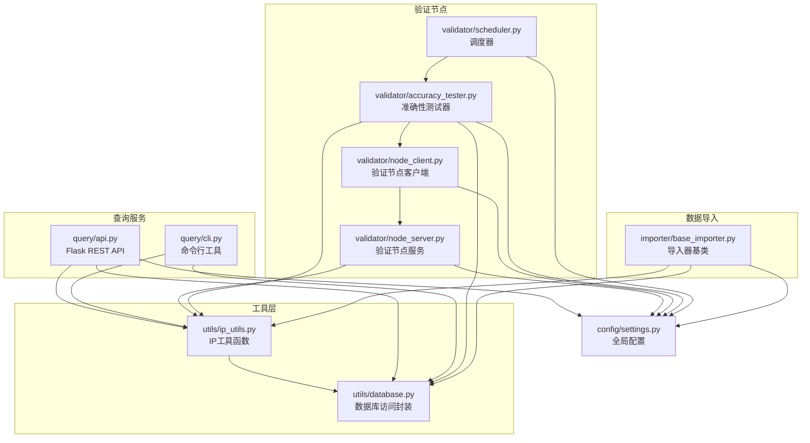
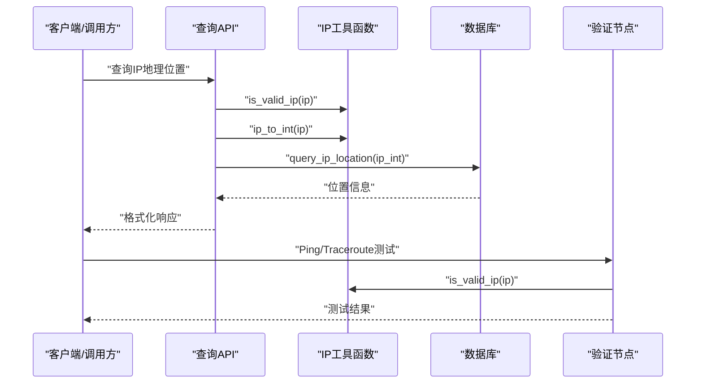
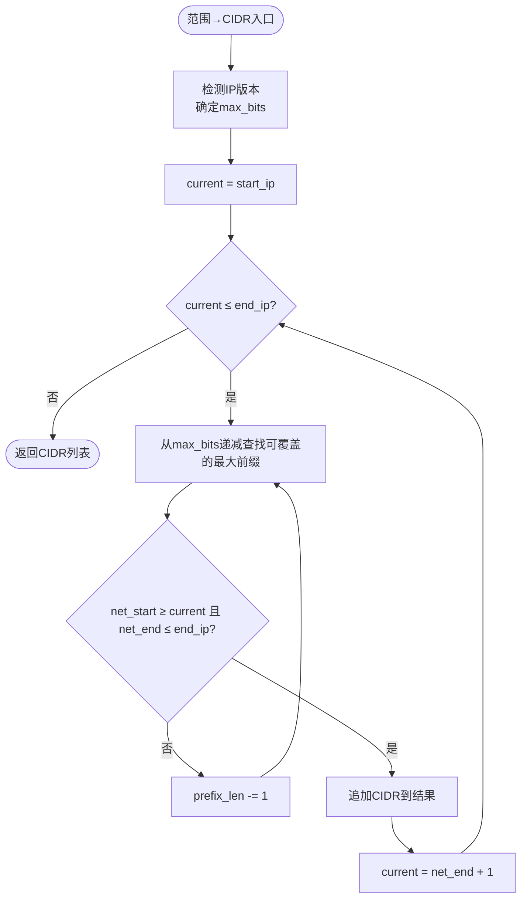
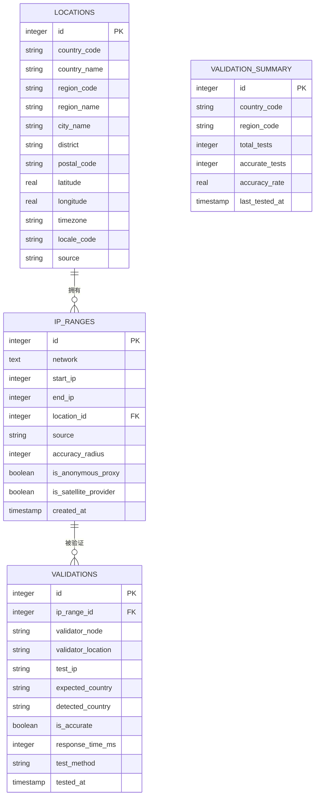
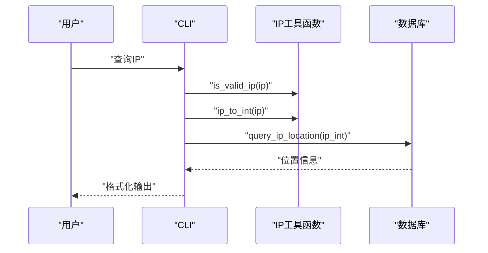
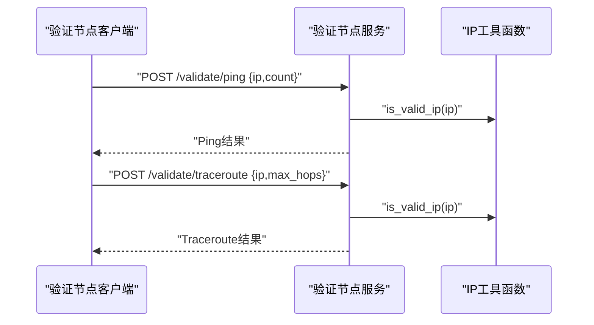
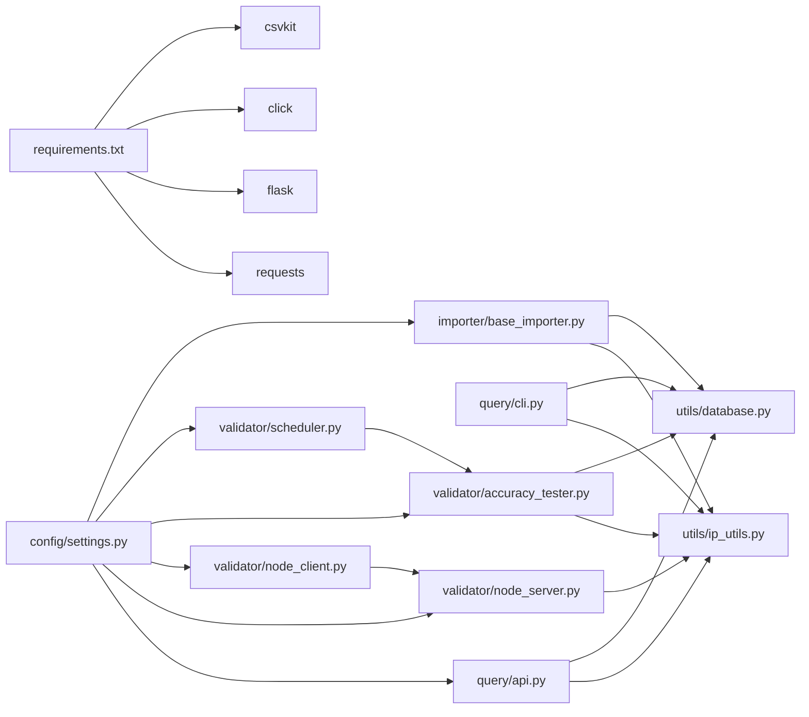

# IP工具函数

<cite>
**本文引用的文件**
- [utils/ip_utils.py](file://utils/ip_utils.py)
- [utils/database.py](file://utils/database.py)
- [query/api.py](file://query/api.py)
- [query/cli.py](file://query/cli.py)
- [validator/node_server.py](file://validator/node_server.py)
- [validator/node_client.py](file://validator/node_client.py)
- [validator/accuracy_tester.py](file://validator/accuracy_tester.py)
- [validator/scheduler.py](file://validator/scheduler.py)
- [importer/base_importer.py](file://importer/base_importer.py)
- [config/settings.py](file://config/settings.py)
- [requirements.txt](file://requirements.txt)
</cite>

## 目录
1. [简介](#简介)
2. [项目结构](#项目结构)
3. [核心组件](#核心组件)
4. [架构总览](#架构总览)
5. [详细组件分析](#详细组件分析)
6. [依赖关系分析](#依赖关系分析)
7. [性能考量](#性能考量)
8. [故障排查指南](#故障排查指南)
9. [结论](#结论)
10. [附录：使用示例与最佳实践](#附录使用示例与最佳实践)

## 简介
本文件面向“IP工具函数模块”，系统性阐述以下能力：
- IP地址格式转换：IPv4/IPv6互转、整数与字符串互转、二进制格式化
- CIDR与IP范围互转：CIDR转范围、范围合并为最小CIDR集合
- IP范围与网络计算：子网地址计算、范围包含判断
- IP验证与格式检查：有效性校验、私有地址判断、标准化与压缩/展开
- 与查询服务、验证节点、导入器等模块的集成方式
- 性能优化与边界情况处理
- 常见问题与最佳实践

## 项目结构
该项目采用按功能域划分的模块化组织，IP工具函数位于工具层，查询服务、验证节点、导入器分别承担API查询、网络连通性验证、数据导入等职责。

图表来源
- [utils/ip_utils.py:1-282](file://utils/ip_utils.py#L1-L282)
- [utils/database.py:1-398](file://utils/database.py#L1-L398)
- [query/api.py:1-325](file://query/api.py#L1-L325)
- [query/cli.py:1-250](file://query/cli.py#L1-L250)
- [validator/node_server.py:1-350](file://validator/node_server.py#L1-L350)
- [validator/node_client.py:1-244](file://validator/node_client.py#L1-L244)
- [validator/accuracy_tester.py:1-373](file://validator/accuracy_tester.py#L1-L373)
- [validator/scheduler.py:1-265](file://validator/scheduler.py#L1-L265)
- [importer/base_importer.py:1-168](file://importer/base_importer.py#L1-L168)
- [config/settings.py:1-44](file://config/settings.py#L1-L44)

章节来源
- [utils/ip_utils.py:1-282](file://utils/ip_utils.py#L1-L282)
- [config/settings.py:1-44](file://config/settings.py#L1-L44)

## 核心组件
- IP工具函数模块：提供IP地址格式转换、CIDR与范围互转、IP范围计算、网络计算、格式检查与验证等能力
- 数据库访问封装：提供统一的数据库连接、查询、事务、索引管理
- 查询服务：基于Flask的REST API与CLI工具，调用IP工具函数进行IP定位查询
- 验证节点：提供Ping/Traceroute等网络连通性测试，辅助IP准确性验证
- 导入器：基于CIDR数据，解析并批量写入数据库

章节来源
- [utils/ip_utils.py:9-282](file://utils/ip_utils.py#L9-L282)
- [utils/database.py:15-398](file://utils/database.py#L15-L398)
- [query/api.py:18-325](file://query/api.py#L18-L325)
- [query/cli.py:18-250](file://query/cli.py#L18-L250)
- [validator/node_server.py:20-350](file://validator/node_server.py#L20-L350)
- [validator/node_client.py:22-244](file://validator/node_client.py#L22-L244)
- [importer/base_importer.py:15-168](file://importer/base_importer.py#L15-L168)

## 架构总览
IP工具函数作为跨模块共享的基础能力，被查询API、CLI、验证节点、导入器广泛复用。其核心流程如下：

图表来源
- [query/api.py:115-143](file://query/api.py#L115-L143)
- [utils/ip_utils.py:134-148](file://utils/ip_utils.py#L134-L148)
- [utils/database.py:193-231](file://utils/database.py#L193-L231)
- [validator/node_server.py:231-284](file://validator/node_server.py#L231-L284)

## 详细组件分析

### IP工具函数模块（utils/ip_utils.py）
- 功能清单
  - 整数与IP互转：支持IPv4/IPv6
  - CIDR转范围：返回起止IP整数
  - 范围转CIDR：将连续IP范围合并为最小CIDR集合
  - IP属性判断：有效性、私有地址、版本、二进制格式
  - IP格式化：标准化、IPv6展开/压缩
  - 反向解析：IP反查主机名
  - 范围包含判断：某IP是否在给定范围内
  - 子网地址计算：给定IP+前缀长度计算网络地址

- 关键算法与复杂度
  - 整数↔IP转换：O(1)，基于标准库ipaddress
  - CIDR→范围：O(1)，解析网络对象
  - 范围→CIDR：贪心算法，最坏O(2^(max_bits))，但实际受IP连续性约束；IPv4约O(32)，IPv6约O(128)
  - 范围包含判断：O(1)，三次整数比较
  - 子网计算：O(1)，构造网络对象取network_address

- 边界情况处理
  - 无效IP抛出异常或返回False，确保上层可捕获
  - IPv6压缩/展开遵循标准格式
  - 范围转CIDR时，若输入非连续范围，会拆分为多个CIDR
  - 反向解析失败返回None，避免阻断主流程

- 代码片段路径
  - [整数↔IP转换:9-48](file://utils/ip_utils.py#L9-L48)
  - [CIDR→范围:51-67](file://utils/ip_utils.py#L51-L67)
  - [范围→CIDR:70-114](file://utils/ip_utils.py#L70-L114)
  - [IP有效性/私有/版本/二进制/标准化:134-168](file://utils/ip_utils.py#L134-L168)
  - [IPv6展开/压缩:202-227](file://utils/ip_utils.py#L202-L227)
  - [IP反查主机名:230-244](file://utils/ip_utils.py#L230-L244)
  - [范围包含判断:247-262](file://utils/ip_utils.py#L247-L262)
  - [子网地址计算:265-281](file://utils/ip_utils.py#L265-L281)

图表来源
- [utils/ip_utils.py:70-114](file://utils/ip_utils.py#L70-L114)

章节来源
- [utils/ip_utils.py:9-282](file://utils/ip_utils.py#L9-L282)

### 数据库访问封装（utils/database.py）
- 功能清单
  - 数据库管理器：连接池式上下文管理、事务回滚、批量执行
  - 初始化数据库：创建表与索引
  - 查询接口：单条/多条记录查询
  - IP定位查询：基于IP整数范围匹配
  - 批量导入：IP范围批量写入
  - 验证统计：汇总表维护

- 关键SQL与索引
  - ip_ranges表：存储网络、起止IP、位置关联、精度半径等
  - locations表：国家/地区/城市/区县等地理信息
  - validation_summary表：按国家/区域聚合的验证准确率
  - 索引：ip_ranges(start_ip,end_ip)、ip_ranges(network)、locations(country_code,city_name)

- 代码片段路径
  - [数据库管理器:15-67](file://utils/database.py#L15-L67)
  - [初始化数据库:70-185](file://utils/database.py#L70-L185)
  - [IP定位查询:193-231](file://utils/database.py#L193-L231)
  - [批量插入IP范围:310-338](file://utils/database.py#L310-L338)
  - [验证统计更新:363-398](file://utils/database.py#L363-L398)

图表来源
- [utils/database.py:80-181](file://utils/database.py#L80-L181)

章节来源
- [utils/database.py:15-398](file://utils/database.py#L15-L398)

### 查询服务（query/api.py 与 query/cli.py）
- API服务
  - 提供单IP查询、批量查询、统计信息接口
  - 内置简单内存缓存装饰器
  - 输入严格校验：IP有效性、请求体格式
  - 输出统一格式化：包含地理位置、精度、来源、查询时间等

- CLI工具
  - 单IP查询、批量查询、统计信息展示
  - 支持文本/JSON两种输出格式

- 与IP工具函数的集成
  - 使用is_valid_ip进行输入校验
  - 使用ip_to_int进行范围查询
  - 使用format_ip_response统一输出

- 代码片段路径
  - [API路由与缓存装饰器:31-60](file://query/api.py#L31-L60)
  - [单IP查询:115-143](file://query/api.py#L115-L143)
  - [批量查询:145-204](file://query/api.py#L145-L204)
  - [统计信息:207-287](file://query/api.py#L207-L287)
  - [CLI单IP查询:54-106](file://query/cli.py#L54-L106)
  - [CLI批量查询:109-173](file://query/cli.py#L109-L173)

图表来源
- [query/cli.py:54-106](file://query/cli.py#L54-L106)
- [utils/ip_utils.py:134-148](file://utils/ip_utils.py#L134-L148)
- [utils/database.py:193-231](file://utils/database.py#L193-L231)

章节来源
- [query/api.py:18-325](file://query/api.py#L18-L325)
- [query/cli.py:18-250](file://query/cli.py#L18-L250)

### 验证节点（validator/node_server.py 与 validator/node_client.py）
- 服务端
  - 提供健康检查、节点信息、Ping/Traceroute测试接口
  - 使用is_valid_ip进行输入校验
  - 跨平台执行系统命令（Windows/Linux）

- 客户端
  - 与服务端通信，支持多节点管理
  - 统一API密钥认证
  - 支持全节点或指定节点验证

- 与IP工具函数的集成
  - 服务端在测试前先校验IP有效性
  - 客户端调用服务端接口进行测试

- 代码片段路径
  - [服务端路由与测试:231-321](file://validator/node_server.py#L231-L321)
  - [客户端请求封装:31-104](file://validator/node_client.py#L31-L104)
  - [节点管理器:107-178](file://validator/node_client.py#L107-L178)

图表来源
- [validator/node_server.py:231-321](file://validator/node_server.py#L231-L321)
- [validator/node_client.py:31-104](file://validator/node_client.py#L31-L104)
- [utils/ip_utils.py:134-148](file://utils/ip_utils.py#L134-L148)

章节来源
- [validator/node_server.py:20-350](file://validator/node_server.py#L20-L350)
- [validator/node_client.py:22-244](file://validator/node_client.py#L22-L244)

### 准确性测试器与调度器（validator/accuracy_tester.py 与 validator/scheduler.py）
- 准确性测试器
  - 从数据库随机采样IP范围，生成测试IP
  - 通过验证节点进行跨节点连通性验证
  - 统计准确率并更新汇总表

- 调度器
  - 支持一次性与周期性任务
  - 可按国家或全部国家执行验证
  - 支持线程守护与优雅停止

- 与IP工具函数的集成
  - 使用ip_to_int/int_to_ip生成/转换测试IP
  - 使用is_valid_ip进行输入校验

- 代码片段路径
  - [测试器批量验证:182-254](file://validator/accuracy_tester.py#L182-L254)
  - [调度器周期任务:65-93](file://validator/scheduler.py#L65-L93)

章节来源
- [validator/accuracy_tester.py:27-373](file://validator/accuracy_tester.py#L27-L373)
- [validator/scheduler.py:27-265](file://validator/scheduler.py#L27-L265)

### 导入器（importer/base_importer.py）
- 基于CIDR的数据导入
  - 解析CSV中的网络字段，调用cidr_to_range转换为起止IP
  - 缓存位置ID，避免重复查询
  - 批量写入IP范围数据

- 与IP工具函数的集成
  - 使用cidr_to_range进行CIDR→范围转换

- 代码片段路径
  - [导入流程:82-154](file://importer/base_importer.py#L82-L154)

章节来源
- [importer/base_importer.py:15-168](file://importer/base_importer.py#L15-L168)

## 依赖关系分析
- 外部依赖
  - requests：验证节点客户端HTTP通信
  - flask：查询API与验证节点服务端
  - click：CLI参数解析
  - csvkit：CSV处理（requirements中声明）

- 模块间耦合
  - utils/ip_utils.py被query、validator、importer广泛依赖
  - utils/database.py被query与validator共同使用
  - config/settings.py集中管理配置

图表来源
- [requirements.txt:1-5](file://requirements.txt#L1-L5)
- [query/api.py:18-22](file://query/api.py#L18-L22)
- [validator/node_server.py:20-23](file://validator/node_server.py#L20-L23)
- [validator/node_client.py:8-16](file://validator/node_client.py#L8-L16)
- [validator/accuracy_tester.py:16-21](file://validator/accuracy_tester.py#L16-L21)
- [importer/base_importer.py:8-10](file://importer/base_importer.py#L8-L10)
- [config/settings.py:1-44](file://config/settings.py#L1-L44)

章节来源
- [requirements.txt:1-5](file://requirements.txt#L1-L5)
- [config/settings.py:1-44](file://config/settings.py#L1-L44)

## 性能考量
- 时间复杂度
  - 整数↔IP转换：O(1)
  - CIDR→范围：O(1)
  - 范围→CIDR：最坏O(2^k)，实际受连续性约束
  - IP定位查询：基于索引的范围扫描，O(log N)到O(1)取决于命中率
- 空间复杂度
  - 内存缓存装饰器：O(n)，受最大缓存条目限制
  - 批量导入：分批写入，避免单次内存峰值过高
- 优化建议
  - 对频繁查询的IP进行缓存
  - 合理设置数据库索引，确保范围查询高效
  - 导入时使用批量写入与缓存位置ID
  - 验证任务按国家分批执行，避免长时间阻塞

[本节为通用性能讨论，无需特定文件引用]

## 故障排查指南
- 常见错误与处理
  - 无效IP：调用is_valid_ip返回False或抛出异常，需在上游进行校验
  - 反向解析失败：get_hostname返回None，不影响主流程
  - 数据库连接异常：DatabaseManager自动回滚并抛出异常，检查连接参数
  - 验证节点不可达：ValidatorNodeClient健康检查失败，切换到其他节点或重试
- 调试建议
  - 开启日志级别，查看详细错误栈
  - 使用CLI工具进行单步验证，缩小问题范围
  - 检查配置文件中的API密钥、节点地址与端口

章节来源
- [utils/ip_utils.py:230-244](file://utils/ip_utils.py#L230-L244)
- [utils/database.py:21-34](file://utils/database.py#L21-L34)
- [validator/node_client.py:54-60](file://validator/node_client.py#L54-L60)

## 结论
IP工具函数模块提供了完备的IP地址处理能力，涵盖格式转换、CIDR与范围互转、网络计算、验证与格式检查等核心功能。通过与查询服务、验证节点、导入器的紧密协作，形成从数据导入到查询验证的完整链路。建议在生产环境中结合缓存、索引与批量处理策略，以获得更好的性能与稳定性。

[本节为总结性内容，无需特定文件引用]

## 附录：使用示例与最佳实践

- 使用场景与示例路径
  - 将CIDR转换为IP范围并进行查询
    - [CIDR→范围:51-67](file://utils/ip_utils.py#L51-L67)
    - [查询IP定位:193-231](file://utils/database.py#L193-L231)
  - 将IP范围合并为最小CIDR集合
    - [范围→CIDR:70-114](file://utils/ip_utils.py#L70-L114)
  - 验证IP是否为私有地址
    - [私有地址判断:117-131](file://utils/ip_utils.py#L117-L131)
  - 获取IP版本并进行二进制格式化
    - [版本判断:151-168](file://utils/ip_utils.py#L151-L168)
    - [二进制格式:171-185](file://utils/ip_utils.py#L171-L185)
  - 通过IP反查主机名
    - [反查主机名:230-244](file://utils/ip_utils.py#L230-L244)
  - 计算子网地址
    - [子网地址计算:265-281](file://utils/ip_utils.py#L265-L281)
  - 在查询API中使用
    - [单IP查询:115-143](file://query/api.py#L115-L143)
    - [批量查询:145-204](file://query/api.py#L145-L204)
  - 在验证节点中使用
    - [Ping/Traceroute测试:231-321](file://validator/node_server.py#L231-L321)
  - 在导入器中使用
    - [CIDR→范围转换:122-122](file://importer/base_importer.py#L122-L122)

- 最佳实践
  - 输入严格校验：始终使用is_valid_ip进行校验
  - 合理缓存：对热点IP查询启用缓存装饰器
  - 批量处理：导入与批量查询使用批量写入/读取
  - 索引优化：确保ip_ranges表的start_ip/end_ip索引生效
  - 节点容错：验证节点客户端支持多节点与健康检查
  - 调度策略：准确性验证按国家分批执行，避免长时间阻塞

[本节为示例与实践建议，无需特定文件引用]