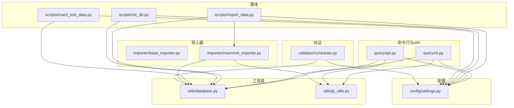
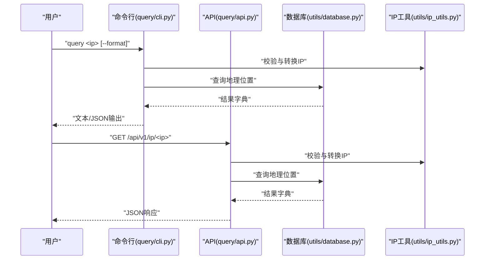
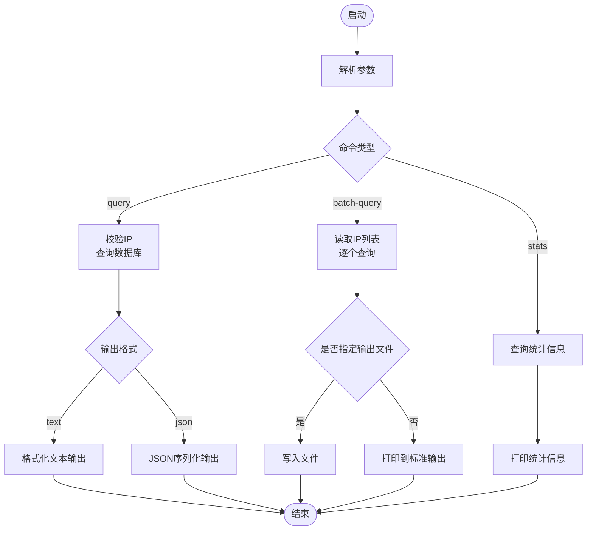
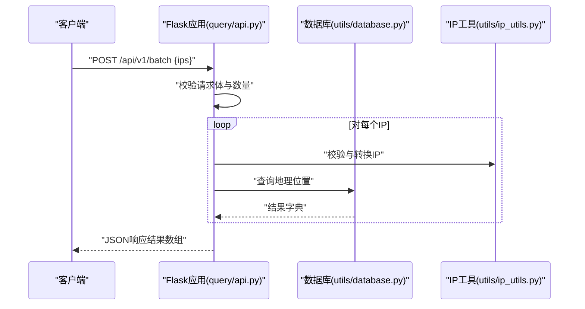
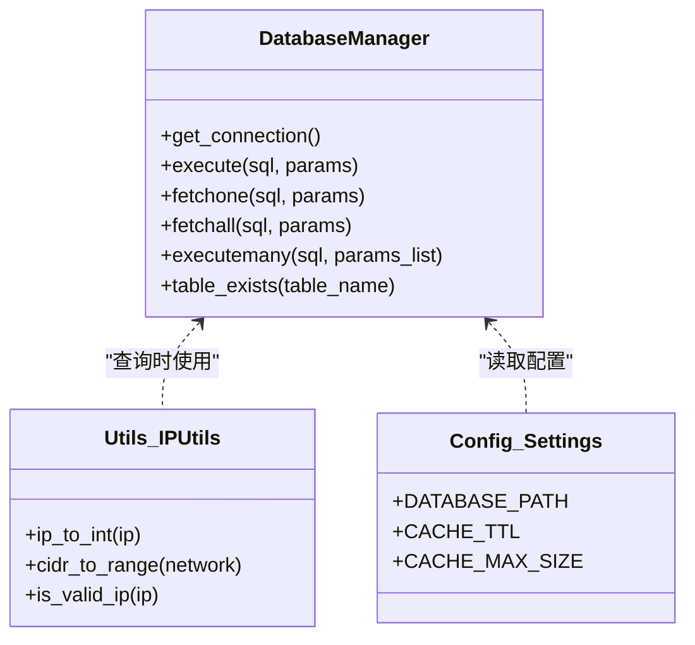
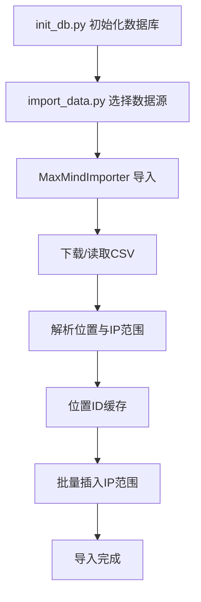
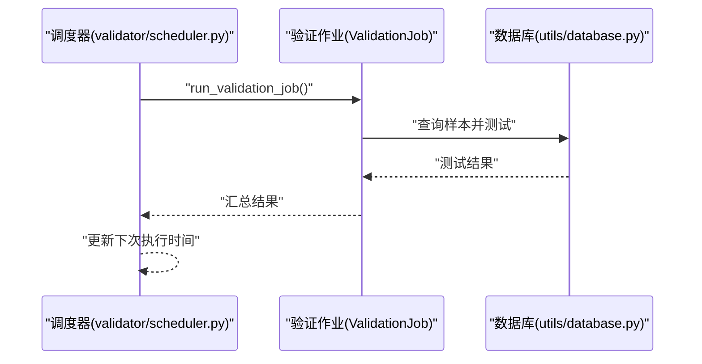
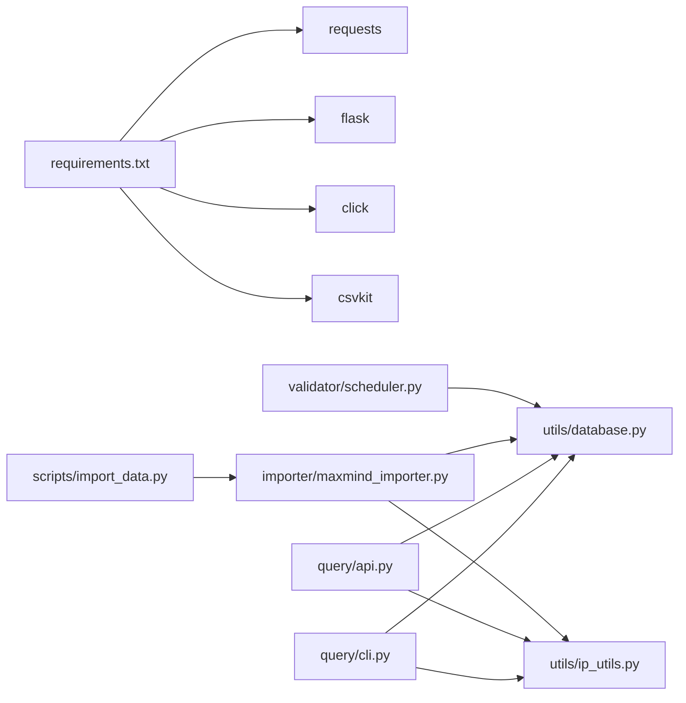

# 命令行工具

<cite>
**本文引用的文件**
- [query/cli.py](file://query/cli.py)
- [query/api.py](file://query/api.py)
- [utils/database.py](file://utils/database.py)
- [utils/ip_utils.py](file://utils/ip_utils.py)
- [config/settings.py](file://config/settings.py)
- [scripts/import_data.py](file://scripts/import_data.py)
- [scripts/init_db.py](file://scripts/init_db.py)
- [scripts/insert_test_data.py](file://scripts/insert_test_data.py)
- [importer/base_importer.py](file://importer/base_importer.py)
- [importer/maxmind_importer.py](file://importer/maxmind_importer.py)
- [validator/scheduler.py](file://validator/scheduler.py)
- [requirements.txt](file://requirements.txt)
</cite>

## 目录
1. [简介](#简介)
2. [项目结构](#项目结构)
3. [核心组件](#核心组件)
4. [架构总览](#架构总览)
5. [详细组件分析](#详细组件分析)
6. [依赖分析](#依赖分析)
7. [性能考虑](#性能考虑)
8. [故障排除指南](#故障排除指南)
9. [结论](#结论)
10. [附录](#附录)

## 简介
本命令行工具提供IP地址地理定位查询能力，支持：
- 单IP查询与批量查询
- 文本格式与JSON格式输出
- 数据库统计信息查看
- REST API服务（可选）
- 数据导入（MaxMind GeoLite2）
- 验证任务调度（可选）

工具采用SQLite作为本地数据库，支持IPv4/IPv6，具备缓存与索引优化，适合在本地或内网环境中进行高并发查询与批处理。

## 项目结构
- query：命令行与API入口
  - cli.py：命令行工具
  - api.py：REST API服务
- utils：通用工具
  - database.py：数据库连接、查询与管理
  - ip_utils.py：IP地址解析与转换
- config：全局配置
  - settings.py：数据库、API、缓存、验证节点等配置
- scripts：辅助脚本
  - import_data.py：数据导入
  - init_db.py：数据库初始化
  - insert_test_data.py：插入测试数据
- importer：数据导入器
  - base_importer.py：抽象基类
  - maxmind_importer.py：MaxMind导入实现
- validator：验证模块
  - scheduler.py：验证任务调度器
- requirements.txt：依赖包清单

图表来源
- [query/cli.py:1-250](file://query/cli.py#L1-L250)
- [query/api.py:1-325](file://query/api.py#L1-L325)
- [utils/database.py:1-398](file://utils/database.py#L1-L398)
- [utils/ip_utils.py:1-282](file://utils/ip_utils.py#L1-L282)
- [config/settings.py:1-44](file://config/settings.py#L1-L44)
- [scripts/import_data.py:1-65](file://scripts/import_data.py#L1-L65)
- [scripts/init_db.py:1-38](file://scripts/init_db.py#L1-L38)
- [scripts/insert_test_data.py:1-63](file://scripts/insert_test_data.py#L1-L63)
- [importer/base_importer.py:1-168](file://importer/base_importer.py#L1-L168)
- [importer/maxmind_importer.py:1-274](file://importer/maxmind_importer.py#L1-L274)
- [validator/scheduler.py:1-265](file://validator/scheduler.py#L1-L265)

章节来源
- [query/cli.py:1-250](file://query/cli.py#L1-L250)
- [query/api.py:1-325](file://query/api.py#L1-L325)
- [utils/database.py:1-398](file://utils/database.py#L1-L398)
- [utils/ip_utils.py:1-282](file://utils/ip_utils.py#L1-L282)
- [config/settings.py:1-44](file://config/settings.py#L1-L44)
- [scripts/import_data.py:1-65](file://scripts/import_data.py#L1-L65)
- [scripts/init_db.py:1-38](file://scripts/init_db.py#L1-L38)
- [scripts/insert_test_data.py:1-63](file://scripts/insert_test_data.py#L1-L63)
- [importer/base_importer.py:1-168](file://importer/base_importer.py#L1-L168)
- [importer/maxmind_importer.py:1-274](file://importer/maxmind_importer.py#L1-L274)
- [validator/scheduler.py:1-265](file://validator/scheduler.py#L1-L265)

## 核心组件
- 命令行工具
  - 子命令：query、batch-query、stats
  - 输出格式：text（默认）、json
- REST API服务
  - 路由：/api/v1/ip/<ip>、/api/v1/batch、/api/v1/stats、/api/v1/validation-stats
  - 缓存：内存缓存，可配置TTL与容量
- 数据库
  - 表：locations、ip_ranges、validations、validation_summary
  - 索引：加速IP范围查找与地理位置聚合
- 数据导入
  - 支持MaxMind GeoLite2，自动下载与解析CSV
- 验证调度
  - 定时执行准确性验证，支持按国家或全量

章节来源
- [query/cli.py:219-246](file://query/cli.py#L219-L246)
- [query/api.py:100-325](file://query/api.py#L100-L325)
- [utils/database.py:15-185](file://utils/database.py#L15-L185)
- [importer/maxmind_importer.py:19-274](file://importer/maxmind_importer.py#L19-L274)
- [validator/scheduler.py:27-123](file://validator/scheduler.py#L27-L123)

## 架构总览
命令行与API共享相同的查询逻辑与数据库访问层，确保一致性；导入器负责数据准备，验证模块负责质量保障。

图表来源
- [query/cli.py:54-106](file://query/cli.py#L54-L106)
- [query/api.py:115-143](file://query/api.py#L115-L143)
- [utils/database.py:193-231](file://utils/database.py#L193-L231)
- [utils/ip_utils.py:9-32](file://utils/ip_utils.py#L9-L32)

## 详细组件分析

### 命令行工具（query/cli.py）
- 子命令
  - query：查询单个IP，支持--format=text|json
  - batch-query：批量查询，输入文件每行一个IP，支持--output导出JSON
  - stats：显示数据库统计信息（IP范围、地理位置、国家分布、验证统计）
- 输出格式
  - text：人类可读的表格式输出
  - json：机器友好的结构化输出，便于脚本处理
- 错误处理
  - 无效IP、文件不存在、查询异常均输出明确错误信息

图表来源
- [query/cli.py:219-246](file://query/cli.py#L219-L246)
- [query/cli.py:54-106](file://query/cli.py#L54-L106)
- [query/cli.py:109-172](file://query/cli.py#L109-L172)
- [query/cli.py:175-217](file://query/cli.py#L175-L217)

章节来源
- [query/cli.py:219-246](file://query/cli.py#L219-L246)
- [query/cli.py:54-106](file://query/cli.py#L54-L106)
- [query/cli.py:109-172](file://query/cli.py#L109-L172)
- [query/cli.py:175-217](file://query/cli.py#L175-L217)

### REST API服务（query/api.py）
- 路由
  - GET /api/v1/ip/<ip>：查询单个IP
  - POST /api/v1/batch：批量查询（最多1000个）
  - GET /api/v1/stats：数据库统计
  - GET /api/v1/validation-stats：验证统计
- 缓存策略
  - 内存缓存，支持TTL与最大容量控制
  - 统计接口默认缓存5分钟
- 错误处理
  - 400：请求参数错误
  - 404：接口不存在
  - 500：服务器内部错误

图表来源
- [query/api.py:145-204](file://query/api.py#L145-L204)
- [utils/ip_utils.py:134-148](file://utils/ip_utils.py#L134-L148)
- [utils/database.py:193-231](file://utils/database.py#L193-L231)

章节来源
- [query/api.py:100-325](file://query/api.py#L100-L325)
- [query/api.py:145-204](file://query/api.py#L145-L204)

### 数据库与查询（utils/database.py）
- 数据库管理器
  - 连接池：上下文管理器自动提交/回滚/关闭
  - SQL封装：execute、fetchone、fetchall、executemany
- 查询逻辑
  - query_ip_location：基于IP整数范围匹配，优先精确度半径更小的记录
- 表结构与索引
  - locations：国家/地区/城市/经纬度等
  - ip_ranges：IP范围、起止整数、关联location_id
  - validations：验证记录
  - validation_summary：按国家/省汇总准确率
- 批量导入
  - 批量插入IP范围，支持分批大小配置

图表来源
- [utils/database.py:15-67](file://utils/database.py#L15-L67)
- [utils/ip_utils.py:9-32](file://utils/ip_utils.py#L9-L32)
- [config/settings.py:10-27](file://config/settings.py#L10-L27)

章节来源
- [utils/database.py:15-185](file://utils/database.py#L15-L185)
- [utils/database.py:193-231](file://utils/database.py#L193-L231)
- [utils/ip_utils.py:9-32](file://utils/ip_utils.py#L9-L32)
- [config/settings.py:10-27](file://config/settings.py#L10-L27)

### 数据导入（scripts/import_data.py 与 importer/maxmind_importer.py）
- 导入流程
  - init_db.py：初始化数据库表与索引
  - import_data.py：选择数据源（maxmind），支持直接导入CSV或下载后导入
  - MaxMindImporter：解析Blocks与Locations CSV，构建locations与ip_ranges
- 性能优化
  - 位置ID缓存，避免重复查询
  - 批量插入，分批大小可配置
  - CIDR转范围，减少存储冗余

图表来源
- [scripts/init_db.py:16-34](file://scripts/init_db.py#L16-L34)
- [scripts/import_data.py:44-61](file://scripts/import_data.py#L44-L61)
- [importer/maxmind_importer.py:145-258](file://importer/maxmind_importer.py#L145-L258)
- [importer/base_importer.py:82-154](file://importer/base_importer.py#L82-L154)

章节来源
- [scripts/init_db.py:16-34](file://scripts/init_db.py#L16-L34)
- [scripts/import_data.py:44-61](file://scripts/import_data.py#L44-L61)
- [importer/maxmind_importer.py:145-258](file://importer/maxmind_importer.py#L145-L258)
- [importer/base_importer.py:82-154](file://importer/base_importer.py#L82-L154)

### 验证调度（validator/scheduler.py）
- 功能
  - ValidationScheduler：定时执行验证任务
  - ValidationJob：按国家或全量验证，生成报告
- 参数
  - 间隔（小时）、批次大小、样本数
- 状态
  - 运行状态、上次/下次执行时间

图表来源
- [validator/scheduler.py:39-63](file://validator/scheduler.py#L39-L63)
- [validator/scheduler.py:125-201](file://validator/scheduler.py#L125-L201)

章节来源
- [validator/scheduler.py:27-123](file://validator/scheduler.py#L27-L123)
- [validator/scheduler.py:125-201](file://validator/scheduler.py#L125-L201)

## 依赖分析
- Python依赖
  - requests：网络请求（下载MaxMind数据）
  - flask：Web框架（API服务）
  - click：命令行参数（API脚本中使用）
  - csvkit：CSV处理（导入脚本中使用）
- 模块间耦合
  - CLI/API共享数据库与IP工具，保持查询一致性
  - 导入器依赖数据库与IP工具，形成清晰职责边界
  - 验证模块依赖数据库统计表

图表来源
- [requirements.txt:1-5](file://requirements.txt#L1-L5)
- [query/cli.py:18-20](file://query/cli.py#L18-L20)
- [query/api.py:20-22](file://query/api.py#L20-L22)
- [scripts/import_data.py:26-41](file://scripts/import_data.py#L26-L41)
- [importer/maxmind_importer.py:19-27](file://importer/maxmind_importer.py#L19-L27)
- [validator/scheduler.py:17-18](file://validator/scheduler.py#L17-L18)

章节来源
- [requirements.txt:1-5](file://requirements.txt#L1-L5)
- [query/cli.py:18-20](file://query/cli.py#L18-L20)
- [query/api.py:20-22](file://query/api.py#L20-L22)
- [scripts/import_data.py:26-41](file://scripts/import_data.py#L26-L41)
- [importer/maxmind_importer.py:19-27](file://importer/maxmind_importer.py#L19-L27)
- [validator/scheduler.py:17-18](file://validator/scheduler.py#L17-L18)

## 性能考虑
- 查询性能
  - 使用索引：ip_ranges(start_ip,end_ip)、ip_ranges(network)、locations(country_code,city_name)
  - 查询逻辑按精度半径升序优先，减少误差
- 缓存策略
  - API接口内置内存缓存，可调TTL与容量
  - 统计接口默认缓存5分钟，降低频繁统计开销
- 批处理
  - 批量插入IP范围，分批大小可配置
  - 导入器对位置ID进行缓存，避免重复查询
- 并发与稳定性
  - 数据库连接使用上下文管理器，自动事务控制
  - API服务支持并发请求，注意缓存命中率与数据库负载

章节来源
- [utils/database.py:149-181](file://utils/database.py#L149-L181)
- [query/api.py:31-60](file://query/api.py#L31-L60)
- [importer/base_importer.py:41-81](file://importer/base_importer.py#L41-L81)
- [config/settings.py:19-27](file://config/settings.py#L19-L27)

## 故障排除指南
- 常见问题
  - 无效IP地址：检查输入格式，支持IPv4/IPv6
  - 文件不存在：确认输入文件路径与权限
  - 数据库未初始化：先执行数据库初始化脚本
  - API端口占用：修改监听地址与端口
  - MaxMind下载失败：检查License Key与网络连通性
- 排错步骤
  - CLI：查看错误提示，确认命令与参数
  - API：检查HTTP状态码与响应体中的错误信息
  - 数据库：确认表与索引存在，查看日志
  - 导入：检查CSV字段映射与编码
- 建议
  - 使用--format=json便于自动化处理
  - 批量查询时指定--output以避免大输出阻塞终端
  - 合理设置缓存TTL，平衡实时性与性能

章节来源
- [query/cli.py:65-67](file://query/cli.py#L65-L67)
- [query/cli.py:117-119](file://query/cli.py#L117-L119)
- [scripts/init_db.py:16-34](file://scripts/init_db.py#L16-L34)
- [query/api.py:127-142](file://query/api.py#L127-L142)
- [importer/maxmind_importer.py:35-37](file://importer/maxmind_importer.py#L35-L37)

## 结论
该命令行工具提供了完整的IP地理定位解决方案，涵盖查询、导入、统计与验证等环节。通过统一的数据库与工具层，CLI与API保持一致行为；通过缓存与索引优化，满足高并发与批处理需求。配合脚本与调度器，可实现从数据准备到质量监控的闭环。

## 附录

### 使用示例与最佳实践
- 单IP查询
  - 文本输出：python query/cli.py query 8.8.8.8
  - JSON输出：python query/cli.py query 8.8.8.8 --format json
- 批量查询
  - 输入文件每行一个IP，输出到标准输出：python query/cli.py batch-query ips.txt
  - 导出到文件：python query/cli.py batch-query ips.txt --output results.json
- 统计信息
  - 显示数据库统计：python query/cli.py stats
- API服务
  - 启动服务：python query/api.py
  - 查询单个IP：curl http://localhost:5000/api/v1/ip/8.8.8.8
  - 批量查询：curl -X POST http://localhost:5000/api/v1/batch -H "Content-Type: application/json" -d '{"ips":["8.8.8.8","1.1.1.1"]}'
- 数据导入
  - 初始化数据库：python scripts/init_db.py
  - 导入MaxMind数据：python scripts/import_data.py maxmind --license-key YOUR_KEY
  - 直接导入CSV：python scripts/import_data.py maxmind --csv-path /path/to/blocks.csv --init-db
- 验证调度
  - 运行一次：python validator/scheduler.py --mode once --country CN --sample-size 100
  - 全量验证：python validator/scheduler.py --mode all-countries --sample-size-per-country 50
  - 后台调度：python validator/scheduler.py --mode scheduler --interval 24

### 输出格式对比
- 文本格式（--format=text）
  - 优点：易读，适合人工查看
  - 适用：交互式查询、快速核验
- JSON格式（--format=json）
  - 优点：结构化，便于脚本解析与二次处理
  - 适用：自动化流水线、API集成、报表生成

### 管道与脚本集成
- 将查询结果重定向到文件：python query/cli.py batch-query ips.txt --output results.json
- 在shell中结合jq处理JSON：python query/cli.py query 8.8.8.8 --format json | jq '.location.country'
- 与定时任务结合：crontab中调用验证调度器，定期评估准确性