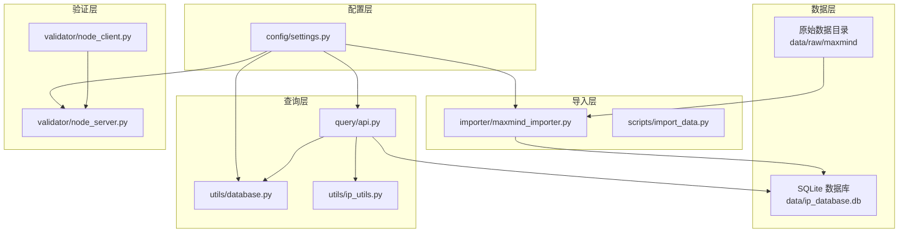
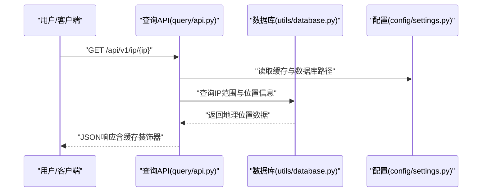
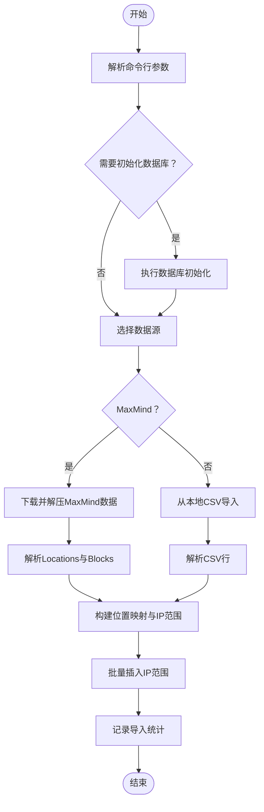
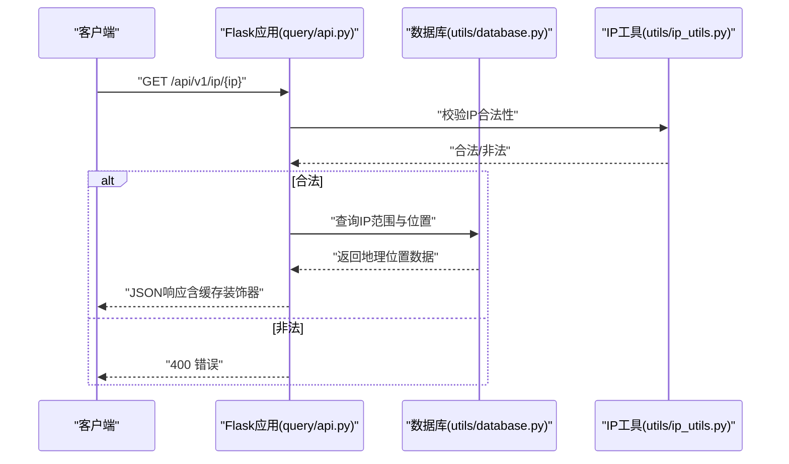
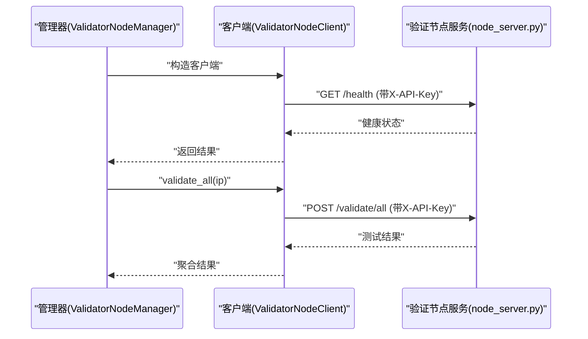
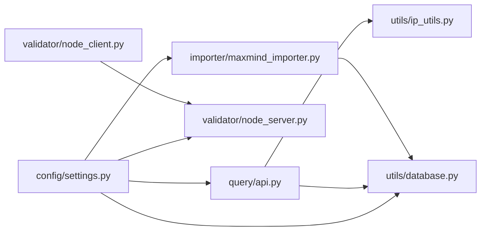

# 安装与配置

<cite>
**本文引用的文件**
- [requirements.txt](file://requirements.txt)
- [config/settings.py](file://config/settings.py)
- [scripts/init_db.py](file://scripts/init_db.py)
- [scripts/import_data.py](file://scripts/import_data.py)
- [query/api.py](file://query/api.py)
- [validator/node_server.py](file://validator/node_server.py)
- [validator/node_client.py](file://validator/node_client.py)
- [importer/maxmind_importer.py](file://importer/maxmind_importer.py)
- [utils/database.py](file://utils/database.py)
- [utils/ip_utils.py](file://utils/ip_utils.py)
</cite>

## 目录
1. [简介](#简介)
2. [项目结构](#项目结构)
3. [核心组件](#核心组件)
4. [架构总览](#架构总览)
5. [详细组件分析](#详细组件分析)
6. [依赖关系分析](#依赖关系分析)
7. [性能考虑](#性能考虑)
8. [故障排查指南](#故障排查指南)
9. [结论](#结论)
10. [附录](#附录)

## 简介
本文件面向IP地址定位系统的安装与配置，涵盖：
- Python运行环境与依赖安装
- 关键依赖包作用说明（requests、flask、csvkit、click）
- config/settings.py 中全部配置项详解
- 不同部署环境（开发/生产）的配置差异
- 环境变量使用方法（MAXMIND_LICENSE_KEY、VALIDATOR_API_KEY）
- 配置验证方法与常见错误排查

## 项目结构
项目采用按功能模块划分的组织方式，核心目录与职责如下：
- config：集中存放全局配置
- scripts：命令行脚本（数据库初始化、数据导入、测试数据插入）
- query：查询API服务（Flask应用）
- validator：验证节点（服务端与客户端）
- importer：数据导入器（MaxMind）
- utils：通用工具（数据库、IP工具）
- data/raw/maxmind：原始数据缓存目录

图表来源
- [config/settings.py:1-44](file://config/settings.py#L1-L44)
- [scripts/import_data.py:1-65](file://scripts/import_data.py#L1-L65)
- [importer/maxmind_importer.py:1-274](file://importer/maxmind_importer.py#L1-L274)
- [utils/database.py:1-398](file://utils/database.py#L1-L398)
- [query/api.py:1-325](file://query/api.py#L1-L325)
- [validator/node_server.py:1-350](file://validator/node_server.py#L1-L350)
- [validator/node_client.py:1-244](file://validator/node_client.py#L1-L244)

章节来源
- [config/settings.py:1-44](file://config/settings.py#L1-L44)
- [scripts/init_db.py:1-38](file://scripts/init_db.py#L1-L38)
- [scripts/import_data.py:1-65](file://scripts/import_data.py#L1-L65)
- [importer/maxmind_importer.py:1-274](file://importer/maxmind_importer.py#L1-L274)
- [utils/database.py:1-398](file://utils/database.py#L1-L398)
- [query/api.py:1-325](file://query/api.py#L1-L325)
- [validator/node_server.py:1-350](file://validator/node_server.py#L1-L350)
- [validator/node_client.py:1-244](file://validator/node_client.py#L1-L244)

## 核心组件
- 配置中心：集中定义数据库路径、API服务参数、缓存策略、验证节点列表、日志等
- 数据导入：支持从MaxMind下载或本地CSV导入，批量写入数据库
- 查询API：基于Flask提供REST接口，带简单内存缓存
- 验证节点：多节点分布式验证，支持健康检查、Ping、Traceroute等测试
- 工具库：数据库连接管理、IP地址解析与转换、CIDR与IP范围互转

章节来源
- [config/settings.py:1-44](file://config/settings.py#L1-L44)
- [utils/database.py:1-398](file://utils/database.py#L1-L398)
- [utils/ip_utils.py:1-282](file://utils/ip_utils.py#L1-L282)
- [importer/maxmind_importer.py:1-274](file://importer/maxmind_importer.py#L1-L274)
- [query/api.py:1-325](file://query/api.py#L1-L325)
- [validator/node_server.py:1-350](file://validator/node_server.py#L1-L350)
- [validator/node_client.py:1-244](file://validator/node_client.py#L1-L244)

## 架构总览
系统由“配置—导入—存储—查询—验证”五层构成，数据流自上而下，控制流自外向内。

图表来源
- [query/api.py:115-143](file://query/api.py#L115-L143)
- [utils/database.py:193-230](file://utils/database.py#L193-L230)
- [config/settings.py:22-27](file://config/settings.py#L22-L27)

## 详细组件分析

### 依赖与环境准备
- Python版本：建议使用Python 3.8+（具体以各依赖兼容性为准）
- 依赖安装：使用requirements.txt安装
  - requests：网络请求（下载MaxMind数据、验证节点HTTP调用）
  - flask：Web服务框架（查询API、验证节点服务）
  - click：命令行参数解析（脚本入口）
  - csvkit：CSV处理（项目中直接使用csv标准库，csvkit非强制依赖）

章节来源
- [requirements.txt:1-5](file://requirements.txt#L1-L5)

### 配置文件 config/settings.py 详解
- 项目根目录与数据路径
  - BASE_DIR：项目根目录
  - DATABASE_PATH：SQLite数据库文件路径
  - DATA_RAW_DIR：原始数据缓存目录
- MaxMind配置
  - MAXMIND_LICENSE_KEY：从环境变量读取，下载GeoLite2数据所需
  - MAXMIND_DOWNLOAD_URL：MaxMind下载地址
  - MAXMIND_EDITION：默认使用GeoLite2-City-CSV
- 导入配置
  - BATCH_SIZE：批量插入大小
  - IMPORT_CHUNK_SIZE：导入分块大小
- 查询服务配置
  - API_HOST/API_PORT/API_DEBUG：API监听地址、端口与调试开关
  - CACHE_TTL/CACHE_MAX_SIZE：缓存生存时间与最大条目
- 验证节点配置
  - VALIDATOR_NODES：验证节点列表（名称、主机、端口、位置）
  - VALIDATOR_API_KEY：API密钥，用于节点间鉴权
  - VALIDATION_BATCH_SIZE/VALIDATION_INTERVAL_HOURS：验证批大小与间隔
- 日志配置
  - LOG_LEVEL/LOG_FORMAT/LOG_FILE：日志级别、格式与文件路径

章节来源
- [config/settings.py:1-44](file://config/settings.py#L1-L44)

### 数据库初始化与导入流程
- 初始化数据库
  - 脚本：scripts/init_db.py
  - 功能：确保数据目录存在并创建SQLite表结构（locations、ip_ranges、validations、validation_summary），建立必要索引
- 导入数据
  - 脚本：scripts/import_data.py
  - 支持两种模式：
    - 直接导入本地CSV：--csv-path
    - 下载MaxMind并导入：--license-key 或环境变量MAXMIND_LICENSE_KEY
  - 导入器：importer/maxmind_importer.py
    - 下载ZIP并解压，解析Locations与Blocks文件，构建位置与IP范围映射，批量写入数据库

图表来源
- [scripts/import_data.py:44-61](file://scripts/import_data.py#L44-L61)
- [importer/maxmind_importer.py:145-258](file://importer/maxmind_importer.py#L145-L258)
- [utils/database.py:310-338](file://utils/database.py#L310-L338)

章节来源
- [scripts/init_db.py:16-34](file://scripts/init_db.py#L16-L34)
- [utils/database.py:70-185](file://utils/database.py#L70-L185)
- [scripts/import_data.py:26-41](file://scripts/import_data.py#L26-L41)
- [importer/maxmind_importer.py:28-72](file://importer/maxmind_importer.py#L28-L72)
- [importer/maxmind_importer.py:145-258](file://importer/maxmind_importer.py#L145-L258)

### 查询API服务
- 启动方式：python query/api.py [--host --port --debug]
- 路由概览
  - GET /：返回API说明与可用端点
  - GET /api/v1/ip/<ip>：查询单个IP
  - POST /api/v1/batch：批量查询（最多1000个）
  - GET /api/v1/stats：数据库统计（含国家分布、数据源分布）
  - GET /api/v1/validation-stats：验证统计
- 缓存机制：@cached装饰器实现简单内存缓存，支持TTL与容量上限
- 错误处理：统一的404/500错误响应

图表来源
- [query/api.py:115-143](file://query/api.py#L115-L143)
- [utils/database.py:193-230](file://utils/database.py#L193-L230)
- [utils/ip_utils.py:134-148](file://utils/ip_utils.py#L134-L148)

章节来源
- [query/api.py:100-325](file://query/api.py#L100-L325)
- [utils/database.py:193-230](file://utils/database.py#L193-L230)
- [utils/ip_utils.py:9-32](file://utils/ip_utils.py#L9-L32)

### 验证节点服务与客户端
- 服务端（validator/node_server.py）
  - 提供健康检查、节点信息、Ping与Traceroute测试
  - 通过X-API-Key头进行鉴权（密钥来自配置）
  - 支持跨平台命令行工具调用（ping/tracert）
- 客户端（validator/node_client.py）
  - 封装HTTP请求，支持健康检查、信息获取、Ping、Traceroute、全量验证
  - ValidatorNodeManager可管理多个节点并自动健康探测

图表来源
- [validator/node_client.py:22-104](file://validator/node_client.py#L22-L104)
- [validator/node_server.py:216-321](file://validator/node_server.py#L216-L321)
- [config/settings.py:36](file://config/settings.py#L36)

章节来源
- [validator/node_server.py:1-350](file://validator/node_server.py#L1-L350)
- [validator/node_client.py:1-244](file://validator/node_client.py#L1-L244)
- [config/settings.py:29-38](file://config/settings.py#L29-L38)

### 环境变量与部署差异
- 环境变量
  - MAXMIND_LICENSE_KEY：下载MaxMind数据所需的License Key
  - VALIDATOR_API_KEY：验证节点间通信的API密钥
- 开发环境
  - API_HOST：可设为127.0.0.1或0.0.0.0以便本地联调
  - API_DEBUG：开启调试模式便于排错
  - LOG_LEVEL：INFO或DEBUG
  - VALIDATOR_NODES：指向本地验证节点（默认localhost:5001/5002/5003）
- 生产环境
  - API_HOST：绑定到内网或公网IP，谨慎开放
  - API_DEBUG：关闭
  - LOG_LEVEL：INFO或更高
  - VALIDATOR_NODES：指向实际部署的验证节点集群
  - 配置文件中应明确设置环境变量，或通过系统服务/容器环境注入

章节来源
- [config/settings.py:14](file://config/settings.py#L14)
- [config/settings.py:36](file://config/settings.py#L36)
- [config/settings.py:23-27](file://config/settings.py#L23-L27)
- [config/settings.py:29-34](file://config/settings.py#L29-L34)

### 配置验证方法
- 数据库初始化验证
  - 运行脚本后检查数据目录与数据库文件是否存在
  - 参考：scripts/init_db.py
- 数据导入验证
  - 导入完成后查询统计数据（/api/v1/stats）
  - 检查数据库表是否存在及索引是否创建
  - 参考：utils/database.py 的表与索引创建逻辑
- 查询API验证
  - 访问 /api/v1/ip/<测试IP> 与 /api/v1/batch
  - 观察缓存命中与响应时间
  - 参考：query/api.py
- 验证节点验证
  - 访问 /health 与 /node/info
  - 使用客户端进行Ping/Traceroute测试
  - 参考：validator/node_server.py 与 validator/node_client.py

章节来源
- [scripts/init_db.py:16-34](file://scripts/init_db.py#L16-L34)
- [utils/database.py:70-185](file://utils/database.py#L70-L185)
- [query/api.py:100-204](file://query/api.py#L100-L204)
- [validator/node_server.py:216-321](file://validator/node_server.py#L216-L321)
- [validator/node_client.py:54-104](file://validator/node_client.py#L54-L104)

## 依赖关系分析
- 配置依赖：query/api.py、validator/node_server.py、importer/maxmind_importer.py、utils/database.py均依赖config/settings.py
- 工具依赖：query/api.py依赖utils/database.py与utils/ip_utils.py
- 导入依赖：scripts/import_data.py依赖importer/maxmind_importer.py与utils/database.py
- 验证依赖：validator/node_client.py依赖validator/node_server.py与config/settings.py

图表来源
- [config/settings.py:1-44](file://config/settings.py#L1-L44)
- [query/api.py:20-22](file://query/api.py#L20-L22)
- [validator/node_server.py:23](file://validator/node_server.py#L23)
- [importer/maxmind_importer.py:12-14](file://importer/maxmind_importer.py#L12-L14)
- [utils/database.py:8](file://utils/database.py#L8)
- [validator/node_client.py:16](file://validator/node_client.py#L16)

章节来源
- [config/settings.py:1-44](file://config/settings.py#L1-L44)
- [query/api.py:20-22](file://query/api.py#L20-L22)
- [validator/node_server.py:23](file://validator/node_server.py#L23)
- [importer/maxmind_importer.py:12-14](file://importer/maxmind_importer.py#L12-L14)
- [utils/database.py:8](file://utils/database.py#L8)
- [validator/node_client.py:16](file://validator/node_client.py#L16)

## 性能考虑
- 缓存策略：查询API对热点IP进行内存缓存，合理设置CACHE_TTL与CACHE_MAX_SIZE
- 数据库索引：已创建多处索引（IP范围区间、网络、位置、验证相关），避免全表扫描
- 批量导入：BATCH_SIZE与IMPORT_CHUNK_SIZE影响导入速度与内存占用
- 并发与限流：API对批量查询设置了上限（1000个），避免过大请求导致资源耗尽
- 验证节点：多节点并行验证可提升准确性，但需注意网络与资源开销

章节来源
- [config/settings.py:26-27](file://config/settings.py#L26-L27)
- [utils/database.py:149-181](file://utils/database.py#L149-L181)
- [query/api.py:172-175](file://query/api.py#L172-L175)
- [importer/maxmind_importer.py:238-245](file://importer/maxmind_importer.py#L238-L245)

## 故障排查指南
- 无法下载MaxMind数据
  - 检查MAXMIND_LICENSE_KEY是否设置且有效
  - 确认网络可达与超时设置
  - 参考：importer/maxmind_importer.py 的下载逻辑
- 数据库文件不存在或权限不足
  - 运行初始化脚本确保目录与文件存在
  - 检查DATABASE_PATH权限
  - 参考：scripts/init_db.py 与 utils/database.py
- 查询API报错或无响应
  - 检查API_HOST/API_PORT/API_DEBUG配置
  - 查看日志文件（LOG_FILE）定位异常
  - 参考：query/api.py 的错误处理与日志配置
- 验证节点鉴权失败
  - 确认X-API-Key头与VALIDATOR_API_KEY一致
  - 参考：validator/node_server.py 的鉴权逻辑
- 批量导入卡顿或内存不足
  - 调整BATCH_SIZE与IMPORT_CHUNK_SIZE
  - 参考：config/settings.py 与 importer/maxmind_importer.py
- 验证节点不可达
  - 使用客户端健康检查与节点信息接口确认
  - 参考：validator/node_client.py 的健康检查方法

章节来源
- [importer/maxmind_importer.py:35-72](file://importer/maxmind_importer.py#L35-L72)
- [scripts/init_db.py:18-33](file://scripts/init_db.py#L18-L33)
- [utils/database.py:70-185](file://utils/database.py#L70-L185)
- [query/api.py:290-303](file://query/api.py#L290-L303)
- [validator/node_server.py:44-49](file://validator/node_server.py#L44-L49)
- [validator/node_client.py:54-63](file://validator/node_client.py#L54-L63)
- [config/settings.py:19-20](file://config/settings.py#L19-L20)
- [importer/maxmind_importer.py:238-245](file://importer/maxmind_importer.py#L238-L245)

## 结论
通过标准化的配置文件与清晰的模块分工，系统实现了从数据导入、数据库存储到查询API与验证节点的完整链路。建议在生产环境中严格区分环境变量与配置项，结合缓存与索引优化查询性能，并定期进行验证节点健康检查与数据准确性评估。

## 附录
- 常用命令参考
  - 初始化数据库：python scripts/init_db.py
  - 导入MaxMind数据：python scripts/import_data.py maxmind --license-key YOUR_KEY
  - 启动查询API：python query/api.py
  - 启动验证节点：python validator/node_server.py --name beijing --port 5001
  - 验证节点客户端：python validator/node_client.py --host localhost --port 5001 --action health