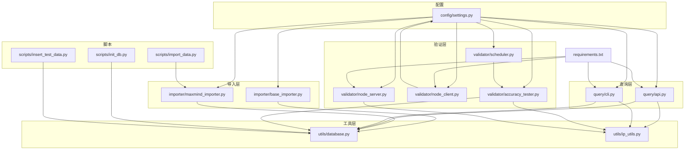
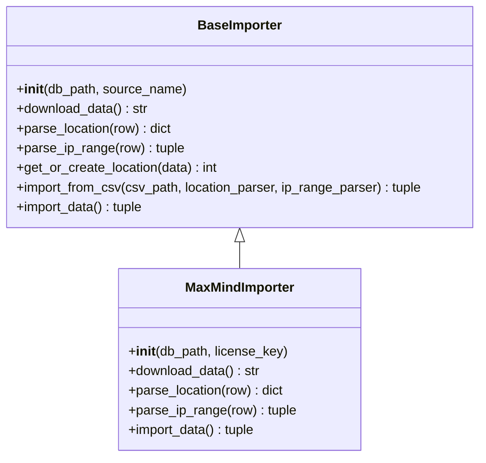
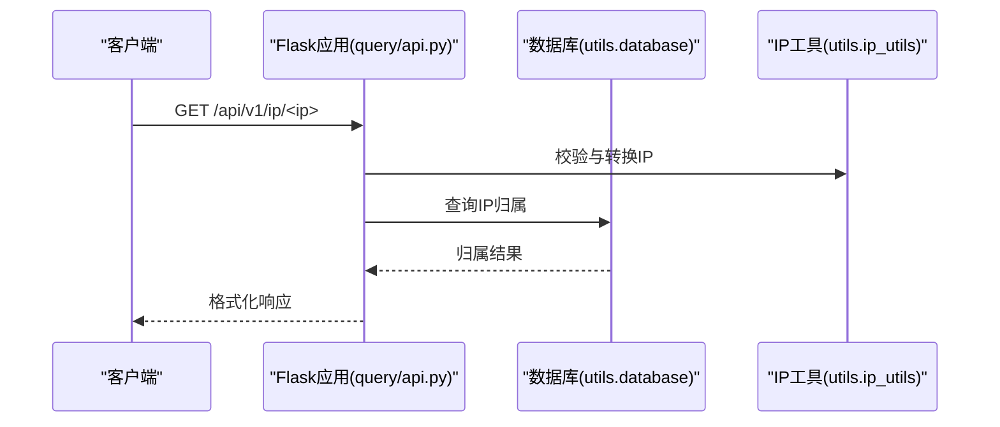
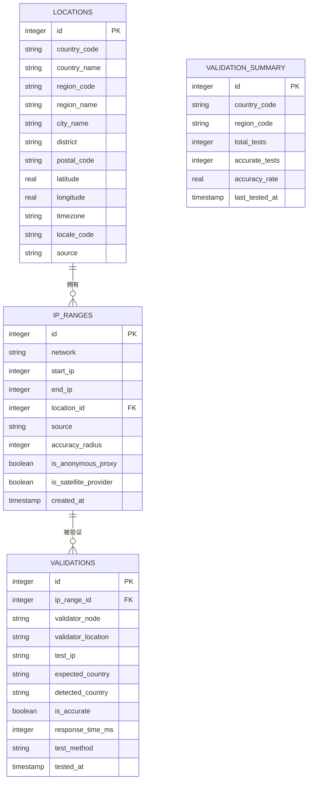
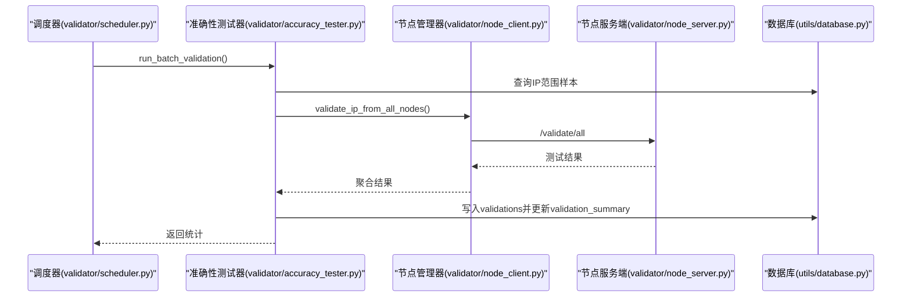
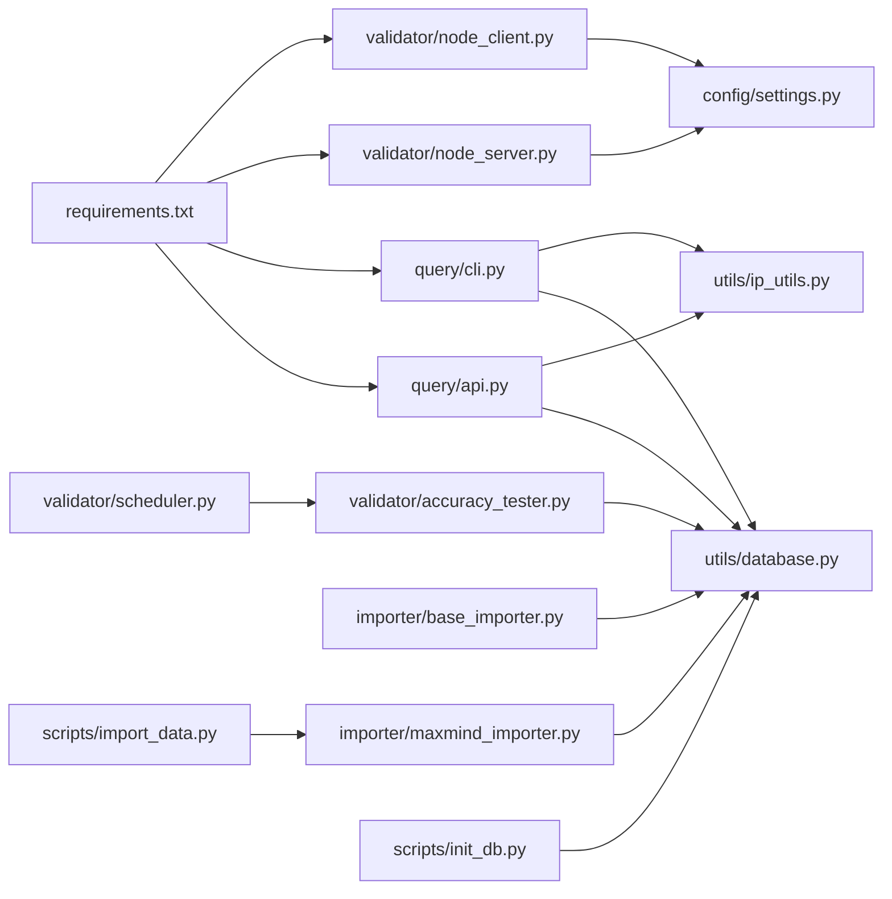

# 开发指南

<cite>
**本文引用的文件**
- [requirements.txt](file://requirements.txt)
- [settings.py](file://config/settings.py)
- [base_importer.py](file://importer/base_importer.py)
- [maxmind_importer.py](file://importer/maxmind_importer.py)
- [api.py](file://query/api.py)
- [cli.py](file://query/cli.py)
- [database.py](file://utils/database.py)
- [ip_utils.py](file://utils/ip_utils.py)
- [accuracy_tester.py](file://validator/accuracy_tester.py)
- [node_client.py](file://validator/node_client.py)
- [node_server.py](file://validator/node_server.py)
- [scheduler.py](file://validator/scheduler.py)
- [import_data.py](file://scripts/import_data.py)
- [init_db.py](file://scripts/init_db.py)
- [insert_test_data.py](file://scripts/insert_test_data.py)
- [test.py](file://test.py)
</cite>

## 目录
1. [简介](#简介)
2. [项目结构](#项目结构)
3. [核心组件](#核心组件)
4. [架构总览](#架构总览)
5. [详细组件分析](#详细组件分析)
6. [依赖关系分析](#依赖关系分析)
7. [性能考虑](#性能考虑)
8. [故障排查指南](#故障排查指南)
9. [结论](#结论)
10. [附录](#附录)

## 简介
本开发指南面向希望参与 IP 地址定位系统的开发者，系统提供基于 SQLite 的离线 IP 归属地查询能力，支持 REST API 与命令行两种使用方式，并内置验证节点网络以进行跨节点的 IP 可达性验证与准确性统计。文档涵盖代码结构与编程约定、新功能开发流程、测试策略、调试技巧、代码审查流程以及贡献指南。

## 项目结构
项目采用按功能域划分的模块化组织方式：
- config：集中式配置管理
- importer：数据导入器（抽象基类与具体实现）
- query：查询入口（API 与 CLI）
- utils：通用工具（数据库、IP 工具）
- validator：验证节点体系（客户端、服务端、准确性测试、调度器）
- scripts：辅助脚本（数据库初始化、数据导入、测试数据插入）
- requirements.txt：依赖声明



图表来源
- [settings.py:1-44](file://config/settings.py#L1-L44)
- [base_importer.py:1-168](file://importer/base_importer.py#L1-L168)
- [maxmind_importer.py:1-274](file://importer/maxmind_importer.py#L1-L274)
- [api.py:1-325](file://query/api.py#L1-L325)
- [cli.py:1-250](file://query/cli.py#L1-L250)
- [database.py:1-398](file://utils/database.py#L1-L398)
- [ip_utils.py:1-282](file://utils/ip_utils.py#L1-L282)
- [accuracy_tester.py:1-373](file://validator/accuracy_tester.py#L1-L373)
- [node_client.py:1-244](file://validator/node_client.py#L1-L244)
- [node_server.py:1-350](file://validator/node_server.py#L1-L350)
- [scheduler.py:1-265](file://validator/scheduler.py#L1-L265)
- [init_db.py:1-38](file://scripts/init_db.py#L1-L38)
- [import_data.py:1-65](file://scripts/import_data.py#L1-L65)
- [insert_test_data.py:1-63](file://scripts/insert_test_data.py#L1-L63)
- [requirements.txt:1-5](file://requirements.txt#L1-L5)

章节来源
- [settings.py:1-44](file://config/settings.py#L1-L44)
- [requirements.txt:1-5](file://requirements.txt#L1-L5)

## 核心组件
- 配置中心：集中管理数据库路径、MaxMind 下载参数、API 服务参数、验证节点配置、日志级别等。
- 数据导入器：抽象基类定义导入流程与通用逻辑，具体实现负责解析与入库。
- 查询服务：Flask 提供 REST API；CLI 提供命令行查询与统计。
- 数据库工具：封装 SQLite 连接、事务、索引、批量写入与查询。
- IP 工具：IP/IPv6 解析、CIDR 转换、有效性校验、二进制/压缩格式转换等。
- 验证节点：节点服务端提供健康检查与连通性测试；节点客户端聚合多节点结果；准确性测试器结合节点结果评估归属准确性；调度器周期性执行验证任务。
- 辅助脚本：数据库初始化、数据导入、测试数据注入。

章节来源
- [settings.py:1-44](file://config/settings.py#L1-L44)
- [base_importer.py:1-168](file://importer/base_importer.py#L1-L168)
- [maxmind_importer.py:1-274](file://importer/maxmind_importer.py#L1-L274)
- [api.py:1-325](file://query/api.py#L1-L325)
- [cli.py:1-250](file://query/cli.py#L1-L250)
- [database.py:1-398](file://utils/database.py#L1-L398)
- [ip_utils.py:1-282](file://utils/ip_utils.py#L1-L282)
- [accuracy_tester.py:1-373](file://validator/accuracy_tester.py#L1-L373)
- [node_client.py:1-244](file://validator/node_client.py#L1-L244)
- [node_server.py:1-350](file://validator/node_server.py#L1-L350)
- [scheduler.py:1-265](file://validator/scheduler.py#L1-L265)
- [init_db.py:1-38](file://scripts/init_db.py#L1-L38)
- [import_data.py:1-65](file://scripts/import_data.py#L1-L65)
- [insert_test_data.py:1-63](file://scripts/insert_test_data.py#L1-L63)

## 架构总览
系统采用“配置驱动 + 模块化工具 + 可插拔导入器 + 查询服务 + 验证节点”的分层架构。导入器负责将外部数据（如 MaxMind）标准化后写入 SQLite；查询层通过 IP 工具与数据库工具完成快速定位；验证层通过节点网络对 IP 的可达性进行交叉验证，并更新准确性统计。

```mermaid
graph TB
C["配置(config)"] --> I["导入(importer)"]
C --> Q["查询(query)"]
C --> V["验证(validator)"]
UDB["数据库(utils.database)"] <- --> I
UDB <- --> Q
UDB <- --> V
UIP["IP工具(utils.ip_utils)"] --> Q
UIP --> V
NCLI["节点客户端(validator.node_client)"] --> V
NSRV["节点服务端(validator.node_server)"] --> V
SCH["调度器(validator.scheduler)"] --> V
API["API(query.api)"] --> Q
CLI["CLI(query.cli)"] --> Q
IMP["导入脚本(scripts.import_data)"] --> I
INIT["初始化脚本(scripts.init_db)"] --> UDB
```

图表来源
- [settings.py:1-44](file://config/settings.py#L1-L44)
- [base_importer.py:1-168](file://importer/base_importer.py#L1-L168)
- [maxmind_importer.py:1-274](file://importer/maxmind_importer.py#L1-L274)
- [api.py:1-325](file://query/api.py#L1-L325)
- [cli.py:1-250](file://query/cli.py#L1-L250)
- [database.py:1-398](file://utils/database.py#L1-L398)
- [ip_utils.py:1-282](file://utils/ip_utils.py#L1-L282)
- [accuracy_tester.py:1-373](file://validator/accuracy_tester.py#L1-L373)
- [node_client.py:1-244](file://validator/node_client.py#L1-L244)
- [node_server.py:1-350](file://validator/node_server.py#L1-L350)
- [scheduler.py:1-265](file://validator/scheduler.py#L1-L265)
- [import_data.py:1-65](file://scripts/import_data.py#L1-L65)
- [init_db.py:1-38](file://scripts/init_db.py#L1-L38)

## 详细组件分析

### 配置模块（config/settings.py）
- 职责：集中管理数据库路径、数据源参数、API 服务参数、缓存策略、验证节点列表与密钥、日志配置等。
- 关键点：环境变量注入（如 MaxMind 许可密钥、验证 API Key）、默认值与边界参数（端口、缓存 TTL、批大小）。
- 建议：新增配置项需在文档中同步说明用途与默认值；敏感信息通过环境变量注入。

章节来源
- [settings.py:1-44](file://config/settings.py#L1-L44)

### 数据导入器（importer）
- 抽象基类 BaseImporter
  - 规范导入流程：下载数据 → 解析位置 → 解析 IP 范围 → 批量写入。
  - 位置缓存：避免重复查询相同位置，提升导入效率。
  - 批量写入：按配置的批量大小进行批量插入。
- 具体实现 MaxMindImporter
  - 支持在线下载与本地 CSV 导入两种模式。
  - 同时处理 Locations 与 Blocks 文件，构建位置映射后再导入 Blocks。
  - 解析字段包含经纬度、时区、精度半径、匿名代理标识等。



图表来源
- [base_importer.py:15-168](file://importer/base_importer.py#L15-L168)
- [maxmind_importer.py:19-274](file://importer/maxmind_importer.py#L19-L274)

章节来源
- [base_importer.py:1-168](file://importer/base_importer.py#L1-L168)
- [maxmind_importer.py:1-274](file://importer/maxmind_importer.py#L1-L274)

### 查询服务（query）
- API（Flask）
  - 提供单 IP 查询、批量查询、统计信息、验证统计等接口。
  - 内置简单内存缓存装饰器，支持 TTL 与容量上限。
  - 输入校验与错误处理，统一返回 JSON。
- CLI
  - 支持文本与 JSON 两种输出格式。
  - 批量查询支持输入文件与输出文件。
  - 统计信息展示国家分布与验证准确率。



图表来源
- [api.py:115-143](file://query/api.py#L115-L143)
- [database.py:193-231](file://utils/database.py#L193-L231)
- [ip_utils.py:9-32](file://utils/ip_utils.py#L9-L32)

章节来源
- [api.py:1-325](file://query/api.py#L1-L325)
- [cli.py:1-250](file://query/cli.py#L1-L250)
- [database.py:1-398](file://utils/database.py#L1-L398)
- [ip_utils.py:1-282](file://utils/ip_utils.py#L1-L282)

### 数据库工具（utils/database.py）
- DatabaseManager：封装连接、事务、查询与批量执行。
- 表结构：locations、ip_ranges、validations、validation_summary。
- 索引：为查询热点字段建立索引，优化范围查询与联表性能。
- 关键函数：查询 IP 归属、获取/插入位置、批量插入 IP 范围、更新验证汇总。



图表来源
- [database.py:80-182](file://utils/database.py#L80-L182)

章节来源
- [database.py:1-398](file://utils/database.py#L1-L398)

### IP 工具（utils/ip_utils.py）
- IP/IPv6 转换、CIDR 与范围互转、有效性校验、私有地址判断、二进制/压缩格式转换、子网计算等。
- 为查询与导入提供基础能力。

章节来源
- [ip_utils.py:1-282](file://utils/ip_utils.py#L1-L282)

### 验证节点体系（validator）
- 节点客户端（node_client.py）
  - 与验证节点通信，支持健康检查、节点信息、Ping、Traceroute、全量验证。
  - ValidatorNodeManager 聚合多节点结果。
- 节点服务端（node_server.py）
  - 提供 /health、/node/info、/validate/ping、/validate/traceroute、/validate/all 接口。
  - 通过系统命令执行 Ping/Traceroute 并解析输出。
- 准确性测试器（accuracy_tester.py）
  - 从数据库随机采样 IP 范围，生成测试 IP，调用节点网络进行可达性验证，统计准确率并更新汇总。
- 调度器（scheduler.py）
  - 定时执行验证任务，支持一次性与持续运行模式，支持按国家验证与全局验证。



图表来源
- [scheduler.py:39-63](file://validator/scheduler.py#L39-L63)
- [accuracy_tester.py:182-254](file://validator/accuracy_tester.py#L182-L254)
- [node_client.py:179-189](file://validator/node_client.py#L179-L189)
- [node_server.py:287-321](file://validator/node_server.py#L287-L321)
- [database.py:341-398](file://utils/database.py#L341-L398)

章节来源
- [node_client.py:1-244](file://validator/node_client.py#L1-L244)
- [node_server.py:1-350](file://validator/node_server.py#L1-L350)
- [accuracy_tester.py:1-373](file://validator/accuracy_tester.py#L1-L373)
- [scheduler.py:1-265](file://validator/scheduler.py#L1-L265)

### 辅助脚本（scripts）
- init_db.py：初始化数据库与目录。
- import_data.py：根据参数选择初始化数据库与导入数据（支持直接导入本地 CSV 或在线下载导入）。
- insert_test_data.py：向数据库插入测试数据，便于快速验证。

章节来源
- [init_db.py:1-38](file://scripts/init_db.py#L1-L38)
- [import_data.py:1-65](file://scripts/import_data.py#L1-L65)
- [insert_test_data.py:1-63](file://scripts/insert_test_data.py#L1-L63)

## 依赖关系分析
- 外部依赖：requests、flask、click、csvkit。
- 内部依赖：query 依赖 utils 与 config；importer 依赖 utils 与 config；validator 依赖 utils 与 config；scripts 作为入口脚本依赖各模块。



图表来源
- [requirements.txt:1-5](file://requirements.txt#L1-L5)
- [api.py:1-325](file://query/api.py#L1-L325)
- [cli.py:1-250](file://query/cli.py#L1-L250)
- [node_server.py:1-350](file://validator/node_server.py#L1-L350)
- [node_client.py:1-244](file://validator/node_client.py#L1-L244)
- [maxmind_importer.py:1-274](file://importer/maxmind_importer.py#L1-L274)
- [base_importer.py:1-168](file://importer/base_importer.py#L1-L168)
- [accuracy_tester.py:1-373](file://validator/accuracy_tester.py#L1-L373)
- [scheduler.py:1-265](file://validator/scheduler.py#L1-L265)
- [import_data.py:1-65](file://scripts/import_data.py#L1-L65)
- [init_db.py:1-38](file://scripts/init_db.py#L1-L38)
- [database.py:1-398](file://utils/database.py#L1-L398)
- [ip_utils.py:1-282](file://utils/ip_utils.py#L1-L282)
- [settings.py:1-44](file://config/settings.py#L1-L44)

章节来源
- [requirements.txt:1-5](file://requirements.txt#L1-L5)

## 性能考虑
- 数据库索引：为 ip_ranges 的 start_ip/end_ip、network、location_id 与 locations 的 country_code、city_name 建立索引，显著提升查询性能。
- 批量写入：导入阶段按配置批量插入，减少事务开销。
- 缓存策略：API 层提供简单内存缓存装饰器，控制 TTL 与容量上限，降低重复查询压力。
- IP 范围查询：按精度半径升序优先匹配，确保更精确的结果优先返回。
- 验证任务：调度器支持分段睡眠，便于及时响应停止信号；可配置验证间隔与批次大小。

章节来源
- [database.py:149-182](file://utils/database.py#L149-L182)
- [base_importer.py:137-151](file://importer/base_importer.py#L137-L151)
- [api.py:31-60](file://query/api.py#L31-L60)
- [database.py:206-228](file://utils/database.py#L206-L228)
- [scheduler.py:65-93](file://validator/scheduler.py#L65-L93)

## 故障排查指南
- 数据库初始化失败
  - 确认数据目录存在且可写；使用初始化脚本自动创建目录与表。
- 导入数据异常
  - 检查 MaxMind 许可密钥与网络权限；确认 CSV 文件格式与字段映射正确。
- 查询无结果
  - 校验 IP 有效性；确认数据库中是否存在对应 IP 范围；检查索引是否生效。
- 验证节点不可达
  - 检查节点健康检查接口；确认 API Key 一致；查看节点服务端日志。
- API/CLI 报错
  - 查看错误响应中的错误信息；确认参数格式与取值范围。

章节来源
- [init_db.py:16-34](file://scripts/init_db.py#L16-L34)
- [import_data.py:26-41](file://scripts/import_data.py#L26-L41)
- [api.py:127-142](file://query/api.py#L127-L142)
- [node_server.py:216-222](file://validator/node_server.py#L216-L222)
- [node_client.py:54-59](file://validator/node_client.py#L54-L59)

## 结论
本系统通过清晰的模块划分与配置驱动，提供了稳定的数据导入、高效查询与可扩展的验证能力。建议在新增功能时遵循现有模块职责与命名规范，完善测试与文档，并通过调度器与验证节点保障数据质量。

## 附录

### 新功能开发流程（从需求到实现）
- 需求分析：明确功能目标、输入输出、性能与可靠性要求。
- 设计评审：确定模块边界、接口设计、数据模型变更与影响范围。
- 实现步骤：
  - 在 config 中添加必要配置项。
  - 在 utils 中补充工具函数或复用现有工具。
  - 在 importer/query/validator 中新增或扩展模块。
  - 在 scripts 中提供便捷脚本入口。
  - 编写单元/集成/性能测试，覆盖关键路径。
- 文档与注释：补充 README 或模块内文档，保持注释一致性。
- 提交流程：创建分支、提交、发起 PR、代码审查、合并。

### 测试策略与最佳实践
- 单元测试：针对工具函数（如 IP 工具、数据库工具）编写独立测试，覆盖边界条件。
- 集成测试：模拟导入、查询、验证全流程，确保模块间协作正确。
- 性能测试：对导入批大小、查询缓存、验证调度间隔进行基准测试，记录指标。
- 端到端测试：使用测试数据脚本准备数据，验证 API/CLI 行为与输出格式。

### 调试技巧与开发工具
- 使用 Flask 的调试模式（API/CLI 均支持）。
- 通过日志配置查看关键路径执行情况。
- 使用测试数据脚本快速搭建测试环境。
- 对于验证节点，使用节点客户端脚本进行连通性自检。

### 代码审查标准与流程
- 代码风格：遵循现有命名与注释规范；模块职责单一。
- 安全性：敏感配置通过环境变量注入；API Key 校验与错误处理。
- 可靠性：完善的异常捕获与错误返回；幂等性与事务一致性。
- 可维护性：清晰的模块依赖与接口契约；必要的文档与注释。
- 流程：提交前自测；PR 描述包含变更内容、测试结果与风险说明；至少一名 reviewer 通过。

### 贡献指南
- 分支管理：主分支保护，功能开发在 feature/* 分支；修复在 hotfix/* 分支。
- 提交规范：简明标题 + 详细描述；引用相关 Issue；拆分小的可审查提交。
- Pull Request：描述变更动机与方案；列出测试覆盖；关联相关模块与配置。

### 扩展功能开发模板与示例
- 新增数据源导入器
  - 继承 BaseImporter，实现 download_data、parse_location、parse_ip_range。
  - 在 scripts 中提供导入入口。
- 新增查询接口
  - 在 query/api.py 中添加路由与处理逻辑；复用 utils 与 config。
- 新增验证节点
  - 在 validator/node_server.py 中扩展测试接口；在 node_client.py 中添加调用方法。
- 新增定时任务
  - 在 validator/scheduler.py 中新增 Job 或调整调度策略。

章节来源
- [base_importer.py:23-39](file://importer/base_importer.py#L23-L39)
- [api.py:100-112](file://query/api.py#L100-L112)
- [node_server.py:200-213](file://validator/node_server.py#L200-L213)
- [node_client.py:31-53](file://validator/node_client.py#L31-L53)
- [scheduler.py:125-201](file://validator/scheduler.py#L125-L201)