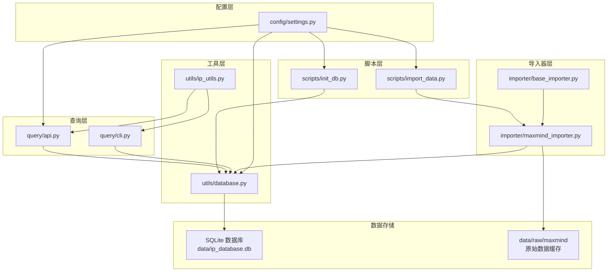
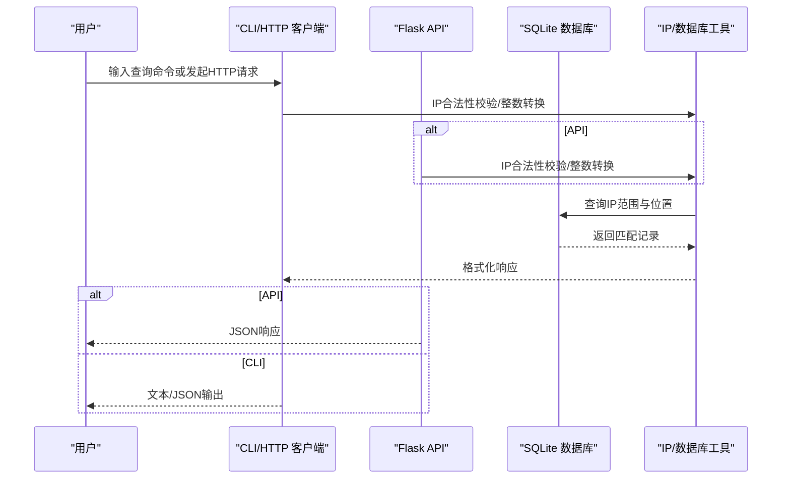
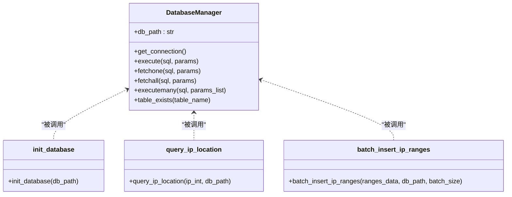
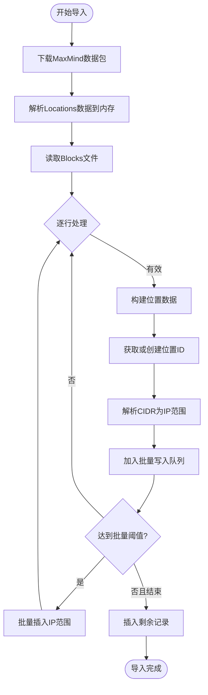
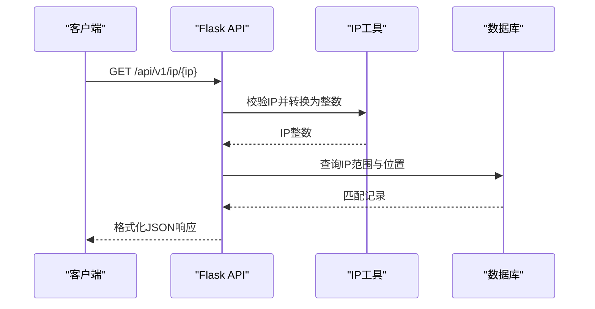
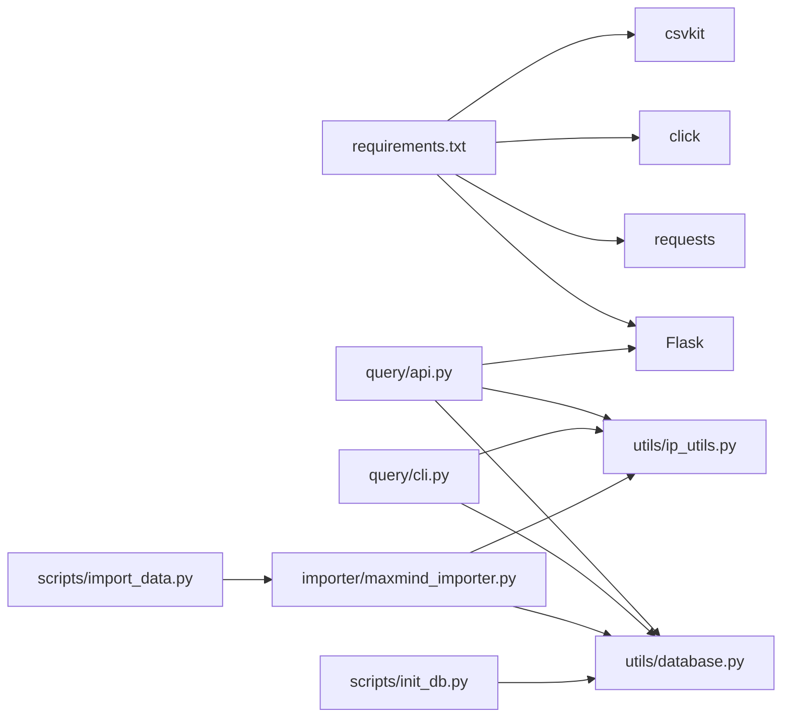

# 快速开始

<cite>
**本文引用的文件**
- [requirements.txt](file://requirements.txt)
- [settings.py](file://config/settings.py)
- [init_db.py](file://scripts/init_db.py)
- [import_data.py](file://scripts/import_data.py)
- [maxmind_importer.py](file://importer/maxmind_importer.py)
- [base_importer.py](file://importer/base_importer.py)
- [database.py](file://utils/database.py)
- [ip_utils.py](file://utils/ip_utils.py)
- [api.py](file://query/api.py)
- [cli.py](file://query/cli.py)
</cite>

## 目录
1. [简介](#简介)
2. [项目结构](#项目结构)
3. [核心组件](#核心组件)
4. [架构总览](#架构总览)
5. [详细组件分析](#详细组件分析)
6. [依赖关系分析](#依赖关系分析)
7. [性能与优化建议](#性能与优化建议)
8. [故障排除指南](#故障排除指南)
9. [结论](#结论)
10. [附录：安装与使用步骤](#附录安装与使用步骤)

## 简介
本指南面向首次接触 IP 地址定位系统的用户，帮助你在约 30 分钟内完成环境准备、安装部署、数据导入与服务启动，并掌握基本的 IP 查询与批量查询操作。系统支持通过 MaxMind GeoLite2 数据进行 IP 定位，提供命令行工具与 REST API 两种使用方式，并内置缓存与统计功能，便于快速上手与扩展。

## 项目结构
项目采用“配置-工具-导入器-查询-脚本”的分层组织：
- config：集中存放全局配置（数据库路径、API 参数、MaxMind 配置、验证节点等）
- utils：通用工具模块（数据库连接、IP 工具）
- importer：数据导入器（抽象基类与 MaxMind 导入器）
- query：查询入口（CLI 与 API）
- scripts：运维脚本（初始化数据库、导入数据、插入测试数据）
- data/raw/maxmind：原始数据缓存目录（用于下载与解压 MaxMind 数据）

图表来源
- [settings.py:1-44](file://config/settings.py#L1-L44)
- [database.py:1-398](file://utils/database.py#L1-L398)
- [ip_utils.py:1-282](file://utils/ip_utils.py#L1-L282)
- [base_importer.py:1-168](file://importer/base_importer.py#L1-L168)
- [maxmind_importer.py:1-274](file://importer/maxmind_importer.py#L1-L274)
- [api.py:1-325](file://query/api.py#L1-L325)
- [cli.py:1-250](file://query/cli.py#L1-L250)
- [init_db.py:1-38](file://scripts/init_db.py#L1-L38)
- [import_data.py:1-65](file://scripts/import_data.py#L1-L65)

章节来源
- [settings.py:1-44](file://config/settings.py#L1-L44)
- [database.py:1-398](file://utils/database.py#L1-L398)
- [ip_utils.py:1-282](file://utils/ip_utils.py#L1-L282)
- [base_importer.py:1-168](file://importer/base_importer.py#L1-L168)
- [maxmind_importer.py:1-274](file://importer/maxmind_importer.py#L1-L274)
- [api.py:1-325](file://query/api.py#L1-L325)
- [cli.py:1-250](file://query/cli.py#L1-L250)
- [init_db.py:1-38](file://scripts/init_db.py#L1-L38)
- [import_data.py:1-65](file://scripts/import_data.py#L1-L65)

## 核心组件
- 配置中心：集中定义数据库路径、API 监听地址与端口、缓存策略、MaxMind 下载参数、验证节点与密钥等
- 数据库工具：封装 SQLite 连接、表初始化、查询与批量写入、索引管理、验证统计
- IP 工具：IP/IPv6 解析、CIDR 转换、有效性校验、二进制与压缩格式转换等
- 导入器：抽象基类定义统一导入流程；MaxMind 导入器负责下载、解析、去重与批量入库
- 查询入口：CLI 提供命令行查询与批量查询；API 提供 REST 接口与缓存
- 运维脚本：初始化数据库、导入数据、插入测试数据

章节来源
- [settings.py:1-44](file://config/settings.py#L1-L44)
- [database.py:1-398](file://utils/database.py#L1-L398)
- [ip_utils.py:1-282](file://utils/ip_utils.py#L1-L282)
- [base_importer.py:1-168](file://importer/base_importer.py#L1-L168)
- [maxmind_importer.py:1-274](file://importer/maxmind_importer.py#L1-L274)
- [api.py:1-325](file://query/api.py#L1-L325)
- [cli.py:1-250](file://query/cli.py#L1-L250)
- [init_db.py:1-38](file://scripts/init_db.py#L1-L38)
- [import_data.py:1-65](file://scripts/import_data.py#L1-L65)

## 架构总览
系统以 SQLite 作为本地数据库，通过导入器将 MaxMind 数据转换为 IP 范围与地理位置映射，查询时根据 IP 的整数形式在有序区间内匹配最近精度的记录。API 与 CLI 共享相同的查询逻辑与缓存策略，CLI 适合离线与批处理，API 适合集成与在线服务。

图表来源
- [api.py:115-204](file://query/api.py#L115-L204)
- [cli.py:54-173](file://query/cli.py#L54-L173)
- [database.py:193-231](file://utils/database.py#L193-L231)
- [ip_utils.py:9-32](file://utils/ip_utils.py#L9-L32)

## 详细组件分析

### 配置模块（config/settings.py）
- 数据库路径：默认位于项目根目录下的 data/ip_database.db
- MaxMind 配置：下载地址、许可密钥、数据集名称
- 导入配置：批量插入大小、导入分块大小
- API 配置：监听地址、端口、调试开关、缓存 TTL 与最大缓存条目
- 验证节点：预设验证节点列表与密钥、验证批次大小、验证间隔
- 日志配置：日志级别、格式与输出文件

章节来源
- [settings.py:1-44](file://config/settings.py#L1-L44)

### 数据库工具（utils/database.py）
- 数据库管理器：提供上下文管理连接、执行 SQL、批量插入、表存在性检查
- 初始化：创建 locations、ip_ranges、validations、validation_summary 表及必要索引
- 查询：按 IP 整数在有序区间匹配地理位置，优先返回精度更高的记录
- 批量写入：按批次插入 IP 范围，减少事务开销
- 验证统计：维护国家/区域维度的验证汇总表

图表来源
- [database.py:15-191](file://utils/database.py#L15-L191)
- [database.py:70-186](file://utils/database.py#L70-L186)
- [database.py:193-231](file://utils/database.py#L193-L231)
- [database.py:310-339](file://utils/database.py#L310-L339)

章节来源
- [database.py:1-398](file://utils/database.py#L1-L398)

### IP 工具（utils/ip_utils.py）
- IP/IPv6 转换：支持 IPv4/IPv6，提供整数与字符串互转
- CIDR 范围：CIDR 转换为起止 IP，以及反向的 CIDR 列表生成
- 合法性校验：判断字符串是否为有效 IP
- 其他实用函数：私有地址判断、主机名解析、子网计算等

章节来源
- [ip_utils.py:1-282](file://utils/ip_utils.py#L1-L282)

### 导入器（importer/base_importer.py 与 importer/maxmind_importer.py）
- 抽象基类：定义统一的导入流程（下载数据、解析位置、解析 IP 范围、批量写入），并提供位置缓存避免重复写入
- MaxMind 导入器：下载 GeoLite2-City-CSV 数据包，解析 Locations 与 Blocks，构建位置与 IP 范围映射，批量写入数据库

图表来源
- [base_importer.py:82-154](file://importer/base_importer.py#L82-L154)
- [maxmind_importer.py:145-258](file://importer/maxmind_importer.py#L145-L258)

章节来源
- [base_importer.py:1-168](file://importer/base_importer.py#L1-L168)
- [maxmind_importer.py:1-274](file://importer/maxmind_importer.py#L1-L274)

### 查询入口（query/cli.py 与 query/api.py）
- CLI：支持单 IP 查询、批量查询（从文件读取）、统计信息展示；可输出文本或 JSON
- API：提供 /api/v1/ip/<ip> 单次查询、/api/v1/batch 批量查询、/api/v1/stats 统计、/api/v1/validation-stats 验证统计；内置内存缓存与错误处理

图表来源
- [api.py:115-143](file://query/api.py#L115-L143)
- [ip_utils.py:9-32](file://utils/ip_utils.py#L9-L32)
- [database.py:193-231](file://utils/database.py#L193-L231)

章节来源
- [cli.py:1-250](file://query/cli.py#L1-L250)
- [api.py:1-325](file://query/api.py#L1-L325)

### 运维脚本（scripts/init_db.py 与 scripts/import_data.py）
- 初始化数据库：确保数据目录存在并创建数据库表与索引
- 导入数据：支持 MaxMind 数据源，可直接从本地 CSV 导入或自动下载后导入

章节来源
- [init_db.py:1-38](file://scripts/init_db.py#L1-L38)
- [import_data.py:1-65](file://scripts/import_data.py#L1-L65)

## 依赖关系分析
- Python 版本与依赖：项目声明了 requests、flask、click、csvkit 等依赖，满足网络请求、Web 服务、命令行与 CSV 处理需求
- 组件耦合：查询入口与数据库工具强耦合；导入器依赖 IP 工具与数据库工具；配置模块贯穿各层

图表来源
- [requirements.txt:1-5](file://requirements.txt#L1-L5)
- [api.py:1-325](file://query/api.py#L1-L325)
- [cli.py:1-250](file://query/cli.py#L1-L250)
- [import_data.py:1-65](file://scripts/import_data.py#L1-L65)
- [maxmind_importer.py:1-274](file://importer/maxmind_importer.py#L1-L274)
- [database.py:1-398](file://utils/database.py#L1-L398)
- [ip_utils.py:1-282](file://utils/ip_utils.py#L1-L282)

章节来源
- [requirements.txt:1-5](file://requirements.txt#L1-L5)
- [api.py:1-325](file://query/api.py#L1-L325)
- [cli.py:1-250](file://query/cli.py#L1-L250)
- [import_data.py:1-65](file://scripts/import_data.py#L1-L65)
- [maxmind_importer.py:1-274](file://importer/maxmind_importer.py#L1-L274)
- [database.py:1-398](file://utils/database.py#L1-L398)
- [ip_utils.py:1-282](file://utils/ip_utils.py#L1-L282)

## 性能与优化建议
- 缓存策略：API 内置内存缓存，合理设置 TTL 与最大缓存条目，平衡内存占用与命中率
- 批量写入：导入阶段按批次写入，减少事务提交次数；查询阶段使用索引覆盖范围查询
- 精度优先：查询时按精度半径升序选择更精确的结果
- 并发与扩展：API 默认非调试模式，生产部署建议结合 WSGI 服务器与反向代理

章节来源
- [api.py:31-60](file://query/api.py#L31-L60)
- [database.py:193-231](file://utils/database.py#L193-L231)
- [database.py:310-339](file://utils/database.py#L310-L339)

## 故障排除指南
- 无法连接数据库或表不存在
  - 确认已执行数据库初始化脚本
  - 检查数据库路径与权限
- MaxMind 导入失败
  - 确认已设置 MaxMind 许可密钥
  - 检查网络连通性与下载超时
  - 确认数据目录可写
- 查询返回空结果
  - 检查输入 IP 是否合法
  - 确认数据库中已有对应 IP 范围
- API 启动失败
  - 检查监听地址与端口是否被占用
  - 确认 Flask 依赖已安装

章节来源
- [init_db.py:16-34](file://scripts/init_db.py#L16-L34)
- [maxmind_importer.py:28-73](file://importer/maxmind_importer.py#L28-L73)
- [api.py:306-325](file://query/api.py#L306-L325)

## 结论
本系统提供了从数据导入到查询服务的完整链路，具备良好的可扩展性与易用性。按照“附录”中的步骤，你可以在半小时内完成部署并运行基本功能。后续可根据业务需求扩展更多数据源、优化缓存策略与并发能力。

## 附录：安装与使用步骤

### 一、环境准备
- Python 版本要求
  - 使用 Python 3.8 及以上版本（推荐 3.10+）
- 安装依赖
  - 在项目根目录执行安装命令，安装 requirements.txt 中声明的依赖

章节来源
- [requirements.txt:1-5](file://requirements.txt#L1-L5)

### 二、配置文件设置
- 数据库路径
  - 默认位于 data/ip_database.db，可在配置中调整
- API 配置
  - 监听地址、端口、调试模式、缓存 TTL 与最大缓存条目
- MaxMind 密钥
  - 设置环境变量 MAXMIND_LICENSE_KEY
  - 若无密钥，可使用公开数据源（需自行准备 CSV 文件）

章节来源
- [settings.py:10-27](file://config/settings.py#L10-L27)
- [settings.py:13-16](file://config/settings.py#L13-L16)

### 三、安装流程（从零到运行）
- 步骤 1：初始化数据库
  - 执行数据库初始化脚本，创建表与索引
- 步骤 2：准备数据
  - 方案 A：使用 MaxMind 数据（需许可密钥）
    - 执行导入脚本，自动下载并导入数据
  - 方案 B：使用本地 CSV 文件
    - 执行导入脚本，指定本地 CSV 路径
- 步骤 3：启动查询服务
  - 启动 API 服务或使用 CLI 进行查询

章节来源
- [init_db.py:16-28](file://scripts/init_db.py#L16-L28)
- [import_data.py:44-61](file://scripts/import_data.py#L44-L61)
- [maxmind_importer.py:145-258](file://importer/maxmind_importer.py#L145-L258)
- [api.py:306-325](file://query/api.py#L306-L325)

### 四、基本使用示例
- 单 IP 查询（CLI）
  - 查询单个 IP 的地理位置信息
- 批量查询（CLI）
  - 从文件读取多个 IP，输出 JSON 或文本
- API 查询
  - 单次查询：GET /api/v1/ip/{ip}
  - 批量查询：POST /api/v1/batch，请求体包含 IP 数组
- 统计信息
  - GET /api/v1/stats：查看数据库统计
  - GET /api/v1/validation-stats：查看验证统计

章节来源
- [cli.py:54-173](file://query/cli.py#L54-L173)
- [api.py:115-204](file://query/api.py#L115-L204)
- [api.py:207-287](file://query/api.py#L207-L287)

### 五、常见问题与解决
- 依赖安装失败
  - 确保网络可访问 PyPI，必要时使用国内镜像源
- MaxMind 导入报错
  - 检查许可密钥是否正确，网络是否可达
- 查询无结果
  - 确认数据库中已有数据，IP 格式正确
- API 无法启动
  - 更换端口或关闭占用端口的进程

章节来源
- [requirements.txt:1-5](file://requirements.txt#L1-L5)
- [maxmind_importer.py:35-72](file://importer/maxmind_importer.py#L35-L72)
- [api.py:290-303](file://query/api.py#L290-L303)