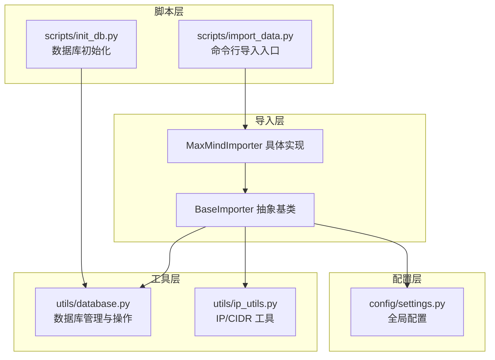
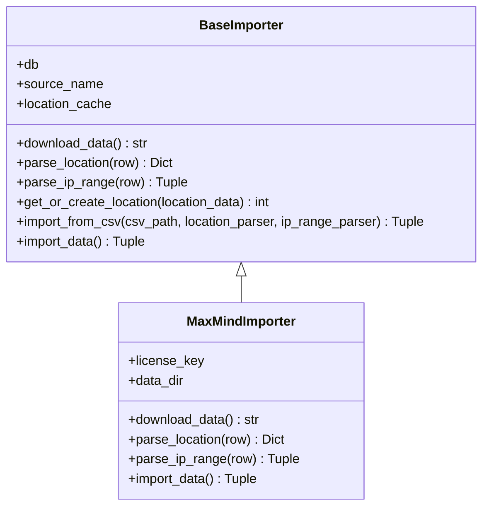
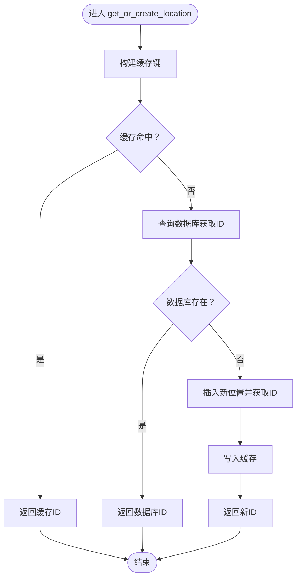
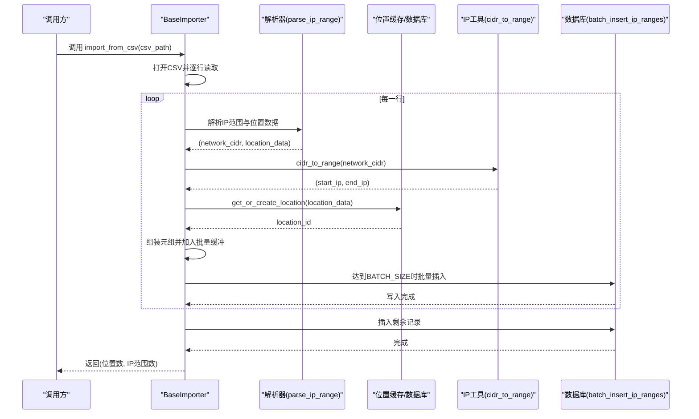
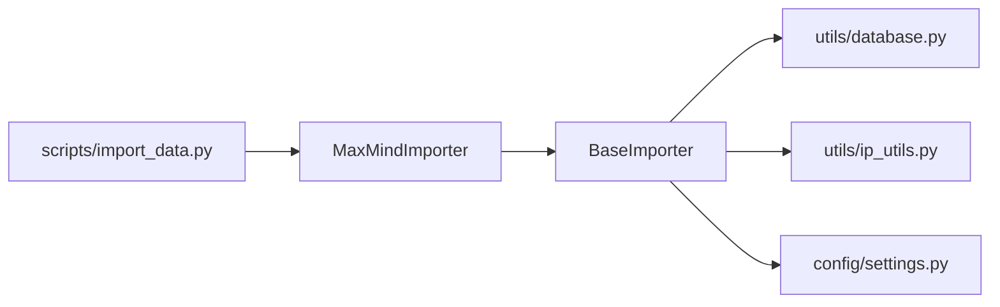

# BaseImporter核心组件

<cite>
**本文引用的文件**
- [importer/base_importer.py](file://importer/base_importer.py)
- [importer/maxmind_importer.py](file://importer/maxmind_importer.py)
- [utils/database.py](file://utils/database.py)
- [utils/ip_utils.py](file://utils/ip_utils.py)
- [config/settings.py](file://config/settings.py)
- [scripts/import_data.py](file://scripts/import_data.py)
- [scripts/init_db.py](file://scripts/init_db.py)
</cite>

## 目录
1. [简介](#简介)
2. [项目结构](#项目结构)
3. [核心组件](#核心组件)
4. [架构总览](#架构总览)
5. [详细组件分析](#详细组件分析)
6. [依赖分析](#依赖分析)
7. [性能考量](#性能考量)
8. [故障排查指南](#故障排查指南)
9. [结论](#结论)
10. [附录：自定义导入器示例与最佳实践](#附录自定义导入器示例与最佳实践)

## 简介
本文围绕 BaseImporter 抽象基类进行深入技术文档编写，重点阐述其设计理念、抽象接口定义、缓存机制、批量处理流程、错误处理与日志策略，并提供基于该基类扩展自定义导入器的完整示例与最佳实践。读者无需具备深厚的数据库背景即可理解并正确使用该组件。

## 项目结构
该项目采用“功能模块化+分层”的组织方式：
- importer：导入器抽象与具体实现（BaseImporter、MaxMindImporter）
- utils：通用工具（数据库操作、IP地址工具）
- config：全局配置（数据库路径、批处理大小、日志等）
- scripts：命令行入口与数据库初始化脚本
- validator：验证相关（与导入流程配合）

图表来源
- [importer/base_importer.py:15-168](file://importer/base_importer.py#L15-L168)
- [importer/maxmind_importer.py:19-274](file://importer/maxmind_importer.py#L19-L274)
- [utils/database.py:15-398](file://utils/database.py#L15-L398)
- [utils/ip_utils.py:51-68](file://utils/ip_utils.py#L51-L68)
- [config/settings.py:19](file://config/settings.py#L19)
- [scripts/import_data.py:26-41](file://scripts/import_data.py#L26-L41)
- [scripts/init_db.py:16-28](file://scripts/init_db.py#L16-L28)

章节来源
- [importer/base_importer.py:15-168](file://importer/base_importer.py#L15-L168)
- [importer/maxmind_importer.py:19-274](file://importer/maxmind_importer.py#L19-L274)
- [utils/database.py:15-398](file://utils/database.py#L15-L398)
- [utils/ip_utils.py:51-68](file://utils/ip_utils.py#L51-L68)
- [config/settings.py:19](file://config/settings.py#L19)
- [scripts/import_data.py:26-41](file://scripts/import_data.py#L26-L41)
- [scripts/init_db.py:16-28](file://scripts/init_db.py#L16-L28)

## 核心组件
- BaseImporter 抽象基类：定义导入器的统一接口与通用能力（下载、解析、缓存、批量导入、主流程）
- MaxMindImporter 具体实现：基于 BaseImporter 的具体数据源适配
- 数据库工具：封装 SQLite 连接、事务、批量插入、查询等
- IP 工具：CIDR 到 IP 范围转换等
- 配置：BATCH_SIZE 等关键参数
- 脚本：命令行入口与数据库初始化

章节来源
- [importer/base_importer.py:15-168](file://importer/base_importer.py#L15-L168)
- [importer/maxmind_importer.py:19-274](file://importer/maxmind_importer.py#L19-L274)
- [utils/database.py:15-398](file://utils/database.py#L15-L398)
- [utils/ip_utils.py:51-68](file://utils/ip_utils.py#L51-L68)
- [config/settings.py:19](file://config/settings.py#L19)
- [scripts/import_data.py:26-41](file://scripts/import_data.py#L26-L41)
- [scripts/init_db.py:16-28](file://scripts/init_db.py#L16-L28)

## 架构总览
BaseImporter 将“数据源无关”的导入流程与“数据源特定”的解析逻辑分离，通过抽象方法约束子类实现，从而保证可扩展性与一致性。

图表来源
- [importer/base_importer.py:15-168](file://importer/base_importer.py#L15-L168)
- [importer/maxmind_importer.py:19-274](file://importer/maxmind_importer.py#L19-L274)

## 详细组件分析

### BaseImporter 抽象基类设计与职责
- 统一构造：持有数据库管理器、数据源标识、位置缓存
- 抽象接口：
  - download_data：负责下载/定位数据文件并返回路径
  - parse_location：将原始行解析为位置数据字典
  - parse_ip_range：将原始行解析为 (network_cidr, location_data) 元组
- 通用能力：
  - get_or_create_location：基于多字段组合构建缓存键，避免重复查询/插入
  - import_from_csv：读取 CSV，逐行解析并批量写入 IP 范围
  - import_data：统一的主流程（先下载再导入）

章节来源
- [importer/base_importer.py:15-168](file://importer/base_importer.py#L15-L168)

### 抽象方法详解与实现要求

#### download_data
- 作用：下载或定位数据文件，返回文件路径
- 实现要求：
  - 处理网络异常、文件不存在等边界情况
  - 返回的路径应指向可被 CSV 解析器读取的文件
  - 在具体实现中需考虑超时、断点续传、解压等细节

章节来源
- [importer/base_importer.py:23-26](file://importer/base_importer.py#L23-L26)
- [importer/maxmind_importer.py:28-73](file://importer/maxmind_importer.py#L28-L73)

#### parse_location
- 作用：将原始 CSV 行解析为位置数据字典
- 输出字段建议包含：国家/地区/城市/区县、时区、语言、来源等
- 实现要求：字段映射清晰、缺失值处理稳健

章节来源
- [importer/base_importer.py:28-31](file://importer/base_importer.py#L28-L31)
- [importer/maxmind_importer.py:74-97](file://importer/maxmind_importer.py#L74-L97)

#### parse_ip_range
- 作用：将原始 CSV 行解析为 (network_cidr, location_data) 元组
- 输出要求：network_cidr 必须可被 cidr_to_range 正确转换
- 实现要求：确保 location_data 与 parse_location 输出一致

章节来源
- [importer/base_importer.py:33-39](file://importer/base_importer.py#L33-L39)
- [importer/maxmind_importer.py:99-129](file://importer/maxmind_importer.py#L99-L129)

### get_or_create_location 方法：缓存与数据库交互
- 设计目标：减少重复查询与插入，提升导入效率
- 缓存键构建：以国家代码、省/州代码、城市名、区/县构成元组作为键
- 交互流程：
  1) 若缓存命中，直接返回缓存的 location_id
  2) 否则查询数据库，若存在则返回；否则插入新记录并返回新 ID
  3) 将结果写入缓存，供后续复用
- 数据库查询与插入由工具函数完成，遵循唯一约束，避免重复

图表来源
- [importer/base_importer.py:41-80](file://importer/base_importer.py#L41-L80)
- [utils/database.py:233-307](file://utils/database.py#L233-L307)

章节来源
- [importer/base_importer.py:41-80](file://importer/base_importer.py#L41-L80)
- [utils/database.py:233-307](file://utils/database.py#L233-L307)

### import_from_csv 方法：批量处理与内存优化
- 流程概览：
  1) 使用 CSV DictReader 逐行读取
  2) 调用传入或默认的解析器生成 (network_cidr, location_data)
  3) 通过 get_or_create_location 获取/创建位置 ID
  4) 将 CIDR 转换为 IP 范围，组装成元组加入批量缓冲
  5) 达到 BATCH_SIZE 即批量插入，清空缓冲并记录进度
  6) 处理完剩余记录，返回统计结果
- 关键参数：
  - BATCH_SIZE：控制批量插入大小，平衡内存占用与吞吐
- 错误处理：捕获单行异常并记录日志，继续处理下一行

图表来源
- [importer/base_importer.py:82-154](file://importer/base_importer.py#L82-L154)
- [utils/ip_utils.py:51-68](file://utils/ip_utils.py#L51-L68)
- [utils/database.py:310-338](file://utils/database.py#L310-L338)
- [config/settings.py:19](file://config/settings.py#L19)

章节来源
- [importer/base_importer.py:82-154](file://importer/base_importer.py#L82-L154)
- [utils/ip_utils.py:51-68](file://utils/ip_utils.py#L51-L68)
- [utils/database.py:310-338](file://utils/database.py#L310-L338)
- [config/settings.py:19](file://config/settings.py#L19)

### location_cache 缓存系统：工作原理与性能优势
- 工作原理：
  - 以 (country_code, region_code, city_name, district) 为键
  - 首次查询数据库后写入缓存，后续同键直接命中
- 性能优势：
  - 显著降低重复查询次数，减少数据库往返
  - 在大量重复位置数据的场景下，整体导入速度大幅提升
- 注意事项：
  - 缓存键需与数据库唯一约束保持一致
  - 缓存仅在单次导入会话内有效，重启后失效

章节来源
- [importer/base_importer.py:21](file://importer/base_importer.py#L21)
- [importer/base_importer.py:51-80](file://importer/base_importer.py#L51-L80)
- [utils/database.py:96](file://utils/database.py#L96)

### 错误处理机制与日志记录策略
- 行级错误处理：在 import_from_csv 中捕获异常并记录日志，跳过错误行继续处理
- 数据源错误处理：download_data 与 import_data 中捕获网络/文件异常并抛出
- 日志级别：INFO 用于进度与统计，ERROR 用于异常
- 建议：在生产环境结合配置文件设置合适的日志输出位置与轮转策略

章节来源
- [importer/base_importer.py:144-146](file://importer/base_importer.py#L144-L146)
- [importer/maxmind_importer.py:70-72](file://importer/maxmind_importer.py#L70-L72)
- [scripts/import_data.py:19-22](file://scripts/import_data.py#L19-L22)

## 依赖分析
- BaseImporter 依赖：
  - utils.database：数据库管理、位置查询/插入、批量插入
  - utils.ip_utils：CIDR 转换为 IP 范围
  - config.settings：BATCH_SIZE 等配置
- MaxMindImporter 依赖 BaseImporter 并扩展下载与解析逻辑
- 脚本层通过命令行参数驱动导入流程

图表来源
- [importer/base_importer.py:8-10](file://importer/base_importer.py#L8-L10)
- [importer/maxmind_importer.py:11](file://importer/maxmind_importer.py#L11)
- [scripts/import_data.py:28](file://scripts/import_data.py#L28)

章节来源
- [importer/base_importer.py:8-10](file://importer/base_importer.py#L8-L10)
- [importer/maxmind_importer.py:11](file://importer/maxmind_importer.py#L11)
- [scripts/import_data.py:28](file://scripts/import_data.py#L28)

## 性能考量
- 批量插入：通过 BATCH_SIZE 控制每次写入的数据量，减少事务提交次数
- 位置缓存：避免重复查询/插入，显著降低数据库压力
- CIDR 转换：在内存中完成，避免多次 IO
- 索引优化：数据库层已建立必要索引，有利于查询与连接性能
- 建议：根据机器内存与磁盘 I/O 能力调整 BATCH_SIZE；在大规模导入前预热数据库连接

章节来源
- [config/settings.py:19](file://config/settings.py#L19)
- [utils/database.py:149-181](file://utils/database.py#L149-L181)
- [importer/base_importer.py:138-142](file://importer/base_importer.py#L138-L142)

## 故障排查指南
- 下载失败：检查网络连通性、超时设置、License Key 是否正确
- 文件路径错误：确认 download_data 返回的是可读文件路径
- 解析异常：检查 parse_ip_range 与 parse_location 的字段映射是否匹配
- 数据库异常：确认数据库初始化已完成，表结构与索引存在
- 导入卡顿：适当增大 BATCH_SIZE 或检查磁盘 I/O；关注日志中的错误行

章节来源
- [importer/maxmind_importer.py:35-36](file://importer/maxmind_importer.py#L35-L36)
- [importer/maxmind_importer.py:68](file://importer/maxmind_importer.py#L68)
- [utils/database.py:70-185](file://utils/database.py#L70-L185)
- [scripts/import_data.py:54-56](file://scripts/import_data.py#L54-L56)

## 结论
BaseImporter 通过抽象接口与通用流程，为不同数据源提供了统一且高效的导入框架。借助位置缓存与批量插入策略，能够在保证正确性的前提下显著提升导入性能。结合良好的错误处理与日志策略，该组件适合在生产环境中稳定运行。

## 附录：自定义导入器示例与最佳实践

### 自定义导入器步骤
1) 新建类继承 BaseImporter，并实现三个抽象方法：
   - download_data：返回 CSV 文件路径
   - parse_location：解析位置数据字典
   - parse_ip_range：解析 (network_cidr, location_data)
2) 如需特殊流程，可重写 import_data 或 import_from_csv
3) 在脚本中通过命令行参数或直接调用实例方法启动导入

参考实现路径
- [importer/base_importer.py:23-39](file://importer/base_importer.py#L23-L39)
- [importer/maxmind_importer.py:28-129](file://importer/maxmind_importer.py#L28-L129)

### 最佳实践
- 字段映射一致性：确保 parse_location 与 parse_ip_range 输出字段一致
- 异常隔离：每行独立 try-catch，避免单行错误影响整体导入
- 缓存键设计：与数据库唯一约束保持一致，避免误判
- 批量大小权衡：根据内存与磁盘 I/O 调整 BATCH_SIZE
- 日志规范：按 INFO/ERROR 分级记录，便于问题定位

章节来源
- [importer/base_importer.py:41-80](file://importer/base_importer.py#L41-L80)
- [importer/base_importer.py:82-154](file://importer/base_importer.py#L82-L154)
- [config/settings.py:19](file://config/settings.py#L19)
- [scripts/import_data.py:26-41](file://scripts/import_data.py#L26-L41)