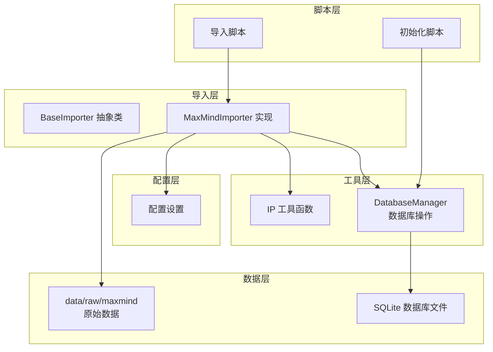
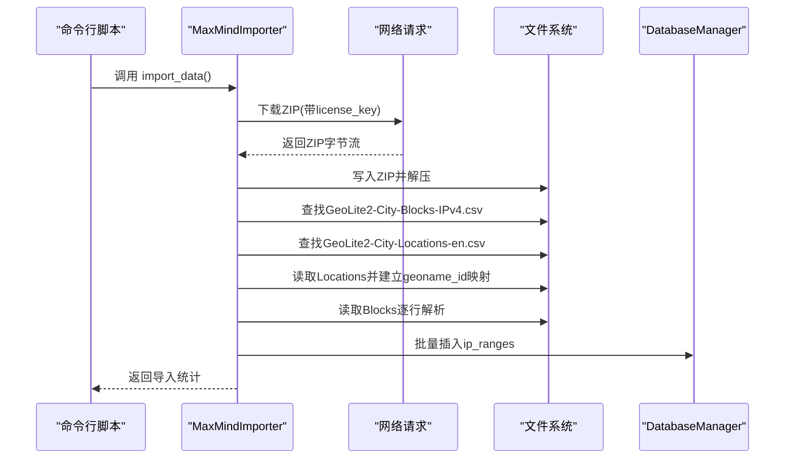
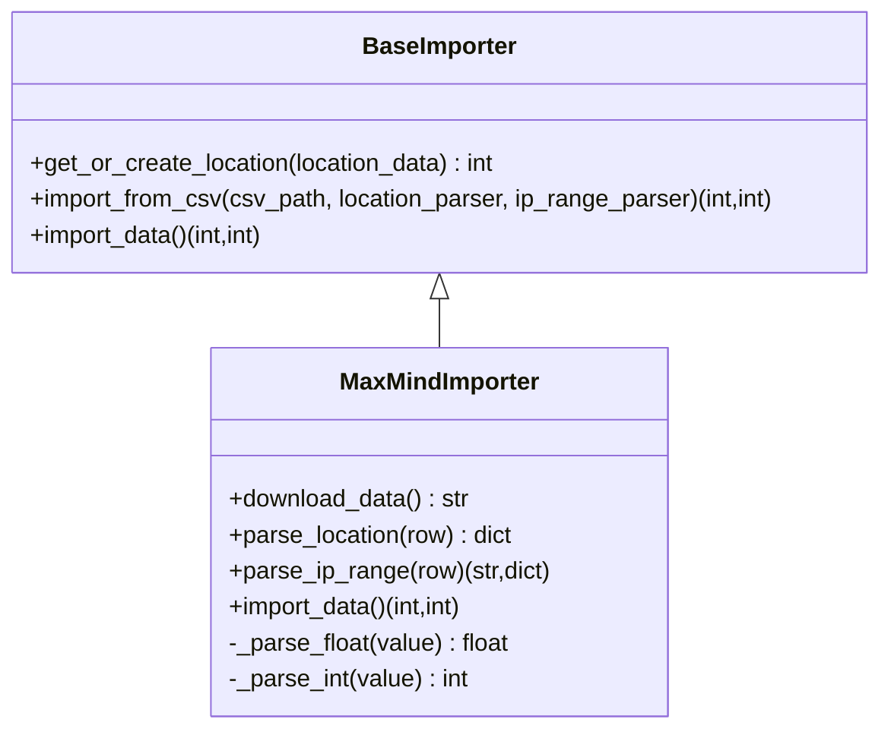
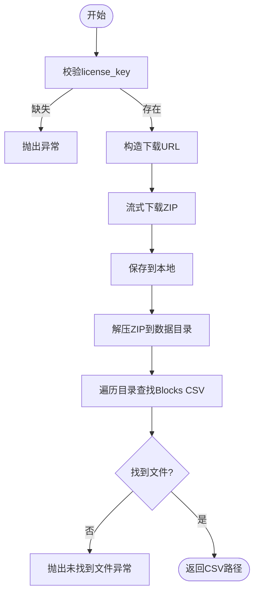
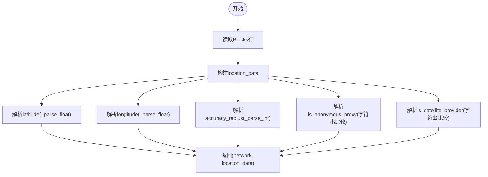
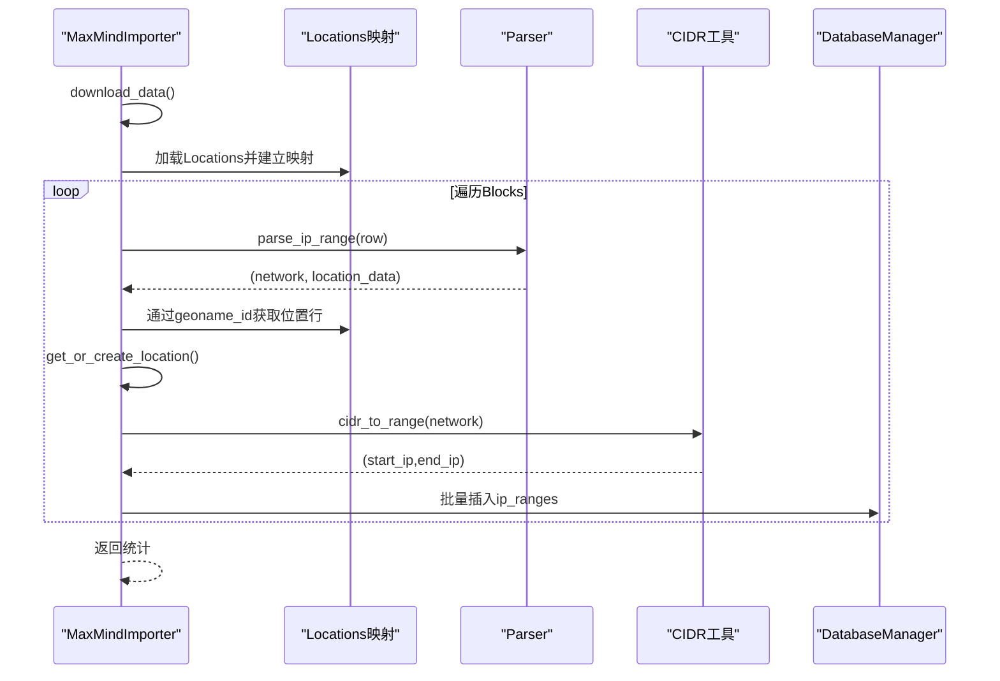
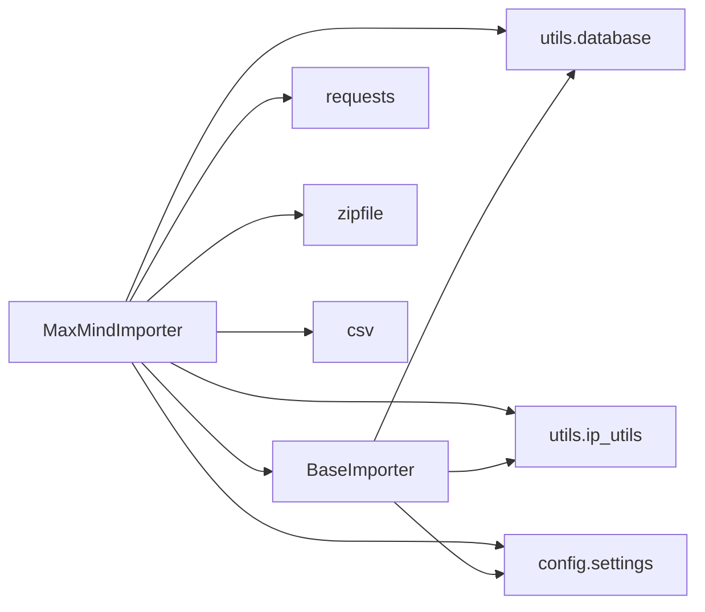

# MaxMindImporter实现

<cite>
**本文引用的文件**
- [importer/maxmind_importer.py](file://importer/maxmind_importer.py)
- [importer/base_importer.py](file://importer/base_importer.py)
- [utils/database.py](file://utils/database.py)
- [utils/ip_utils.py](file://utils/ip_utils.py)
- [config/settings.py](file://config/settings.py)
- [scripts/import_data.py](file://scripts/import_data.py)
- [scripts/init_db.py](file://scripts/init_db.py)
- [utils/database.py](file://utils/database.py)
</cite>

## 目录
1. [简介](#简介)
2. [项目结构](#项目结构)
3. [核心组件](#核心组件)
4. [架构总览](#架构总览)
5. [详细组件分析](#详细组件分析)
6. [依赖关系分析](#依赖关系分析)
7. [性能考虑](#性能考虑)
8. [故障排查指南](#故障排查指南)
9. [结论](#结论)
10. [附录](#附录)

## 简介
本文件针对 MaxMindImporter 具体实现类进行全面技术文档说明，重点涵盖：
- MaxMind 数据源与 GeoLite2 数据格式要求（CSV 字段与结构）
- download_data 方法的下载与解压流程
- parse_location 与 parse_ip_range 的字段映射、数据转换与验证逻辑
- MaxMind 特有字段（如 accuracy_radius、is_anonymous_proxy、is_satellite_provider）的处理方式
- 完整使用示例（初始化、数据导入、错误处理）
- 性能优化建议与常见问题解决方案

## 项目结构
该项目采用模块化设计，围绕“导入器”“数据库”“工具函数”“配置”“脚本入口”等层次组织：
- importer：导入器抽象与具体实现（MaxMindImporter 继承自 BaseImporter）
- utils：数据库操作、IP 工具函数
- config：全局配置（数据库路径、MaxMind 下载参数、批处理大小等）
- scripts：命令行导入与数据库初始化脚本
- data/raw/maxmind：下载与解压后的原始数据存放目录

图表来源
- [importer/base_importer.py:15-168](file://importer/base_importer.py#L15-L168)
- [importer/maxmind_importer.py:19-274](file://importer/maxmind_importer.py#L19-L274)
- [utils/database.py:15-398](file://utils/database.py#L15-L398)
- [utils/ip_utils.py:51-68](file://utils/ip_utils.py#L51-L68)
- [config/settings.py:10-20](file://config/settings.py#L10-L20)
- [scripts/import_data.py:26-41](file://scripts/import_data.py#L26-L41)
- [scripts/init_db.py:16-28](file://scripts/init_db.py#L16-L28)

章节来源
- [importer/maxmind_importer.py:1-274](file://importer/maxmind_importer.py#L1-L274)
- [importer/base_importer.py:1-168](file://importer/base_importer.py#L1-L168)
- [utils/database.py:1-398](file://utils/database.py#L1-L398)
- [utils/ip_utils.py:1-282](file://utils/ip_utils.py#L1-L282)
- [config/settings.py:1-44](file://config/settings.py#L1-L44)
- [scripts/import_data.py:1-65](file://scripts/import_data.py#L1-L65)
- [scripts/init_db.py:1-38](file://scripts/init_db.py#L1-L38)

## 核心组件
- MaxMindImporter：继承 BaseImporter，负责下载 MaxMind GeoLite2 CSV 文件、解析位置与 IP 范围、批量写入数据库。
- BaseImporter：定义导入器接口与通用能力（位置缓存、批量导入、通用 CSV 导入流程）。
- DatabaseManager：封装 SQLite 连接、事务、批量插入、查询等数据库操作。
- IP 工具函数：提供 CIDR 到 IP 范围转换、IP 校验、二进制转换等。
- 配置设置：包含数据库路径、MaxMind 下载参数、批处理大小等。
- 脚本入口：提供命令行导入与数据库初始化功能。

章节来源
- [importer/maxmind_importer.py:19-274](file://importer/maxmind_importer.py#L19-L274)
- [importer/base_importer.py:15-168](file://importer/base_importer.py#L15-L168)
- [utils/database.py:15-398](file://utils/database.py#L15-L398)
- [utils/ip_utils.py:51-68](file://utils/ip_utils.py#L51-L68)
- [config/settings.py:10-20](file://config/settings.py#L10-L20)
- [scripts/import_data.py:26-41](file://scripts/import_data.py#L26-L41)

## 架构总览
MaxMindImporter 的工作流分为三个阶段：
1) 下载与解压：根据配置拼接下载 URL，下载 ZIP 并解压，定位 Blocks 与 Locations CSV。
2) 位置数据预加载：读取 Locations CSV，按 geoname_id 建立内存映射，用于后续 Blocks 关联。
3) IP 范围导入：逐行读取 Blocks CSV，解析网络、经纬度、精度半径、匿名代理标记、卫星提供商标记等，批量写入数据库。

图表来源
- [importer/maxmind_importer.py:28-73](file://importer/maxmind_importer.py#L28-L73)
- [importer/maxmind_importer.py:145-258](file://importer/maxmind_importer.py#L145-L258)
- [utils/database.py:310-338](file://utils/database.py#L310-L338)
- [config/settings.py:14-16](file://config/settings.py#L14-L16)

## 详细组件分析

### MaxMindImporter 类
- 继承关系：MaxMindImporter 继承自 BaseImporter，复用其位置缓存与批量导入能力。
- 关键职责：
  - download_data：下载 ZIP 并解压，定位 Blocks CSV。
  - parse_location：解析 Locations 行为位置数据。
  - parse_ip_range：解析 Blocks 行为 IP 范围数据，并提取 MaxMind 特有字段。
  - import_data：协调下载、预加载位置、批量导入 IP 范围。
  - 辅助解析：_parse_float、_parse_int 提供安全数值转换。

图表来源
- [importer/base_importer.py:15-168](file://importer/base_importer.py#L15-L168)
- [importer/maxmind_importer.py:19-144](file://importer/maxmind_importer.py#L19-L144)

章节来源
- [importer/maxmind_importer.py:19-144](file://importer/maxmind_importer.py#L19-L144)

#### download_data 方法实现
- 输入校验：必须提供 license_key，否则抛出异常。
- URL 构造：基于配置中的下载地址、Edition 与 license_key 拼接下载链接。
- 流式下载：使用 requests 流式下载，支持超时控制。
- ZIP 解压：使用标准库 zipfile 解压到 data/raw/maxmind 目录。
- 文件定位：遍历解压目录查找 Blocks CSV 文件路径。
- 异常处理：捕获并记录错误，向上抛出。

图表来源
- [importer/maxmind_importer.py:28-73](file://importer/maxmind_importer.py#L28-L73)
- [config/settings.py:14-16](file://config/settings.py#L14-L16)

章节来源
- [importer/maxmind_importer.py:28-73](file://importer/maxmind_importer.py#L28-L73)
- [config/settings.py:14-16](file://config/settings.py#L14-L16)

#### parse_location 方法实现
- 输入：CSV 行字典（来自 Locations 文件）。
- 输出：标准化位置数据字典，包含国家、地区、城市、区县、时区、语言等字段。
- 注意：Postal code 在 Locations 文件中不可用，因此保留空值；经纬度在 Locations 中不可用，因此保留 None。

章节来源
- [importer/maxmind_importer.py:74-97](file://importer/maxmind_importer.py#L74-L97)

#### parse_ip_range 方法实现
- 输入：CSV 行字典（来自 Blocks 文件）。
- 输出：返回 (network_cidr, location_data) 元组。
- 字段映射与转换：
  - country/region/city/district/postal_code：从行中直接映射。
  - latitude/longitude：调用 _parse_float 安全转换。
  - timezone：从行中映射。
  - accuracy_radius：调用 _parse_int 安全转换。
  - is_anonymous_proxy/is_satellite_provider：字符串比较转布尔。
  - locale_code：固定为 "en"。
  - source：使用导入器源名。

图表来源
- [importer/maxmind_importer.py:99-129](file://importer/maxmind_importer.py#L99-L129)
- [importer/maxmind_importer.py:131-143](file://importer/maxmind_importer.py#L131-L143)

章节来源
- [importer/maxmind_importer.py:99-129](file://importer/maxmind_importer.py#L99-L129)
- [importer/maxmind_importer.py:131-143](file://importer/maxmind_importer.py#L131-L143)

#### import_data 方法实现
- 步骤：
  1) 调用 download_data 获取 Blocks CSV 路径。
  2) 遍历目录查找 Locations CSV。
  3) 读取 Locations CSV，建立 geoname_id -> 行 的映射。
  4) 读取 Blocks CSV，逐行解析：
     - 获取 network 字段。
     - 通过 geoname_id 或 registered_country_geoname_id 获取位置行。
     - 构建 location_data（优先使用 Locations 的时区与国家信息，Blocks 中的邮政编码与坐标）。
     - 调用 get_or_create_location 获取或创建位置 ID。
     - 使用 utils.ip_utils.cidr_to_range 将 CIDR 转换为整型起止 IP。
     - 组装 ip_range_tuple 并加入批量队列。
     - 达到 BATCH_SIZE 后批量插入。
  5) 处理剩余记录并输出统计。

图表来源
- [importer/maxmind_importer.py:145-258](file://importer/maxmind_importer.py#L145-L258)
- [utils/ip_utils.py:51-68](file://utils/ip_utils.py#L51-L68)
- [utils/database.py:310-338](file://utils/database.py#L310-L338)

章节来源
- [importer/maxmind_importer.py:145-258](file://importer/maxmind_importer.py#L145-L258)
- [utils/ip_utils.py:51-68](file://utils/ip_utils.py#L51-L68)
- [utils/database.py:310-338](file://utils/database.py#L310-L338)

#### BaseImporter 通用能力
- get_or_create_location：基于国家/地区/城市/区县构建缓存键，避免重复查询与插入。
- import_from_csv：通用 CSV 导入流程，支持自定义解析器。
- import_data：统一的下载+导入流程（由子类实现 download_data）。

章节来源
- [importer/base_importer.py:41-168](file://importer/base_importer.py#L41-L168)

### 数据模型与字段说明
- locations 表：存储国家、地区、城市、区县、邮政编码、经纬度、时区、语言、来源等。
- ip_ranges 表：存储网络、起止 IP 整数、位置 ID、来源、精度半径、匿名代理标记、卫星提供商标记。
- MaxMind 特有字段处理：
  - accuracy_radius：解析为整数，用于查询时排序优先级。
  - is_anonymous_proxy：字符串 "1" 视为 True，其他视为 False。
  - is_satellite_provider：字符串 "1" 视为 True，其他视为 False。

章节来源
- [utils/database.py:80-115](file://utils/database.py#L80-L115)
- [importer/maxmind_importer.py:119-126](file://importer/maxmind_importer.py#L119-L126)

## 依赖关系分析
- MaxMindImporter 依赖：
  - BaseImporter：继承其通用导入能力。
  - requests：下载 ZIP。
  - zipfile：解压 ZIP。
  - csv：解析 CSV。
  - utils.database：批量插入、位置查询/插入。
  - utils.ip_utils：CIDR 转换。
  - config.settings：下载 URL、Edition、License Key、批处理大小等。
- BaseImporter 依赖：
  - utils.database：位置查询/插入、批量插入。
  - utils.ip_utils：CIDR 转换。
  - config.settings：批处理大小。

图表来源
- [importer/maxmind_importer.py:4-14](file://importer/maxmind_importer.py#L4-L14)
- [importer/base_importer.py:8-10](file://importer/base_importer.py#L8-L10)
- [config/settings.py:14-16](file://config/settings.py#L14-L16)

章节来源
- [importer/maxmind_importer.py:4-14](file://importer/maxmind_importer.py#L4-L14)
- [importer/base_importer.py:8-10](file://importer/base_importer.py#L8-L10)
- [config/settings.py:14-16](file://config/settings.py#L14-L16)

## 性能考虑
- 批量插入：使用批量插入函数，减少事务开销；默认批量大小可配置。
- 位置缓存：BaseImporter 内置位置缓存，避免重复查询/插入。
- 内存优化：Locations 文件一次性加载到内存映射，降低磁盘 IO。
- 网络下载：流式下载，避免一次性占用大量内存。
- 索引策略：数据库已创建必要索引，提升查询与插入性能。

章节来源
- [config/settings.py:19-20](file://config/settings.py#L19-L20)
- [importer/base_importer.py:21-80](file://importer/base_importer.py#L21-L80)
- [utils/database.py:149-181](file://utils/database.py#L149-L181)

## 故障排查指南
- 下载失败：
  - 检查 license_key 是否正确设置。
  - 确认网络可达与超时设置合理。
  - 查看日志输出定位具体异常。
- 未找到 CSV 文件：
  - 确认 ZIP 解压目录存在且包含目标文件。
  - 检查 Edition 名称与文件命名是否匹配。
- 数值解析异常：
  - _parse_float/_parse_int 对空值或非法字符串返回 None，确保上游逻辑兼容 None。
- 导入中断：
  - 分批导入会持续记录进度，可重新运行脚本继续导入。
- 数据库初始化：
  - 使用初始化脚本创建表与索引，确保数据库文件存在。

章节来源
- [importer/maxmind_importer.py:35-36](file://importer/maxmind_importer.py#L35-L36)
- [importer/maxmind_importer.py:60-68](file://importer/maxmind_importer.py#L60-L68)
- [importer/maxmind_importer.py:131-143](file://importer/maxmind_importer.py#L131-L143)
- [scripts/import_data.py:54-56](file://scripts/import_data.py#L54-L56)
- [scripts/init_db.py:16-28](file://scripts/init_db.py#L16-L28)

## 结论
MaxMindImporter 通过清晰的职责划分与稳健的数据处理流程，实现了对 MaxMind GeoLite2 CSV 数据的高效导入。其关键优势包括：
- 明确的字段映射与类型转换，特别是对 MaxMind 特有字段的安全处理。
- 基于 BaseImporter 的可扩展性与通用能力复用。
- 批量导入与位置缓存优化，显著提升导入性能。
- 完整的错误处理与日志记录，便于运维与排障。

## 附录

### 使用示例
- 初始化数据库：
  - 使用脚本初始化数据库与表结构。
- 导入数据：
  - 方式一：提供 license_key，自动下载并导入。
  - 方式二：提供本地 CSV 路径，直接导入。
- 错误处理：
  - 脚本会记录详细日志，遇到异常会继续处理下一行，保证整体导入稳定性。

章节来源
- [scripts/init_db.py:16-28](file://scripts/init_db.py#L16-L28)
- [scripts/import_data.py:26-41](file://scripts/import_data.py#L26-L41)
- [scripts/import_data.py:44-61](file://scripts/import_data.py#L44-L61)