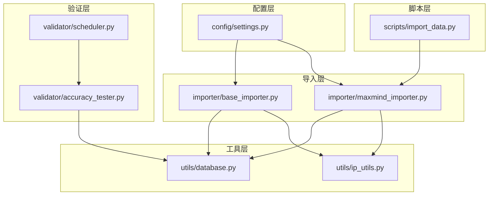
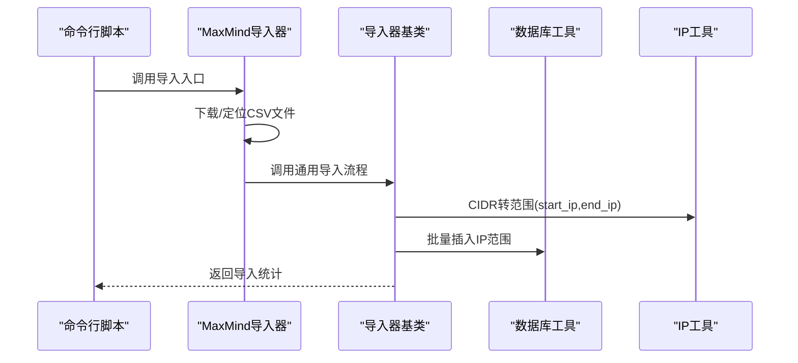
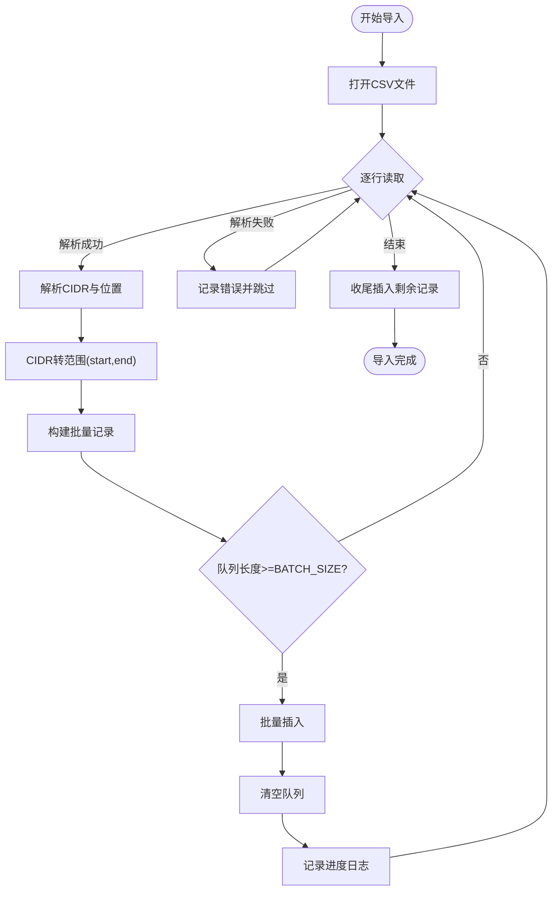
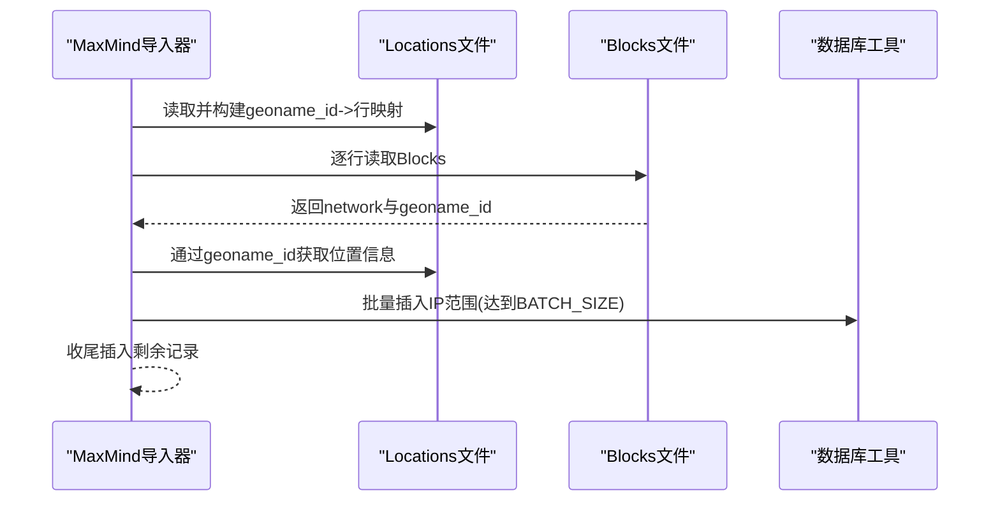
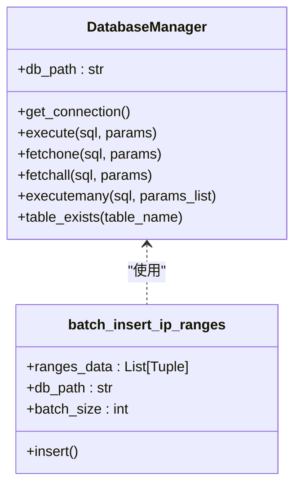
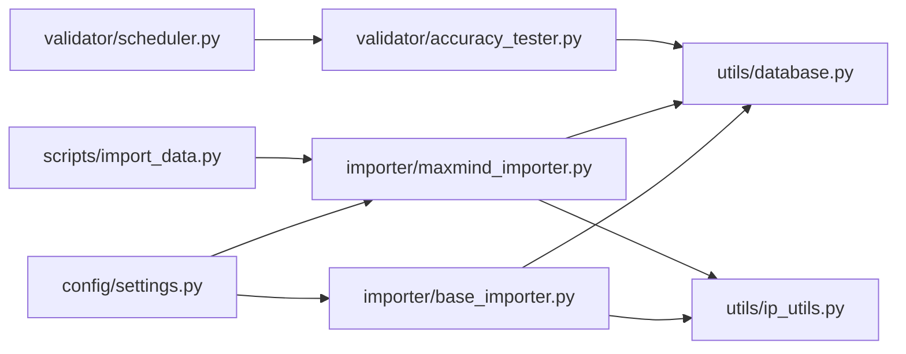

# 批量处理机制

<cite>
**本文引用的文件**
- [importer/base_importer.py](file://importer/base_importer.py)
- [importer/maxmind_importer.py](file://importer/maxmind_importer.py)
- [utils/database.py](file://utils/database.py)
- [utils/ip_utils.py](file://utils/ip_utils.py)
- [config/settings.py](file://config/settings.py)
- [scripts/import_data.py](file://scripts/import_data.py)
- [validator/accuracy_tester.py](file://validator/accuracy_tester.py)
- [validator/scheduler.py](file://validator/scheduler.py)
</cite>

## 目录
1. [简介](#简介)
2. [项目结构](#项目结构)
3. [核心组件](#核心组件)
4. [架构总览](#架构总览)
5. [详细组件分析](#详细组件分析)
6. [依赖分析](#依赖分析)
7. [性能考量](#性能考量)
8. [故障排查指南](#故障排查指南)
9. [结论](#结论)
10. [附录](#附录)

## 简介
本文聚焦于数据导入系统的批量处理机制，围绕以下目标展开：
- 明确并解释 BATCH_SIZE 与 IMPORT_CHUNK_SIZE 的作用与配置方式
- 深入分析批量导入工作流：内存管理、事务处理、错误恢复
- 评估批量处理对性能的影响，并给出优化策略
- 提供大数据集导入的最佳实践：进度跟踪、内存监控、资源管理
- 给出不同规模数据集的处理建议与性能调优指南
- 说明异常处理与数据一致性保障机制

## 项目结构
该系统采用“配置-导入-数据库-工具-验证”的分层组织：
- 配置层：集中定义数据库路径、批处理参数、服务端口等
- 导入层：抽象基类与具体实现负责数据下载、解析、批量写入
- 工具层：数据库连接管理、IP地址转换、CIDR转范围等
- 脚本层：命令行入口，支持初始化数据库与直接导入
- 验证层：准确性测试与调度，确保导入后的数据质量

图表来源
- [config/settings.py:18-20](file://config/settings.py#L18-L20)
- [importer/base_importer.py:10](file://importer/base_importer.py#L10)
- [importer/maxmind_importer.py:12-14](file://importer/maxmind_importer.py#L12-L14)
- [utils/database.py:15-62](file://utils/database.py#L15-L62)
- [utils/ip_utils.py:51-68](file://utils/ip_utils.py#L51-L68)
- [scripts/import_data.py:26-41](file://scripts/import_data.py#L26-L41)
- [validator/accuracy_tester.py:17-22](file://validator/accuracy_tester.py#L17-L22)
- [validator/scheduler.py:17-34](file://validator/scheduler.py#L17-L34)

章节来源
- [config/settings.py:1-44](file://config/settings.py#L1-L44)
- [importer/base_importer.py:1-168](file://importer/base_importer.py#L1-L168)
- [importer/maxmind_importer.py:1-274](file://importer/maxmind_importer.py#L1-L274)
- [utils/database.py:1-398](file://utils/database.py#L1-L398)
- [utils/ip_utils.py:1-282](file://utils/ip_utils.py#L1-L282)
- [scripts/import_data.py:1-65](file://scripts/import_data.py#L1-L65)
- [validator/accuracy_tester.py:1-373](file://validator/accuracy_tester.py#L1-L373)
- [validator/scheduler.py:45-81](file://validator/scheduler.py#L45-L81)

## 核心组件
- 批处理参数
  - BATCH_SIZE：控制导入过程中IP范围记录的批量插入大小，默认值在配置文件中定义
  - IMPORT_CHUNK_SIZE：当前代码中未被直接使用，但可作为更大体量数据的分块策略参考
- 导入器基类
  - 提供通用的CSV导入流程、位置缓存、CIDR转范围、批量插入触发逻辑
- MaxMind导入器
  - 实现具体的数据下载、位置与IP范围解析、两阶段导入（Locations+Blocks）
- 数据库工具
  - 数据库连接管理（自动提交/回滚）、批量插入、表初始化与索引
- IP工具
  - CIDR转范围、IP整数互转、有效性校验等

章节来源
- [config/settings.py:18-20](file://config/settings.py#L18-L20)
- [importer/base_importer.py:82-154](file://importer/base_importer.py#L82-L154)
- [importer/maxmind_importer.py:145-258](file://importer/maxmind_importer.py#L145-L258)
- [utils/database.py:15-62](file://utils/database.py#L15-L62)
- [utils/ip_utils.py:51-68](file://utils/ip_utils.py#L51-L68)

## 架构总览
批量导入的整体流程如下：
- 初始化数据库与索引
- 下载/定位数据源（CSV）
- 逐行解析：提取CIDR与位置信息，计算IP范围边界
- 构造批量插入队列，达到阈值触发批量写入
- 剩余记录收尾写入
- 导入完成后进行进度日志与统计

图表来源
- [scripts/import_data.py:26-41](file://scripts/import_data.py#L26-L41)
- [importer/maxmind_importer.py:145-258](file://importer/maxmind_importer.py#L145-L258)
- [importer/base_importer.py:82-154](file://importer/base_importer.py#L82-L154)
- [utils/database.py:310-338](file://utils/database.py#L310-L338)
- [utils/ip_utils.py:51-68](file://utils/ip_utils.py#L51-L68)

## 详细组件分析

### 批处理参数与配置
- BATCH_SIZE
  - 定义：在配置文件中设置默认批量大小
  - 用途：控制每次批量插入的记录数，平衡内存占用与IO吞吐
  - 影响：过大可能导致内存峰值升高；过小导致频繁IO与事务开销增加
- IMPORT_CHUNK_SIZE
  - 定义：在配置文件中设置导入分块大小
  - 用途：作为更大体量数据的分块策略参考，可在上层流程中按块读取与处理
  - 影响：与BATCH_SIZE配合，决定整体导入的内存与并发节奏

章节来源
- [config/settings.py:18-20](file://config/settings.py#L18-L20)

### 导入器基类（BaseImporter）
- 关键职责
  - 位置缓存：避免重复查询相同位置，减少数据库往返
  - CSV逐行解析：抽取CIDR与位置字段，转换为IP范围边界
  - 批量插入触发：当队列长度达到BATCH_SIZE即触发批量写入
  - 剩余记录收尾：循环结束后一次性写入剩余记录
- 异常处理
  - 单行异常捕获并记录，不影响整体导入流程
- 性能要点
  - 位置缓存降低重复查询
  - 批量插入减少事务次数
  - CIDR转范围在内存中完成，避免多次外部调用

图表来源
- [importer/base_importer.py:82-154](file://importer/base_importer.py#L82-L154)
- [utils/ip_utils.py:51-68](file://utils/ip_utils.py#L51-L68)
- [utils/database.py:310-338](file://utils/database.py#L310-L338)

章节来源
- [importer/base_importer.py:15-168](file://importer/base_importer.py#L15-L168)
- [utils/ip_utils.py:51-68](file://utils/ip_utils.py#L51-L68)
- [utils/database.py:310-338](file://utils/database.py#L310-L338)

### MaxMind导入器（MaxMindImporter）
- 特殊流程
  - 同时处理Blocks与Locations两个文件
  - 先加载Locations到内存映射，再扫描Blocks并关联位置信息
  - 保持与基类一致的批量插入策略
- 位置解析
  - 从Blocks行中提取位置字段，必要时回填Locations映射
- 批量插入
  - 达到BATCH_SIZE触发批量写入，并周期性输出进度日志

图表来源
- [importer/maxmind_importer.py:145-258](file://importer/maxmind_importer.py#L145-L258)
- [utils/database.py:310-338](file://utils/database.py#L310-L338)

章节来源
- [importer/maxmind_importer.py:19-274](file://importer/maxmind_importer.py#L19-L274)

### 数据库工具（DatabaseManager与批量插入）
- 连接管理
  - 使用上下文管理器确保连接正确关闭
  - 事务：正常退出提交，异常抛出回滚
- 批量插入
  - 支持分片批量插入，便于进度反馈
  - 通过executemany高效写入

图表来源
- [utils/database.py:15-62](file://utils/database.py#L15-L62)
- [utils/database.py:310-338](file://utils/database.py#L310-L338)

章节来源
- [utils/database.py:15-62](file://utils/database.py#L15-L62)
- [utils/database.py:310-338](file://utils/database.py#L310-L338)

### IP工具（CIDR转范围）
- 功能
  - 将CIDR网络转换为起止IP整数范围
  - 失败时抛出异常，便于上层捕获与记录
- 与批量导入的关系
  - 在内存中完成转换，避免外部依赖，提升吞吐

章节来源
- [utils/ip_utils.py:51-68](file://utils/ip_utils.py#L51-L68)

### 命令行入口（scripts/import_data.py）
- 功能
  - 初始化数据库
  - 支持直接导入本地CSV或下载后导入
- 与批量处理的关系
  - 作为批量导入的入口，调用导入器并打印统计结果

章节来源
- [scripts/import_data.py:26-41](file://scripts/import_data.py#L26-L41)

### 验证与调度（AccuracyTester与Scheduler）
- 验证
  - 从导入的IP范围中随机采样，生成测试IP并跨节点验证
  - 将结果持久化至验证表，并更新汇总统计
- 调度
  - 按设定间隔执行批量验证任务，记录下次运行时间

章节来源
- [validator/accuracy_tester.py:182-254](file://validator/accuracy_tester.py#L182-L254)
- [validator/scheduler.py:45-81](file://validator/scheduler.py#L45-L81)

## 依赖分析
- 配置依赖
  - BATCH_SIZE与IMPORT_CHUNK_SIZE由配置文件统一提供
- 导入器依赖
  - 基类依赖IP工具与数据库工具
  - MaxMind导入器额外依赖配置中的下载参数
- 数据库依赖
  - 导入器与验证器均依赖数据库工具提供的连接与批量能力
- 脚本依赖
  - 命令行脚本依赖导入器与数据库初始化

图表来源
- [config/settings.py:18-20](file://config/settings.py#L18-L20)
- [importer/base_importer.py:8-10](file://importer/base_importer.py#L8-L10)
- [importer/maxmind_importer.py:12-14](file://importer/maxmind_importer.py#L12-L14)
- [utils/database.py:15-62](file://utils/database.py#L15-L62)
- [utils/ip_utils.py:51-68](file://utils/ip_utils.py#L51-L68)
- [scripts/import_data.py:26-41](file://scripts/import_data.py#L26-L41)
- [validator/accuracy_tester.py:17-22](file://validator/accuracy_tester.py#L17-L22)
- [validator/scheduler.py:17-34](file://validator/scheduler.py#L17-L34)

## 性能考量
- 批量大小（BATCH_SIZE）
  - 建议根据机器内存与磁盘IO能力调整：内存充足且磁盘写入快时可适当增大
  - 过大可能引发内存峰值过高，过小会增加事务与锁竞争
- 内存管理
  - 基类位置缓存避免重复查询，减少数据库往返
  - MaxMind导入器先加载Locations到内存映射，降低后续查找成本
- 事务与一致性
  - 数据库连接管理器在异常时自动回滚，保证数据一致性
  - 批量插入采用executemany，减少事务提交次数
- 进度与可观测性
  - 导入过程中定期输出进度日志，便于监控与调试
- 并发与I/O
  - 导入器本身为单线程顺序处理，适合稳定可控的环境
  - 若需更高吞吐，可在上层引入多进程/多线程分块读取与写入

章节来源
- [importer/base_importer.py:21-21](file://importer/base_importer.py#L21-L21)
- [importer/maxmind_importer.py:165-175](file://importer/maxmind_importer.py#L165-L175)
- [utils/database.py:21-33](file://utils/database.py#L21-L33)
- [utils/database.py:310-338](file://utils/database.py#L310-L338)

## 故障排查指南
- 常见问题与处理
  - 下载失败：检查许可证密钥与网络连通性
  - 解析异常：单行异常被捕获并记录，不影响整体导入
  - 数据库异常：连接管理器自动回滚，检查数据库路径与权限
  - CIDR无效：IP工具抛出异常，需修正数据源
- 数据一致性
  - 事务回滚确保异常不破坏现有数据
  - 位置唯一约束避免重复插入
- 进度与日志
  - 导入器与验证器均输出详细日志，便于定位问题

章节来源
- [importer/maxmind_importer.py:45-72](file://importer/maxmind_importer.py#L45-L72)
- [importer/base_importer.py:144-146](file://importer/base_importer.py#L144-L146)
- [utils/database.py:21-33](file://utils/database.py#L21-L33)
- [utils/ip_utils.py:61-67](file://utils/ip_utils.py#L61-L67)
- [validator/accuracy_tester.py:244-246](file://validator/accuracy_tester.py#L244-L246)

## 结论
- BATCH_SIZE与IMPORT_CHUNK_SIZE分别控制“写入粒度”和“读取粒度”，二者协同决定导入的内存与吞吐表现
- 基类与MaxMind导入器提供了清晰的批量导入框架：位置缓存、CIDR转换、批量写入、异常容错
- 数据库工具通过上下文管理器与executemany保障事务一致性与性能
- 验证与调度模块确保导入后数据质量的持续监控
- 建议结合实际硬件条件与数据特征，动态调整BATCH_SIZE以获得最佳性能

## 附录

### 不同规模数据集的处理建议
- 小规模（百万级）
  - BATCH_SIZE建议：8000~12000
  - 注意：优先保证稳定性，避免过大批次导致内存压力
- 中规模（千万级）
  - BATCH_SIZE建议：10000~20000
  - 可考虑分块读取（IMPORT_CHUNK_SIZE）以控制内存峰值
- 大规模（亿级）
  - BATCH_SIZE建议：20000~50000
  - 引入分块策略与多进程/多线程分治，结合磁盘IO优化

### 性能调优清单
- 调整BATCH_SIZE：从默认值开始，逐步增减观察内存与吞吐变化
- 启用索引：数据库初始化已创建必要索引，确保查询与写入效率
- 控制日志级别：生产环境可降低日志频率以减少I/O
- 磁盘与网络：确保数据库文件所在磁盘具备良好写入性能，网络下载时关注带宽与超时