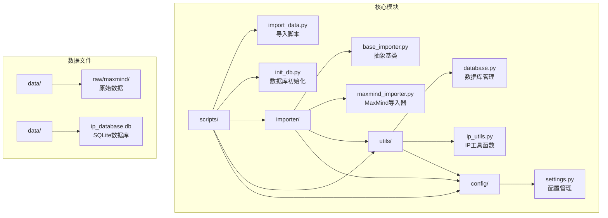
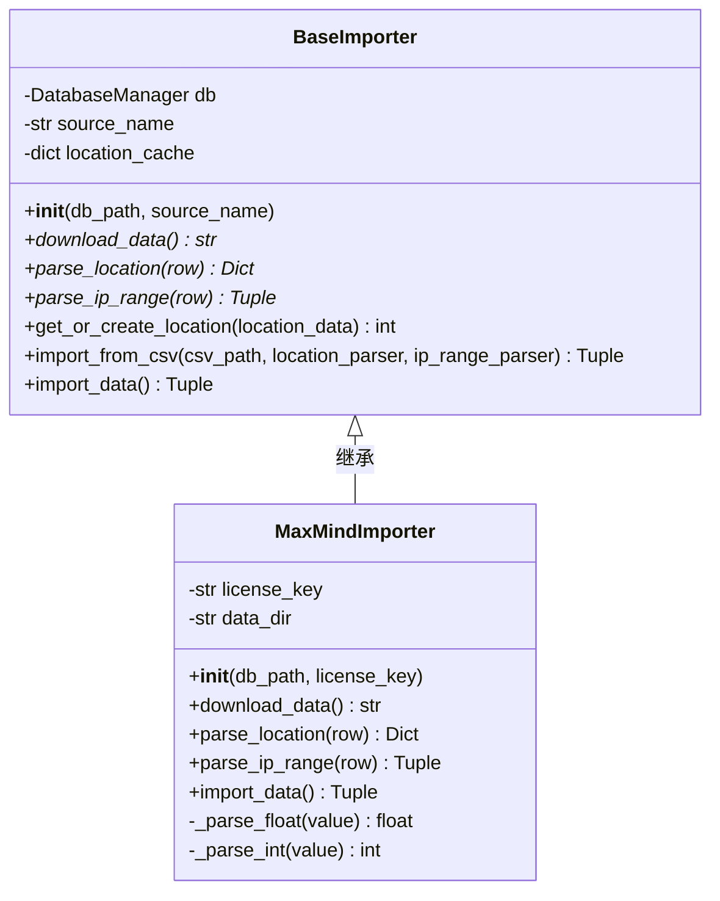
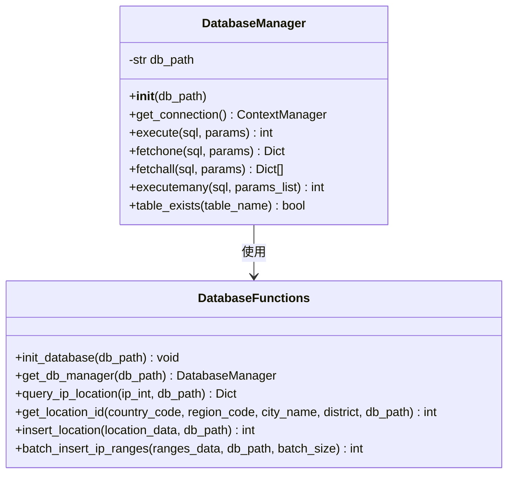
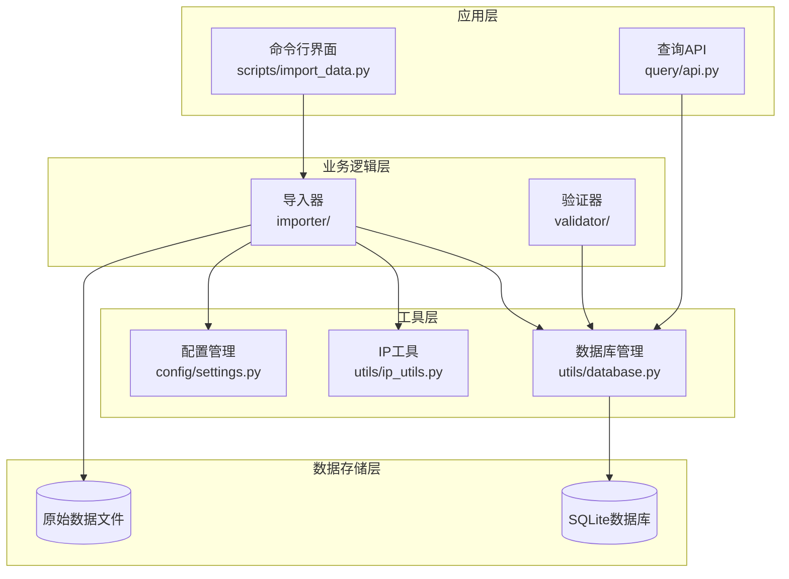
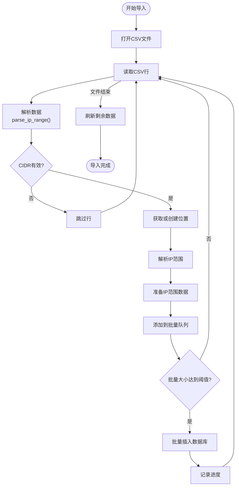
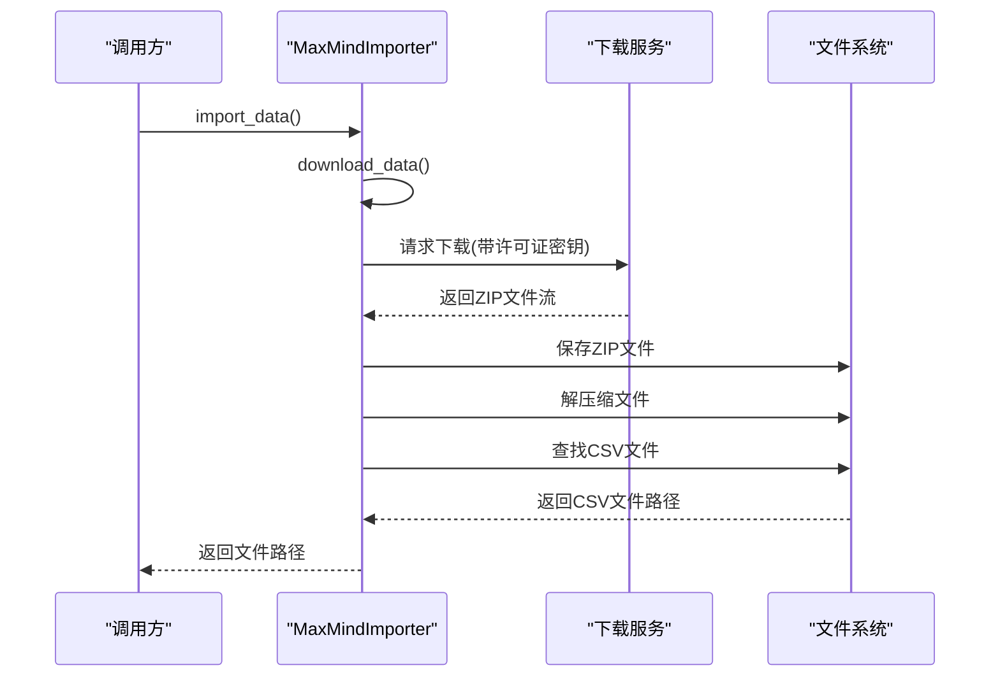
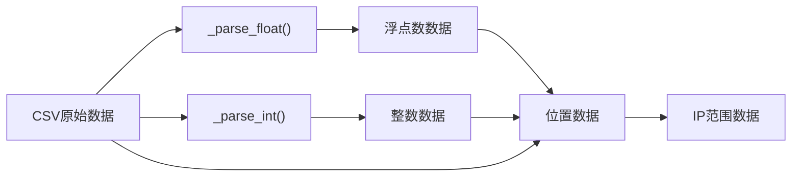
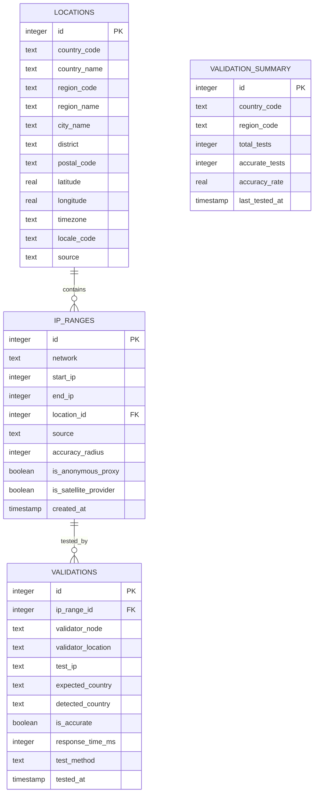
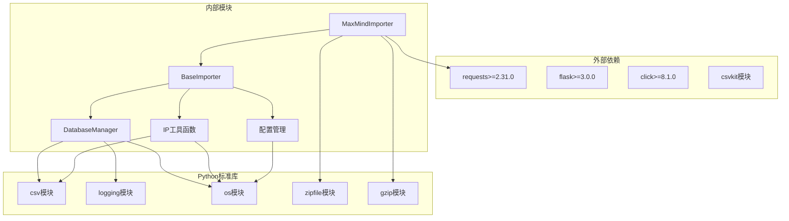

# 数据导入系统

<cite>
**本文档引用的文件**
- [importer/base_importer.py](file://importer/base_importer.py)
- [importer/maxmind_importer.py](file://importer/maxmind_importer.py)
- [utils/database.py](file://utils/database.py)
- [utils/ip_utils.py](file://utils/ip_utils.py)
- [config/settings.py](file://config/settings.py)
- [scripts/import_data.py](file://scripts/import_data.py)
- [scripts/init_db.py](file://scripts/init_db.py)
- [requirements.txt](file://requirements.txt)
</cite>

## 目录
1. [简介](#简介)
2. [项目结构](#项目结构)
3. [核心组件](#核心组件)
4. [架构概览](#架构概览)
5. [详细组件分析](#详细组件分析)
6. [依赖分析](#依赖分析)
7. [性能考虑](#性能考虑)
8. [故障排除指南](#故障排除指南)
9. [结论](#结论)
10. [附录](#附录)

## 简介

这是一个基于Python的IP地址地理位置数据导入系统，专门用于处理MaxMind GeoLite2数据集。该系统提供了完整的数据导入流程，从数据下载、格式转换到数据库存储，支持批量处理和错误恢复机制。

系统采用面向对象设计，通过抽象基类定义统一的导入接口，具体的数据源导入器实现特定的数据处理逻辑。核心特性包括：
- 支持多种数据源的可扩展架构
- 高效的批量数据导入机制
- 完善的错误处理和日志记录
- SQLite数据库存储和查询优化
- IP地址格式转换和范围计算

## 项目结构

项目采用模块化组织方式，主要分为以下几个核心模块：



**图表来源**
- [importer/base_importer.py:1-168](file://importer/base_importer.py#L1-L168)
- [importer/maxmind_importer.py:1-274](file://importer/maxmind_importer.py#L1-L274)
- [utils/database.py:1-398](file://utils/database.py#L1-L398)
- [utils/ip_utils.py:1-282](file://utils/ip_utils.py#L1-L282)
- [config/settings.py:1-44](file://config/settings.py#L1-L44)
- [scripts/import_data.py:1-65](file://scripts/import_data.py#L1-L65)
- [scripts/init_db.py:1-38](file://scripts/init_db.py#L1-L38)

**章节来源**
- [importer/base_importer.py:1-168](file://importer/base_importer.py#L1-L168)
- [importer/maxmind_importer.py:1-274](file://importer/maxmind_importer.py#L1-L274)
- [utils/database.py:1-398](file://utils/database.py#L1-L398)
- [utils/ip_utils.py:1-282](file://utils/ip_utils.py#L1-L282)
- [config/settings.py:1-44](file://config/settings.py#L1-L44)
- [scripts/import_data.py:1-65](file://scripts/import_data.py#L1-L65)
- [scripts/init_db.py:1-38](file://scripts/init_db.py#L1-L38)

## 核心组件

### 抽象基类设计

BaseImporter抽象基类定义了数据导入的标准接口和通用功能：



**图表来源**
- [importer/base_importer.py:15-168](file://importer/base_importer.py#L15-L168)
- [importer/maxmind_importer.py:19-274](file://importer/maxmind_importer.py#L19-L274)

### 数据库管理系统

DatabaseManager类提供了统一的数据库访问接口，封装了SQLite连接管理和事务处理：



**图表来源**
- [utils/database.py:15-68](file://utils/database.py#L15-L68)
- [utils/database.py:188-398](file://utils/database.py#L188-L398)

**章节来源**
- [importer/base_importer.py:15-168](file://importer/base_importer.py#L15-L168)
- [utils/database.py:15-398](file://utils/database.py#L15-L398)

## 架构概览

系统采用分层架构设计，实现了清晰的关注点分离：



**图表来源**
- [scripts/import_data.py:1-65](file://scripts/import_data.py#L1-L65)
- [importer/base_importer.py:1-168](file://importer/base_importer.py#L1-L168)
- [utils/database.py:1-398](file://utils/database.py#L1-L398)
- [utils/ip_utils.py:1-282](file://utils/ip_utils.py#L1-L282)
- [config/settings.py:1-44](file://config/settings.py#L1-L44)

## 详细组件分析

### BaseImporter抽象基类详解

BaseImporter作为所有导入器的基类，提供了以下核心功能：

#### 核心接口设计

1. **抽象方法**：强制子类实现数据下载、位置解析和IP范围解析功能
2. **通用功能**：提供位置缓存、批量导入等通用逻辑
3. **错误处理**：统一的异常捕获和日志记录机制

#### 批量处理机制

BaseImporter实现了高效的批量处理策略：



**图表来源**
- [importer/base_importer.py:82-154](file://importer/base_importer.py#L82-L154)

#### 位置缓存优化

BaseImporter实现了智能的位置缓存机制，避免重复查询相同的位置信息：

- **缓存键生成**：基于国家代码、省/州代码、城市名称和区/县的组合
- **内存缓存**：减少数据库查询次数，提高导入效率
- **缓存失效**：通过唯一性约束确保数据一致性

**章节来源**
- [importer/base_importer.py:15-168](file://importer/base_importer.py#L15-L168)

### MaxMindImporter实现细节

MaxMindImporter是具体的导入器实现，专门处理MaxMind GeoLite2数据集：

#### 数据下载流程



**图表来源**
- [importer/maxmind_importer.py:28-73](file://importer/maxmind_importer.py#L28-L73)

#### 数据解析策略

MaxMindImporter采用了独特的双文件处理策略：

1. **Locations文件预处理**：将地理位置信息加载到内存映射中
2. **Blocks文件逐行处理**：边读取边解析，实时关联地理位置信息
3. **内存优化**：避免一次性加载大量数据到内存

#### 数据类型转换



**图表来源**
- [importer/maxmind_importer.py:131-144](file://importer/maxmind_importer.py#L131-L144)

**章节来源**
- [importer/maxmind_importer.py:19-274](file://importer/maxmind_importer.py#L19-L274)

### 数据库架构设计

系统使用SQLite作为数据存储引擎，设计了优化的表结构和索引策略：

#### 数据模型关系



**图表来源**
- [utils/database.py:80-182](file://utils/database.py#L80-L182)

#### 性能优化策略

1. **索引优化**：为常用查询字段建立索引
2. **批量操作**：使用executemany进行批量插入
3. **连接池**：通过上下文管理器管理数据库连接
4. **事务处理**：自动事务提交和回滚

**章节来源**
- [utils/database.py:1-398](file://utils/database.py#L1-L398)

## 依赖分析

系统依赖关系清晰，遵循单一职责原则：



**图表来源**
- [requirements.txt:1-5](file://requirements.txt#L1-L5)
- [importer/base_importer.py:4-10](file://importer/base_importer.py#L4-L10)
- [importer/maxmind_importer.py:4-14](file://importer/maxmind_importer.py#L4-L14)
- [utils/database.py:4-8](file://utils/database.py#L4-L8)
- [utils/ip_utils.py:4-7](file://utils/ip_utils.py#L4-L7)

**章节来源**
- [requirements.txt:1-5](file://requirements.txt#L1-L5)

## 性能考虑

### 批量处理参数

系统通过配置参数控制批量处理行为：

| 参数 | 默认值 | 作用 | 性能影响 |
|------|--------|------|----------|
| BATCH_SIZE | 10000 | 单次批量插入记录数 | 大：减少数据库往返次数；小：降低内存占用 |
| IMPORT_CHUNK_SIZE | 50000 | 导入分块大小 | 大：提高吞吐量；小：更好的内存控制 |

### 内存优化策略

1. **流式处理**：使用csv.DictReader逐行处理大型文件
2. **位置缓存**：避免重复数据库查询
3. **分块导入**：控制内存使用峰值
4. **及时释放**：批量处理后立即清空临时数据

### 数据库性能优化

1. **索引策略**：为查询频繁的字段建立索引
2. **批量插入**：使用executemany替代循环插入
3. **连接复用**：通过上下文管理器管理连接生命周期
4. **事务批处理**：减少事务开销

## 故障排除指南

### 常见问题及解决方案

#### 数据下载失败

**症状**：MaxMind数据下载超时或认证失败
**原因**：
- 许可证密钥无效或过期
- 网络连接不稳定
- 下载URL配置错误

**解决方案**：
1. 验证MAXMIND_LICENSE_KEY环境变量设置
2. 检查网络连接状态
3. 确认MAXMIND_DOWNLOAD_URL配置正确

#### CSV文件解析错误

**症状**：导入过程中出现CSV解析异常
**原因**：
- CSV文件格式不符合预期
- 编码格式不正确
- 数据字段缺失

**解决方案**：
1. 验证CSV文件完整性
2. 检查文件编码格式
3. 确认必需字段存在

#### 数据库连接问题

**症状**：数据库操作失败或连接超时
**原因**：
- 数据库文件损坏
- 权限不足
- 磁盘空间不足

**解决方案**：
1. 运行数据库初始化脚本
2. 检查文件权限设置
3. 清理磁盘空间

### 调试技巧

1. **启用详细日志**：设置日志级别为DEBUG
2. **分步调试**：使用断点逐步执行导入过程
3. **监控资源使用**：观察内存和CPU使用情况
4. **验证数据完整性**：检查导入前后数据一致性

**章节来源**
- [importer/maxmind_importer.py:70-73](file://importer/maxmind_importer.py#L70-L73)
- [importer/base_importer.py:144-146](file://importer/base_importer.py#L144-L146)

## 结论

这个数据导入系统展现了良好的软件工程实践，具有以下特点：

1. **可扩展性**：通过抽象基类设计，易于添加新的数据源导入器
2. **性能优化**：采用批量处理、缓存和索引优化等技术
3. **健壮性**：完善的错误处理和日志记录机制
4. **易用性**：提供命令行工具和清晰的API接口

系统特别适合处理大规模地理数据的导入需求，为后续的IP地址查询和验证功能奠定了坚实的基础。

## 附录

### 使用示例

#### 基本导入流程

```bash
# 初始化数据库
python scripts/init_db.py

# 导入MaxMind数据
python scripts/import_data.py maxmind --license-key YOUR_LICENSE_KEY

# 直接从CSV导入
python scripts/import_data.py maxmind --csv-path /path/to/blocks.csv --init-db
```

#### 扩展新数据源导入器

要创建新的数据源导入器，需要：

1. 继承BaseImporter基类
2. 实现抽象方法：download_data、parse_location、parse_ip_range
3. 在import_data方法中实现完整的导入流程
4. 处理特定的数据格式转换逻辑

### 配置选项

系统支持以下环境变量配置：

- `MAXMIND_LICENSE_KEY`：MaxMind许可证密钥
- `VALIDATOR_API_KEY`：验证节点API密钥