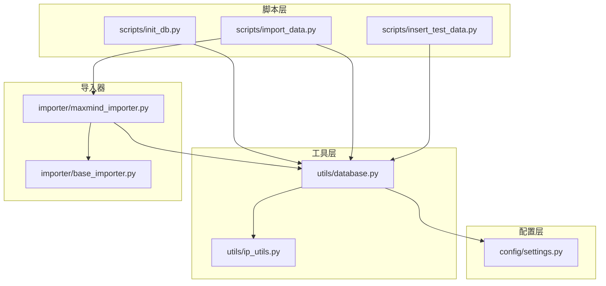
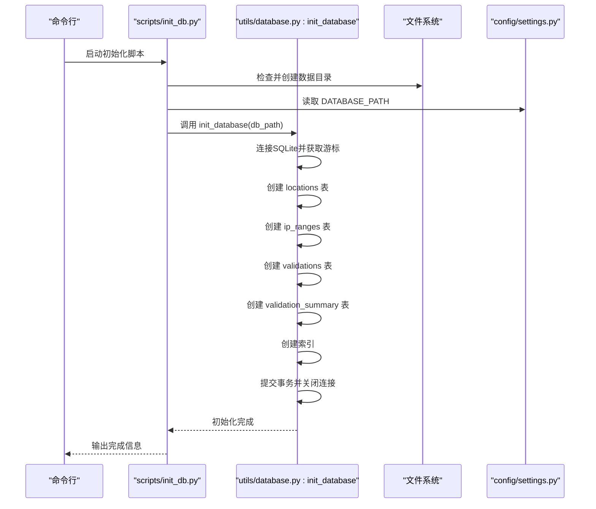
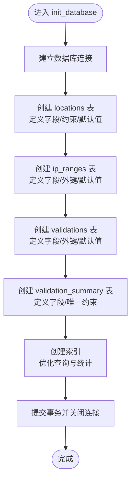
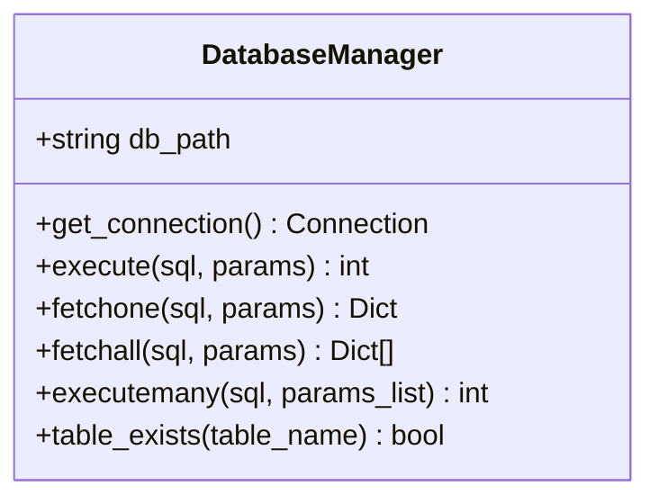
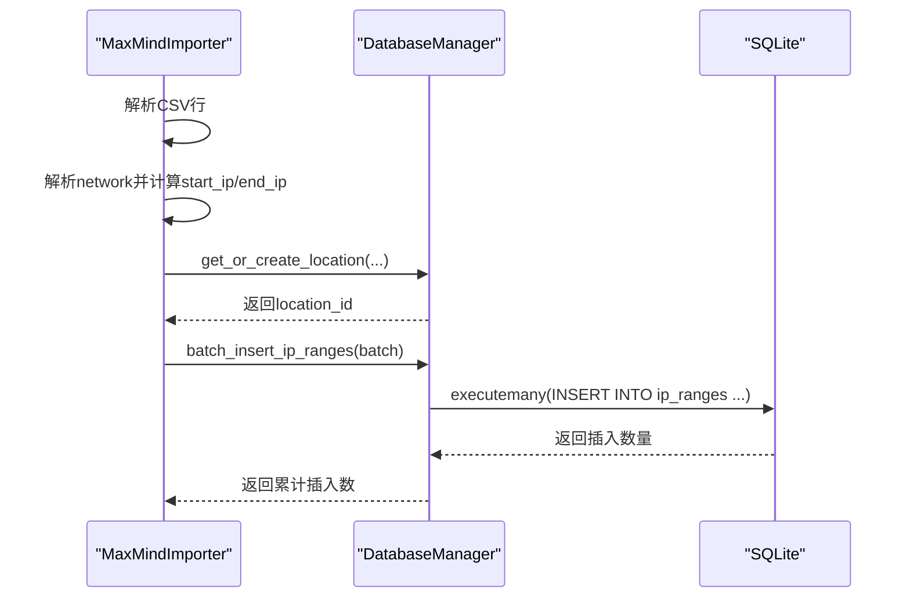
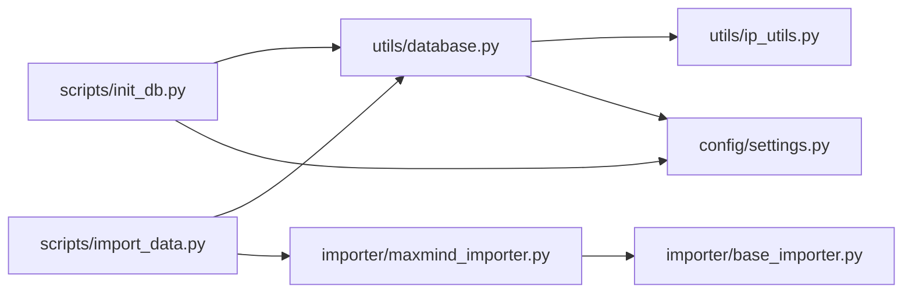

# 数据库初始化

<cite>
**本文引用的文件**
- [scripts/init_db.py](file://scripts/init_db.py)
- [utils/database.py](file://utils/database.py)
- [config/settings.py](file://config/settings.py)
- [scripts/import_data.py](file://scripts/import_data.py)
- [importer/maxmind_importer.py](file://importer/maxmind_importer.py)
- [importer/base_importer.py](file://importer/base_importer.py)
- [scripts/insert_test_data.py](file://scripts/insert_test_data.py)
- [utils/ip_utils.py](file://utils/ip_utils.py)
</cite>

## 目录
1. [简介](#简介)
2. [项目结构](#项目结构)
3. [核心组件](#核心组件)
4. [架构总览](#架构总览)
5. [详细组件分析](#详细组件分析)
6. [依赖关系分析](#依赖关系分析)
7. [性能考量](#性能考量)
8. [故障排除指南](#故障排除指南)
9. [结论](#结论)
10. [附录：初始化与验证步骤](#附录初始化与验证步骤)

## 简介
本文件面向数据库初始化过程，围绕 init_database 函数的完整执行流程进行深入说明，涵盖：
- 表创建、索引建立、约束设置的顺序与设计原因
- 每个 CREATE TABLE 的字段定义、约束与默认值选择
- 数据库连接管理、事务处理与错误处理机制
- 初始化的完整步骤与验证方法
- 数据库迁移与版本升级的指导原则
- 初始化失败时的故障排除方法

## 项目结构
该项目采用“脚本入口 + 工具模块 + 配置”的组织方式，数据库初始化主要由脚本调用工具模块中的初始化函数完成，并通过配置模块统一管理数据库路径等参数。

图表来源
- [scripts/init_db.py:1-38](file://scripts/init_db.py#L1-L38)
- [utils/database.py:1-398](file://utils/database.py#L1-L398)
- [config/settings.py:1-44](file://config/settings.py#L1-L44)
- [scripts/import_data.py:1-65](file://scripts/import_data.py#L1-L65)
- [importer/maxmind_importer.py:1-274](file://importer/maxmind_importer.py#L1-L274)
- [importer/base_importer.py:1-168](file://importer/base_importer.py#L1-L168)
- [scripts/insert_test_data.py:1-63](file://scripts/insert_test_data.py#L1-L63)
- [utils/ip_utils.py:1-282](file://utils/ip_utils.py#L1-L282)

章节来源
- [scripts/init_db.py:1-38](file://scripts/init_db.py#L1-L38)
- [utils/database.py:1-398](file://utils/database.py#L1-L398)
- [config/settings.py:1-44](file://config/settings.py#L1-L44)

## 核心组件
- 数据库初始化入口：scripts/init_db.py
- 初始化实现：utils/database.py 中的 init_database 函数
- 连接与事务管理：utils/database.py 中的 DatabaseManager 类
- 配置参数：config/settings.py 中的 DATABASE_PATH 等
- 数据导入与批量写入：importer/maxmind_importer.py 与 utils/database.py 的批量接口
- IP 工具：utils/ip_utils.py 提供 CIDR 到范围转换等

章节来源
- [scripts/init_db.py:16-37](file://scripts/init_db.py#L16-L37)
- [utils/database.py:70-185](file://utils/database.py#L70-L185)
- [config/settings.py:10-11](file://config/settings.py#L10-L11)
- [importer/maxmind_importer.py:145-258](file://importer/maxmind_importer.py#L145-L258)
- [utils/ip_utils.py:51-67](file://utils/ip_utils.py#L51-L67)

## 架构总览
数据库初始化的整体流程如下：
- 脚本层负责准备环境（确保数据目录存在）、调用初始化函数
- 初始化函数创建四张核心表及若干索引
- 导入器在初始化完成后使用批量写入接口导入数据
- 查询与统计功能基于已初始化的表结构运行

图表来源
- [scripts/init_db.py:16-37](file://scripts/init_db.py#L16-L37)
- [utils/database.py:70-185](file://utils/database.py#L70-L185)
- [config/settings.py:10-11](file://config/settings.py#L10-L11)

## 详细组件分析

### init_database 函数执行流程与设计
- 连接与事务
  - 使用 sqlite3.connect 建立连接，随后通过游标执行 DDL/DML
  - 事务提交与关闭在函数末尾显式完成，保证原子性
- 表创建顺序与原因
  - locations → ip_ranges → validations → validation_summary
  - 顺序遵循外键依赖：ip_ranges.location_id 引用 locations.id；validations.ip_range_id 引用 ip_ranges.id
- 约束与唯一性
  - locations 的唯一性约束组合 country_code、region_code、city_name、district，避免重复位置
  - validation_summary 的唯一性约束 country_code、region_code，用于按区域聚合统计
- 默认值与类型
  - ip_ranges.accuracy_radius、is_anonymous_proxy、is_satellite_provider 设置了合理默认值，便于后续统计与筛选
  - created_at、tested_at 使用 CURRENT_TIMESTAMP，默认记录时间戳
- 索引策略
  - ip_ranges: start_ip+end_ip、network、location_id
  - locations: country_code、city_name
  - validations: ip_range_id、is_accurate、tested_at
  - 索引服务于查询与统计场景，如范围查找、按国家/城市过滤、按准确性与时间排序

图表来源
- [utils/database.py:70-185](file://utils/database.py#L70-L185)

章节来源
- [utils/database.py:70-185](file://utils/database.py#L70-L185)

### 表结构设计与字段选择
- locations
  - 设计考虑：存储地理层级信息，唯一性约束避免重复；支持空值的 district 字段用于更细粒度定位
  - 字段与约束：主键自增、文本字段、数值字段、locale_code、source、UNIQUE 组合
- ip_ranges
  - 设计考虑：以整型 start_ip/end_ip 存储范围，便于快速范围匹配；network 文本便于展示与调试
  - 字段与约束：NOT NULL 的 network/start_ip/end_ip；外键指向 locations；布尔默认值与时间戳默认值
- validations
  - 设计考虑：记录验证节点、期望与检测结果、准确性标记、响应时间、测试方法与时间
  - 字段与约束：外键指向 ip_ranges；默认时间戳
- validation_summary
  - 设计考虑：按国家/区域聚合统计，包含总数、准确数、准确率与最后测试时间
  - 字段与约束：UNIQUE 组合，避免重复统计项

章节来源
- [utils/database.py:80-147](file://utils/database.py#L80-L147)

### 数据库连接管理与事务处理
- 连接管理
  - 使用 sqlite3.connect 建立连接，设置 row_factory 为 sqlite3.Row，便于通过列名访问结果
- 事务处理
  - 显式 commit 提交，异常时 rollback，finally 关闭连接，确保资源释放
- 并发与一致性
  - 单次初始化流程内串行执行 DDL，避免并发冲突
  - 批量写入使用 executemany，提升导入效率

图表来源
- [utils/database.py:15-67](file://utils/database.py#L15-L67)

章节来源
- [utils/database.py:15-67](file://utils/database.py#L15-L67)

### 错误处理机制
- 初始化阶段
  - 通过 try/except/finally 实现回滚与关闭，防止异常中断导致连接泄漏
- 导入阶段
  - 导入器在逐行处理时捕获异常并记录错误，跳过问题行继续导入，保证整体导入进度
- 配置缺失
  - 导入 MaxMind 数据时若缺少许可证密钥会抛出异常，提示用户提供

章节来源
- [utils/database.py:21-33](file://utils/database.py#L21-L33)
- [importer/maxmind_importer.py:35-36](file://importer/maxmind_importer.py#L35-L36)
- [importer/maxmind_importer.py:144-146](file://importer/maxmind_importer.py#L144-L146)

### 数据导入与批量写入
- 导入流程
  - 导入器先解析 CSV 行，提取 network 与位置信息
  - 通过 get_or_create_location 获取或创建位置 ID
  - 将 network 转换为 start_ip/end_ip，组装 IP 范围元组
  - 达到批量阈值后调用 batch_insert_ip_ranges 写入
- 批量写入
  - 使用 executemany 批量插入，减少往返次数，提高吞吐量

图表来源
- [importer/maxmind_importer.py:221-255](file://importer/maxmind_importer.py#L221-L255)
- [utils/database.py:310-338](file://utils/database.py#L310-L338)

章节来源
- [importer/maxmind_importer.py:145-258](file://importer/maxmind_importer.py#L145-L258)
- [utils/database.py:310-338](file://utils/database.py#L310-L338)

### 查询与统计
- IP 查询
  - 通过 ip_ranges 与 locations 连接，利用 start_ip/end_ip 范围匹配，按 accuracy_radius 排序返回最精确结果
- 统计更新
  - validation_summary 采用先更新后插入的策略，保证并发安全与幂等性

章节来源
- [utils/database.py:193-230](file://utils/database.py#L193-L230)
- [utils/database.py:363-397](file://utils/database.py#L363-L397)

## 依赖关系分析
- 脚本依赖
  - scripts/init_db.py 依赖 utils/database.py 的 init_database 与 config/settings.py 的 DATABASE_PATH
  - scripts/import_data.py 可选初始化数据库并调用导入器
- 导入器依赖
  - importer/maxmind_importer.py 继承 importer/base_importer.py，复用 get_or_create_location、batch_insert_ip_ranges 等通用逻辑
- 工具依赖
  - utils/database.py 依赖 utils/ip_utils.py 进行 CIDR 到范围的转换
- 配置依赖
  - config/settings.py 提供 DATABASE_PATH、BATCH_SIZE 等全局配置

图表来源
- [scripts/init_db.py:12-13](file://scripts/init_db.py#L12-L13)
- [utils/database.py:8-8](file://utils/database.py#L8-L8)
- [scripts/import_data.py:16-17](file://scripts/import_data.py#L16-L17)
- [importer/maxmind_importer.py:19-26](file://importer/maxmind_importer.py#L19-L26)
- [importer/base_importer.py:15-21](file://importer/base_importer.py#L15-L21)
- [utils/ip_utils.py:1-7](file://utils/ip_utils.py#L1-L7)
- [config/settings.py:10-11](file://config/settings.py#L10-L11)

章节来源
- [scripts/init_db.py:12-13](file://scripts/init_db.py#L12-L13)
- [utils/database.py:8-8](file://utils/database.py#L8-L8)
- [scripts/import_data.py:16-17](file://scripts/import_data.py#L16-L17)
- [importer/maxmind_importer.py:19-26](file://importer/maxmind_importer.py#L19-L26)
- [importer/base_importer.py:15-21](file://importer/base_importer.py#L15-L21)
- [utils/ip_utils.py:1-7](file://utils/ip_utils.py#L1-L7)
- [config/settings.py:10-11](file://config/settings.py#L10-L11)

## 性能考量
- 索引策略
  - 为 ip_ranges 的 start_ip+end_ip、network、location_id 建立索引，优化范围查询与连接性能
  - 为 locations 的 country_code、city_name 建立索引，加速地理过滤
  - 为 validations 的 ip_range_id、is_accurate、tested_at 建立索引，支撑统计与排序
- 批量写入
  - 使用 executemany 与批量阈值（BATCH_SIZE）减少事务开销，提升导入速度
- 查询优化
  - 查询 IP 时按 accuracy_radius 排序并限制返回，兼顾精度与性能

章节来源
- [utils/database.py:149-181](file://utils/database.py#L149-L181)
- [utils/database.py:310-338](file://utils/database.py#L310-L338)
- [config/settings.py:19-20](file://config/settings.py#L19-L20)

## 故障排除指南
- 初始化失败
  - 检查数据目录权限与路径：脚本会在初始化前创建数据目录，若仍失败请确认用户权限
  - 查看日志输出：初始化函数记录完成日志，若无日志可能因异常被上层捕获
  - 确认 SQLite 文件可写：确保 DATABASE_PATH 所在目录具备写权限
- 导入失败
  - MaxMind 导入需许可证密钥：若未提供会抛出异常，请设置环境变量或传入参数
  - CSV 格式问题：导入器会跳过异常行并记录错误，建议检查 CSV 文件完整性
- 查询异常
  - 若查询不到结果，确认 ip_ranges 是否正确导入，且 start_ip/end_ip 范围是否覆盖目标 IP
  - 检查索引是否存在：可通过 sqlite_master 查询表与索引状态
- 统计不更新
  - 确认 validation_summary 的 country_code/region_code 是否与 locations 对应
  - 检查更新逻辑：先更新后插入，确保唯一性约束不冲突

章节来源
- [scripts/init_db.py:20-24](file://scripts/init_db.py#L20-L24)
- [utils/database.py:21-33](file://utils/database.py#L21-L33)
- [importer/maxmind_importer.py:35-36](file://importer/maxmind_importer.py#L35-L36)
- [importer/maxmind_importer.py:144-146](file://importer/maxmind_importer.py#L144-L146)
- [utils/database.py:363-397](file://utils/database.py#L363-L397)

## 结论
本项目的数据库初始化通过明确的表结构、合理的索引与约束、严谨的连接与事务管理，构建了高效稳定的地理 IP 数据库。配合批量导入与查询统计能力，能够满足大规模数据的入库与检索需求。建议在生产环境中结合监控与日志，持续关注索引命中率与导入吞吐量，以进一步优化性能。

## 附录：初始化与验证步骤

### 初始化步骤
1. 准备环境
   - 确保项目根目录存在，数据目录不存在则自动创建
2. 执行初始化
   - 运行脚本入口，调用 init_database 完成表与索引创建
3. 验证结果
   - 检查数据库文件是否存在与大小
   - 可通过 sqlite3 命令行或工具查看 sqlite_master 确认表与索引存在

章节来源
- [scripts/init_db.py:16-37](file://scripts/init_db.py#L16-L37)
- [utils/database.py:70-185](file://utils/database.py#L70-L185)

### 验证方法
- 表与索引
  - 查询 sqlite_master，确认四张表与对应索引均存在
- 数据导入
  - 使用 scripts/import_data.py 导入数据，观察日志输出与返回的计数
- 查询验证
  - 使用 utils/database.py 的查询函数，输入已知 IP，验证返回的地理位置信息
- 统计验证
  - 插入测试数据后，检查 validation_summary 的聚合统计是否更新

章节来源
- [scripts/import_data.py:44-61](file://scripts/import_data.py#L44-L61)
- [utils/database.py:193-230](file://utils/database.py#L193-L230)
- [scripts/insert_test_data.py:13-62](file://scripts/insert_test_data.py#L13-L62)

### 数据库迁移与版本升级指导
- 版本控制
  - 在项目中维护一个版本号常量与迁移脚本清单，每次升级时按顺序执行
- 迁移策略
  - 新增表：在现有初始化基础上追加 CREATE TABLE 与索引
  - 修改表：使用 ALTER TABLE 或重建表的方式，注意数据备份与索引重建
  - 索引变更：新增/删除索引需评估查询性能影响
- 幂等性
  - 迁移脚本应具备幂等性，避免重复执行造成错误
- 回滚机制
  - 保留备份与回滚脚本，确保升级失败时可恢复到上一版本

[本节为通用指导，无需具体文件引用]