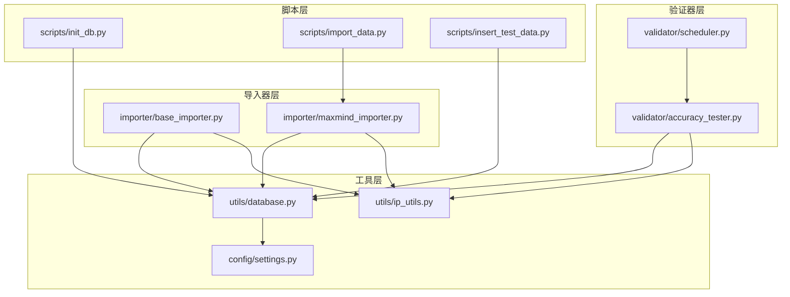
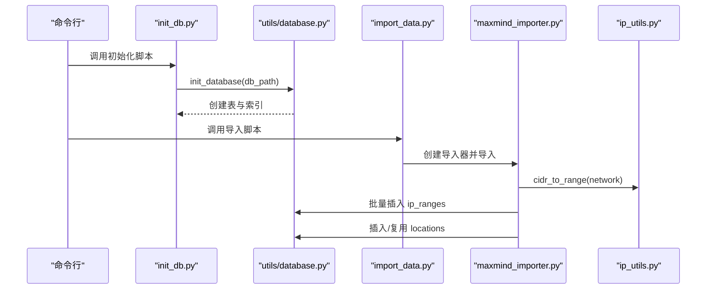
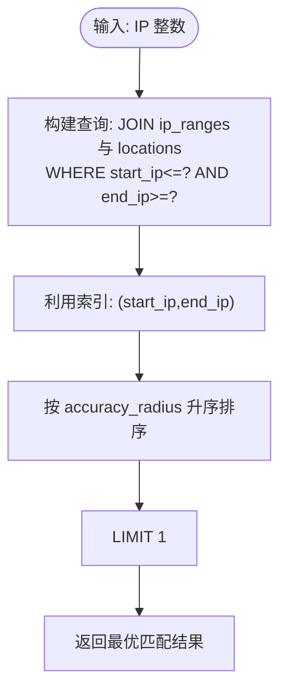
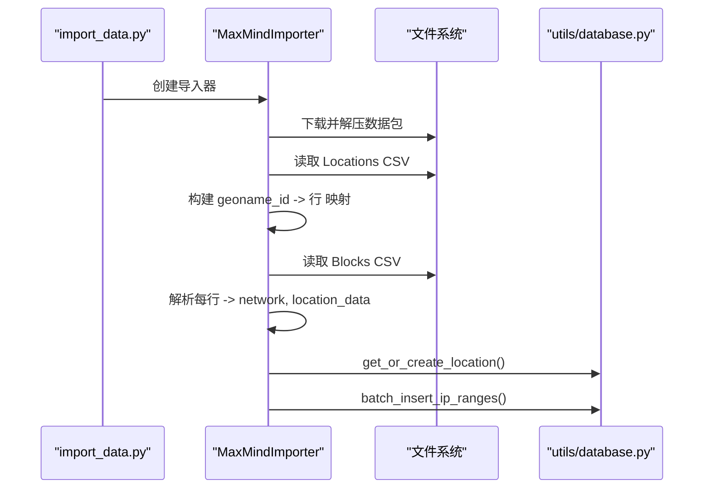
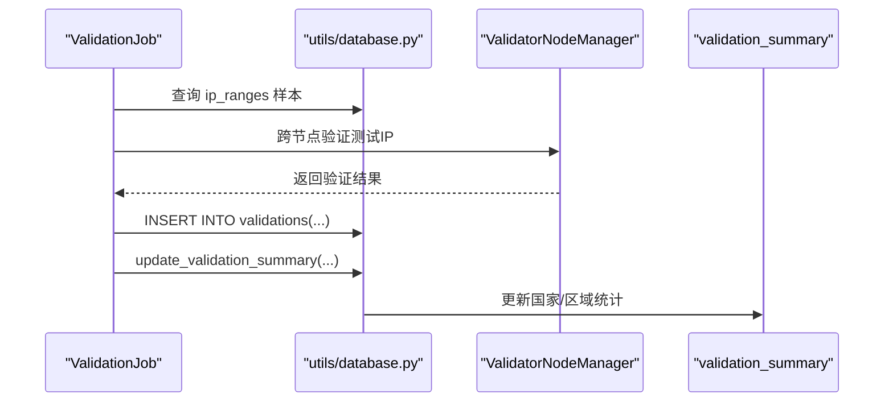
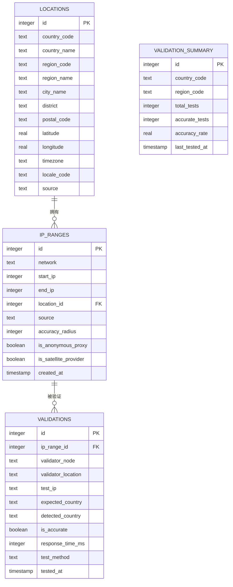
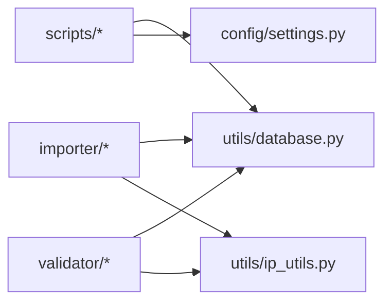

# 数据库设计

<cite>
**本文引用的文件**
- [scripts/init_db.py](file://scripts/init_db.py)
- [utils/database.py](file://utils/database.py)
- [importer/maxmind_importer.py](file://importer/maxmind_importer.py)
- [importer/base_importer.py](file://importer/base_importer.py)
- [utils/ip_utils.py](file://utils/ip_utils.py)
- [config/settings.py](file://config/settings.py)
- [scripts/import_data.py](file://scripts/import_data.py)
- [scripts/insert_test_data.py](file://scripts/insert_test_data.py)
- [validator/accuracy_tester.py](file://validator/accuracy_tester.py)
- [validator/scheduler.py](file://validator/scheduler.py)
</cite>

## 目录
1. [简介](#简介)
2. [项目结构](#项目结构)
3. [核心组件](#核心组件)
4. [架构总览](#架构总览)
5. [详细组件分析](#详细组件分析)
6. [依赖分析](#依赖分析)
7. [性能考量](#性能考量)
8. [故障排查指南](#故障排查指南)
9. [结论](#结论)
10. [附录](#附录)

## 简介
本文件面向数据库设计与实现，围绕 IP_RANGES、LOCATIONS、VALIDATIONS 及 validation_summary 四张核心表，系统阐述其结构、主外键与索引设计、初始化流程、查询优化策略、IP范围高效查询机制、数据迁移与版本管理建议、以及维护与备份最佳实践。文档以仓库中的实际实现为依据，辅以可视化图示帮助读者快速理解。

## 项目结构
该项目采用“脚本驱动 + 工具模块 + 导入器 + 验证器”的分层组织方式：
- 脚本层：负责数据库初始化、数据导入、测试数据插入、验证调度等入口
- 工具层：数据库连接管理、IP地址工具、查询封装
- 导入器层：抽象导入器与具体数据源（MaxMind）实现
- 验证器层：准确性测试、节点验证、调度器

图表来源
- [scripts/init_db.py:16-28](file://scripts/init_db.py#L16-L28)
- [utils/database.py:70-185](file://utils/database.py#L70-L185)
- [importer/maxmind_importer.py:145-258](file://importer/maxmind_importer.py#L145-L258)
- [validator/accuracy_tester.py:17-21](file://validator/accuracy_tester.py#L17-L21)

章节来源
- [scripts/init_db.py:16-38](file://scripts/init_db.py#L16-L38)
- [utils/database.py:70-185](file://utils/database.py#L70-L185)
- [importer/maxmind_importer.py:19-274](file://importer/maxmind_importer.py#L19-L274)
- [validator/accuracy_tester.py:27-373](file://validator/accuracy_tester.py#L27-L373)

## 核心组件
本节聚焦四张核心表的结构、约束与索引，并解释其设计动机与性能影响。

- LOCATIONS 表
  - 主键：自增 id
  - 唯一性约束：(country_code, region_code, city_name, district)
  - 字段用途：国家/地区/城市/区县、邮政编码、经纬度、时区、语言代码、来源
  - 设计要点：唯一性约束确保相同地理粒度下的去重；经纬度与时区便于后续地理分析与展示

- IP_RANGES 表
  - 主键：自增 id
  - 外键：location_id 引用 LOCATIONS(id)
  - 关键字段：network 文本、start_ip/end_ip 整数、accuracy_radius、代理/卫星标记、来源、创建时间
  - 设计要点：存储整数形式的IP范围，配合索引实现 O(log N) 级别的范围查找；accuracy_radius 用于排序优先级

- VALIDATIONS 表
  - 主键：自增 id
  - 外键：ip_range_id 引用 IP_RANGES(id)
  - 字段用途：验证节点、测试IP、期望/检测国家、准确性布尔值、响应时间、测试方法、测试时间
  - 设计要点：记录每次验证的细节，支撑后续统计与报告

- VALIDATION_SUMMARY 表
  - 主键：自增 id
  - 唯一性约束：(country_code, region_code)
  - 字段用途：国家/区域维度的总测试数、准确测试数、准确率、最后测试时间
  - 设计要点：聚合统计，便于按区域评估数据质量

索引设计与性能考虑
- ip_ranges: (start_ip, end_ip)、network、location_id
  - 范围查询与JOIN性能优化
- locations: country_code、city_name
  - 地理过滤与定位效率
- validations: ip_range_id、is_accurate、tested_at
  - 验证记录检索、准确性筛选与时间序列分析

章节来源
- [utils/database.py:80-147](file://utils/database.py#L80-L147)
- [utils/database.py:149-181](file://utils/database.py#L149-L181)

## 架构总览
数据库初始化与数据导入的整体流程如下：

图表来源
- [scripts/init_db.py:16-28](file://scripts/init_db.py#L16-L28)
- [utils/database.py:70-185](file://utils/database.py#L70-L185)
- [scripts/import_data.py:26-41](file://scripts/import_data.py#L26-L41)
- [importer/maxmind_importer.py:145-258](file://importer/maxmind_importer.py#L145-L258)
- [utils/ip_utils.py:51-67](file://utils/ip_utils.py#L51-L67)

## 详细组件分析

### 数据库初始化流程
- 目标：创建四张核心表与必要索引
- 步骤：
  1) 确保数据目录存在
  2) 连接 SQLite 数据库
  3) 创建 LOCATIONS、IP_RANGES、VALIDATIONS、validation_summary 表
  4) 为关键列创建索引
  5) 提交事务并关闭连接
- 注意事项：
  - 使用 UNIQUE 约束避免重复地理位置
  - 使用外键保证引用完整性
  - 索引覆盖常见查询模式（范围、过滤、连接）

章节来源
- [scripts/init_db.py:16-38](file://scripts/init_db.py#L16-L38)
- [utils/database.py:70-185](file://utils/database.py#L70-L185)

### IP 地址范围查询与索引使用
- 查询逻辑：
  - 输入：IP 的整数形式
  - SQL：JOIN ip_ranges 与 locations，WHERE start_ip <= ip_int AND end_ip >= ip_int
  - 排序：按 accuracy_radius 升序，LIMIT 1，优先返回更精确的匹配
- 索引作用：
  - (start_ip, end_ip) 索引支持范围查找
  - (location_id) 索引加速 JOIN
- 性能要点：
  - 使用整数存储 IP 范围端点，避免字符串比较
  - 通过排序与 LIMIT 实现“最优匹配”快速返回

图表来源
- [utils/database.py:193-230](file://utils/database.py#L193-L230)

章节来源
- [utils/database.py:193-230](file://utils/database.py#L193-L230)

### 数据导入器与批量写入
- 抽象导入器 BaseImporter
  - 统一处理 CSV 读取、位置解析、IP 范围解析、批量写入
  - 位置缓存减少重复查询
- MaxMindImporter
  - 下载并解压 MaxMind 数据包
  - 同时处理 Locations 与 Blocks 文件，先加载 Locations 内存映射，再逐行处理 Blocks
  - 使用 cidr_to_range 将 CIDR 转换为整数范围
  - 批量插入 ip_ranges，批量大小由配置控制

图表来源
- [scripts/import_data.py:26-41](file://scripts/import_data.py#L26-L41)
- [importer/maxmind_importer.py:145-258](file://importer/maxmind_importer.py#L145-L258)
- [importer/base_importer.py:82-154](file://importer/base_importer.py#L82-L154)
- [utils/ip_utils.py:51-67](file://utils/ip_utils.py#L51-L67)

章节来源
- [importer/maxmind_importer.py:19-274](file://importer/maxmind_importer.py#L19-L274)
- [importer/base_importer.py:15-168](file://importer/base_importer.py#L15-L168)
- [utils/ip_utils.py:51-67](file://utils/ip_utils.py#L51-L67)

### 验证与统计
- AccuracyTester
  - 从 ip_ranges 中随机采样，生成测试 IP 并跨节点验证
  - 将验证结果写入 validations，并更新 validation_summary
- Scheduler
  - 定时调度批量验证任务，支持按国家或全量验证
  - 维护上次/下次运行时间，便于运维监控

图表来源
- [validator/accuracy_tester.py:182-254](file://validator/accuracy_tester.py#L182-L254)
- [utils/database.py:363-397](file://utils/database.py#L363-L397)

章节来源
- [validator/accuracy_tester.py:27-373](file://validator/accuracy_tester.py#L27-L373)
- [validator/scheduler.py:27-123](file://validator/scheduler.py#L27-L123)

### 数据模型关系图

图表来源
- [utils/database.py:80-147](file://utils/database.py#L80-L147)

## 依赖分析
- 组件耦合
  - scripts/* 依赖 utils/database.py 与 config/settings.py
  - importer/* 依赖 utils/database.py 与 utils/ip_utils.py
  - validator/* 依赖 utils/database.py 与 utils/ip_utils.py
- 外部依赖
  - SQLite（内置）
  - Python 标准库（ipaddress、requests、csv、gzip、threading 等）
- 循环依赖
  - 未发现循环依赖；各层职责清晰

图表来源
- [scripts/import_data.py:16-41](file://scripts/import_data.py#L16-L41)
- [importer/maxmind_importer.py:12-26](file://importer/maxmind_importer.py#L12-L26)
- [validator/accuracy_tester.py:16-21](file://validator/accuracy_tester.py#L16-L21)

章节来源
- [scripts/import_data.py:16-65](file://scripts/import_data.py#L16-L65)
- [importer/maxmind_importer.py:12-274](file://importer/maxmind_importer.py#L12-L274)
- [validator/accuracy_tester.py:16-373](file://validator/accuracy_tester.py#L16-L373)

## 性能考量
- 查询优化策略
  - 使用整数存储 IP 范围端点，结合 (start_ip, end_ip) 索引进行范围扫描
  - 对 locations 的 country_code、city_name 建立索引，提升地理过滤效率
  - 对 validations 的 ip_range_id、is_accurate、tested_at 建立索引，支持验证记录检索与统计
- 批量写入
  - 导入器使用批量插入，降低事务开销与 I/O 次数
  - 批量大小可配置，平衡内存占用与吞吐
- 索引选择
  - 范围查询优先使用 (start_ip, end_ip)，避免对 end_ip 单独建索引
  - JOIN 优化使用 (location_id) 与 (ip_range_id)
- 查询计划分析
  - 建议在生产环境使用 EXPLAIN QUERY PLAN 观察 SQLite 查询计划
  - 对高频查询（如 IP 查询）关注索引命中情况与回表次数

章节来源
- [utils/database.py:149-181](file://utils/database.py#L149-L181)
- [importer/base_importer.py:138-151](file://importer/base_importer.py#L138-L151)
- [config/settings.py:18-20](file://config/settings.py#L18-L20)

## 故障排查指南
- 初始化失败
  - 检查数据库路径权限与父目录是否存在
  - 确认 SQLite 可用且无并发写冲突
- 导入异常
  - 核对 MaxMind License Key 与下载链接
  - 检查 CSV 字段映射与空值处理
  - 关注批处理日志，定位卡顿或错误行
- 查询缓慢
  - 确认索引已创建
  - 使用 EXPLAIN QUERY PLAN 分析执行计划
  - 检查是否存在不必要的排序或大范围扫描
- 验证统计不更新
  - 确认 validations 写入成功
  - 检查 update_validation_summary 的更新/插入分支

章节来源
- [scripts/init_db.py:20-34](file://scripts/init_db.py#L20-L34)
- [importer/maxmind_importer.py:35-72](file://importer/maxmind_importer.py#L35-L72)
- [validator/accuracy_tester.py:256-283](file://validator/accuracy_tester.py#L256-L283)

## 结论
本数据库设计以 SQLite 为基础，围绕 LOCATIONS、IP_RANGES、VALIDATIONS、validation_summary 构建了完整的 IP 地理位置与准确性验证体系。通过整数化 IP 范围、合理的索引布局与批量导入策略，实现了高效的范围查询与大规模数据写入。验证与统计模块进一步保障了数据质量的持续监控与改进。建议在生产环境中结合 EXPLAIN QUERY PLAN 与监控指标持续优化查询与写入性能。

## 附录

### 数据库初始化步骤清单
- 确保数据目录存在
- 连接数据库并创建表
- 创建索引
- 提交事务并关闭连接

章节来源
- [scripts/init_db.py:16-38](file://scripts/init_db.py#L16-L38)
- [utils/database.py:70-185](file://utils/database.py#L70-L185)

### 查询优化与索引使用要点
- IP 查询：使用 (start_ip, end_ip) 索引，避免对 end_ip 单独建索引
- 地理过滤：对 country_code、city_name 建立索引
- 验证记录：对 ip_range_id、is_accurate、tested_at 建立索引
- 批量写入：合理设置批量大小，减少事务提交频率

章节来源
- [utils/database.py:149-181](file://utils/database.py#L149-L181)
- [config/settings.py:18-20](file://config/settings.py#L18-L20)

### 数据迁移与版本管理建议
- 版本标识：在数据库中增加 schema_version 表或元数据字段
- 迁移脚本：为新增表/索引/列编写迁移脚本，按版本顺序执行
- 备份策略：定期导出 schema 与数据，保留历史快照
- 兼容性：新增列默认值与非空约束需谨慎，避免破坏现有数据

[本节为通用实践建议，不直接分析具体文件]

### 维护与备份最佳实践
- 备份：定期备份数据库文件，保留增量与全量备份
- 索引维护：定期重建或重新分析索引，保持查询性能
- 日志：启用并轮转日志，监控导入与验证任务
- 监控：观察导入进度、查询耗时、验证准确率趋势

[本节为通用实践建议，不直接分析具体文件]