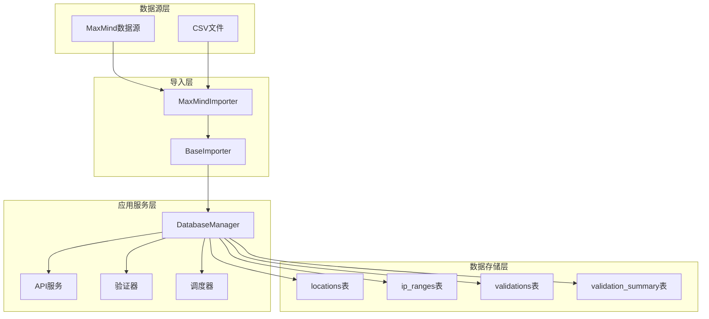
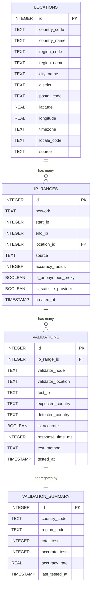
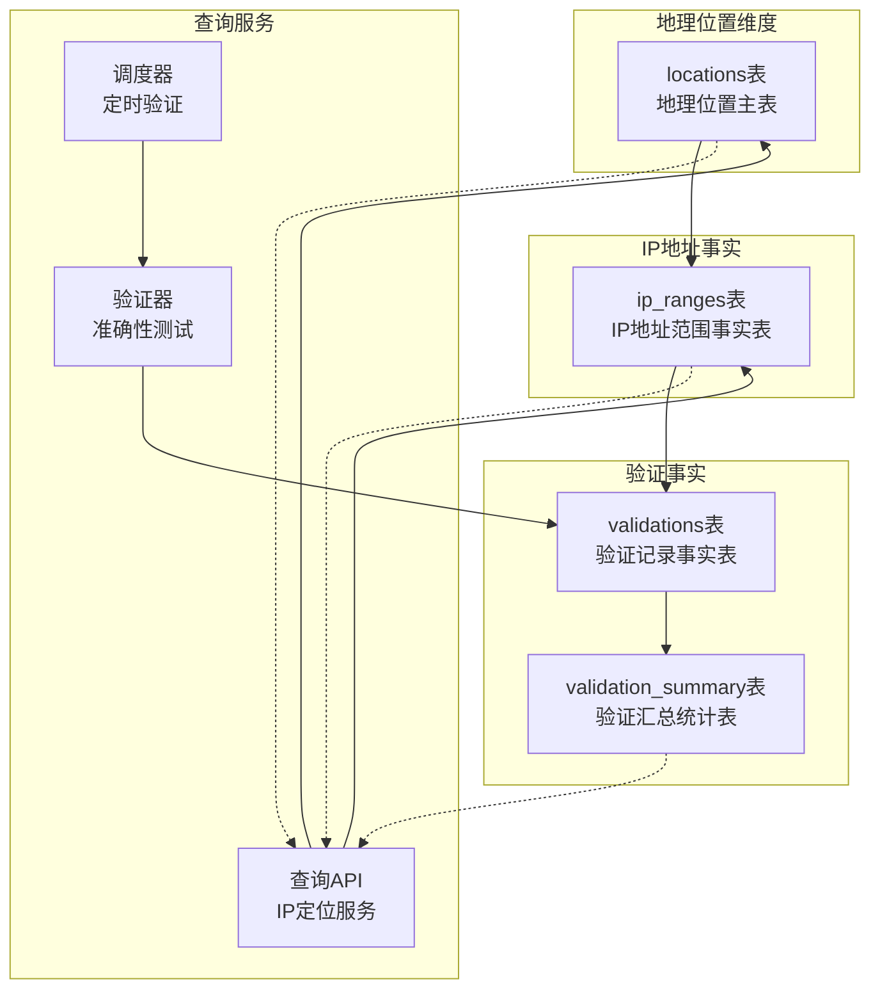
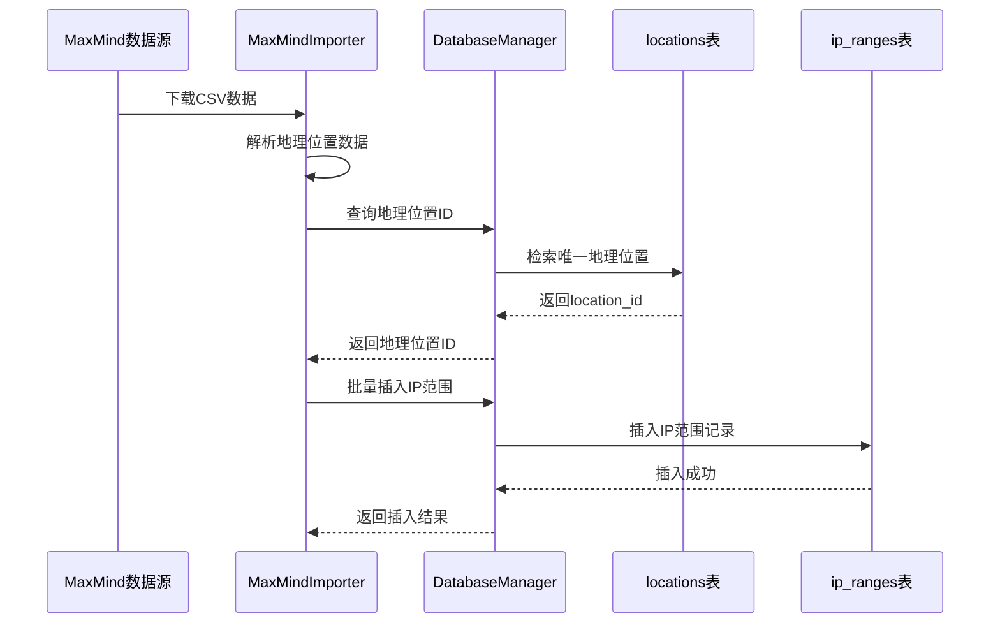
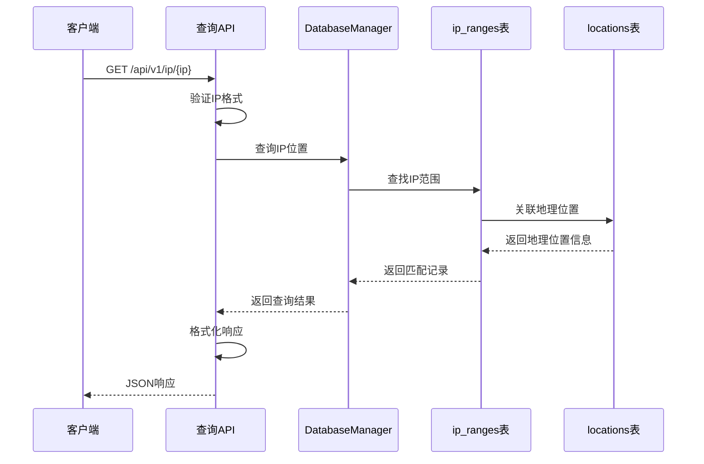
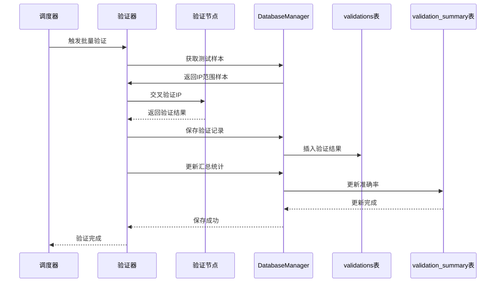

# 数据表结构

<cite>
**本文档引用的文件**
- [utils/database.py](file://utils/database.py)
- [config/settings.py](file://config/settings.py)
- [importer/maxmind_importer.py](file://importer/maxmind_importer.py)
- [validator/accuracy_tester.py](file://validator/accuracy_tester.py)
- [validator/scheduler.py](file://validator/scheduler.py)
- [query/api.py](file://query/api.py)
- [utils/ip_utils.py](file://utils/ip_utils.py)
- [scripts/init_db.py](file://scripts/init_db.py)
- [scripts/import_data.py](file://scripts/import_data.py)
</cite>

## 目录
1. [简介](#简介)
2. [项目结构概览](#项目结构概览)
3. [核心数据表结构](#核心数据表结构)
4. [表间关系与约束](#表间关系与约束)
5. [字段详细说明](#字段详细说明)
6. [索引设计](#索引设计)
7. [ER图](#er图)
8. [数据流分析](#数据流分析)
9. [性能考虑](#性能考虑)
10. [最佳实践建议](#最佳实践建议)

## 简介

IP地址定位系统是一个基于SQLite的地理位置数据库系统，主要用于存储和查询IP地址的地理位置信息。该系统通过导入MaxMind等数据源，建立IP地址范围与地理位置的映射关系，并提供实时的查询服务和准确性验证功能。

系统采用模块化设计，包含数据导入、数据库管理、查询服务、验证测试等多个组件，形成了完整的IP定位解决方案。

## 项目结构概览

**图表来源**
- [utils/database.py:70-185](file://utils/database.py#L70-L185)
- [importer/maxmind_importer.py:19-274](file://importer/maxmind_importer.py#L19-L274)

## 核心数据表结构

### locations表（地理位置表）

locations表存储全球各地理位置的详细信息，是整个数据库的核心维度表。

| 字段名 | 数据类型 | 约束条件 | 描述 |
|--------|----------|----------|------|
| id | INTEGER | PRIMARY KEY, AUTOINCREMENT | 主键，自增标识符 |
| country_code | TEXT | | 国家代码（如：CN、US） |
| country_name | TEXT | | 国家名称（如：中国、United States） |
| region_code | TEXT | | 省/州代码（如：BJ、CA） |
| region_name | TEXT | | 省/州名称（如：北京市、California） |
| city_name | TEXT | | 城市名称（如：Beijing、Los Angeles） |
| district | TEXT | | 区/县名称（如：朝阳区、Los Angeles County） |
| postal_code | TEXT | | 邮政编码 |
| latitude | REAL | | 纬度坐标 |
| longitude | REAL | | 经度坐标 |
| timezone | TEXT | | 时区信息 |
| locale_code | TEXT | | 语言/地区代码 |
| source | TEXT | | 数据来源标识 |
| UNIQUE | (country_code, region_code, city_name, district) | | 唯一约束，防止重复地理位置 |

### ip_ranges表（IP地址范围表）

ip_ranges表存储IP地址范围与地理位置的关联关系，是查询的核心表。

| 字段名 | 数据类型 | 约束条件 | 描述 |
|--------|----------|----------|------|
| id | INTEGER | PRIMARY KEY, AUTOINCREMENT | 主键，自增标识符 |
| network | TEXT | NOT NULL | CIDR格式的网络地址（如：192.168.1.0/24） |
| start_ip | INTEGER | NOT NULL | 起始IP地址的整数值 |
| end_ip | INTEGER | NOT NULL | 结束IP地址的整数值 |
| location_id | INTEGER | NOT NULL, FOREIGN KEY | 外键，引用locations表的id |
| source | TEXT | | 数据来源标识 |
| accuracy_radius | INTEGER | | 准确半径（公里） |
| is_anonymous_proxy | BOOLEAN | DEFAULT 0 | 是否为匿名代理IP |
| is_satellite_provider | BOOLEAN | DEFAULT 0 | 是否为卫星提供商IP |
| created_at | TIMESTAMP | DEFAULT CURRENT_TIMESTAMP | 记录创建时间 |
| UNIQUE | (network) | | 唯一约束，防止重复网络段 |

### validations表（验证记录表）

validations表记录IP定位准确性的验证历史。

| 字段名 | 数据类型 | 约束条件 | 描述 |
|--------|----------|----------|------|
| id | INTEGER | PRIMARY KEY, AUTOINCREMENT | 主键，自增标识符 |
| ip_range_id | INTEGER | NOT NULL, FOREIGN KEY | 外键，引用ip_ranges表的id |
| validator_node | TEXT | | 验证节点名称 |
| validator_location | TEXT | | 验证节点地理位置 |
| test_ip | TEXT | | 测试使用的IP地址 |
| expected_country | TEXT | | 预期的国家代码 |
| detected_country | TEXT | | 实际检测到的国家代码 |
| is_accurate | BOOLEAN | | 验证结果（准确/不准确） |
| response_time_ms | INTEGER | | 响应时间（毫秒） |
| test_method | TEXT | | 测试方法标识 |
| tested_at | TIMESTAMP | DEFAULT CURRENT_TIMESTAMP | 测试时间 |

### validation_summary表（验证汇总表）

validation_summary表存储按国家/地区维度的验证统计信息。

| 字段名 | 数据类型 | 约束条件 | 描述 |
|--------|----------|----------|------|
| id | INTEGER | PRIMARY KEY, AUTOINCREMENT | 主键，自增标识符 |
| country_code | TEXT | | 国家代码 |
| region_code | TEXT | | 省/州代码 |
| total_tests | INTEGER | DEFAULT 0 | 总测试次数 |
| accurate_tests | INTEGER | DEFAULT 0 | 准确测试次数 |
| accuracy_rate | REAL | | 准确率（计算字段） |
| last_tested_at | TIMESTAMP | | 最后测试时间 |
| UNIQUE | (country_code, region_code) | | 唯一约束，确保每个国家/地区组合只有一条汇总记录 |

**章节来源**
- [utils/database.py:80-147](file://utils/database.py#L80-L147)

## 表间关系与约束

### 外键关系

**图表来源**
- [utils/database.py:100-147](file://utils/database.py#L100-L147)

### 引用完整性约束

1. **locations表**：作为地理位置的主维度表，被其他表引用
2. **ip_ranges表**：通过location_id外键引用locations表
3. **validations表**：通过ip_range_id外键引用ip_ranges表
4. **validation_summary表**：通过country_code和region_code标识地理位置

**章节来源**
- [utils/database.py:113](file://utils/database.py#L113)
- [utils/database.py:131](file://utils/database.py#L131)

## 字段详细说明

### 地理位置相关字段

#### 国家和行政区划字段
- **country_code**：ISO 3166-1 alpha-2标准的国家代码，如CN、US、JP
- **country_name**：国家的英文名称，用于用户界面显示
- **region_code**：省/州的代码，如BJ、CA、NY
- **region_name**：省/州的名称
- **city_name**：城市名称
- **district**：区/县名称，支持空值表示无区级行政区

#### 坐标和时区字段
- **latitude/longitude**：GPS坐标，使用十进制度数表示
- **timezone**：IANA时区标识符，如Asia/Shanghai、America/Los_Angeles
- **postal_code**：邮政编码

#### 数据质量字段
- **locale_code**：语言和地区代码，默认为'en'
- **source**：数据来源标识，如'maxmind'

**章节来源**
- [utils/database.py:82-96](file://utils/database.py#L82-L96)
- [importer/maxmind_importer.py:84-97](file://importer/maxmind_importer.py#L84-L97)

### IP地址范围相关字段

#### 网络表示字段
- **network**：CIDR格式的网络地址，如'192.168.1.0/24'或'2001:db8::/32'
- **start_ip/end_ip**：IP地址范围的起始和结束值，使用整数存储以优化查询性能

#### 位置关联字段
- **location_id**：外键，指向locations表的地理位置记录
- **source**：数据来源标识

#### 质量和特殊用途字段
- **accuracy_radius**：IP定位的准确半径（公里），用于排序和筛选
- **is_anonymous_proxy**：标记是否为匿名代理IP
- **is_satellite_provider**：标记是否为卫星网络提供商IP
- **created_at**：记录创建时间戳

**章节来源**
- [utils/database.py:101-114](file://utils/database.py#L101-L114)
- [importer/maxmind_importer.py:109-129](file://importer/maxmind_importer.py#L109-L129)

### 验证相关字段

#### 基本验证信息
- **ip_range_id**：关联的IP范围记录
- **test_ip**：实际测试的IP地址
- **expected_country/detected_country**：预期和实际检测到的国家代码
- **is_accurate**：验证结果布尔值

#### 节点和性能字段
- **validator_node/validator_location**：验证节点的名称和地理位置
- **response_time_ms**：验证响应时间（毫秒）
- **test_method**：使用的验证方法标识

#### 时间追踪字段
- **tested_at**：测试执行时间戳

**章节来源**
- [utils/database.py:118-133](file://utils/database.py#L118-L133)
- [validator/accuracy_tester.py:256-283](file://validator/accuracy_tester.py#L256-L283)

### 汇总统计字段

#### 计数字段
- **total_tests**：累计测试总数
- **accurate_tests**：累计准确测试数

#### 比率计算字段
- **accuracy_rate**：准确率 = accurate_tests / total_tests
- **last_tested_at**：最后测试时间

#### 唯一标识字段
- **country_code/region_code**：组合唯一标识符

**章节来源**
- [utils/database.py:135-147](file://utils/database.py#L135-L147)

## 索引设计

系统为提高查询性能建立了以下索引：

### locations表索引
- **idx_locations_country**：按country_code建立索引，优化国家过滤查询
- **idx_locations_city**：按city_name建立索引，优化城市搜索

### ip_ranges表索引
- **idx_ip_ranges_start_end**：复合索引(start_ip, end_ip)，优化IP范围查询
- **idx_ip_ranges_network**：按network建立索引，优化网络段查找
- **idx_ip_ranges_location**：按location_id建立索引，优化地理位置关联查询

### validations表索引
- **idx_validations_range**：按ip_range_id建立索引，优化范围关联查询
- **idx_validations_accuracy**：按is_accurate建立索引，优化准确性过滤
- **idx_validations_tested_at**：按tested_at建立索引，优化时间序列查询

**章节来源**
- [utils/database.py:149-182](file://utils/database.py#L149-L182)

## ER图

**图表来源**
- [utils/database.py:70-185](file://utils/database.py#L70-L185)
- [query/api.py:115-143](file://query/api.py#L115-L143)

## 数据流分析

### 数据导入流程

**图表来源**
- [importer/maxmind_importer.py:145-258](file://importer/maxmind_importer.py#L145-L258)
- [utils/database.py:310-338](file://utils/database.py#L310-L338)

### 查询流程

**图表来源**
- [query/api.py:115-143](file://query/api.py#L115-L143)
- [utils/database.py:193-231](file://utils/database.py#L193-L231)

### 验证流程

**图表来源**
- [validator/scheduler.py:39-63](file://validator/scheduler.py#L39-L63)
- [validator/accuracy_tester.py:182-254](file://validator/accuracy_tester.py#L182-L254)

## 性能考虑

### 查询优化策略

1. **索引优化**
   - IP范围查询使用复合索引(start_ip, end_ip)
   - 地理位置查询使用单列索引(country_code, city_name)
   - 验证查询使用多列索引(is_accurate, tested_at)

2. **数据类型优化**
   - IP地址使用INTEGER存储，避免字符串比较
   - 使用BOOLEAN类型存储布尔值，节省空间

3. **查询优化**
   - locations表使用INSERT OR IGNORE避免重复插入
   - 查询时使用ORDER BY accuracy_radius ASC NULLS LAST优化准确性排序

### 内存和缓存策略

1. **批量处理**
   - 默认批量大小为10000，平衡内存使用和性能
   - 支持可配置的批处理大小

2. **API缓存**
   - 查询结果缓存5分钟
   - 统计信息缓存5分钟
   - 最大缓存10000条记录

### 数据一致性保证

1. **事务管理**
   - 自动事务提交和回滚
   - 上下文管理器确保连接正确关闭

2. **约束检查**
   - 外键约束确保引用完整性
   - 唯一约束防止重复数据
   - NOT NULL约束确保关键字段完整性

**章节来源**
- [config/settings.py:18-27](file://config/settings.py#L18-L27)
- [utils/database.py:21-33](file://utils/database.py#L21-L33)

## 最佳实践建议

### 数据导入最佳实践

1. **数据预处理**
   - 在导入前验证数据格式和完整性
   - 使用location_cache减少重复查询
   - 分批处理大数据集，避免内存溢出

2. **错误处理**
   - 对异常数据进行日志记录但不影响整体导入
   - 提供详细的错误信息便于问题排查

### 查询优化建议

1. **索引使用**
   - 根据查询模式调整索引策略
   - 定期分析查询计划优化性能

2. **缓存策略**
   - 合理设置缓存时间和大小
   - 对热点数据启用缓存

### 数据维护建议

1. **定期清理**
   - 清理过期的验证记录
   - 优化数据库文件大小

2. **监控指标**
   - 监控查询性能和数据库大小
   - 跟踪验证准确率变化趋势

### 安全考虑

1. **输入验证**
   - 严格验证IP地址格式
   - 防止SQL注入攻击

2. **权限控制**
   - 限制数据库文件访问权限
   - 使用环境变量存储敏感配置

**章节来源**
- [importer/base_importer.py:82-154](file://importer/base_importer.py#L82-L154)
- [query/api.py:127-142](file://query/api.py#L127-L142)