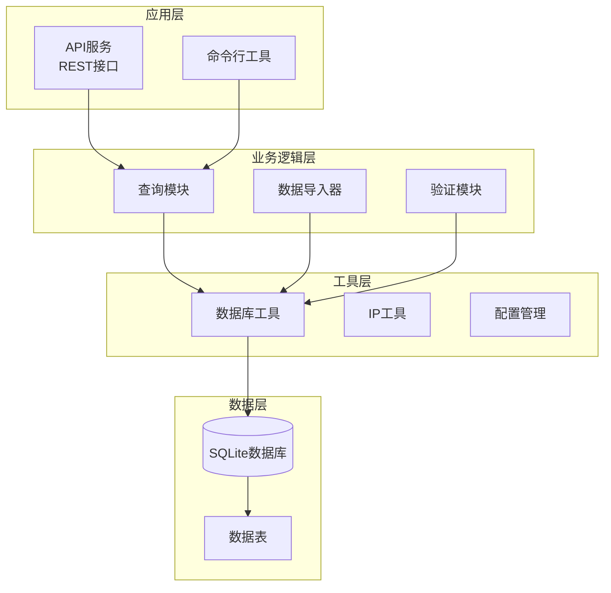
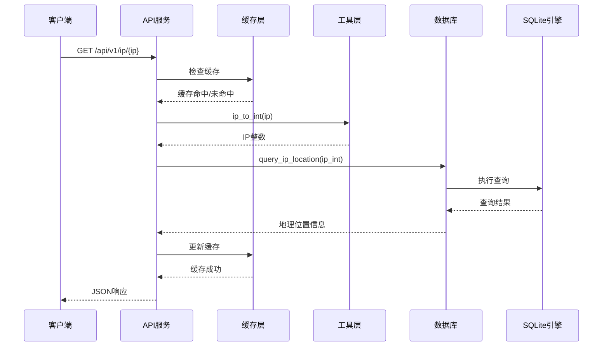
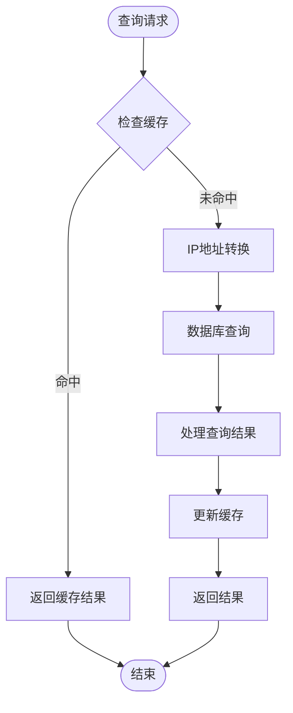
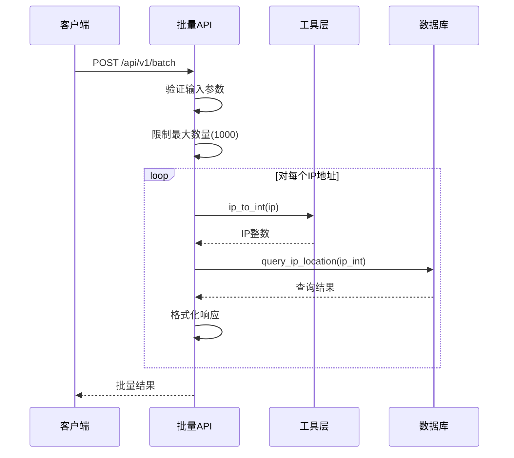
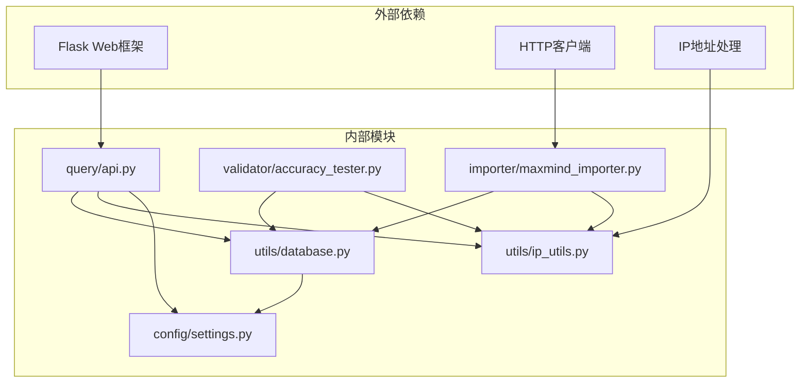
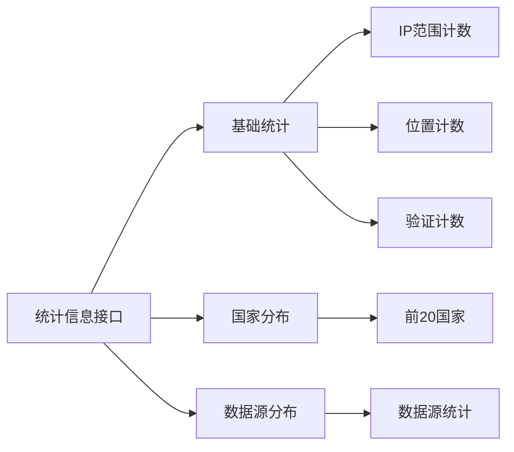

# 查询优化

<cite>
**本文档引用的文件**
- [query/api.py](file://query/api.py)
- [utils/database.py](file://utils/database.py)
- [utils/ip_utils.py](file://utils/ip_utils.py)
- [config/settings.py](file://config/settings.py)
- [scripts/init_db.py](file://scripts/init_db.py)
- [validator/accuracy_tester.py](file://validator/accuracy_tester.py)
- [importer/maxmind_importer.py](file://importer/maxmind_importer.py)
</cite>

## 目录
1. [简介](#简介)
2. [项目结构](#项目结构)
3. [核心组件](#核心组件)
4. [架构概览](#架构概览)
5. [详细组件分析](#详细组件分析)
6. [依赖关系分析](#依赖关系分析)
7. [性能考虑](#性能考虑)
8. [故障排除指南](#故障排除指南)
9. [结论](#结论)

## 简介

本文档深入分析IP地址定位系统的数据库查询优化策略，重点关注`query_ip_location`函数的SQL查询优化技术和整体查询性能优化方案。该系统采用SQLite作为存储引擎，通过精心设计的索引策略、优化的查询条件和缓存机制，实现了高效的IP地址地理位置查询服务。

## 项目结构

该项目采用模块化架构设计，主要包含以下核心模块：



**图表来源**
- [query/api.py:1-325](file://query/api.py#L1-L325)
- [utils/database.py:1-398](file://utils/database.py#L1-L398)
- [config/settings.py:1-44](file://config/settings.py#L1-L44)

**章节来源**
- [query/api.py:1-325](file://query/api.py#L1-L325)
- [utils/database.py:1-398](file://utils/database.py#L1-L398)
- [config/settings.py:1-44](file://config/settings.py#L1-L44)

## 核心组件

### 数据库管理系统

系统的核心是`DatabaseManager`类，提供了统一的数据库访问接口：

- **连接管理**: 使用上下文管理器确保连接正确关闭
- **查询接口**: 提供`fetchone`、`fetchall`、`execute`等方法
- **事务支持**: 自动事务管理和回滚机制
- **类型安全**: 支持参数化查询防止SQL注入

### IP地址处理工具

`ip_utils.py`模块提供了完整的IP地址处理功能：

- **IP转换**: 支持IPv4和IPv6地址的整数转换
- **范围计算**: CIDR格式与IP范围的相互转换
- **有效性验证**: IP地址格式和范围检查

### 查询优化核心

`query_ip_location`函数是查询优化的关键实现：

```sql
SELECT 
    r.id as range_id,
    r.network,
    r.accuracy_radius,
    r.source as ip_source,
    l.country_code,
    l.country_name,
    l.region_code,
    l.region_name,
    l.city_name,
    l.district,
    l.postal_code,
    l.latitude,
    l.longitude,
    l.timezone,
    l.locale_code
FROM ip_ranges r
JOIN locations l ON r.location_id = l.id
WHERE r.start_ip <= ? AND r.end_ip >= ?
ORDER BY r.accuracy_radius ASC NULLS LAST
LIMIT 1
```

**章节来源**
- [utils/database.py:193-231](file://utils/database.py#L193-L231)
- [utils/ip_utils.py:9-32](file://utils/ip_utils.py#L9-L32)

## 架构概览

系统采用分层架构设计，查询流程如下：



**图表来源**
- [query/api.py:115-143](file://query/api.py#L115-L143)
- [utils/database.py:193-231](file://utils/database.py#L193-L231)
- [utils/ip_utils.py:9-32](file://utils/ip_utils.py#L9-L32)

## 详细组件分析

### 查询优化策略详解

#### 1. WHERE条件优化

系统使用范围查询条件来高效定位IP地址：

```sql
WHERE r.start_ip <= ? AND r.end_ip >= ?
```

这种条件设计的优势：
- **对称性**: 同时检查起始和结束边界
- **索引友好**: 可以利用复合索引进行快速查找
- **精确匹配**: 确保IP地址完全包含在范围内

#### 2. JOIN操作优化

查询使用内连接确保数据完整性：

```sql
FROM ip_ranges r
JOIN locations l ON r.location_id = l.id
```

优化要点：
- **主键连接**: 基于主键的高效连接
- **选择性排序**: 先JOIN再过滤，减少中间结果集大小

#### 3. ORDER BY和LIMIT配合

```sql
ORDER BY r.accuracy_radius ASC NULLS LAST
LIMIT 1
```

这种组合的优化效果：
- **优先级排序**: 按精度半径升序排列
- **NULL值处理**: 使用`NULLS LAST`避免空值影响
- **早期终止**: `LIMIT 1`确保只返回最佳匹配

#### 4. 索引策略分析

系统建立了多维度索引体系：

```mermaid
graph LR
subgraph "IP范围表索引"
A[idx_ip_ranges_start_end<br/>复合索引: (start_ip, end_ip)]
B[idx_ip_ranges_network<br/>网络字段索引]
C[idx_ip_ranges_location<br/>外键索引]
end
subgraph "位置表索引"
D[idx_locations_country<br/>国家代码索引]
E[idx_locations_city<br/>城市名称索引]
end
subgraph "验证表索引"
F[idx_validations_range<br/>IP范围ID索引]
G[idx_validations_accuracy<br/>准确性索引]
H[idx_validations_tested_at<br/>时间戳索引]
end
```

**图表来源**
- [utils/database.py:149-181](file://utils/database.py#L149-L181)

**章节来源**
- [utils/database.py:149-181](file://utils/database.py#L149-L181)

### 缓存机制优化

系统实现了多层次缓存策略：



**图表来源**
- [query/api.py:31-60](file://query/api.py#L31-L60)
- [query/api.py:115-143](file://query/api.py#L115-L143)

**章节来源**
- [query/api.py:31-60](file://query/api.py#L31-L60)
- [config/settings.py:26-27](file://config/settings.py#L26-L27)

### 批量查询优化

批量查询接口支持高效的数据处理：



**图表来源**
- [query/api.py:145-204](file://query/api.py#L145-L204)

**章节来源**
- [query/api.py:145-204](file://query/api.py#L145-L204)

## 依赖关系分析

系统模块间的依赖关系清晰明确：



**图表来源**
- [requirements.txt:1-5](file://requirements.txt#L1-L5)
- [query/api.py:18-22](file://query/api.py#L18-L22)
- [utils/database.py:4-8](file://utils/database.py#L4-L8)

**章节来源**
- [requirements.txt:1-5](file://requirements.txt#L1-L5)
- [query/api.py:18-22](file://query/api.py#L18-L22)

## 性能考虑

### 查询性能监控

系统提供了多种性能监控和分析方法：

#### 1. EXPLAIN QUERY PLAN使用

虽然当前代码未直接实现EXPLAIN功能，但可以轻松集成：

```python
def explain_query_plan(db_manager, sql, params):
    """执行EXPLAIN QUERY PLAN分析查询计划"""
    explain_sql = f"EXPLAIN QUERY PLAN {sql}"
    return db_manager.fetchall(explain_sql, params)
```

#### 2. 查询统计信息

API提供了数据库统计信息接口：



**图表来源**
- [query/api.py:207-261](file://query/api.py#L207-L261)

#### 3. 缓存性能优化

系统实现了智能缓存机制：

- **TTL控制**: 可配置的缓存过期时间
- **容量限制**: 最大缓存条目数控制
- **LRU淘汰**: 过期缓存自动清理

**章节来源**
- [query/api.py:207-261](file://query/api.py#L207-L261)
- [query/api.py:31-60](file://query/api.py#L31-L60)

### 批量查询vs单次查询

#### 性能差异分析

| 特性 | 单次查询 | 批量查询 |
|------|----------|----------|
| 连接开销 | 每次查询建立连接 | 复用数据库连接 |
| 缓存效率 | 独立缓存 | 共享缓存 |
| 并发处理 | 串行执行 | 并行处理 |
| 内存使用 | 低 | 中等 |
| 响应时间 | 快 | 可能较慢 |

#### 优化建议

**单次查询场景**：
- 使用缓存装饰器减少重复查询
- 实现连接池复用数据库连接
- 优化WHERE条件的索引使用

**批量查询场景**：
- 控制批量大小（建议1000以内）
- 实现异步处理提升并发性能
- 使用事务批量提交减少开销

### 索引优化技巧

#### 1. 复合索引设计

```sql
CREATE INDEX idx_ip_ranges_start_end ON ip_ranges(start_ip, end_ip);
```

这种设计的优势：
- **范围查询优化**: 支持高效的范围查找
- **顺序访问**: 按IP范围有序访问
- **选择性高**: 能够快速缩小搜索范围

#### 2. 索引维护策略

- **定期重建**: 定期重建索引保持最佳性能
- **统计信息更新**: 定期更新表统计信息
- **监控索引使用**: 监控索引命中率

**章节来源**
- [utils/database.py:149-181](file://utils/database.py#L149-L181)

## 故障排除指南

### 常见查询问题

#### 1. 查询性能问题

**症状**: 查询响应时间过长

**诊断步骤**:
1. 检查索引是否正确使用
2. 分析查询执行计划
3. 监控数据库连接状态
4. 检查缓存命中率

**解决方案**:
- 确保WHERE条件使用索引字段
- 优化复杂查询的执行计划
- 调整缓存配置参数
- 实施连接池管理

#### 2. 内存使用过高

**症状**: 应用内存持续增长

**排查方法**:
1. 检查缓存配置是否合理
2. 监控批量查询的内存使用
3. 分析数据库连接泄漏
4. 检查异常处理机制

**解决措施**:
- 调整缓存最大容量
- 实现缓存清理策略
- 优化批量处理的内存管理
- 加强异常处理和资源释放

#### 3. 数据一致性问题

**症状**: 查询结果不一致

**检查清单**:
1. 验证数据导入的完整性
2. 检查外键约束的有效性
3. 确认事务处理的正确性
4. 监控并发访问的冲突

**修复方案**:
- 实施数据验证机制
- 加强事务管理
- 实现重试和补偿机制
- 建立数据备份和恢复策略

**章节来源**
- [utils/database.py:21-34](file://utils/database.py#L21-L34)
- [query/api.py:290-304](file://query/api.py#L290-L304)

## 结论

该IP地址定位系统通过精心设计的查询优化策略，在保证数据准确性的同时实现了高效的查询性能。核心优化技术包括：

1. **索引优化**: 多维度复合索引设计，特别是`(start_ip, end_ip)`复合索引
2. **查询优化**: 使用范围查询条件和精确的JOIN操作
3. **缓存策略**: 智能缓存机制减少重复查询开销
4. **批量处理**: 高效的批量查询接口设计
5. **监控分析**: 完善的性能监控和分析工具

这些优化措施使得系统能够处理大规模的IP地址查询需求，同时保持良好的响应时间和资源利用率。对于生产环境部署，建议根据实际数据规模调整缓存参数和索引策略，并建立完善的监控告警机制。