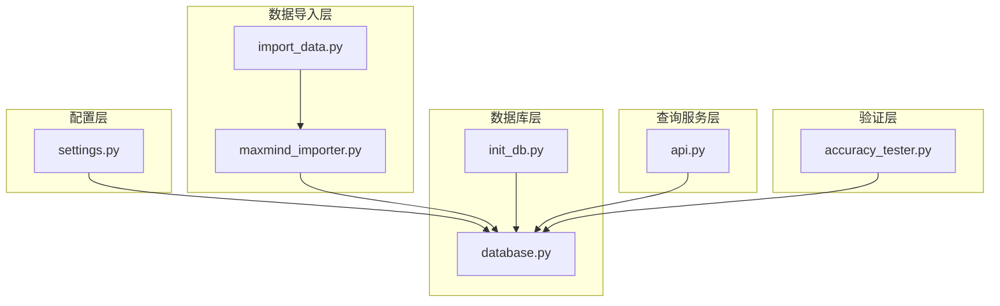
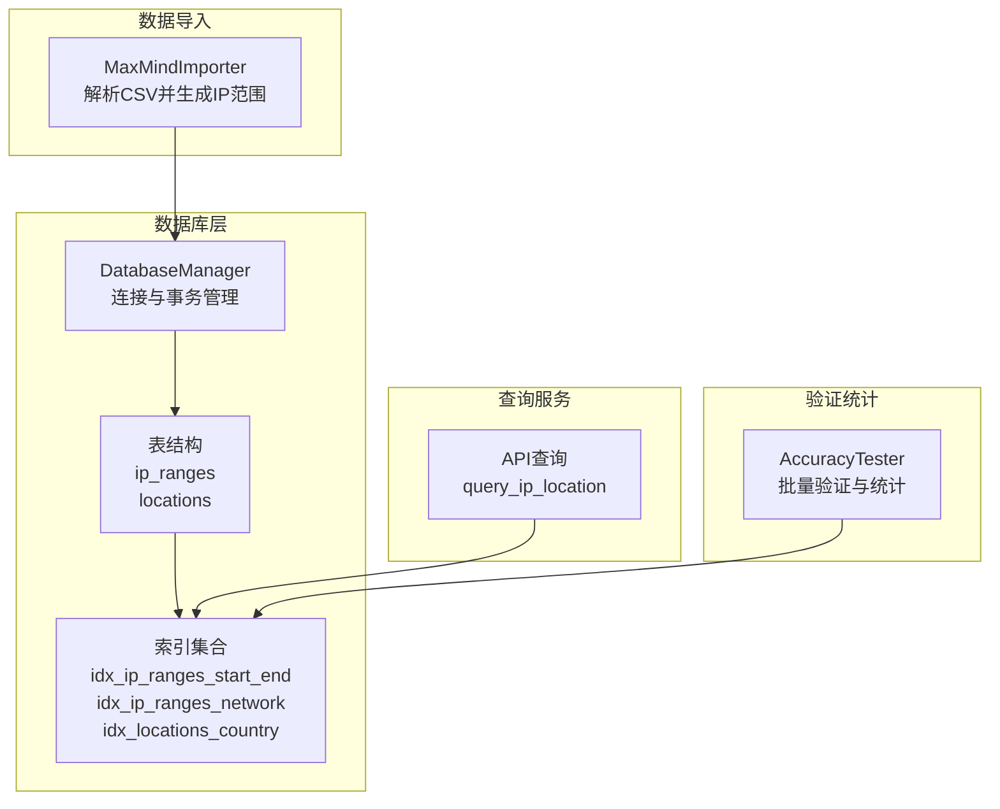
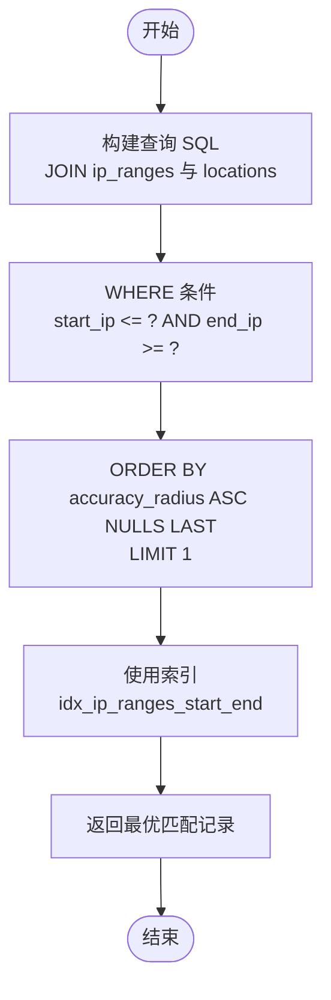
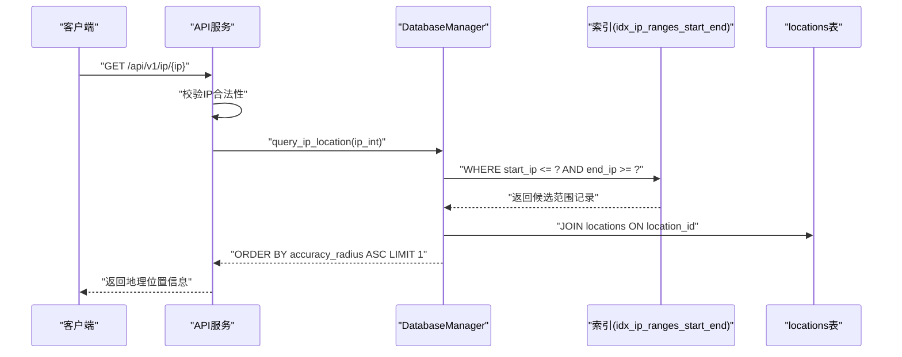
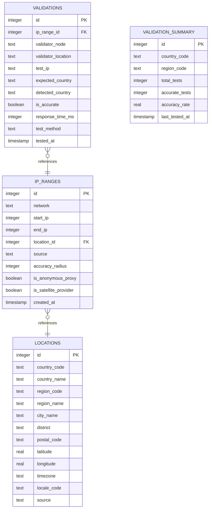
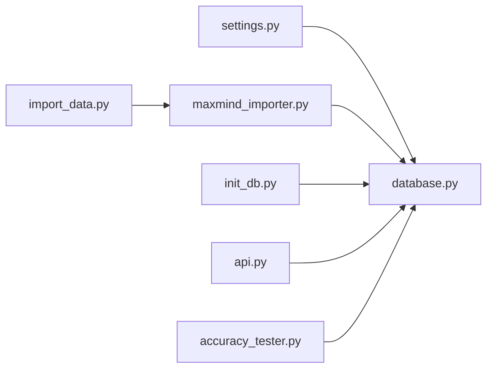

# 索引策略

<cite>
**本文引用的文件**
- [settings.py](file://config/settings.py)
- [database.py](file://utils/database.py)
- [maxmind_importer.py](file://importer/maxmind_importer.py)
- [init_db.py](file://scripts/init_db.py)
- [api.py](file://query/api.py)
- [ip_utils.py](file://utils/ip_utils.py)
- [import_data.py](file://scripts/import_data.py)
- [accuracy_tester.py](file://validator/accuracy_tester.py)
</cite>

## 目录
1. [简介](#简介)
2. [项目结构](#项目结构)
3. [核心组件](#核心组件)
4. [架构总览](#架构总览)
5. [详细组件分析](#详细组件分析)
6. [依赖分析](#依赖分析)
7. [性能考量](#性能考量)
8. [故障排查指南](#故障排查指南)
9. [结论](#结论)
10. [附录](#附录)

## 简介
本技术文档围绕数据库索引策略展开，重点解释以下关键索引的设计目的与查询优化效果：
- idx_ip_ranges_start_end：针对 IP 范围查询的核心索引
- idx_ip_ranges_network：针对网络字段的索引
- idx_locations_country：针对国家代码的索引

文档还将深入分析 IP 地址范围查询的性能优化原理，解释为何选择 start_ip、end_ip 复合索引以及 network 索引；说明索引对插入性能的影响与权衡；提供索引使用情况的监控方法与性能调优建议，并给出查询计划分析与索引选择的最佳实践。

## 项目结构
该项目是一个基于 SQLite 的 IP 地址定位系统，主要模块包括：
- 配置层：数据库路径、导入批处理大小、API 服务配置等
- 数据导入层：从 MaxMind 下载并解析 CSV，生成 IP 范围与位置数据
- 数据库层：创建表与索引、提供查询与批量插入能力
- 查询服务层：提供 REST API，支持单 IP 查询与批量查询
- 验证层：对 IP 归属进行跨节点验证并维护统计

图表来源
- [settings.py](file://config/settings.py)
- [maxmind_importer.py](file://importer/maxmind_importer.py)
- [import_data.py](file://scripts/import_data.py)
- [database.py](file://utils/database.py)
- [init_db.py](file://scripts/init_db.py)
- [api.py](file://query/api.py)
- [accuracy_tester.py](file://validator/accuracy_tester.py)

章节来源
- [settings.py](file://config/settings.py)
- [database.py](file://utils/database.py)
- [maxmind_importer.py](file://importer/maxmind_importer.py)
- [init_db.py](file://scripts/init_db.py)
- [api.py](file://query/api.py)
- [accuracy_tester.py](file://validator/accuracy_tester.py)

## 核心组件
- 数据库初始化与索引创建：在初始化数据库时创建所有表与索引，确保查询性能与数据完整性
- IP 范围查询：通过 start_ip、end_ip 范围匹配定位 IP 所属地理信息
- 批量导入：以批处理方式导入大量 IP 范围数据，减少事务开销
- API 查询：提供单 IP 与批量查询接口，内置简单内存缓存提升响应速度
- 验证统计：维护验证汇总表，支持按国家/区域维度统计准确性

章节来源
- [database.py](file://utils/database.py)
- [api.py](file://query/api.py)
- [accuracy_tester.py](file://validator/accuracy_tester.py)

## 架构总览
下图展示了索引策略在整体架构中的作用与影响路径。

图表来源
- [maxmind_importer.py](file://importer/maxmind_importer.py)
- [database.py](file://utils/database.py)
- [api.py](file://query/api.py)
- [accuracy_tester.py](file://validator/accuracy_tester.py)

## 详细组件分析

### 索引设计与查询优化目标
- idx_ip_ranges_start_end：复合索引，覆盖 start_ip、end_ip，用于快速定位包含目标 IP 的范围记录
- idx_ip_ranges_network：单列索引，覆盖 network 文本字段，便于按网络字符串检索
- idx_locations_country：单列索引，覆盖 country_code，用于按国家过滤与统计

这些索引服务于以下查询场景：
- 单 IP 地址定位：通过 WHERE start_ip <= ? AND end_ip >= ? 进行范围匹配
- 按国家过滤：JOIN locations 并按 country_code 进行过滤
- 批量查询与统计：JOIN 与聚合查询的高效执行

章节来源
- [database.py](file://utils/database.py)

### IP 地址范围查询的性能优化
- 查询条件设计：WHERE start_ip <= ? AND end_ip >= ? 可以利用复合索引 idx_ip_ranges_start_end 进行高效范围扫描
- 排序与限制：ORDER BY accuracy_radius ASC NULLS LAST 与 LIMIT 1 保证只返回精度最高的匹配项，避免全表扫描
- 索引选择依据：
  - 复合索引优先：SQLite 的 B-Tree 索引对范围查询非常友好，start_ip、end_ip 复合索引能显著降低扫描范围
  - network 索引：便于按网络字符串进行检索，适合导入阶段的网络字段索引
  - country 索引：JOIN locations 时按国家过滤，提高连接与筛选效率

图表来源
- [database.py](file://utils/database.py)

章节来源
- [database.py](file://utils/database.py)

### 为什么选择 start_ip、end_ip 复合索引以及 network 索引
- start_ip、end_ip 复合索引：
  - 能够高效支持范围查询，避免对整张表进行逐行扫描
  - 在 WHERE 条件中同时约束 start_ip 与 end_ip，可被索引有效利用
- network 索引：
  - network 字段存储 CIDR 字符串，在导入与检索时需要按字符串匹配
  - 单列索引可加速 LIKE 或精确匹配查询

章节来源
- [database.py](file://utils/database.py)

### 插入性能影响与权衡
- 插入成本：每次 INSERT 操作都会更新所有相关索引，导致写入延迟增加
- 批量插入：通过批量插入（batch_insert_ip_ranges）减少事务提交次数，显著降低索引维护开销
- 索引数量：索引越多，写入越慢；但读取性能提升明显
- 建议：
  - 导入阶段采用大批次插入，导入完成后进行一次 VACUUM（SQLite 提供）以整理碎片
  - 对于频繁更新的表，可考虑在导入完成后重建索引或调整索引策略

章节来源
- [database.py](file://utils/database.py)
- [maxmind_importer.py](file://importer/maxmind_importer.py)

### 索引使用情况监控与性能调优
- 查询计划分析（概念性说明）：
  - SQLite 提供 EXPLAIN QUERY PLAN 用于查看查询执行计划
  - 关注是否使用了预期索引、是否有全表扫描、排序与连接的成本
- 实际监控方法（基于现有实现）：
  - API 层内置简单内存缓存，减少重复查询对数据库的压力
  - 统计接口可观察表规模与分布，辅助判断索引有效性
- 性能调优建议：
  - 保持表与索引统计信息更新（SQLite 会自动维护）
  - 对热点查询建立合适的复合索引
  - 控制查询复杂度，避免不必要的排序与连接
  - 对导入阶段进行批量化与分片处理，降低写入峰值

章节来源
- [api.py](file://query/api.py)
- [accuracy_tester.py](file://validator/accuracy_tester.py)

### 查询流程与索引交互

图表来源
- [api.py](file://query/api.py)
- [database.py](file://utils/database.py)

章节来源
- [api.py](file://query/api.py)
- [database.py](file://utils/database.py)

### 数据模型与索引关系

图表来源
- [database.py](file://utils/database.py)

章节来源
- [database.py](file://utils/database.py)

## 依赖分析
- 导入流程依赖数据库层创建表与索引
- 查询服务依赖数据库层提供的查询函数
- 验证统计依赖数据库层的统计接口与更新逻辑
- 配置层为各模块提供统一的数据库路径与运行参数

图表来源
- [settings.py](file://config/settings.py)
- [import_data.py](file://scripts/import_data.py)
- [maxmind_importer.py](file://importer/maxmind_importer.py)
- [database.py](file://utils/database.py)
- [init_db.py](file://scripts/init_db.py)
- [api.py](file://query/api.py)
- [accuracy_tester.py](file://validator/accuracy_tester.py)

章节来源
- [settings.py](file://config/settings.py)
- [database.py](file://utils/database.py)
- [maxmind_importer.py](file://importer/maxmind_importer.py)
- [init_db.py](file://scripts/init_db.py)
- [api.py](file://query/api.py)
- [accuracy_tester.py](file://validator/accuracy_tester.py)

## 性能考量
- 写入性能：索引会增加 INSERT/UPDATE/DELETE 的成本，应通过批量插入与合理的事务边界控制
- 读取性能：复合索引与单列索引共同提升查询效率，配合 LIMIT 与排序优化
- 缓存策略：API 层的内存缓存可显著降低重复查询的数据库压力
- 统计与监控：通过统计接口与验证报告了解数据分布与准确性，指导索引与查询优化

## 故障排查指南
- 查询缓慢：
  - 检查是否命中了预期索引（可通过 EXPLAIN QUERY PLAN 观察）
  - 确认 WHERE 条件是否能充分利用复合索引
  - 避免在 WHERE 中对索引列进行函数计算
- 插入卡顿：
  - 确认是否使用了批量插入
  - 导入完成后执行数据库整理（SQLite 提供 VACUUM）
- 数据不一致：
  - 检查外键约束与唯一约束
  - 确认导入流程中位置 ID 的获取与复用

章节来源
- [database.py](file://utils/database.py)
- [api.py](file://query/api.py)

## 结论
本项目通过合理的索引设计（复合索引与单列索引）与批量导入策略，在保证查询性能的同时兼顾了写入效率。针对 IP 地址范围查询，start_ip、end_ip 复合索引与 network 索引提供了高效的范围匹配能力；country 索引提升了 JOIN 与过滤的性能。结合 API 缓存与统计监控，可进一步优化整体性能与稳定性。

## 附录
- 索引清单与用途概览：
  - idx_ip_ranges_start_end：范围查询（start_ip、end_ip）
  - idx_ip_ranges_network：网络字符串检索（network）
  - idx_locations_country：国家过滤（country_code）
  - 其他索引：location_id、city_name、validations 的 ip_range_id、is_accurate、tested_at 等，用于验证与统计场景

章节来源
- [database.py](file://utils/database.py)