# 部署与运维

<cite>
**本文档引用的文件**
- [requirements.txt](file://requirements.txt)
- [config/settings.py](file://config/settings.py)
- [utils/database.py](file://utils/database.py)
- [utils/ip_utils.py](file://utils/ip_utils.py)
- [query/api.py](file://query/api.py)
- [importer/maxmind_importer.py](file://importer/maxmind_importer.py)
- [scripts/init_db.py](file://scripts/init_db.py)
- [scripts/import_data.py](file://scripts/import_data.py)
- [scripts/insert_test_data.py](file://scripts/insert_test_data.py)
- [validator/scheduler.py](file://validator/scheduler.py)
- [validator/accuracy_tester.py](file://validator/accuracy_tester.py)
- [validator/node_server.py](file://validator/node_server.py)
- [validator/node_client.py](file://validator/node_client.py)
</cite>

## 目录
1. [简介](#简介)
2. [项目结构](#项目结构)
3. [核心组件](#核心组件)
4. [架构概览](#架构概览)
5. [详细组件分析](#详细组件分析)
6. [依赖关系分析](#依赖关系分析)
7. [性能考虑](#性能考虑)
8. [故障排除指南](#故障排除指南)
9. [结论](#结论)
10. [附录](#附录)

## 简介

IP地址定位系统是一个基于Python开发的地理位置查询服务，能够根据IP地址查询对应的地理位置信息。该系统采用SQLite作为数据存储，提供REST API接口，支持批量查询、准确性验证和分布式验证节点管理。

系统主要功能包括：
- IP地址地理位置查询
- 批量IP查询处理
- MaxMind数据导入
- 地理位置准确性验证
- 分布式验证节点管理
- 内存缓存机制优化查询性能

## 项目结构

项目采用模块化设计，按照功能层次组织代码结构：

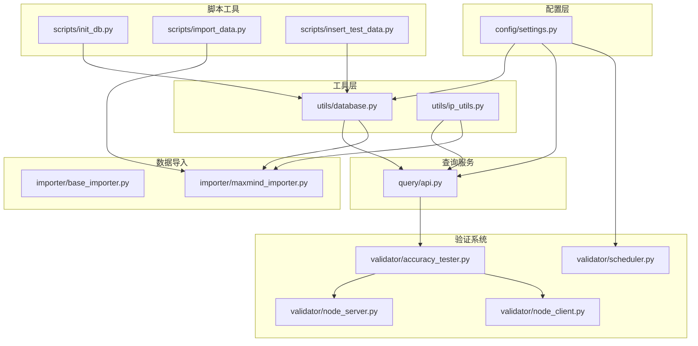

**图表来源**
- [config/settings.py:1-44](file://config/settings.py#L1-L44)
- [utils/database.py:1-398](file://utils/database.py#L1-L398)
- [query/api.py:1-325](file://query/api.py#L1-L325)

**章节来源**
- [config/settings.py:1-44](file://config/settings.py#L1-L44)
- [requirements.txt:1-5](file://requirements.txt#L1-L5)

## 核心组件

### 数据库管理系统
数据库管理系统负责所有数据持久化操作，采用SQLite作为存储引擎，提供连接池管理和事务处理。

### IP地址工具集
提供完整的IP地址处理功能，包括IP转换、CIDR计算、有效性验证等。

### 查询API服务
基于Flask框架构建的REST API服务，提供IP查询、批量查询和统计信息接口。

### 数据导入器
支持MaxMind GeoLite2数据的自动下载和导入，处理地理位置和IP范围数据。

### 验证系统
包含准确性测试器、调度器和分布式验证节点，确保地理位置数据的准确性。

**章节来源**
- [utils/database.py:15-190](file://utils/database.py#L15-L190)
- [utils/ip_utils.py:9-282](file://utils/ip_utils.py#L9-L282)
- [query/api.py:18-325](file://query/api.py#L18-L325)

## 架构概览

系统采用分层架构设计，各层职责明确，耦合度低：

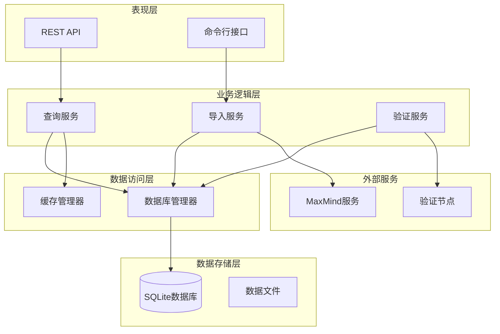

**图表来源**
- [query/api.py:24-325](file://query/api.py#L24-L325)
- [utils/database.py:15-190](file://utils/database.py#L15-L190)
- [validator/scheduler.py:27-123](file://validator/scheduler.py#L27-L123)

## 详细组件分析

### 数据库架构设计

系统采用三层表结构设计，确保数据完整性和查询效率：

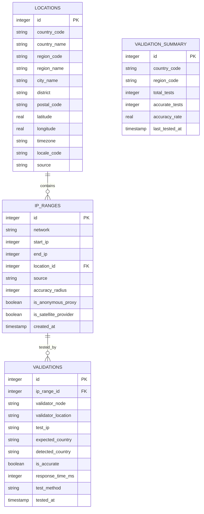

**图表来源**
- [utils/database.py:80-185](file://utils/database.py#L80-L185)

#### 数据库连接管理
数据库管理器采用上下文管理器模式，确保连接的正确打开和关闭：

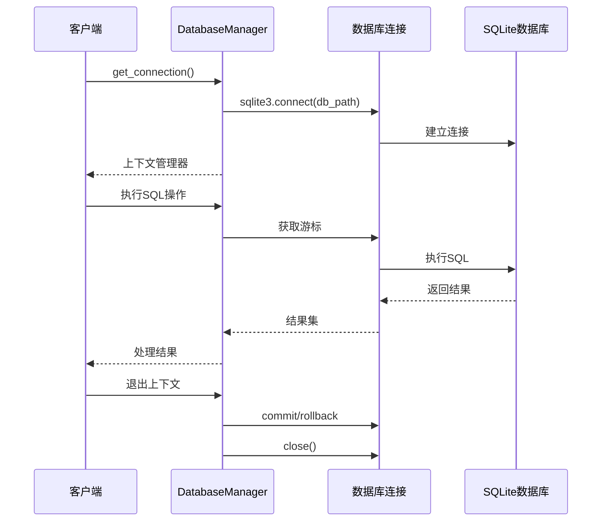

**图表来源**
- [utils/database.py:21-34](file://utils/database.py#L21-L34)

**章节来源**
- [utils/database.py:15-190](file://utils/database.py#L15-L190)

### 查询API服务

查询API服务提供RESTful接口，支持单IP查询和批量查询：

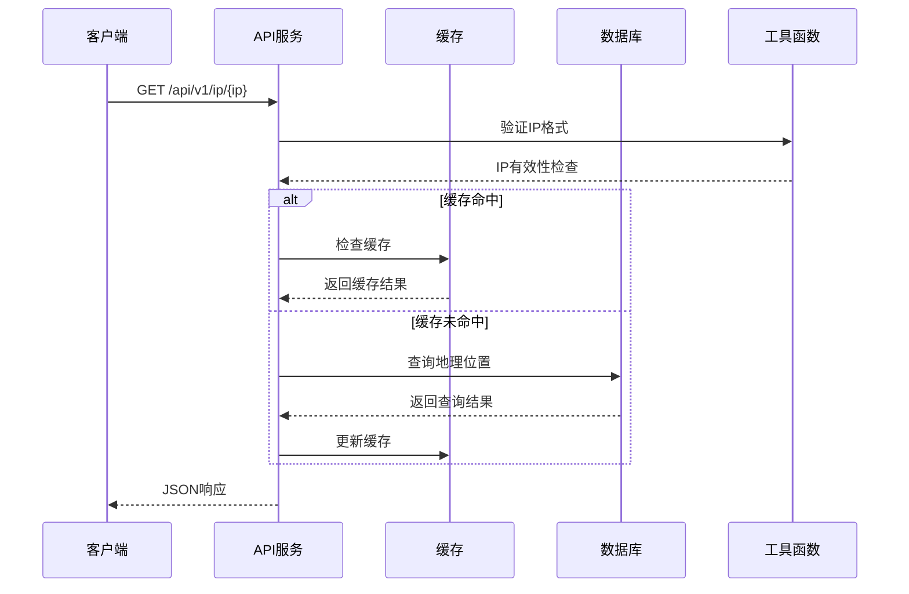

**图表来源**
- [query/api.py:115-143](file://query/api.py#L115-L143)

#### 缓存机制设计
系统实现了简单的内存缓存机制，支持TTL控制和大小限制：

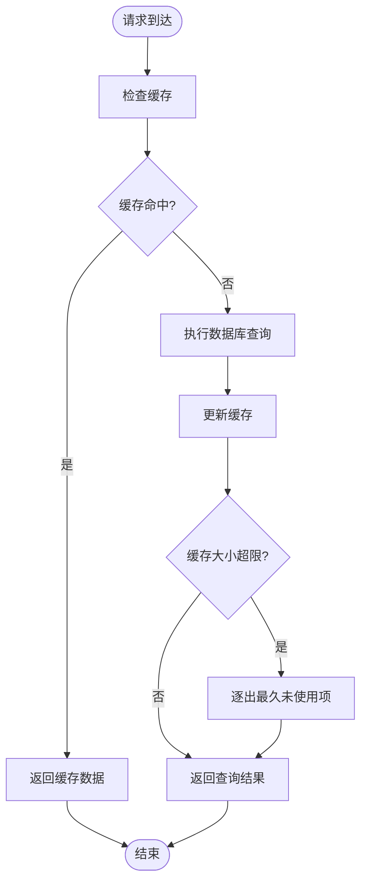

**图表来源**
- [query/api.py:31-61](file://query/api.py#L31-L61)

**章节来源**
- [query/api.py:18-325](file://query/api.py#L18-L325)

### 数据导入系统

数据导入系统支持MaxMind GeoLite2数据的自动下载和处理：

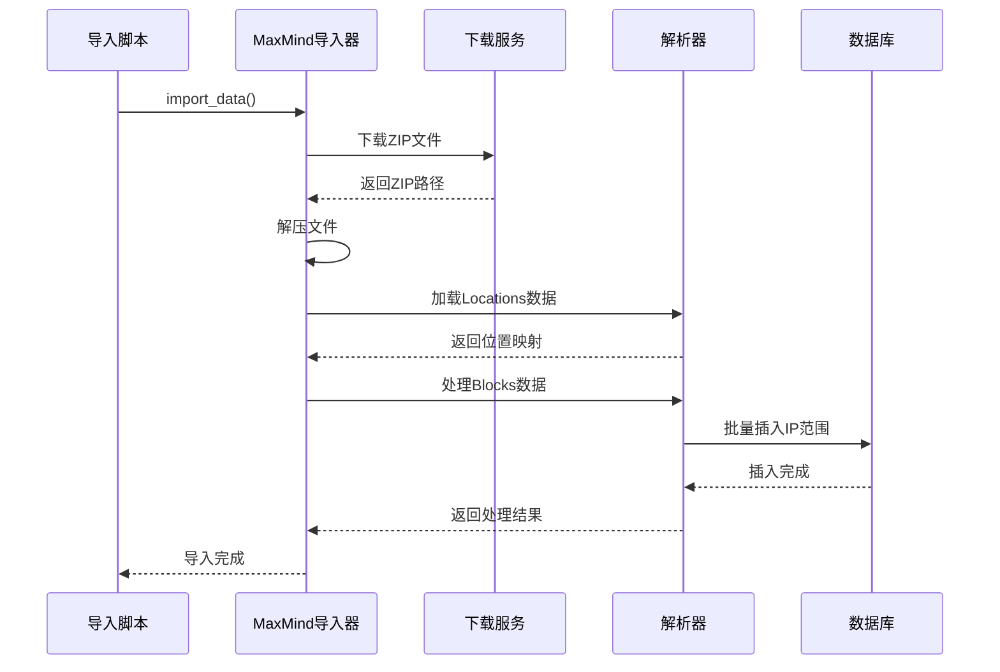

**图表来源**
- [importer/maxmind_importer.py:145-258](file://importer/maxmind_importer.py#L145-L258)

#### 数据处理流程
导入过程采用分批处理策略，确保大数据量下的稳定性：

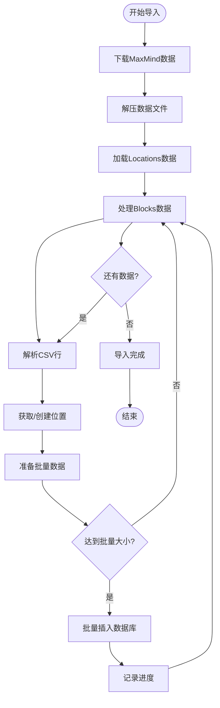

**图表来源**
- [importer/maxmind_importer.py:176-256](file://importer/maxmind_importer.py#L176-L256)

**章节来源**
- [importer/maxmind_importer.py:19-274](file://importer/maxmind_importer.py#L19-L274)

### 验证系统架构

验证系统采用分布式架构，支持多节点并行验证：

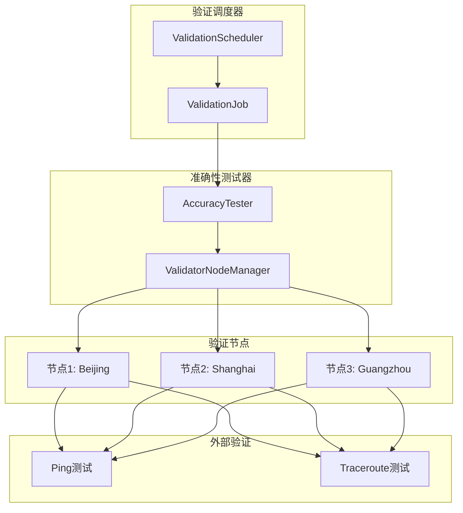

**图表来源**
- [validator/scheduler.py:27-123](file://validator/scheduler.py#L27-L123)
- [validator/accuracy_tester.py:27-180](file://validator/accuracy_tester.py#L27-L180)

#### 验证流程设计
准确性测试器实现了智能的交叉验证机制：

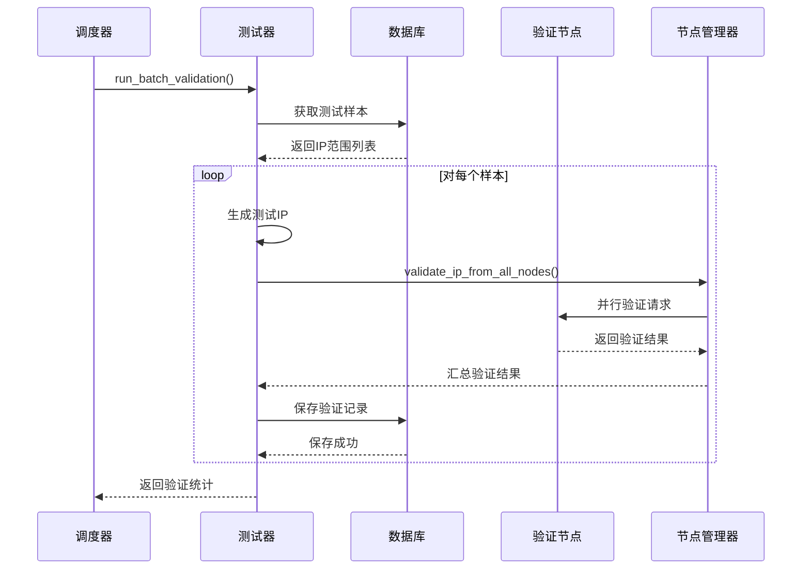

**图表来源**
- [validator/accuracy_tester.py:182-254](file://validator/accuracy_tester.py#L182-L254)

**章节来源**
- [validator/scheduler.py:27-265](file://validator/scheduler.py#L27-L265)
- [validator/accuracy_tester.py:27-373](file://validator/accuracy_tester.py#L27-L373)

## 依赖关系分析

系统依赖关系清晰，主要依赖包括：

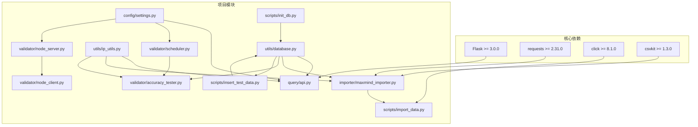

**图表来源**
- [requirements.txt:1-5](file://requirements.txt#L1-L5)
- [config/settings.py:14-43](file://config/settings.py#L14-L43)

**章节来源**
- [requirements.txt:1-5](file://requirements.txt#L1-L5)

## 性能考虑

### 数据库性能优化

系统在数据库层面采用了多项优化措施：

1. **索引优化**：为常用查询字段建立索引，包括IP范围的起止IP、网络地址、地理位置的国家和城市字段
2. **批量操作**：导入过程中采用批量插入，减少数据库往返次数
3. **连接管理**：使用上下文管理器确保连接正确释放
4. **查询优化**：地理位置查询使用精确匹配和排序优化

### 缓存策略

API服务实现了两级缓存机制：

1. **内存缓存**：使用字典存储最近查询结果，支持TTL过期和大小限制
2. **统计缓存**：统计数据查询结果缓存5分钟，减少重复计算

### 网络优化

验证节点服务支持跨平台网络测试：

1. **平台适配**：自动检测操作系统，使用相应的网络命令
2. **超时控制**：设置合理的超时时间，避免长时间阻塞
3. **并发处理**：支持多节点并行验证，提高验证效率

**章节来源**
- [utils/database.py:149-181](file://utils/database.py#L149-L181)
- [query/api.py:26-61](file://query/api.py#L26-L61)

## 故障排除指南

### 常见问题诊断

#### 数据库连接问题
- **症状**：查询API返回数据库连接错误
- **原因**：数据库文件损坏或权限不足
- **解决方案**：重新初始化数据库，检查文件权限

#### IP导入失败
- **症状**：数据导入脚本报错，无法下载MaxMind数据
- **原因**：网络连接问题或许可证密钥无效
- **解决方案**：检查网络连接，验证MaxMind许可证密钥

#### 验证节点不可达
- **症状**：准确性测试失败，验证节点返回错误
- **原因**：节点服务未启动或API密钥不正确
- **解决方案**：启动验证节点服务，检查API密钥配置

### 错误日志分析

系统提供了详细的日志记录机制：

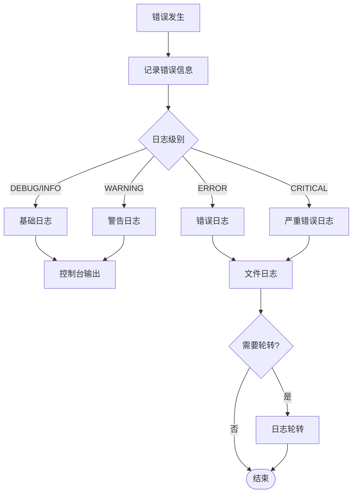

**图表来源**
- [config/settings.py:40-44](file://config/settings.py#L40-L44)

### 性能瓶颈识别

#### 数据库性能瓶颈
- **症状**：查询响应时间过长
- **诊断方法**：检查数据库索引使用情况，分析慢查询日志
- **优化方案**：添加缺失的索引，优化查询语句

#### 缓存失效问题
- **症状**：缓存命中率低
- **诊断方法**：监控缓存统计信息
- **优化方案**：调整缓存TTL和大小限制

**章节来源**
- [config/settings.py:40-44](file://config/settings.py#L40-L44)

## 结论

IP地址定位系统是一个功能完整、架构清晰的地理位置查询服务。系统采用模块化设计，具有良好的可维护性和扩展性。

主要优势：
- **模块化架构**：清晰的分层设计，职责分离明确
- **性能优化**：数据库索引、缓存机制、批量处理等多重优化
- **可靠性保障**：完善的错误处理和日志记录机制
- **可扩展性**：支持分布式验证节点和多实例部署

建议的改进方向：
- 实现更高级的缓存策略（如Redis）
- 添加数据库连接池管理
- 增强监控和告警机制
- 支持更多的数据源和格式

## 附录

### 部署配置清单

#### 环境变量
- `MAXMIND_LICENSE_KEY`: MaxMind许可证密钥
- `VALIDATOR_API_KEY`: 验证节点API密钥

#### 关键配置参数
- `DATABASE_PATH`: 数据库文件路径
- `API_HOST/API_PORT`: API服务监听地址和端口
- `CACHE_TTL/CACHE_MAX_SIZE`: 缓存配置
- `BATCH_SIZE/IMPORT_CHUNK_SIZE`: 导入配置

### 运维最佳实践

#### 监控指标
- API响应时间
- 数据库查询性能
- 缓存命中率
- 验证成功率

#### 备份策略
- 定期备份数据库文件
- 备份配置文件
- 备份日志文件

#### 安全配置
- 限制API访问频率
- 使用HTTPS协议
- 定期更新许可证密钥