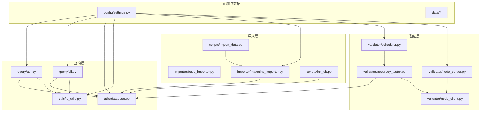
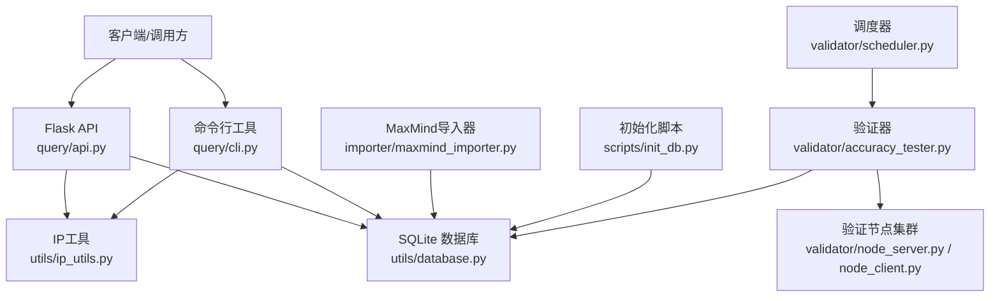
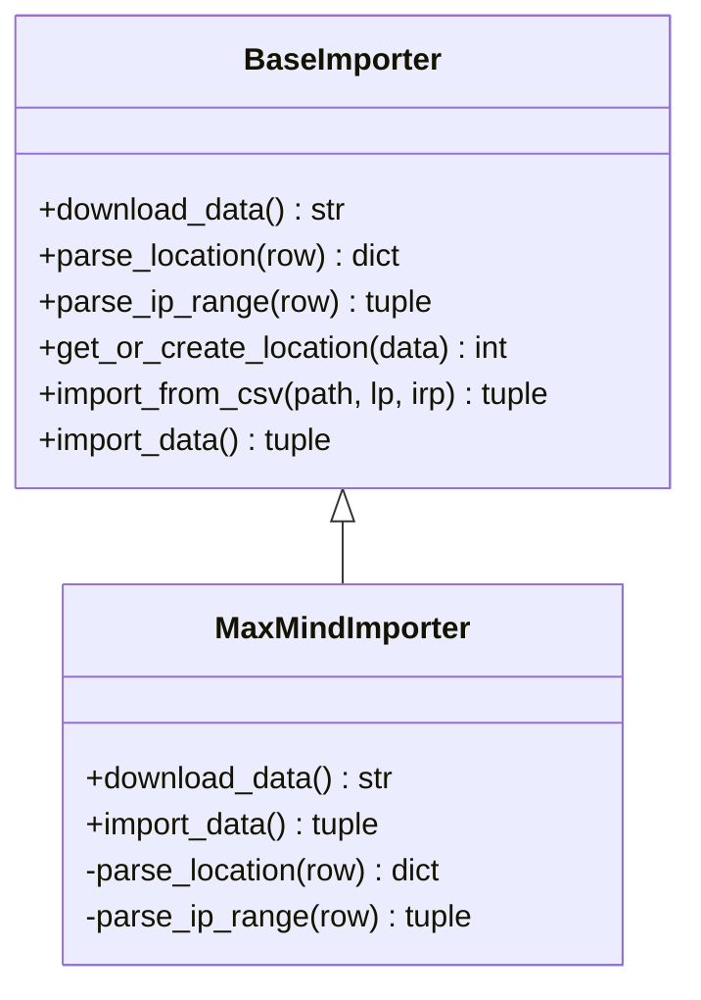
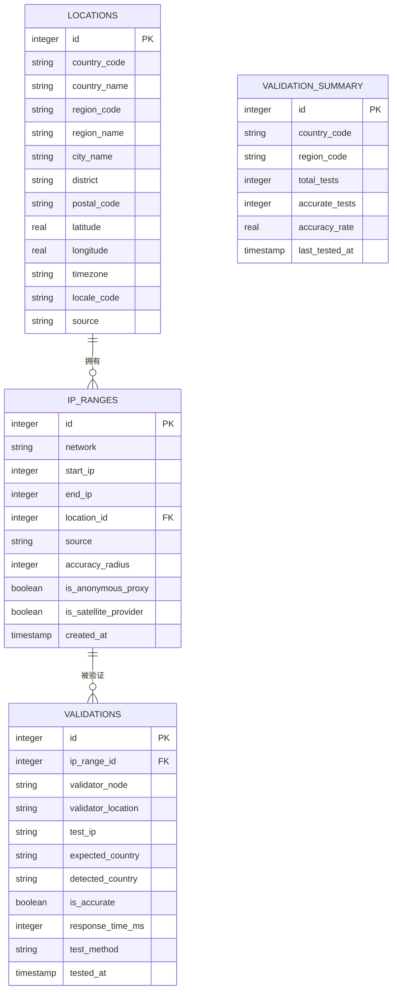
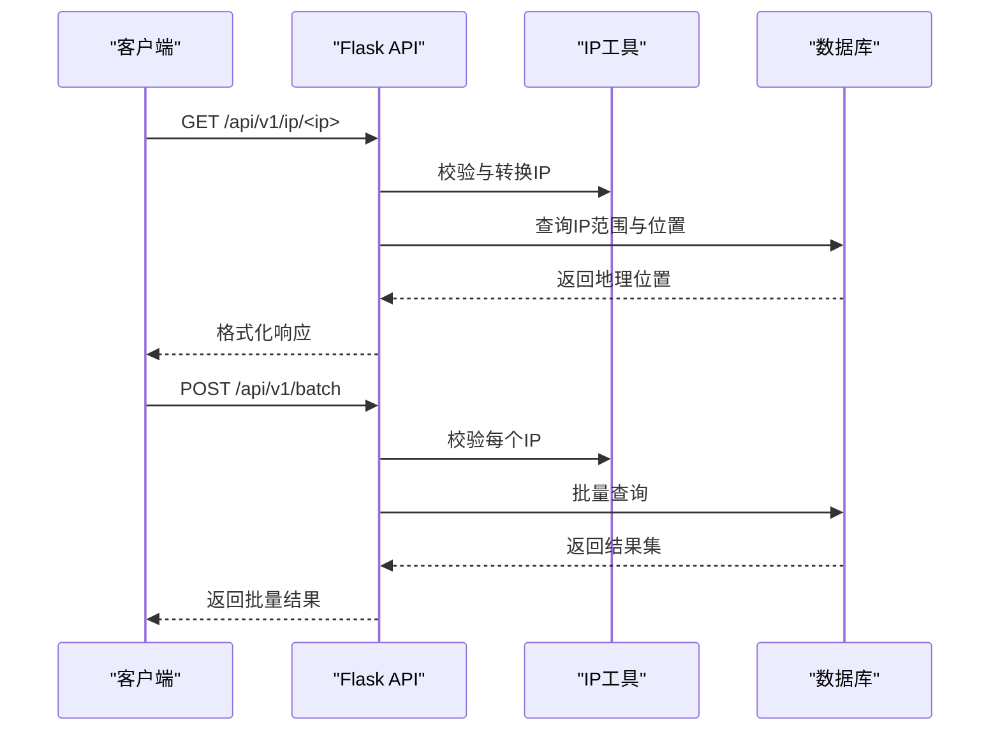
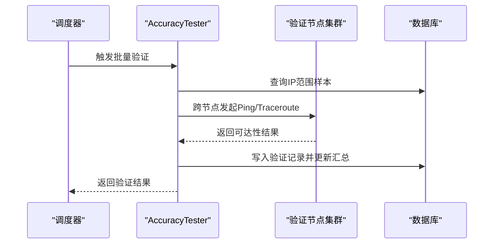
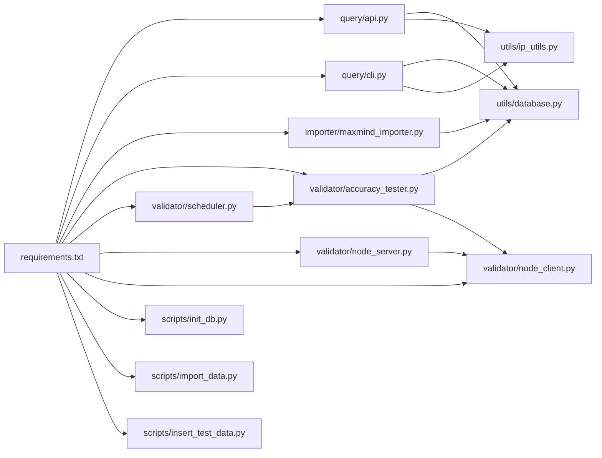

# 项目概述

<cite>
**本文引用的文件**   
- [requirements.txt](file://requirements.txt)
- [settings.py](file://config/settings.py)
- [init_db.py](file://scripts/init_db.py)
- [import_data.py](file://scripts/import_data.py)
- [api.py](file://query/api.py)
- [cli.py](file://query/cli.py)
- [database.py](file://utils/database.py)
- [ip_utils.py](file://utils/ip_utils.py)
- [base_importer.py](file://importer/base_importer.py)
- [maxmind_importer.py](file://importer/maxmind_importer.py)
- [scheduler.py](file://validator/scheduler.py)
- [accuracy_tester.py](file://validator/accuracy_tester.py)
- [node_server.py](file://validator/node_server.py)
- [node_client.py](file://validator/node_client.py)
- [insert_test_data.py](file://scripts/insert_test_data.py)
- [test.py](file://test.py)
</cite>

## 目录
1. [简介](#简介)
2. [项目结构](#项目结构)
3. [核心组件](#核心组件)
4. [架构总览](#架构总览)
5. [详细组件分析](#详细组件分析)
6. [依赖关系分析](#依赖关系分析)
7. [性能考量](#性能考量)
8. [故障排查指南](#故障排查指南)
9. [结论](#结论)
10. [附录](#附录)

## 简介
本项目是一个基于后端的IP地址地理位置查询系统，提供实时查询、批量处理、数据验证与可视化统计能力。系统以Python Flask为核心Web框架，采用SQLite作为本地存储，结合MaxMind数据源进行IP地理映射，并通过分布式验证节点对定位准确性进行交叉验证与统计。

项目目标：
- 提供稳定、可扩展的IP定位服务，支持单IP查询与批量查询。
- 通过缓存与索引优化查询性能，满足高并发场景。
- 通过验证节点与调度器实现自动化准确性评估与统计。
- 以模块化与分层架构组织代码，便于维护与扩展。

## 项目结构
项目采用按功能域划分的模块化组织方式，主要目录与职责如下：
- config：集中式配置管理（数据库路径、API参数、缓存策略、验证节点配置等）
- data：数据与日志输出目录（数据库文件、原始数据、日志文件）
- importer：数据导入器（抽象基类与MaxMind导入器）
- query：查询入口（Flask API与CLI工具）
- scripts：运维脚本（数据库初始化、数据导入、测试数据插入）
- utils：通用工具（数据库连接、IP地址工具）
- validator：验证体系（准确性测试器、节点服务端与客户端、调度器）
- tests：测试目录（预留）

**图表来源**
- [settings.py:1-44](file://config/settings.py#L1-L44)
- [api.py:1-325](file://query/api.py#L1-L325)
- [cli.py:1-250](file://query/cli.py#L1-L250)
- [database.py:1-398](file://utils/database.py#L1-L398)
- [ip_utils.py:1-282](file://utils/ip_utils.py#L1-L282)
- [base_importer.py:1-168](file://importer/base_importer.py#L1-L168)
- [maxmind_importer.py:1-274](file://importer/maxmind_importer.py#L1-L274)
- [scheduler.py:1-265](file://validator/scheduler.py#L1-L265)
- [accuracy_tester.py:1-373](file://validator/accuracy_tester.py#L1-L373)
- [node_server.py:1-350](file://validator/node_server.py#L1-L350)
- [node_client.py:1-244](file://validator/node_client.py#L1-L244)
- [init_db.py:1-38](file://scripts/init_db.py#L1-L38)
- [import_data.py:1-65](file://scripts/import_data.py#L1-L65)

**章节来源**
- [settings.py:1-44](file://config/settings.py#L1-L44)
- [api.py:1-325](file://query/api.py#L1-L325)
- [cli.py:1-250](file://query/cli.py#L1-L250)
- [database.py:1-398](file://utils/database.py#L1-L398)
- [ip_utils.py:1-282](file://utils/ip_utils.py#L1-L282)
- [base_importer.py:1-168](file://importer/base_importer.py#L1-L168)
- [maxmind_importer.py:1-274](file://importer/maxmind_importer.py#L1-L274)
- [scheduler.py:1-265](file://validator/scheduler.py#L1-L265)
- [accuracy_tester.py:1-373](file://validator/accuracy_tester.py#L1-L373)
- [node_server.py:1-350](file://validator/node_server.py#L1-L350)
- [node_client.py:1-244](file://validator/node_client.py#L1-L244)
- [init_db.py:1-38](file://scripts/init_db.py#L1-L38)
- [import_data.py:1-65](file://scripts/import_data.py#L1-L65)

## 核心组件
- 配置中心：集中管理数据库路径、API监听参数、缓存策略、验证节点与日志配置。
- 数据导入器：抽象基类定义统一接口，MaxMind导入器负责下载、解析与入库。
- 数据库层：封装SQLite连接、事务、索引与查询封装，提供批量写入与统计查询。
- 工具层：IP地址转换、CIDR与范围互转、有效性校验、二进制与压缩格式处理。
- 查询服务：Flask API提供单IP查询、批量查询、统计与验证统计接口；CLI提供命令行查询与统计。
- 验证体系：AccuracyTester负责随机采样与跨节点可达性验证；Scheduler周期调度；NodeServer/NodeClient构成分布式验证节点网络。
- 运维脚本：初始化数据库、导入数据、插入测试数据。

**章节来源**
- [settings.py:1-44](file://config/settings.py#L1-L44)
- [base_importer.py:1-168](file://importer/base_importer.py#L1-L168)
- [maxmind_importer.py:1-274](file://importer/maxmind_importer.py#L1-L274)
- [database.py:1-398](file://utils/database.py#L1-L398)
- [ip_utils.py:1-282](file://utils/ip_utils.py#L1-L282)
- [api.py:1-325](file://query/api.py#L1-L325)
- [cli.py:1-250](file://query/cli.py#L1-L250)
- [accuracy_tester.py:1-373](file://validator/accuracy_tester.py#L1-L373)
- [scheduler.py:1-265](file://validator/scheduler.py#L1-L265)
- [node_server.py:1-350](file://validator/node_server.py#L1-L350)
- [node_client.py:1-244](file://validator/node_client.py#L1-L244)
- [init_db.py:1-38](file://scripts/init_db.py#L1-L38)
- [import_data.py:1-65](file://scripts/import_data.py#L1-L65)

## 架构总览
系统采用“配置驱动 + 分层模块 + 可插拔导入器 + 分布式验证”的设计：
- 分层架构：表现层（API/CLI）、业务层（查询/验证）、数据层（SQLite/索引）。
- 模块化组织：导入器、工具、验证器独立封装，便于替换与扩展。
- 技术选型：Flask轻量Web框架、SQLite轻量数据库、requests/click/csvkit等标准库，确保易部署与低门槛。
- 数据流：导入器将MaxMind数据解析入库 → 查询层通过索引快速定位 → API/CLI对外提供服务 → 验证层交叉验证准确性并更新统计。

**图表来源**
- [api.py:1-325](file://query/api.py#L1-L325)
- [cli.py:1-250](file://query/cli.py#L1-L250)
- [database.py:1-398](file://utils/database.py#L1-L398)
- [ip_utils.py:1-282](file://utils/ip_utils.py#L1-L282)
- [maxmind_importer.py:1-274](file://importer/maxmind_importer.py#L1-L274)
- [init_db.py:1-38](file://scripts/init_db.py#L1-L38)
- [accuracy_tester.py:1-373](file://validator/accuracy_tester.py#L1-L373)
- [node_server.py:1-350](file://validator/node_server.py#L1-L350)
- [node_client.py:1-244](file://validator/node_client.py#L1-L244)
- [scheduler.py:1-265](file://validator/scheduler.py#L1-L265)

## 详细组件分析

### 配置中心（config/settings.py）
- 职责：集中管理数据库路径、API监听参数、缓存策略、验证节点列表与日志配置。
- 关键点：环境变量注入（如MaxMind License Key、验证API Key），便于在不同环境灵活切换。
- 影响范围：所有模块均通过该配置读取参数，保证一致性与可维护性。

**章节来源**
- [settings.py:1-44](file://config/settings.py#L1-L44)

### 数据导入器（importer/base_importer.py 与 importer/maxmind_importer.py）
- 抽象基类BaseImporter定义统一接口：下载数据、解析位置、解析IP范围、批量导入。
- MaxMindImporter实现具体逻辑：下载Zip包、解析Locations与Blocks、构建位置与IP范围映射、批量写入数据库。
- 性能特性：分批导入、位置ID缓存、CIDR转范围、错误容错与进度日志。

**图表来源**
- [base_importer.py:1-168](file://importer/base_importer.py#L1-L168)
- [maxmind_importer.py:1-274](file://importer/maxmind_importer.py#L1-L274)

**章节来源**
- [base_importer.py:1-168](file://importer/base_importer.py#L1-L168)
- [maxmind_importer.py:1-274](file://importer/maxmind_importer.py#L1-L274)

### 数据库层（utils/database.py）
- 职责：封装SQLite连接、事务、索引与查询；提供初始化、批量插入、查询封装、统计与汇总更新。
- 关键表：locations、ip_ranges、validations、validation_summary；建立复合索引提升查询性能。
- 查询逻辑：通过IP整数范围匹配，优先返回精度半径较小的记录。

**图表来源**
- [database.py:70-185](file://utils/database.py#L70-L185)

**章节来源**
- [database.py:1-398](file://utils/database.py#L1-L398)

### IP工具（utils/ip_utils.py）
- 职责：IP地址标准化、版本识别、CIDR与范围互转、二进制与压缩格式处理、私有地址判断、反向解析等。
- 设计要点：统一输入校验与异常处理，支持IPv4/IPv6双栈。

**章节来源**
- [ip_utils.py:1-282](file://utils/ip_utils.py#L1-L282)

### 查询服务（query/api.py 与 query/cli.py）
- API服务：提供单IP查询、批量查询、统计与验证统计接口；内置简单内存缓存与错误处理。
- CLI工具：支持文本/JSON输出、批量查询与统计展示，便于离线与自动化集成。
- 性能特性：路径参数与请求体参数校验、批量上限控制、缓存与索引协同。

**图表来源**
- [api.py:115-204](file://query/api.py#L115-L204)
- [ip_utils.py:134-148](file://utils/ip_utils.py#L134-L148)
- [database.py:193-230](file://utils/database.py#L193-L230)

**章节来源**
- [api.py:1-325](file://query/api.py#L1-L325)
- [cli.py:1-250](file://query/cli.py#L1-L250)

### 验证体系（validator/accuracy_tester.py、validator/scheduler.py、validator/node_server.py、validator/node_client.py）
- AccuracyTester：随机采样IP范围、生成测试IP、跨节点可达性验证、更新验证记录与汇总统计。
- Scheduler：周期调度验证任务，支持一次性与持续运行模式。
- NodeServer：验证节点服务，提供健康检查、Ping与Traceroute测试接口。
- NodeClient：节点客户端，管理节点列表、健康检查与统一验证调用。

**图表来源**
- [scheduler.py:39-93](file://validator/scheduler.py#L39-L93)
- [accuracy_tester.py:182-254](file://validator/accuracy_tester.py#L182-L254)
- [node_server.py:231-321](file://validator/node_server.py#L231-L321)
- [node_client.py:140-177](file://validator/node_client.py#L140-L177)
- [database.py:341-398](file://utils/database.py#L341-L398)

**章节来源**
- [accuracy_tester.py:1-373](file://validator/accuracy_tester.py#L1-L373)
- [scheduler.py:1-265](file://validator/scheduler.py#L1-L265)
- [node_server.py:1-350](file://validator/node_server.py#L1-L350)
- [node_client.py:1-244](file://validator/node_client.py#L1-L244)

### 运维脚本（scripts/init_db.py、scripts/import_data.py、scripts/insert_test_data.py）
- init_db：初始化数据库与目录，创建表与索引。
- import_data：导入MaxMind数据（下载或本地CSV），支持初始化数据库与分批导入。
- insert_test_data：快速插入测试数据，便于演示与联调。

**章节来源**
- [init_db.py:1-38](file://scripts/init_db.py#L1-L38)
- [import_data.py:1-65](file://scripts/import_data.py#L1-L65)
- [insert_test_data.py:1-63](file://scripts/insert_test_data.py#L1-L63)

## 依赖关系分析
- 外部依赖：requests（下载MaxMind数据与节点通信）、flask（Web服务）、click（命令行）、csvkit（CSV处理）。
- 内部耦合：查询API/CLI依赖utils与config；导入器依赖utils与config；验证器依赖utils与config；调度器依赖验证器与config。
- 循环依赖：未发现循环依赖，模块边界清晰。

**图表来源**
- [requirements.txt:1-5](file://requirements.txt#L1-L5)
- [api.py:1-325](file://query/api.py#L1-L325)
- [cli.py:1-250](file://query/cli.py#L1-L250)
- [maxmind_importer.py:1-274](file://importer/maxmind_importer.py#L1-L274)
- [accuracy_tester.py:1-373](file://validator/accuracy_tester.py#L1-L373)
- [scheduler.py:1-265](file://validator/scheduler.py#L1-L265)
- [node_server.py:1-350](file://validator/node_server.py#L1-L350)
- [node_client.py:1-244](file://validator/node_client.py#L1-L244)
- [init_db.py:1-38](file://scripts/init_db.py#L1-L38)
- [import_data.py:1-65](file://scripts/import_data.py#L1-L65)
- [insert_test_data.py:1-63](file://scripts/insert_test_data.py#L1-L63)
- [database.py:1-398](file://utils/database.py#L1-L398)
- [ip_utils.py:1-282](file://utils/ip_utils.py#L1-L282)

**章节来源**
- [requirements.txt:1-5](file://requirements.txt#L1-L5)

## 性能考量
- 查询性能：通过ip_ranges的start_ip/end_ip索引与locations的country/city索引，实现O(logN)范围查找与高效关联。
- 缓存策略：API层提供简单内存缓存装饰器，降低重复查询压力；统计接口设置较短TTL，平衡新鲜度与性能。
- 批量处理：导入与查询均支持批量，减少数据库往返；导入器按批次写入，避免大事务。
- I/O优化：CSV解析与网络下载采用流式处理，降低内存占用。
- 并发建议：生产环境建议使用WSGI容器与多进程部署，避免单进程阻塞。

[本节为通用性能指导，无需列出具体文件来源]

## 故障排查指南
- 数据库初始化失败：确认数据目录存在与权限，查看初始化脚本输出与日志。
- 导入数据异常：检查MaxMind License Key与网络连通性；确认CSV字段与解析逻辑；查看导入脚本日志。
- 查询无结果：确认IP格式有效、数据库已导入数据、索引存在；通过CLI查看统计信息辅助定位。
- 验证节点不可达：检查节点健康接口、API Key、网络连通性；查看节点服务端日志。
- API错误码：400（请求参数错误）、404（接口不存在）、500（服务器内部错误），根据返回消息定位问题。

**章节来源**
- [init_db.py:1-38](file://scripts/init_db.py#L1-L38)
- [import_data.py:1-65](file://scripts/import_data.py#L1-L65)
- [api.py:290-304](file://query/api.py#L290-L304)
- [node_server.py:216-222](file://validator/node_server.py#L216-L222)
- [node_client.py:54-59](file://validator/node_client.py#L54-L59)

## 结论
本项目以简洁的模块化与分层架构实现了完整的IP地址定位服务：从数据导入、查询服务到准确性验证形成闭环。技术选型兼顾易用性与可扩展性，适合中小型应用场景快速落地与迭代。通过缓存、索引与批量处理，系统在性能与可靠性方面具备良好表现；验证体系进一步提升了定位质量的可观测性与可信度。

[本节为总结性内容，无需列出具体文件来源]

## 附录
- 实际使用场景示例（概念性说明）：
  - 实时查询：通过API接口对单个或批量IP进行地理位置查询，适用于风控、审计与用户画像。
  - 批量处理：通过CLI或API接收IP列表，生成带地理信息的报告，用于网络拓扑分析。
  - 数据验证：启用调度器定期对特定国家或全量范围进行准确性验证，生成统计报表。
  - 开发联调：使用测试数据脚本快速搭建本地环境，验证导入与查询流程。

[本节为概念性内容，无需列出具体文件来源]