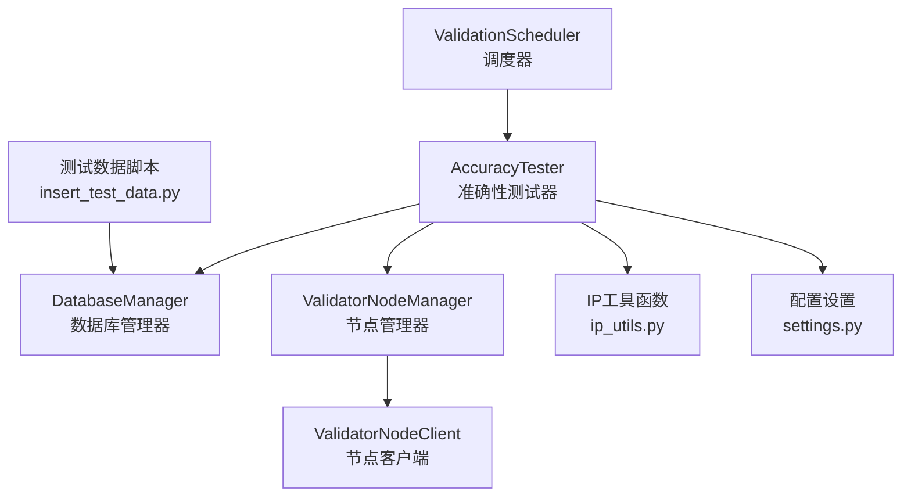
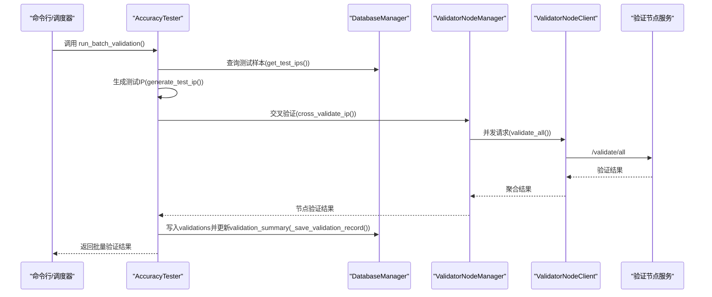
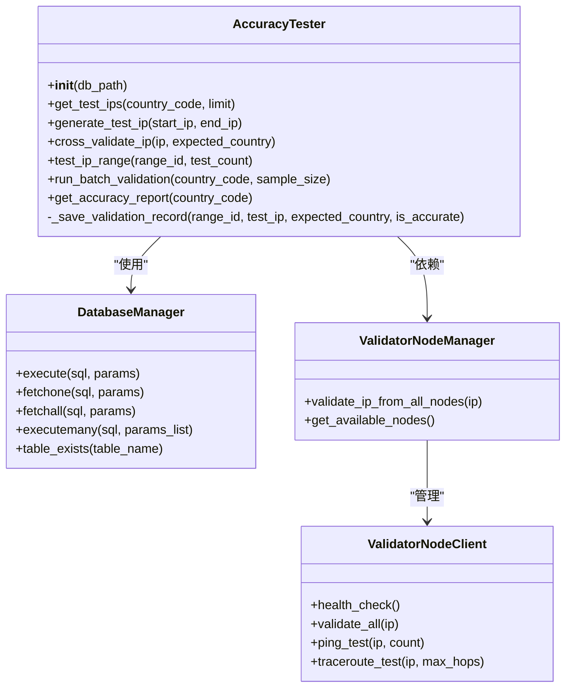
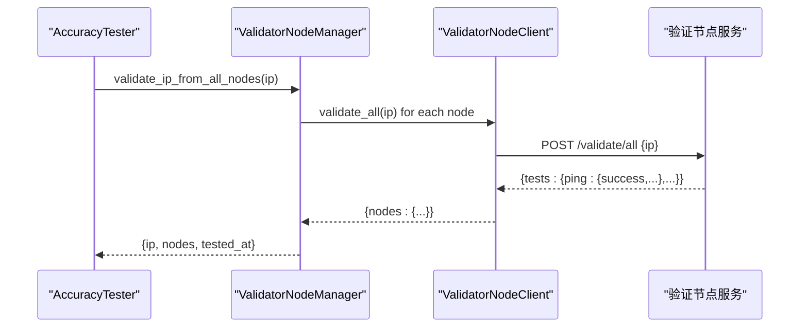
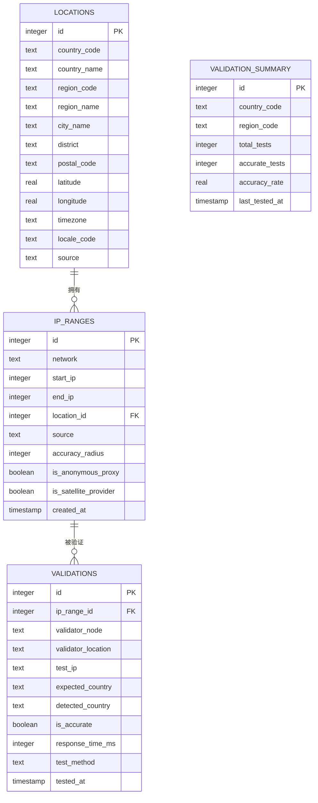
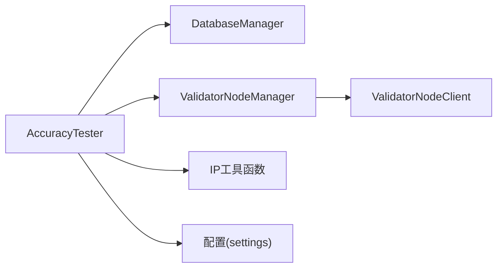

# 准确性测试器

<cite>
**本文引用的文件**
- [validator/accuracy_tester.py](file://validator/accuracy_tester.py)
- [utils/ip_utils.py](file://utils/ip_utils.py)
- [utils/database.py](file://utils/database.py)
- [validator/node_client.py](file://validator/node_client.py)
- [config/settings.py](file://config/settings.py)
- [validator/scheduler.py](file://validator/scheduler.py)
- [scripts/insert_test_data.py](file://scripts/insert_test_data.py)
</cite>

## 目录
1. [简介](#简介)
2. [项目结构](#项目结构)
3. [核心组件](#核心组件)
4. [架构总览](#架构总览)
5. [详细组件分析](#详细组件分析)
6. [依赖关系分析](#依赖关系分析)
7. [性能考虑](#性能考虑)
8. [故障排查指南](#故障排查指南)
9. [结论](#结论)
10. [附录](#附录)

## 简介
本文件为AccuracyTester类的详细技术文档，聚焦于IP定位准确性测试的核心算法与实现机制。内容涵盖：
- get_test_ips()的样本获取逻辑
- generate_test_ip()的IP生成算法
- cross_validate_ip()的交叉验证机制
- test_ip_range()的范围测试流程
- run_batch_validation()的批量验证功能
- 准确性计算方法与统计指标
- 测试配置选项、参数调优与性能优化建议
- 实际使用示例与常见问题解决方案

## 项目结构
该项目围绕IP地理定位数据库与验证节点构建，AccuracyTester作为核心测试组件，负责从数据库中抽取样本、生成测试IP、跨节点验证，并产出统计报告。关键模块如下：
- validator/accuracy_tester.py：AccuracyTester类及命令行入口
- utils/ip_utils.py：IP地址转换与范围处理工具
- utils/database.py：数据库连接、表结构与查询工具
- validator/node_client.py：验证节点客户端与节点管理器
- config/settings.py：全局配置（数据库路径、验证节点、缓存等）
- validator/scheduler.py：验证任务调度器
- scripts/insert_test_data.py：测试数据初始化脚本

图表来源
- [validator/accuracy_tester.py:27-373](file://validator/accuracy_tester.py#L27-L373)
- [utils/database.py:15-398](file://utils/database.py#L15-L398)
- [validator/node_client.py:22-244](file://validator/node_client.py#L22-L244)
- [config/settings.py:1-44](file://config/settings.py#L1-L44)
- [validator/scheduler.py:27-265](file://validator/scheduler.py#L27-L265)
- [scripts/insert_test_data.py:1-63](file://scripts/insert_test_data.py#L1-L63)

章节来源
- [validator/accuracy_tester.py:27-373](file://validator/accuracy_tester.py#L27-L373)
- [utils/database.py:15-398](file://utils/database.py#L15-L398)
- [validator/node_client.py:22-244](file://validator/node_client.py#L22-L244)
- [config/settings.py:1-44](file://config/settings.py#L1-L44)
- [validator/scheduler.py:27-265](file://validator/scheduler.py#L27-L265)
- [scripts/insert_test_data.py:1-63](file://scripts/insert_test_data.py#L1-L63)

## 核心组件
- AccuracyTester：封装样本获取、IP生成、交叉验证、范围测试、批量验证与报告生成的主类
- DatabaseManager：SQLite数据库访问与事务管理
- ValidatorNodeManager/ValidatorNodeClient：验证节点发现、健康检查与多节点并发验证
- IP工具函数：IP整数互转、CIDR与范围转换、有效性校验等
- 配置模块：数据库路径、验证节点列表、API密钥、缓存与日志配置
- 调度器：周期性批量验证任务的调度与执行

章节来源
- [validator/accuracy_tester.py:27-373](file://validator/accuracy_tester.py#L27-L373)
- [utils/database.py:15-398](file://utils/database.py#L15-L398)
- [validator/node_client.py:22-244](file://validator/node_client.py#L22-L244)
- [utils/ip_utils.py:1-282](file://utils/ip_utils.py#L1-L282)
- [config/settings.py:1-44](file://config/settings.py#L1-L44)
- [validator/scheduler.py:27-265](file://validator/scheduler.py#L27-L265)

## 架构总览
AccuracyTester通过DatabaseManager访问ip_ranges与locations表，结合ValidatorNodeManager向多个验证节点发起并发验证，最终将结果写入validations表并更新validation_summary统计表。

图表来源
- [validator/accuracy_tester.py:182-254](file://validator/accuracy_tester.py#L182-L254)
- [validator/accuracy_tester.py:84-126](file://validator/accuracy_tester.py#L84-L126)
- [validator/node_client.py:107-189](file://validator/node_client.py#L107-L189)
- [utils/database.py:363-398](file://utils/database.py#L363-L398)

## 详细组件分析

### AccuracyTester类
AccuracyTester是准确性测试的核心，提供以下关键能力：
- 样本获取：按国家过滤随机抽样
- IP生成：在IP范围内均匀随机生成测试IP
- 交叉验证：多节点并发验证，以可达性判定准确性
- 范围测试：针对单个IP范围批量测试并统计准确率
- 批量验证：全量或按国家批量采样验证
- 报告生成：按国家/区域聚合准确率统计

图表来源
- [validator/accuracy_tester.py:27-373](file://validator/accuracy_tester.py#L27-L373)
- [utils/database.py:15-67](file://utils/database.py#L15-L67)
- [validator/node_client.py:107-189](file://validator/node_client.py#L107-L189)

章节来源
- [validator/accuracy_tester.py:27-373](file://validator/accuracy_tester.py#L27-L373)

#### get_test_ips()：样本获取逻辑
- 功能：从ip_ranges与locations表联接查询，按国家过滤或全局随机抽样
- SQL策略：支持country_code过滤；使用ORDER BY RANDOM()进行随机采样；限制返回数量
- 返回值：包含range_id、network、start_ip、end_ip、国家/地区/城市信息的样本列表

复杂度分析
- 时间复杂度：O(n log n)（随机排序）+ O(k)（LIMIT），k为样本数
- 空间复杂度：O(k)

章节来源
- [validator/accuracy_tester.py:34-67](file://validator/accuracy_tester.py#L34-L67)
- [utils/database.py:41-55](file://utils/database.py#L41-L55)

#### generate_test_ip()：IP生成算法
- 功能：在给定的起止IP整数范围内生成一个随机IP
- 算法：使用随机整数生成器在闭区间[start_ip, end_ip]内取值，再转换为IP字符串
- 复杂度：O(1)

章节来源
- [validator/accuracy_tester.py:69-82](file://validator/accuracy_tester.py#L69-L82)
- [utils/ip_utils.py:9-48](file://utils/ip_utils.py#L9-L48)

#### cross_validate_ip()：交叉验证机制
- 功能：对单个IP在所有可用验证节点上执行验证，以可达性判断准确性
- 流程：
  - 调用ValidatorNodeManager.validate_ip_from_all_nodes()获取各节点结果
  - 统计“ping成功”的节点数量
  - 若至少有一个节点可达，则判定该IP归属准确
- 输出：包含IP、期望国家、节点统计、准确性标记与详细验证信息

复杂度分析
- 时间复杂度：O(m)，m为可用节点数
- 空间复杂度：O(m)

章节来源
- [validator/accuracy_tester.py:84-126](file://validator/accuracy_tester.py#L84-L126)
- [validator/node_client.py:179-189](file://validator/node_client.py#L179-L189)

#### test_ip_range()：范围测试流程
- 功能：针对单个IP范围批量生成测试IP并逐一交叉验证
- 步骤：
  - 查询范围信息（network、country_code、region_code）
  - 生成test_count个测试IP
  - 对每个IP执行cross_validate_ip()
  - 统计准确数量并计算准确率
  - 返回范围ID、网络、国家/区域、测试IP列表、逐项结果与整体准确率
- 判定标准：准确率≥50%视为范围准确

复杂度分析
- 时间复杂度：O(t·m)，t为测试IP数量，m为节点数
- 空间复杂度：O(t)

章节来源
- [validator/accuracy_tester.py:128-180](file://validator/accuracy_tester.py#L128-L180)

#### run_batch_validation()：批量验证功能
- 功能：按国家或全局批量采样，生成测试IP并验证，统计准确率
- 步骤：
  - 调用get_test_ips()获取样本
  - 逐样本生成测试IP并cross_validate_ip()
  - 保存验证记录至validations表并更新validation_summary
  - 统计tested、accurate、inaccurate与accuracy_rate
- 日志：每处理10个样本输出一次进度日志

复杂度分析
- 时间复杂度：O(n·m)，n为样本数，m为节点数
- 空间复杂度：O(n)

章节来源
- [validator/accuracy_tester.py:182-254](file://validator/accuracy_tester.py#L182-L254)
- [utils/database.py:363-398](file://utils/database.py#L363-L398)

#### 准确性计算与统计指标
- 单IP判定：至少一个节点可达即认为准确
- 范围准确率：范围内准确IP数量/测试IP总数
- 批量准确率：准确样本数/测试样本数
- 汇总统计：validation_summary表按国家/区域维护total_tests、accurate_tests、accuracy_rate与last_tested_at

章节来源
- [validator/accuracy_tester.py:168-178](file://validator/accuracy_tester.py#L168-L178)
- [validator/accuracy_tester.py:249-250](file://validator/accuracy_tester.py#L249-L250)
- [utils/database.py:363-398](file://utils/database.py#L363-L398)

#### get_accuracy_report()：报告生成
- 功能：按国家或全局聚合validation_summary，计算总体准确率与分区域统计
- 输出：overall（总测试数、准确数、准确率）、by_region（国家/区域维度明细）

章节来源
- [validator/accuracy_tester.py:284-334](file://validator/accuracy_tester.py#L284-L334)

### 验证节点与网络交互
- ValidatorNodeManager：根据配置列表初始化节点客户端，健康检查后并发调用validate_all()
- ValidatorNodeClient：封装HTTP请求，支持健康检查、信息查询、Ping与Traceroute测试
- 交互协议：基于HTTP API，需携带X-API-Key头

图表来源
- [validator/accuracy_tester.py:98-126](file://validator/accuracy_tester.py#L98-L126)
- [validator/node_client.py:179-189](file://validator/node_client.py#L179-L189)
- [validator/node_client.py:93-104](file://validator/node_client.py#L93-L104)

章节来源
- [validator/node_client.py:22-244](file://validator/node_client.py#L22-L244)

### 数据模型与持久化
- 表结构概览：
  - locations：国家/地区/城市等地理信息
  - ip_ranges：IP范围与对应location_id
  - validations：单次验证记录
  - validation_summary：按国家/区域的汇总统计
- 索引：为高效查询建立索引（如ip_ranges的start_ip/end_ip、locations的country_code等）

图表来源
- [utils/database.py:80-182](file://utils/database.py#L80-L182)

章节来源
- [utils/database.py:80-182](file://utils/database.py#L80-L182)

## 依赖关系分析
- AccuracyTester依赖DatabaseManager进行数据库读写，依赖ValidatorNodeManager进行节点验证
- ValidatorNodeManager依赖ValidatorNodeClient与配置中的节点列表
- IP工具函数被AccuracyTester与数据库层共同使用

图表来源
- [validator/accuracy_tester.py:27-373](file://validator/accuracy_tester.py#L27-L373)
- [validator/node_client.py:107-189](file://validator/node_client.py#L107-L189)
- [config/settings.py:29-38](file://config/settings.py#L29-L38)

章节来源
- [validator/accuracy_tester.py:27-373](file://validator/accuracy_tester.py#L27-L373)
- [validator/node_client.py:107-189](file://validator/node_client.py#L107-L189)
- [config/settings.py:29-38](file://config/settings.py#L29-L38)

## 性能考虑
- 随机采样：get_test_ips()使用ORDER BY RANDOM()，在大数据集上可能较慢。建议：
  - 为ip_ranges添加索引以加速JOIN与LIMIT
  - 使用预洗牌或分页采样策略替代全表随机
- 并发验证：cross_validate_ip()对所有节点并发请求，建议：
  - 控制并发数，避免节点过载
  - 设置合理的超时与重试策略
- 批量写入：run_batch_validation()逐条写入validations，建议：
  - 使用executemany()批量插入
  - 合理设置批大小（参考配置中的BATCH_SIZE）
- 数据库优化：
  - 确保validation_summary的唯一索引(country_code, region_code)
  - 定期清理历史验证记录，控制表规模

[本节为通用性能建议，不直接分析具体文件]

## 故障排查指南
- 样本为空
  - 检查数据库中ip_ranges与locations是否正确初始化
  - 确认country_code参数是否匹配现有数据
- 节点不可达
  - 使用ValidatorNodeClient.health_check()检查节点健康状态
  - 核对配置中的host/port与API密钥
- 验证结果异常
  - 检查节点服务端是否正确实现/validate/all接口
  - 关注cross_validate_ip()中对ping结果的解析
- 统计异常
  - 确认update_validation_summary()是否正确执行
  - 检查unique约束冲突导致的插入失败

章节来源
- [validator/accuracy_tester.py:244-246](file://validator/accuracy_tester.py#L244-L246)
- [validator/node_client.py:54-59](file://validator/node_client.py#L54-L59)
- [utils/database.py:363-398](file://utils/database.py#L363-L398)

## 结论
AccuracyTester通过严谨的样本抽样、随机IP生成与多节点交叉验证，实现了对IP定位准确性的量化评估。配合validation_summary的统计与调度器的周期性任务，可形成持续的质量监控闭环。建议在生产环境中结合索引优化、并发控制与批量写入策略，进一步提升性能与稳定性。

[本节为总结性内容，不直接分析具体文件]

## 附录

### 使用示例
- 命令行使用
  - 批量验证：python -m validator.accuracy_tester --action batch --country CN --sample-size 100
  - 单范围测试：python -m validator.accuracy_tester --action test --range-id 1
  - 单IP验证：python -m validator.accuracy_tester --action test --ip 1.0.1.100 --country CN
  - 报告生成：python -m validator.accuracy_tester --action report --country CN
- 调度器使用
  - 单次执行：python -m validator.scheduler --mode once --country CN --sample-size 100
  - 全量国家：python -m validator.scheduler --mode all-countries --sample-size 50
  - 后台调度：python -m validator.scheduler --mode scheduler --interval 24

章节来源
- [validator/accuracy_tester.py:337-373](file://validator/accuracy_tester.py#L337-L373)
- [validator/scheduler.py:207-265](file://validator/scheduler.py#L207-L265)

### 配置选项与参数调优
- 数据库路径：DATABASE_PATH（默认位于项目根/data/ip_database.db）
- 验证节点：VALIDATOR_NODES（名称、host、port、位置）
- API密钥：VALIDATOR_API_KEY（X-API-Key）
- 批量大小：VALIDATION_BATCH_SIZE（默认100）
- 验证间隔：VALIDATION_INTERVAL_HOURS（默认24小时）
- 缓存与日志：CACHE_TTL/CACHE_MAX_SIZE、LOG_LEVEL/LOG_FILE

章节来源
- [config/settings.py:10-44](file://config/settings.py#L10-L44)

### 测试数据准备
- 初始化数据库：python scripts/init_db.py
- 插入测试数据：python scripts/insert_test_data.py

章节来源
- [scripts/insert_test_data.py:13-63](file://scripts/insert_test_data.py#L13-L63)