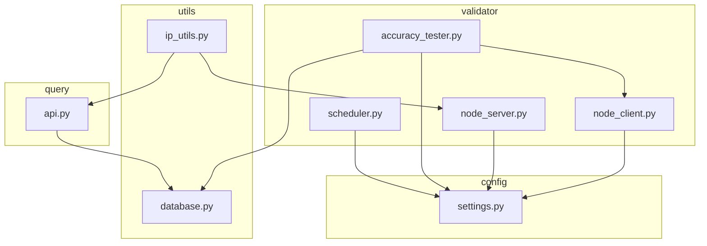
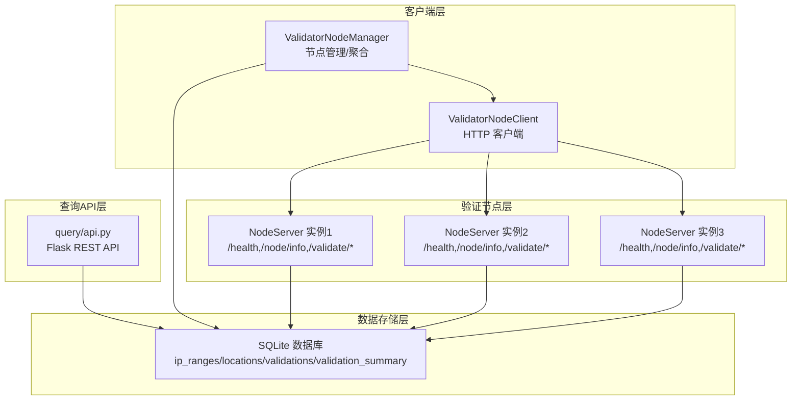
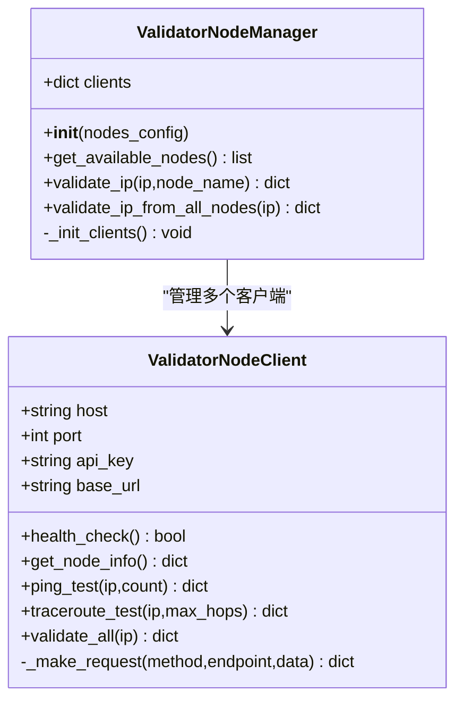
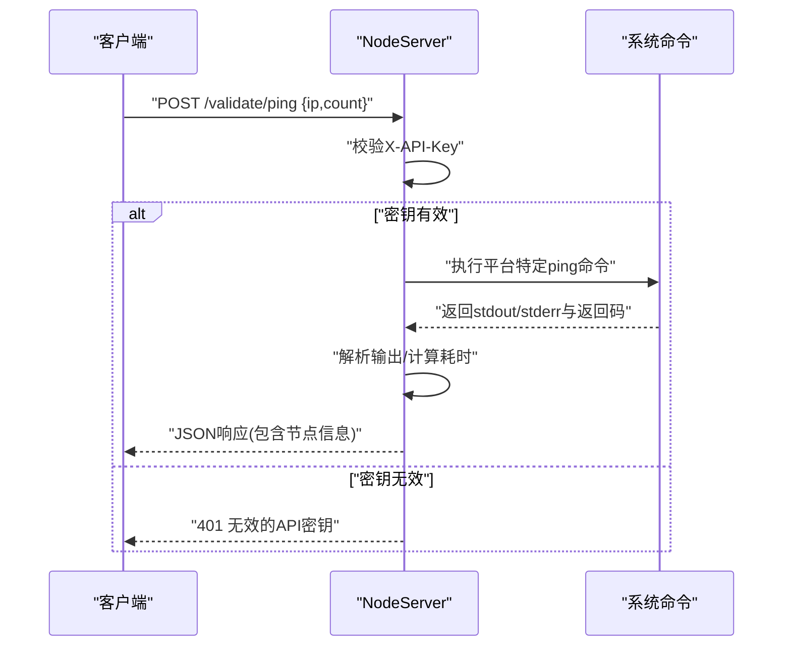
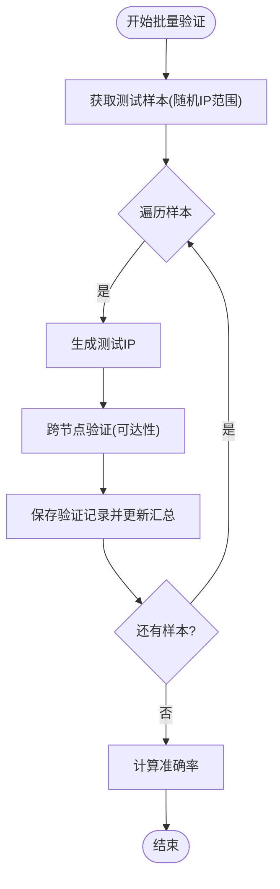
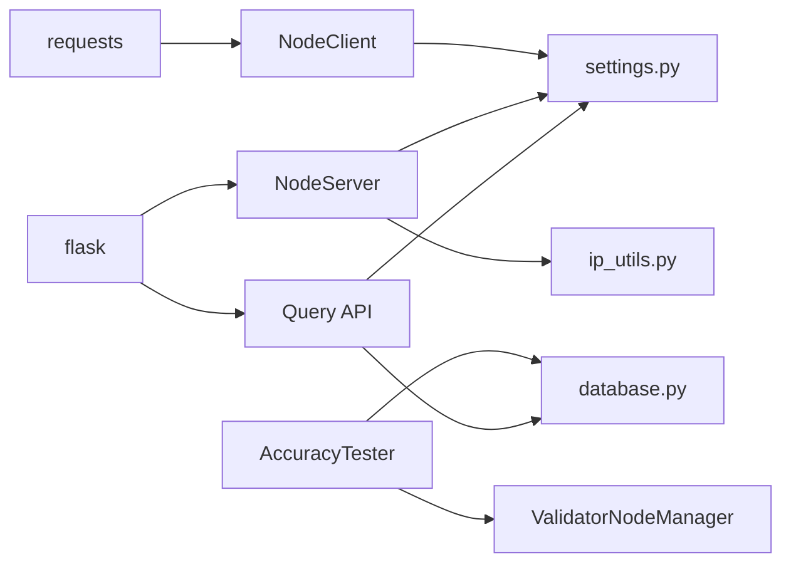

# 节点客户端与服务器

<cite>
**本文引用的文件**
- [validator/node_client.py](file://validator/node_client.py)
- [validator/node_server.py](file://validator/node_server.py)
- [validator/scheduler.py](file://validator/scheduler.py)
- [validator/accuracy_tester.py](file://validator/accuracy_tester.py)
- [config/settings.py](file://config/settings.py)
- [utils/ip_utils.py](file://utils/ip_utils.py)
- [utils/database.py](file://utils/database.py)
- [query/api.py](file://query/api.py)
- [requirements.txt](file://requirements.txt)
</cite>

## 目录
1. [简介](#简介)
2. [项目结构](#项目结构)
3. [核心组件](#核心组件)
4. [架构总览](#架构总览)
5. [组件详细分析](#组件详细分析)
6. [依赖关系分析](#依赖关系分析)
7. [性能考量](#性能考量)
8. [故障排除指南](#故障排除指南)
9. [结论](#结论)
10. [附录](#附录)

## 简介
本文件面向ValidatorNodeManager、NodeClient与NodeServer组件，提供分布式验证架构的技术文档。内容涵盖：
- 节点发现机制：基于配置文件的静态节点清单与健康检查
- 通信协议：基于HTTP的REST API，统一的API密钥鉴权
- 负载均衡与故障转移：客户端侧的可用节点筛选与容错
- 服务端实现：请求处理、响应格式与性能优化
- 节点配置、网络拓扑与安全考虑
- 分布式部署指南、监控方案与故障排除方法

## 项目结构
该项目采用按功能模块划分的组织方式，validator目录包含验证相关的核心组件；config提供全局配置；utils提供通用工具；query提供查询API服务；scripts提供数据导入与初始化脚本。

图表来源
- [validator/node_client.py:1-244](file://validator/node_client.py#L1-L244)
- [validator/node_server.py:1-350](file://validator/node_server.py#L1-L350)
- [validator/scheduler.py:1-265](file://validator/scheduler.py#L1-L265)
- [validator/accuracy_tester.py:1-373](file://validator/accuracy_tester.py#L1-L373)
- [config/settings.py:1-44](file://config/settings.py#L1-L44)
- [utils/ip_utils.py:1-282](file://utils/ip_utils.py#L1-L282)
- [utils/database.py:1-398](file://utils/database.py#L1-L398)
- [query/api.py:1-325](file://query/api.py#L1-L325)

章节来源
- [validator/node_client.py:1-244](file://validator/node_client.py#L1-L244)
- [validator/node_server.py:1-350](file://validator/node_server.py#L1-L350)
- [config/settings.py:1-44](file://config/settings.py#L1-L44)

## 核心组件
- ValidatorNodeClient：封装对单个验证节点的HTTP调用，提供健康检查、节点信息查询、Ping与Traceroute测试、全量验证等能力。
- ValidatorNodeManager：管理多个验证节点，负责节点初始化、可用性检测、聚合验证结果。
- NodeServer：Flask服务端，提供健康检查、节点信息、Ping与Traceroute验证接口，并进行API密钥鉴权。
- AccuracyTester：跨节点验证IP可达性，评估IP归属准确性，并维护验证统计。
- ValidationScheduler：周期性调度批量验证任务，支持连续运行与状态查询。

章节来源
- [validator/node_client.py:22-105](file://validator/node_client.py#L22-L105)
- [validator/node_client.py:107-190](file://validator/node_client.py#L107-L190)
- [validator/node_server.py:20-350](file://validator/node_server.py#L20-L350)
- [validator/accuracy_tester.py:27-373](file://validator/accuracy_tester.py#L27-L373)
- [validator/scheduler.py:27-123](file://validator/scheduler.py#L27-L123)

## 架构总览
分布式验证架构由“查询API层”、“验证节点层”和“数据存储层”组成。查询API层对外提供IP查询服务；验证节点层负责执行网络连通性测试；数据存储层持久化IP范围、位置与验证统计。

图表来源
- [query/api.py:1-325](file://query/api.py#L1-L325)
- [validator/node_server.py:1-350](file://validator/node_server.py#L1-L350)
- [validator/node_client.py:1-244](file://validator/node_client.py#L1-L244)
- [utils/database.py:1-398](file://utils/database.py#L1-L398)

## 组件详细分析

### ValidatorNodeClient 与 ValidatorNodeManager
- 节点管理：ValidatorNodeManager根据配置初始化多个ValidatorNodeClient实例，提供可用节点筛选与聚合验证结果的能力。
- 请求路由：ValidatorNodeClient封装HTTP请求，统一添加API密钥头，支持GET/POST方法，内置超时控制与异常处理。
- 功能接口：健康检查、节点信息、Ping测试、Traceroute测试、全量验证。
- 容错策略：当指定节点不可用或请求失败时，返回错误标记，不影响其他节点的验证流程。

图表来源
- [validator/node_client.py:22-105](file://validator/node_client.py#L22-L105)
- [validator/node_client.py:107-190](file://validator/node_client.py#L107-L190)

章节来源
- [validator/node_client.py:22-105](file://validator/node_client.py#L22-L105)
- [validator/node_client.py:107-190](file://validator/node_client.py#L107-L190)

### NodeServer 服务端实现
- 启动参数：支持节点名称、地理位置、监听地址、端口与调试模式。
- 鉴权机制：所有验证接口要求携带X-API-Key头，与配置中的密钥一致才放行。
- 接口定义：
  - GET /health：健康检查
  - GET /node/info：节点信息（含本地IP、运行时长等）
  - POST /validate/ping：Ping测试，支持自定义包数
  - POST /validate/traceroute：Traceroute测试，支持最大跳数
  - POST /validate/all：全量验证（Ping+Traceroute）
- 平台兼容：根据操作系统选择ping/tracert命令，捕获超时与异常并返回结构化结果。
- 性能优化：日志级别设置、超时控制、输出长度限制。

图表来源
- [validator/node_server.py:44-106](file://validator/node_server.py#L44-L106)
- [validator/node_server.py:231-256](file://validator/node_server.py#L231-L256)

章节来源
- [validator/node_server.py:20-350](file://validator/node_server.py#L20-L350)

### AccuracyTester 与 ValidationScheduler
- AccuracyTester：
  - 从数据库随机采样IP范围，生成测试IP，调用ValidatorNodeManager对目标IP进行跨节点验证。
  - 以“可达性”作为准确性指标（至少一个节点Ping成功即视为准确），并写入验证记录与更新汇总统计。
  - 提供按国家/全量国家的批量验证与准确性报告生成。
- ValidationScheduler：
  - 周期性执行批量验证任务，支持间隔配置与批大小配置。
  - 后台线程运行，支持优雅停止与状态查询。
  - 任务完成后更新下次运行时间，便于监控与排障。

图表来源
- [validator/accuracy_tester.py:182-254](file://validator/accuracy_tester.py#L182-L254)
- [validator/scheduler.py:65-93](file://validator/scheduler.py#L65-L93)

章节来源
- [validator/accuracy_tester.py:27-373](file://validator/accuracy_tester.py#L27-L373)
- [validator/scheduler.py:27-123](file://validator/scheduler.py#L27-L123)

## 依赖关系分析
- 外部依赖：requests（HTTP客户端）、flask（Web框架）、click（命令行）、csvkit（数据处理）。
- 内部依赖：
  - NodeClient/NodeServer依赖配置settings.py中的API密钥与节点列表。
  - AccuracyTester依赖ValidatorNodeManager进行跨节点验证，并依赖数据库工具进行读写。
  - Query API依赖数据库工具进行IP查询与统计。
  - NodeServer依赖IP工具进行输入校验与平台命令执行。

图表来源
- [requirements.txt:1-5](file://requirements.txt#L1-L5)
- [validator/node_client.py:1-244](file://validator/node_client.py#L1-L244)
- [validator/node_server.py:1-350](file://validator/node_server.py#L1-L350)
- [query/api.py:1-325](file://query/api.py#L1-L325)
- [validator/accuracy_tester.py:1-373](file://validator/accuracy_tester.py#L1-L373)
- [utils/database.py:1-398](file://utils/database.py#L1-L398)
- [utils/ip_utils.py:1-282](file://utils/ip_utils.py#L1-L282)
- [config/settings.py:1-44](file://config/settings.py#L1-L44)

章节来源
- [requirements.txt:1-5](file://requirements.txt#L1-L5)
- [config/settings.py:29-38](file://config/settings.py#L29-L38)

## 性能考量
- 超时与并发：
  - NodeClient对GET/POST分别设置不同超时，避免长时间阻塞。
  - NodeServer对子进程执行设置超时，防止长时间占用。
- 缓存与批处理：
  - Query API提供简单内存缓存装饰器，减少重复查询压力。
  - 数据导入与批量写入使用批处理与索引优化，降低写入成本。
- 资源限制：
  - 批量查询接口限制最大IP数量，避免资源滥用。
  - Traceroute输出截断，避免过大响应影响性能。
- 监控与可观测性：
  - 调度器记录任务执行时间与下次运行时间，便于运维观察。
  - NodeServer记录请求日志，便于问题追踪。

章节来源
- [validator/node_client.py:31-52](file://validator/node_client.py#L31-L52)
- [validator/node_server.py:74-106](file://validator/node_server.py#L74-L106)
- [query/api.py:31-60](file://query/api.py#L31-L60)
- [query/api.py:172-175](file://query/api.py#L172-L175)
- [validator/scheduler.py:65-93](file://validator/scheduler.py#L65-L93)

## 故障排除指南
- 健康检查失败：
  - 使用NodeClient的health_check确认节点状态；若失败，检查NodeServer是否启动、监听地址与端口是否正确、防火墙策略。
- API密钥错误：
  - 确认请求头X-API-Key与配置一致；检查环境变量是否正确设置。
- 超时与异常：
  - NodeClient/NodeServer均设置了超时，遇到超时需检查网络连通性、目标主机可达性与系统命令可用性。
- 验证结果异常：
  - 若跨节点验证全部失败，检查各节点的健康状态与网络策略；确认Traceroute/Ping命令在目标平台可用。
- 调度器问题：
  - 查看调度器状态与下次运行时间；若停止，检查线程是否被阻塞或异常退出。

章节来源
- [validator/node_client.py:54-59](file://validator/node_client.py#L54-L59)
- [validator/node_server.py:44-49](file://validator/node_server.py#L44-L49)
- [validator/node_server.py:93-106](file://validator/node_server.py#L93-L106)
- [validator/scheduler.py:107-112](file://validator/scheduler.py#L107-L112)

## 结论
本项目通过轻量级的HTTP REST API与Flask服务端，构建了可扩展的分布式验证架构。ValidatorNodeManager负责节点管理与聚合，NodeServer提供标准化的网络连通性测试接口，AccuracyTester与ValidationScheduler保障数据质量与持续验证。结合配置化与缓存策略，系统具备良好的可运维性与扩展性。

## 附录

### 节点配置与网络拓扑
- 节点配置：通过settings.py中的VALIDATOR_NODES定义节点名称、主机、端口与位置；API密钥通过环境变量配置。
- 网络拓扑建议：
  - 不同地域部署多个NodeServer实例，提升可用性与延迟表现。
  - 使用反向代理或负载均衡器将查询API流量分发至多个验证节点。
  - 严格限制NodeServer的监听地址与端口，仅开放必要端口。

章节来源
- [config/settings.py:29-38](file://config/settings.py#L29-L38)

### 安全考虑
- API密钥：所有验证接口强制要求X-API-Key头，建议使用强密钥并定期轮换。
- 输入校验：NodeServer对IP地址进行有效性校验，避免注入与异常输入。
- 输出限制：Traceroute输出截断，避免敏感信息泄露。

章节来源
- [validator/node_server.py:44-49](file://validator/node_server.py#L44-L49)
- [validator/node_server.py:63-64](file://validator/node_server.py#L63-L64)
- [validator/node_server.py:163-164](file://validator/node_server.py#L163-L164)

### 分布式部署指南
- 基础设施：
  - 准备多台服务器，每台部署一个NodeServer实例，确保系统命令可用（ping/tracert）。
  - 部署Query API服务，连接同一数据库。
- 配置步骤：
  - 设置VALIDATOR_API_KEY与VALIDATOR_NODES。
  - 启动多个NodeServer实例，监听不同端口。
  - 启动Query API服务，对外提供查询接口。
- 监控与告警：
  - 使用调度器定期执行批量验证，生成准确性报告。
  - 结合日志与指标监控节点健康与响应时间。

章节来源
- [validator/node_server.py:324-345](file://validator/node_server.py#L324-L345)
- [query/api.py:306-320](file://query/api.py#L306-L320)
- [validator/scheduler.py:207-216](file://validator/scheduler.py#L207-L216)