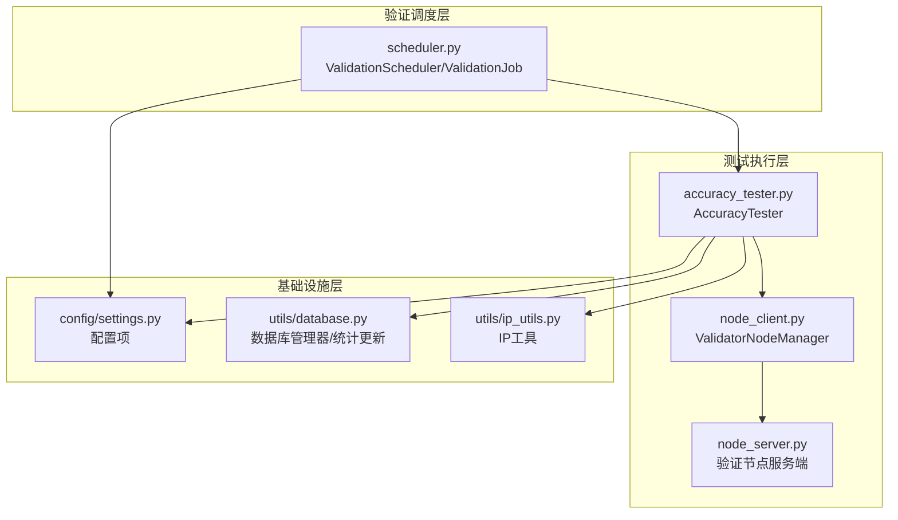
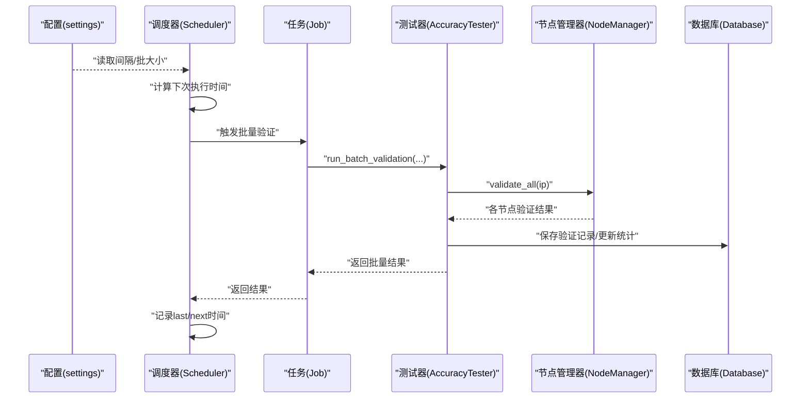
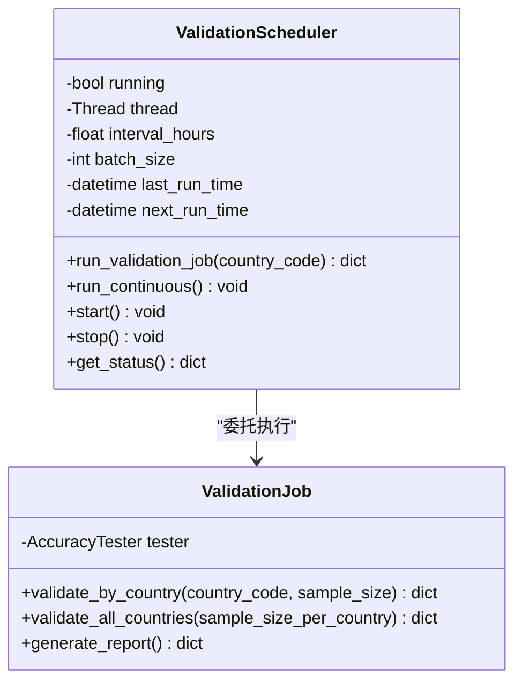
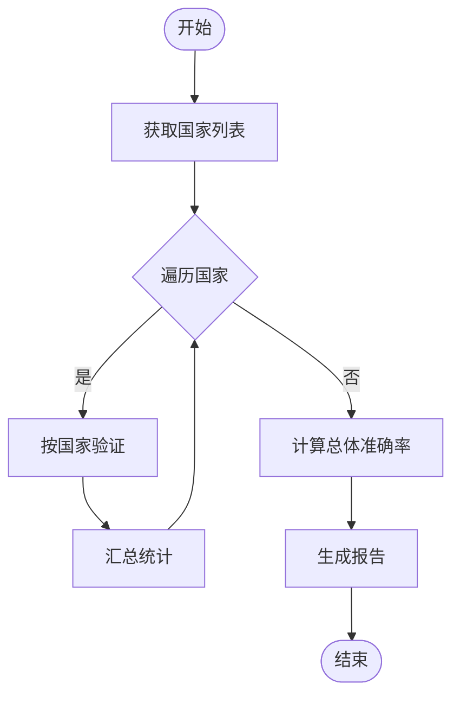
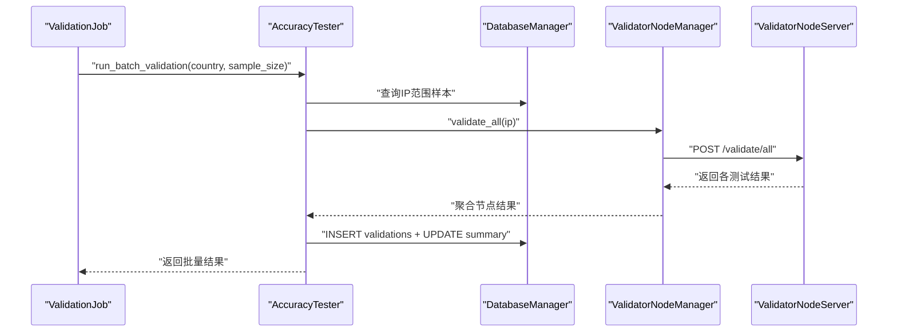
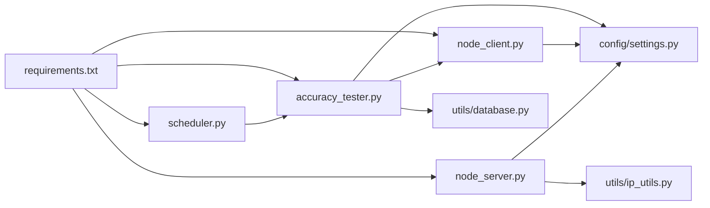

# 调度器

<cite>
**本文引用的文件**
- [validator/scheduler.py](file://validator/scheduler.py)
- [config/settings.py](file://config/settings.py)
- [validator/accuracy_tester.py](file://validator/accuracy_tester.py)
- [validator/node_client.py](file://validator/node_client.py)
- [validator/node_server.py](file://validator/node_server.py)
- [utils/database.py](file://utils/database.py)
- [utils/ip_utils.py](file://utils/ip_utils.py)
- [requirements.txt](file://requirements.txt)
</cite>

## 目录
1. [简介](#简介)
2. [项目结构](#项目结构)
3. [核心组件](#核心组件)
4. [架构总览](#架构总览)
5. [详细组件分析](#详细组件分析)
6. [依赖关系分析](#依赖关系分析)
7. [性能考量](#性能考量)
8. [故障排查指南](#故障排查指南)
9. [结论](#结论)
10. [附录](#附录)

## 简介
本文件面向Scheduler类，提供其自动化调度机制的全面技术文档。内容涵盖定时任务配置、批处理大小控制、验证间隔设置等关键功能；阐述调度器的时间管理策略、任务队列处理与并发控制机制；给出调度配置选项、性能调优参数与监控指标建议；并提供部署配置、故障恢复与异常处理机制说明，以及实际配置示例与最佳实践指导。

## 项目结构
该仓库围绕“IP定位准确性验证”构建，调度器位于validator模块中，配合AccuracyTester、ValidatorNodeManager与数据库工具共同完成周期性验证任务。主要文件与职责如下：
- validator/scheduler.py：调度器主实现，包含ValidationScheduler与ValidationJob两类任务执行器
- validator/accuracy_tester.py：准确性测试器，负责样本抽取、交叉验证与结果统计
- validator/node_client.py / validator/node_server.py：验证节点客户端与服务端，提供跨节点验证能力
- config/settings.py：全局配置项，包括验证间隔、批处理大小、节点列表、API密钥等
- utils/database.py：数据库管理器与验证统计更新逻辑
- utils/ip_utils.py：IP地址工具函数
- requirements.txt：运行依赖

图表来源
- [validator/scheduler.py:27-123](file://validator/scheduler.py#L27-L123)
- [validator/accuracy_tester.py:27-283](file://validator/accuracy_tester.py#L27-L283)
- [validator/node_client.py:107-190](file://validator/node_client.py#L107-L190)
- [validator/node_server.py:200-322](file://validator/node_server.py#L200-L322)
- [config/settings.py:36-38](file://config/settings.py#L36-L38)
- [utils/database.py:15-67](file://utils/database.py#L15-L67)
- [utils/ip_utils.py:9-282](file://utils/ip_utils.py#L9-L282)

章节来源
- [validator/scheduler.py:1-265](file://validator/scheduler.py#L1-L265)
- [config/settings.py:1-44](file://config/settings.py#L1-L44)

## 核心组件
- ValidationScheduler：基于后台线程的持续调度器，负责按固定间隔执行批量验证任务，并维护运行状态与下次执行时间
- ValidationJob：一次性或批量任务封装，支持按国家或全量国家验证
- AccuracyTester：核心测试执行器，负责样本抽取、交叉验证、结果统计与数据库写入
- ValidatorNodeManager：节点管理器，负责健康检查与跨节点验证请求
- 配置项：VALIDATION_INTERVAL_HOURS、VALIDATION_BATCH_SIZE等

章节来源
- [validator/scheduler.py:27-123](file://validator/scheduler.py#L27-L123)
- [validator/scheduler.py:125-205](file://validator/scheduler.py#L125-L205)
- [validator/accuracy_tester.py:27-283](file://validator/accuracy_tester.py#L27-L283)
- [validator/node_client.py:107-190](file://validator/node_client.py#L107-L190)
- [config/settings.py:36-38](file://config/settings.py#L36-L38)

## 架构总览
调度器采用“配置驱动 + 后台线程 + 节点协作”的架构：
- 配置层：从settings读取验证间隔与批处理大小
- 调度层：ValidationScheduler在独立线程中循环执行run_validation_job
- 执行层：AccuracyTester按样本大小随机抽样，结合ValidatorNodeManager进行跨节点验证
- 存储层：utils/database提供SQLite管理与验证统计更新
- 监控层：日志记录每次任务的开始、完成与错误

图表来源
- [validator/scheduler.py:39-93](file://validator/scheduler.py#L39-L93)
- [validator/scheduler.py:125-205](file://validator/scheduler.py#L125-L205)
- [validator/accuracy_tester.py:182-254](file://validator/accuracy_tester.py#L182-L254)
- [validator/node_client.py:107-190](file://validator/node_client.py#L107-L190)
- [utils/database.py:363-398](file://utils/database.py#L363-L398)

## 详细组件分析

### ValidationScheduler：持续调度器
- 时间管理策略
  - 以VALIDATION_INTERVAL_HOURS为基准，每次任务完成后更新last_run_time与next_run_time
  - run_continuous中采用分段sleep（每分钟检查一次running标志），确保能及时响应stop
- 并发控制机制
  - 单线程后台执行，避免竞争条件
  - start仅在当前线程未存活时启动新线程，防止重复启动
  - stop通过running标志与join(timeout)实现优雅停机
- 状态查询
  - get_status返回running、间隔、批大小、上次/下次执行时间等

图表来源
- [validator/scheduler.py:27-123](file://validator/scheduler.py#L27-L123)
- [validator/scheduler.py:125-205](file://validator/scheduler.py#L125-L205)

章节来源
- [validator/scheduler.py:27-123](file://validator/scheduler.py#L27-L123)

### ValidationJob：一次性与批量任务
- validate_by_country：按国家执行单次验证，调用AccuracyTester.run_batch_validation
- validate_all_countries：遍历数据库中的所有国家，逐国执行验证并汇总结果
- generate_report：生成准确性报告

图表来源
- [validator/scheduler.py:145-200](file://validator/scheduler.py#L145-L200)

章节来源
- [validator/scheduler.py:125-205](file://validator/scheduler.py#L125-L205)

### AccuracyTester：批量验证与统计
- 样本抽取：根据country_code或全局随机抽取IP范围样本
- 交叉验证：通过ValidatorNodeManager向各节点发起validate_all，基于可达性判断准确性
- 统计与持久化：保存验证记录到validations表，并调用update_validation_summary更新validation_summary

图表来源
- [validator/accuracy_tester.py:182-254](file://validator/accuracy_tester.py#L182-L254)
- [validator/node_client.py:107-190](file://validator/node_client.py#L107-L190)
- [validator/node_server.py:287-322](file://validator/node_server.py#L287-L322)
- [utils/database.py:363-398](file://utils/database.py#L363-L398)

章节来源
- [validator/accuracy_tester.py:27-283](file://validator/accuracy_tester.py#L27-L283)

### 配置与参数
- 验证间隔：VALIDATION_INTERVAL_HOURS（小时）
- 批处理大小：VALIDATION_BATCH_SIZE（样本数）
- 节点配置：VALIDATOR_NODES（节点列表）、VALIDATOR_API_KEY（API密钥）
- 日志配置：LOG_LEVEL、LOG_FORMAT、LOG_FILE

章节来源
- [config/settings.py:36-44](file://config/settings.py#L36-L44)

## 依赖关系分析
- 外部依赖：requests（节点通信）、Flask（节点服务端）、click（命令行）、csvkit（数据处理）
- 内部依赖：scheduler依赖accuracy_tester与settings；accuracy_tester依赖database与node_client；node_client依赖settings；node_server依赖ip_utils与settings

图表来源
- [requirements.txt:1-5](file://requirements.txt#L1-L5)
- [validator/scheduler.py:17-18](file://validator/scheduler.py#L17-L18)
- [validator/accuracy_tester.py:16-21](file://validator/accuracy_tester.py#L16-L21)
- [validator/node_client.py:16](file://validator/node_client.py#L16)
- [validator/node_server.py:20-23](file://validator/node_server.py#L20-L23)

章节来源
- [requirements.txt:1-5](file://requirements.txt#L1-L5)

## 性能考量
- 批处理大小（VALIDATION_BATCH_SIZE）
  - 建议：根据数据库规模与节点负载调整，过大可能导致内存压力与超时，过小增加I/O次数
  - 参考：默认值为100，可按需提升至200~500
- 验证间隔（VALIDATION_INTERVAL_HOURS）
  - 建议：生产环境建议≥24小时，避免频繁网络与数据库压力
  - 参考：默认值为24小时
- 线程与分段睡眠
  - 调度器采用每分钟检查一次running标志，平衡响应性与CPU占用
- 数据库索引与查询
  - utils/database已建立关键索引，建议定期检查统计与查询计划
- 节点并发
  - ValidatorNodeManager会并行向所有可用节点发起请求，注意节点资源与网络带宽

[本节为通用性能建议，无需特定文件来源]

## 故障排查指南
- 调度器无法停止
  - 现象：调用stop后仍继续运行
  - 排查：确认线程状态与running标志；检查run_continuous中分段sleep是否被异常中断
- 节点通信失败
  - 现象：validate_all返回错误或节点不可达
  - 排查：核对VALIDATOR_API_KEY、节点健康检查接口、防火墙与超时设置
- 数据库写入异常
  - 现象：验证记录未写入或统计未更新
  - 排查：检查数据库初始化脚本、表存在性与权限；查看update_validation_summary逻辑
- 样本为空或结果异常
  - 现象：run_batch_validation返回空样本或准确率异常
  - 排查：确认IP范围表与locations表数据完整性；检查随机采样逻辑与国家过滤条件

章节来源
- [validator/scheduler.py:95-113](file://validator/scheduler.py#L95-L113)
- [validator/accuracy_tester.py:256-283](file://validator/accuracy_tester.py#L256-L283)
- [validator/node_client.py:54-59](file://validator/node_client.py#L54-L59)
- [utils/database.py:70-185](file://utils/database.py#L70-L185)

## 结论
该调度器通过清晰的分层设计与配置驱动，实现了稳定可靠的周期性IP定位准确性验证。其时间管理策略、并发控制与异常处理机制满足生产环境需求。建议在部署时结合业务规模合理设置批处理大小与验证间隔，并关注节点与数据库的资源瓶颈，以获得最佳性能与稳定性。

[本节为总结性内容，无需特定文件来源]

## 附录

### 部署配置清单
- 环境变量
  - VALIDATOR_API_KEY：节点间通信密钥
  - MAXMIND_LICENSE_KEY：MaxMind下载凭据（如需）
- 配置项
  - VALIDATION_INTERVAL_HOURS：验证间隔（小时）
  - VALIDATION_BATCH_SIZE：批处理大小（样本数）
  - VALIDATOR_NODES：节点列表（名称、主机、端口、位置）
- 数据库
  - 确保数据库初始化完成，包含locations、ip_ranges、validations、validation_summary表及索引

章节来源
- [config/settings.py:36-44](file://config/settings.py#L36-L44)
- [utils/database.py:70-185](file://utils/database.py#L70-L185)

### 监控指标建议
- 调度器状态：running、last_run_time、next_run_time
- 批量任务指标：tested、accurate、inaccurate、accuracy_rate
- 节点可用性：可用节点数、各节点健康状态
- 数据库指标：validations表新增记录数、validation_summary更新频率

章节来源
- [validator/scheduler.py:114-122](file://validator/scheduler.py#L114-L122)
- [validator/accuracy_tester.py:284-334](file://validator/accuracy_tester.py#L284-L334)

### 实际配置示例与最佳实践
- 示例一：启动持续调度器（24小时间隔）
  - 命令：python -m validator.scheduler --mode scheduler --interval 24
  - 适用场景：常规每日验证
- 示例二：一次性按国家验证（样本数200）
  - 命令：python -m validator.scheduler --mode once --country CN --sample-size 200
  - 适用场景：快速验证特定国家
- 示例三：全量国家验证（每国家50样本）
  - 命令：python -m validator.scheduler --mode all-countries --sample-size 50
  - 适用场景：首次全量评估或回归测试
- 最佳实践
  - 将调度器作为守护进程运行，结合系统服务管理器（如systemd）实现自启动与自动重启
  - 设置合理的日志轮转，避免日志文件过大
  - 对节点进行健康检查与限流，避免验证风暴导致网络拥塞
  - 定期审查validation_summary，识别准确率下降的区域并针对性优化

章节来源
- [validator/scheduler.py:232-261](file://validator/scheduler.py#L232-L261)