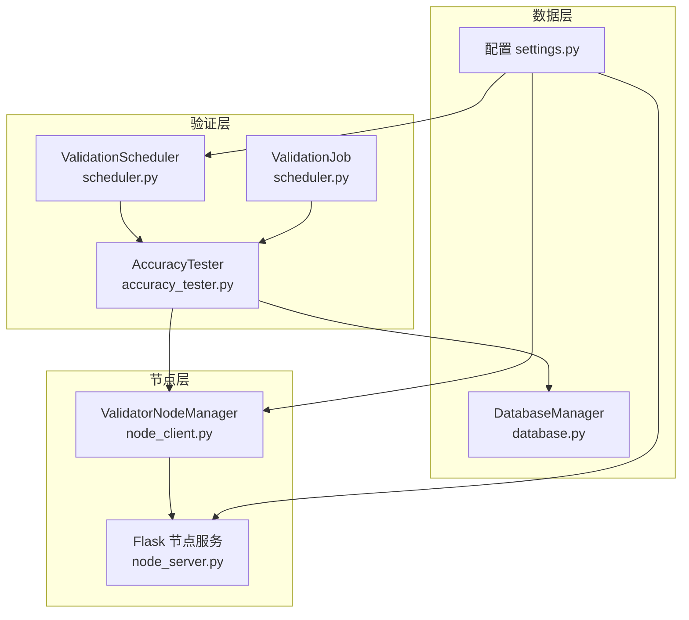
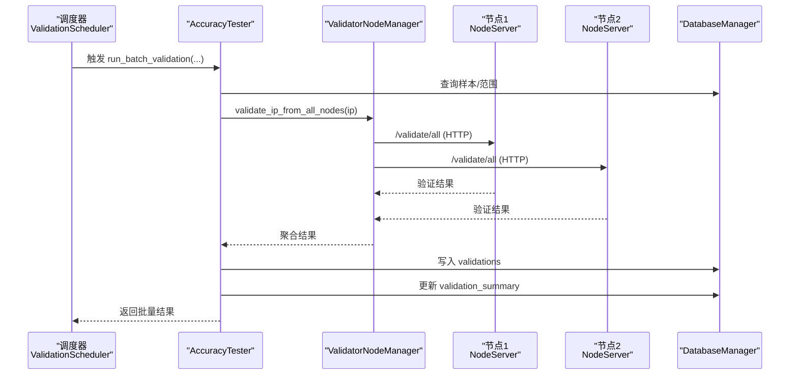
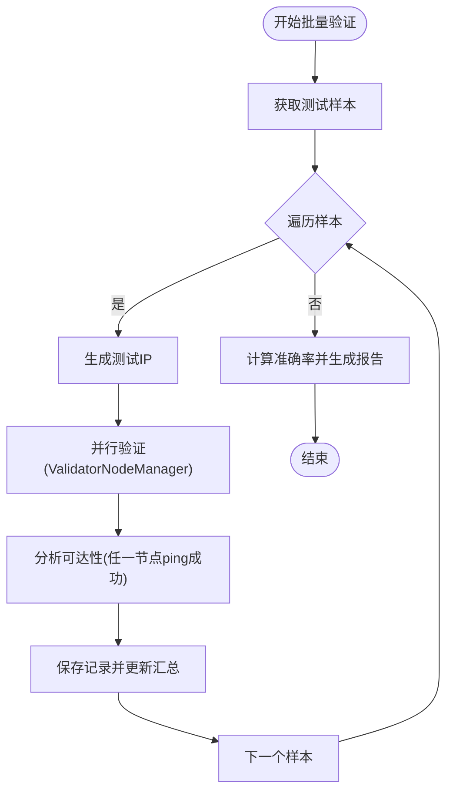
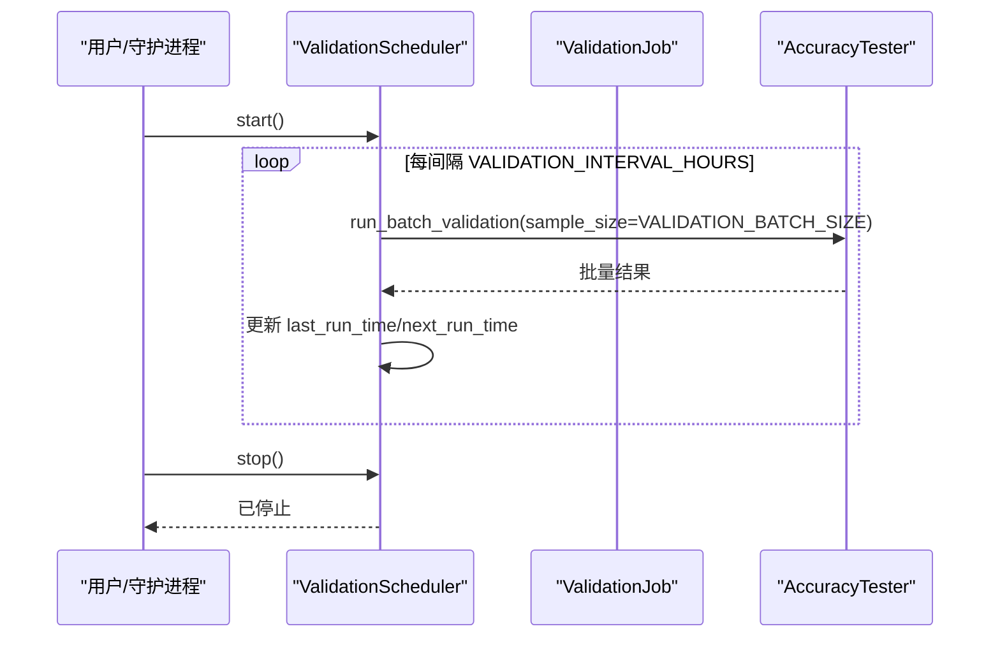
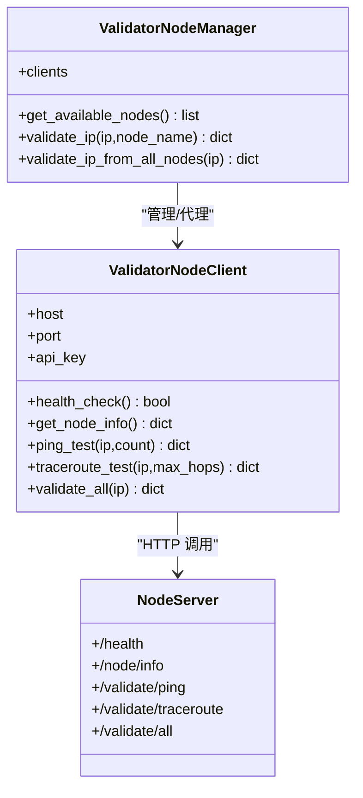
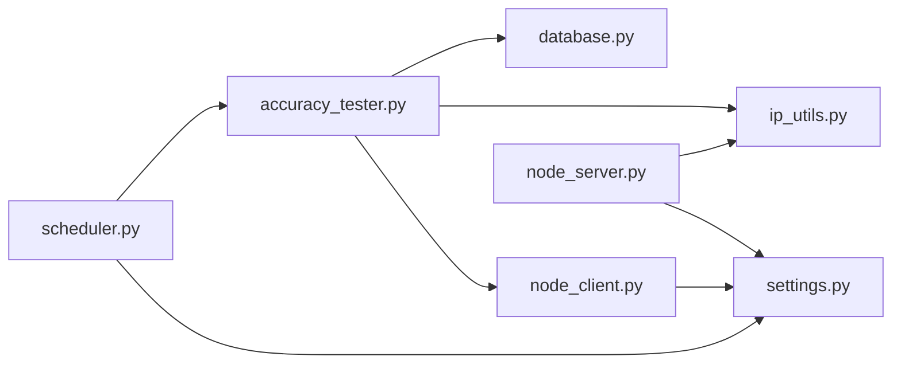
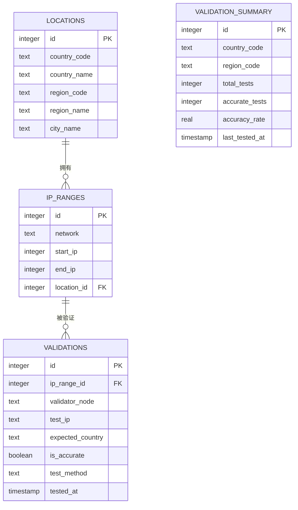

# 验证系统

<cite>
**本文引用的文件**
- [validator/accuracy_tester.py](file://validator/accuracy_tester.py)
- [validator/scheduler.py](file://validator/scheduler.py)
- [validator/node_client.py](file://validator/node_client.py)
- [validator/node_server.py](file://validator/node_server.py)
- [config/settings.py](file://config/settings.py)
- [utils/database.py](file://utils/database.py)
- [utils/ip_utils.py](file://utils/ip_utils.py)
- [requirements.txt](file://requirements.txt)
- [scripts/init_db.py](file://scripts/init_db.py)
</cite>

## 目录
1. [简介](#简介)
2. [项目结构](#项目结构)
3. [核心组件](#核心组件)
4. [架构总览](#架构总览)
5. [详细组件分析](#详细组件分析)
6. [依赖关系分析](#依赖关系分析)
7. [性能考量](#性能考量)
8. [部署与配置指南](#部署与配置指南)
9. [验证结果数据结构与统计分析](#验证结果数据结构与统计分析)
10. [监控与故障排除](#监控与故障排除)
11. [结论](#结论)

## 简介
本文件面向“验证系统”的技术文档，围绕以下目标展开：
- 解释 AccuracyTester 的准确性测试机制：测试算法、评估指标、结果统计
- 说明 Scheduler 的自动化调度功能：定时任务、批处理大小、验证间隔等配置
- 深入分析 NodeClient 与 NodeServer 的分布式验证架构：节点通信协议、负载均衡、故障转移
- 提供部署与配置指南
- 解释验证结果的数据结构与统计分析方法
- 给出监控与故障排除指导

## 项目结构
该项目采用模块化组织，核心验证逻辑集中在 validator 目录，配置集中于 config，数据库与工具函数位于 utils，脚本位于 scripts。关键文件如下：
- 验证器：validator/accuracy_tester.py
- 调度器：validator/scheduler.py
- 节点客户端：validator/node_client.py
- 节点服务端：validator/node_server.py
- 配置：config/settings.py
- 数据库与统计：utils/database.py
- IP 工具：utils/ip_utils.py
- 初始化脚本：scripts/init_db.py
- 依赖声明：requirements.txt

图表来源
- [validator/accuracy_tester.py:1-373](file://validator/accuracy_tester.py#L1-L373)
- [validator/scheduler.py:1-265](file://validator/scheduler.py#L1-L265)
- [validator/node_client.py:1-244](file://validator/node_client.py#L1-L244)
- [validator/node_server.py:1-350](file://validator/node_server.py#L1-L350)
- [config/settings.py:1-44](file://config/settings.py#L1-L44)
- [utils/database.py:1-398](file://utils/database.py#L1-L398)

章节来源
- [validator/accuracy_tester.py:1-373](file://validator/accuracy_tester.py#L1-L373)
- [validator/scheduler.py:1-265](file://validator/scheduler.py#L1-L265)
- [validator/node_client.py:1-244](file://validator/node_client.py#L1-L244)
- [validator/node_server.py:1-350](file://validator/node_server.py#L1-L350)
- [config/settings.py:1-44](file://config/settings.py#L1-L44)
- [utils/database.py:1-398](file://utils/database.py#L1-L398)

## 核心组件
- AccuracyTester：负责样本采集、交叉验证、批量验证、统计报表生成
- ValidationScheduler：负责周期性调度批量验证任务
- ValidationJob：封装一次性或全国家验证任务
- ValidatorNodeManager/ValidatorNodeClient：负责与多个验证节点通信
- NodeServer：提供健康检查、Ping/Traceroute测试、聚合验证接口
- DatabaseManager：封装 SQLite 访问、索引、统计更新
- 配置模块：集中管理数据库路径、节点列表、API 密钥、验证间隔与批次大小

章节来源
- [validator/accuracy_tester.py:27-373](file://validator/accuracy_tester.py#L27-L373)
- [validator/scheduler.py:27-265](file://validator/scheduler.py#L27-L265)
- [validator/node_client.py:22-244](file://validator/node_client.py#L22-L244)
- [validator/node_server.py:25-350](file://validator/node_server.py#L25-L350)
- [utils/database.py:15-398](file://utils/database.py#L15-L398)
- [config/settings.py:29-44](file://config/settings.py#L29-L44)

## 架构总览
验证系统采用“中心化调度 + 分布式节点”的架构：
- 调度器周期性触发批量验证
- AccuracyTester 从数据库采样，调用 ValidatorNodeManager 并行向各节点发起验证
- 各节点通过 Flask 暴露 HTTP 接口，执行本地网络探测（Ping/Traceroute）
- 验证结果写入数据库，并更新按国家/区域的汇总统计

图表来源
- [validator/scheduler.py:39-63](file://validator/scheduler.py#L39-L63)
- [validator/accuracy_tester.py:84-126](file://validator/accuracy_tester.py#L84-L126)
- [validator/node_client.py:179-189](file://validator/node_client.py#L179-L189)
- [validator/node_server.py:287-321](file://validator/node_server.py#L287-L321)
- [utils/database.py:363-398](file://utils/database.py#L363-L398)

## 详细组件分析

### AccuracyTester：准确性测试机制
- 样本采集
  - 支持按国家过滤或随机采样，返回 IP 范围及期望归属
- 测试算法
  - 对每个样本生成范围内的随机 IP
  - 通过 ValidatorNodeManager 并行向所有可用节点发起 /validate/all
  - 以“节点可达性”作为准确性判据：任一节点返回 ping 成功即认为该 IP 是活跃的，从而判定归属更可能准确
- 评估指标
  - 单样本：is_accurate（基于可达性）
  - 批量：tested、accurate、inaccurate、accuracy_rate
  - 范围级：accuracy_rate、is_range_accurate（阈值 50%）
- 结果统计
  - 写入 validations 表
  - 更新 validation_summary（按国家/区域聚合）

图表来源
- [validator/accuracy_tester.py:182-254](file://validator/accuracy_tester.py#L182-L254)
- [validator/accuracy_tester.py:84-126](file://validator/accuracy_tester.py#L84-L126)
- [utils/database.py:363-398](file://utils/database.py#L363-L398)

章节来源
- [validator/accuracy_tester.py:27-373](file://validator/accuracy_tester.py#L27-L373)
- [utils/database.py:15-398](file://utils/database.py#L15-L398)

### Scheduler：自动化调度功能
- 关键配置
  - VALIDATION_INTERVAL_HOURS：验证间隔（小时）
  - VALIDATION_BATCH_SIZE：每次批量验证的样本数
- 运行模式
  - run_continuous：循环调度，支持优雅停止
  - start/stop：后台线程方式启动/停止
  - get_status：返回运行状态、下次执行时间等
- 任务类型
  - ValidationJob.validate_by_country：按国家验证
  - ValidationJob.validate_all_countries：遍历所有国家并汇总

图表来源
- [validator/scheduler.py:65-93](file://validator/scheduler.py#L65-L93)
- [validator/scheduler.py:125-201](file://validator/scheduler.py#L125-L201)
- [config/settings.py:36-38](file://config/settings.py#L36-L38)

章节来源
- [validator/scheduler.py:27-265](file://validator/scheduler.py#L27-L265)
- [config/settings.py:29-44](file://config/settings.py#L29-L44)

### NodeClient 与 NodeServer：分布式验证架构
- 通信协议
  - HTTP/JSON；请求头包含 X-API-Key
  - 节点端暴露 /health、/node/info、/validate/ping、/validate/traceroute、/validate/all
- 负载均衡与故障转移
  - ValidatorNodeManager 维护节点列表，自动健康检查（/health），仅对健康节点发起验证
  - 若某节点失败，聚合结果中记录 error，不影响其他节点结果
- 节点能力
  - NodeServer 在本地执行 ping/traceroute，跨平台兼容 Windows/Linux
  - 返回测试方法、目标、成功标志、耗时、输出片段等

图表来源
- [validator/node_client.py:22-190](file://validator/node_client.py#L22-L190)
- [validator/node_server.py:216-321](file://validator/node_server.py#L216-L321)

章节来源
- [validator/node_client.py:1-244](file://validator/node_client.py#L1-L244)
- [validator/node_server.py:1-350](file://validator/node_server.py#L1-L350)
- [config/settings.py:29-38](file://config/settings.py#L29-L38)

### 数据库与工具
- DatabaseManager：统一的 SQLite 访问、事务上下文、批量插入、索引管理
- 表结构要点
  - locations：地理信息
  - ip_ranges：IP 范围与位置关联
  - validations：单次验证记录
  - validation_summary：按国家/区域的汇总统计
- 统计更新
  - update_validation_summary：原子性更新总数、准确数、准确率与最后测试时间

章节来源
- [utils/database.py:15-398](file://utils/database.py#L15-L398)

## 依赖关系分析
- 外部依赖
  - requests：HTTP 客户端
  - flask：HTTP 服务端
  - click/csvkit：命令行与 CSV 工具（由 requirements.txt 声明）
- 内部依赖
  - accuracy_tester 依赖 database、ip_utils、node_client
  - scheduler 依赖 accuracy_tester、settings
  - node_client 依赖 settings
  - node_server 依赖 ip_utils、settings

图表来源
- [validator/accuracy_tester.py:16-21](file://validator/accuracy_tester.py#L16-L21)
- [validator/scheduler.py:17-18](file://validator/scheduler.py#L17-L18)
- [validator/node_client.py:16](file://validator/node_client.py#L16)
- [validator/node_server.py:20-23](file://validator/node_server.py#L20-L23)

章节来源
- [requirements.txt:1-5](file://requirements.txt#L1-L5)
- [validator/accuracy_tester.py:16-21](file://validator/accuracy_tester.py#L16-L21)
- [validator/scheduler.py:17-18](file://validator/scheduler.py#L17-L18)
- [validator/node_client.py:16](file://validator/node_client.py#L16)
- [validator/node_server.py:20-23](file://validator/node_server.py#L20-L23)

## 性能考量
- 批处理与并发
  - Scheduler 以 VALIDATION_BATCH_SIZE 控制单次样本规模
  - AccuracyTester 通过 ValidatorNodeManager 并行向多个节点发起验证，缩短整体验证时间
- 网络探测成本
  - Ping/Traceroute 为 I/O 密集型，建议合理设置 count/max_hops，避免过长超时
- 数据库写入
  - 批量写入 validations 与 validation_summary，注意磁盘 I/O 与 WAL/索引维护
- 线程与停止
  - Scheduler 使用分段睡眠以便及时响应停止信号，避免长时间阻塞

[本节为通用性能建议，无需特定文件引用]

## 部署与配置指南
- 环境准备
  - 安装依赖：pip install -r requirements.txt
  - 初始化数据库：python scripts/init_db.py
- 配置项
  - 数据库路径：DATABASE_PATH（默认 data/ip_database.db）
  - 验证节点列表：VALIDATOR_NODES（包含 name/host/port/location）
  - API 密钥：VALIDATOR_API_KEY（节点间鉴权）
  - 验证参数：VALIDATION_BATCH_SIZE、VALIDATION_INTERVAL_HOURS
- 启动步骤
  - 启动一个或多个 NodeServer（不同端口），确保 API 密钥一致
  - 启动调度器（可后台运行），或直接运行一次性任务
- 常见部署形态
  - 单机：在同一主机上启动多个 NodeServer（不同端口）
  - 多机：在不同主机上分别启动 NodeServer，修改 VALIDATOR_NODES 中的 host

章节来源
- [config/settings.py:10-44](file://config/settings.py#L10-L44)
- [scripts/init_db.py:16-34](file://scripts/init_db.py#L16-L34)
- [validator/node_server.py:324-346](file://validator/node_server.py#L324-L346)
- [validator/scheduler.py:207-261](file://validator/scheduler.py#L207-L261)

## 验证结果数据结构与统计分析
- 单样本结构（cross_validate_ip）
  - 字段示例：ip、expected_country、node_count、reachable_count、is_accurate、validation_details、tested_at
- 批量结果（run_batch_validation）
  - 字段示例：total_samples、tested、accurate、inaccurate、details、accuracy_rate、generated_at
- 范围级结果（test_ip_range）
  - 字段示例：range_id、network、country_code、region_code、test_ips、results、accuracy_rate、is_range_accurate
- 报告（get_accuracy_report）
  - 整体统计：total_tests、accurate_tests、accuracy_rate
  - 分地区统计：by_region 列表，包含 country_code、region_code、total_tests、accurate_tests、accuracy_rate、last_tested_at
- 统计更新
  - update_validation_summary：原子性更新汇总表，支持并发安全

图表来源
- [utils/database.py:100-147](file://utils/database.py#L100-L147)
- [utils/database.py:363-398](file://utils/database.py#L363-L398)

章节来源
- [validator/accuracy_tester.py:84-180](file://validator/accuracy_tester.py#L84-L180)
- [validator/accuracy_tester.py:284-334](file://validator/accuracy_tester.py#L284-L334)
- [utils/database.py:100-147](file://utils/database.py#L100-L147)
- [utils/database.py:363-398](file://utils/database.py#L363-L398)

## 监控与故障排除
- 健康检查
  - 节点端：/health 返回健康状态
  - 客户端：ValidatorNodeManager.get_available_nodes 会过滤不可达节点
- 常见问题
  - API 密钥错误：节点端校验 X-API-Key，返回 401
  - 节点不可达：聚合结果中对应节点显示 error，不影响其他节点
  - 超时：Ping/Traceroute 设置了超时，超时返回 error
  - IP 无效：节点端对输入进行校验，返回错误
- 日志
  - 调度器、节点服务、客户端均使用标准日志，便于排查
- 建议
  - 为每个节点配置独立日志文件
  - 监控 validation_summary 的 last_tested_at，确保调度器正常运行
  - 对异常节点进行隔离与修复，避免影响整体准确性

章节来源
- [validator/node_server.py:44-49](file://validator/node_server.py#L44-L49)
- [validator/node_client.py:129-138](file://validator/node_client.py#L129-L138)
- [validator/node_server.py:52-106](file://validator/node_server.py#L52-L106)
- [validator/node_server.py:109-179](file://validator/node_server.py#L109-L179)

## 结论
本验证系统通过“调度器 + 分布式节点 + 数据库统计”的组合，实现了高可用、可扩展的 IP 地理位置准确性验证方案。AccuracyTester 以“可达性”为核心判据，结合 Scheduler 的周期性与批量控制，配合 NodeServer 的本地网络探测能力，形成闭环的验证与统计体系。通过合理的配置与监控，可在多节点环境下稳定运行并产出可靠的统计报告。